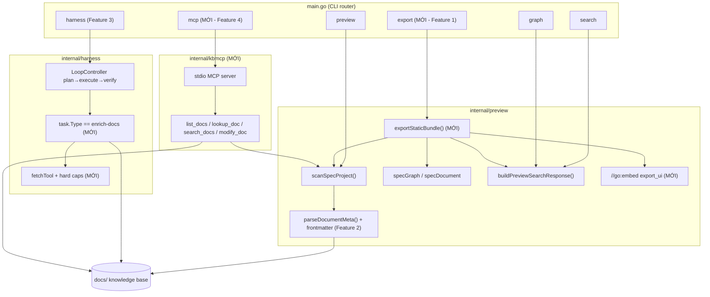
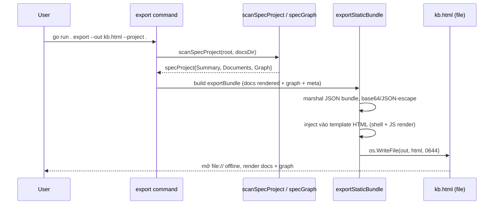
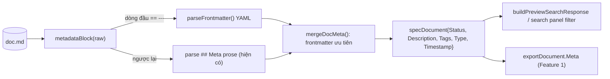
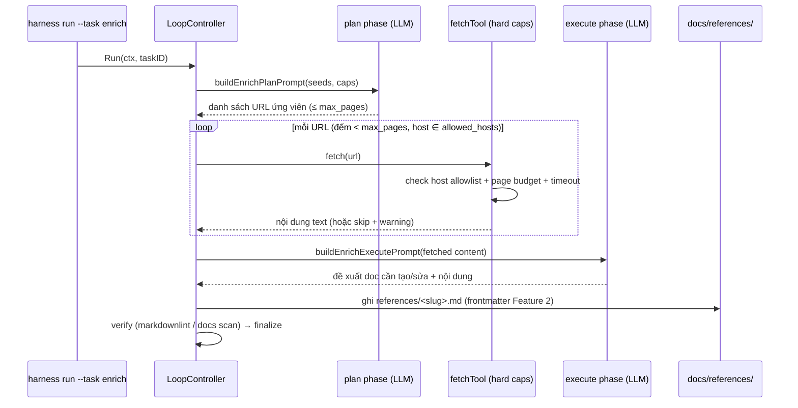
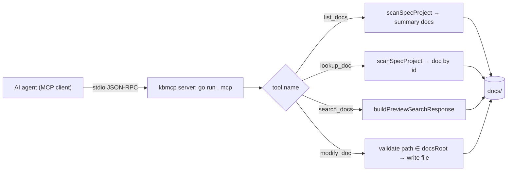

# Design Document: OKF Knowledge Enhancements

## Overview

Tài liệu này thiết kế việc áp dụng một số pattern từ dự án [GoogleCloudPlatform/knowledge-catalog](https://github.com/GoogleCloudPlatform/knowledge-catalog) (Apache 2.0, dùng định dạng **OKF = Open Knowledge Format**) vào Go CLI `ns-workspace`. Mục tiêu là làm knowledge base trong `docs/` dễ chia sẻ, dễ query/index, và để agent đọc/sửa trực tiếp — mà **không** kéo theo bất kỳ tầng cloud nào (Dataplex, BigQuery, GCS). Mọi thứ chạy local-only.

Thiết kế gồm **bốn feature độc lập, phased**, ship riêng được, ưu tiên theo thứ tự sau:

1. **Static HTML export** (ưu tiên cao nhất): dump toàn bộ docs + graph thành MỘT file HTML self-contained, offline, không cần backend sống.
2. **Chuẩn hoá metadata docs theo tinh thần OKF**: thêm YAML frontmatter chuẩn tối thiểu (`type`, `description`, `tags`, `timestamp`), giữ tương thích ngược với `## Meta` prose hiện tại.
3. **Enrichment agent với hard caps**: thêm task type `enrich-docs` vào `harness`, dùng fetch tool với `max-pages` + `allowed-host` filter (LLM-as-crawler có kiểm soát).
4. **MCP tools cho knowledge base**: expose `docs/` qua MCP server (list/lookup/search/modify) cho agent.

Mỗi feature có phần High-Level Design (kiến trúc, data flow, tích hợp CLI) và Low-Level Design (Go signatures, định dạng dữ liệu, pseudocode). Vì project dùng Go, mọi code ví dụ dùng cú pháp Go.

## Bối Cảnh Và Nguồn Tham Khảo

`ns-workspace` hiện có các package liên quan:

- `internal/preview`: HTTP preview read-only. Scan docs (`scanSpecProject`), parse metadata Markdown/HTML (`parseDocumentMeta`, `metadataBlock`), dựng graph (`parseSpecGraph` → `specGraph`), cache snapshot (`previewSearchSnapshot`), build search response (`buildPreviewSearchResponse`). Frontend Vue trong `internal/preview/preview_ui_src/`, build ra `internal/preview/preview_ui/` rồi `//go:embed preview_ui` nhúng vào binary. Graph UI hiện render bằng **Sigma/Graphology** (WebGL), Markdown bằng TOAST UI Viewer, diagram bằng Mermaid.
- `internal/graphquery`: registry/setup/cache LSP cho Code Graph, CLI `lsp`.
- `internal/harness`: agentic loop (plan→execute→verify→diagnose). Task là YAML/JSON trong `.harness/tasks/<id>.yaml`. `Task` struct có field `Type` (hiện chưa được dùng để rẽ nhánh). Dispatch qua `SubagentDriver.Dispatch(ctx, agent, prompt)`.
- `internal/agentsync`: sync config agent; `mcp.go` ở đây chỉ **transform MCP config** cho các adapter, KHÔNG phải MCP server runtime.
- `internal/cli`, `main.go`: route command (`preview`, `search`, `graph`, `lsp`, `harness`, ...).

Các pattern mượn từ knowledge-catalog (chỉ mượn convention, không copy spec):

- **OKF visualizer**: nhúng knowledge bundle thành JSON blob trong HTML, render client-side bằng thư viện từ CDN, không data rời khỏi page.
- **OKF frontmatter**: key chuẩn `type` + frontmatter tối thiểu + nguyên tắc "permissive consumer" (bỏ qua key lạ, link gãy, type không biết).
- **OKF reference agent**: LLM-as-crawler có hard caps (max-pages, allowed-host) khi enrich từ seed URL.
- **mdcode MCP**: tools `list-entries` / `lookup-entry` / `modify-entry`, áp dụng cho docs knowledge base.

## Nguyên Tắc Thiết Kế Chung

1. **Local-only**: không gọi cloud, không upload. Static export, enrichment, MCP đều chạy trên máy người dùng.
2. **Một backend contract duy nhất**: tái dùng `scanSpecProject`, `specGraph`, `buildPreviewSearchResponse` thay vì nhân đôi logic ở frontend hoặc package mới.
3. **Permissive consumer**: parser docs đã chấp nhận cả frontmatter lẫn `## Meta`; mọi thay đổi metadata phải fail-open với key lạ / type lạ / link gãy.
4. **Phased & độc lập**: bốn feature không phụ thuộc cứng vào nhau. Feature 1 ship trước.
5. **Tôn trọng ràng buộc embed frontend**: source of truth là `preview_ui_src/`, build ra `preview_ui/` rồi Go embed. Feature 1 phải quyết định rõ cách dùng artifact embed này.

## Architecture

Phần này mô tả kiến trúc tổng quan (high-level), cách bốn feature cùng đi qua một "knowledge core" duy nhất.



Điểm chung: cả bốn feature đều đi qua `scanSpecProject()` / `specGraph` / `buildPreviewSearchResponse()` như một "knowledge core" duy nhất. Feature mới chỉ thêm consumer (export writer, MCP tool handler, enrichment task) chứ không sửa pipeline scan/graph.

## Components and Interfaces

Tóm tắt component và interface chính trên cả bốn feature (chi tiết signature ở mỗi feature bên dưới).

| Component | Package | Trách nhiệm | Tái dùng |
| --- | --- | --- | --- |
| `RunExport` / `exportStaticBundle` | `internal/preview` (mới `export.go`) | Dump docs + graph thành HTML tĩnh | `scanSpecProject`, `specGraph`, `goldmark` |
| `parseFrontmatter` / `parseDocumentMeta` | `internal/preview` (`spec_project.go`) | Parse frontmatter OKF + `## Meta` (permissive) | `metadataBlock`, `yaml.v3` |
| `EnrichConfig` / `enrichGuard` / `fetchTool` / `runEnrich` | `internal/harness` (mới `enrich.go`) | Enrichment task với hard caps | `LoopController`, `SubagentDriver` |
| `kbmcp.Server` + tool handlers | `internal/kbmcp` (mới) | MCP stdio server cho docs | `scanSpecProject`, `buildPreviewSearchResponse` |

Interface boundaries quan trọng:

- **Knowledge core (read)**: `scanSpecProject(projectRoot, docsDir) (specProject, error)` — nguồn dữ liệu chung cho export, MCP, enrichment verify.
- **Search contract**: `buildPreviewSearchResponse(ctx, project, codeGraph, projectRoot, query, mode, keywordOp, limit) previewSearchResponse` — dùng lại cho `search_docs` (Feature 4).
- **Dispatch**: `SubagentDriver.Dispatch(ctx, agent, prompt) (DispatchResult, error)` — dùng lại cho enrichment plan/execute (Feature 3).
- **Façade public (mới)**: `internal/preview` cần export một API mỏng (ví dụ `OpenKnowledge`) để `internal/kbmcp` truy cập snapshot + search mà không phụ thuộc symbol private.

## Data Models

Tóm tắt data model mới/sửa đổi (chi tiết JSON/YAML schema ở mỗi feature).

- `exportBundle`, `exportDocument`, `exportProjectMeta` (Feature 1): JSON blob nhúng vào HTML tĩnh; `exportBundle.Graph` tái dùng nguyên `specGraph`.
- `specDocument` mở rộng thêm `Type`, `Tags`, `Timestamp`; `moduleMeta` mở rộng tương ứng (Feature 2).
- `EnrichConfig`, `EnrichSeed`, `EnrichCaps`, `EnrichTarget` gắn vào `Task.Enrich` (Feature 3).
- MCP tool schema `list_docs` / `lookup_doc` / `search_docs` / `modify_doc` (Feature 4).

Các struct sẵn có được tái dùng (không đổi): `specProject`, `specGraph`, `graphNode`, `graphEdge`, `previewSearchResponse`, `Task`.

## Feature 1: Static HTML Export Cho Graph/Docs

### High-Level Design

#### Vấn đề

Hiện `preview`/`search` phải chạy Go server sống thì frontend mới gọi được `/api/project`, `/api/docs`, `/api/search`, `/api/graph`. Không có cách share một snapshot tĩnh, offline. `search --out` chỉ ghi một **launcher** redirect tới server local (xem `writeSearchLauncher`), không phải file self-contained.

#### Mục tiêu

`go run . export --out kb.html` ghi MỘT file HTML self-contained chứa toàn bộ docs + graph dưới dạng JSON blob nhúng, render hoàn toàn client-side, mở được bằng `file://`, không cần backend, không request mạng ra ngoài (trừ CDN cho thư viện render — xem quyết định bên dưới).

#### Data flow



#### Quyết định thiết kế: renderer nào?

Có hai lựa chọn để render trong file tĩnh:

| Phương án | Ưu | Nhược |
| --- | --- | --- |
| **A. Tái dùng bundle Vue/Sigma hiện có** (inline assets từ `preview_ui/`) | Đồng nhất 100% với preview; không viết lại UI | Bundle Vue assume `/api/*`; phải refactor để đọc từ `window.__NS_KB__` thay vì fetch; bundle nặng; hashed assets khó inline ổn định |
| **B. Export UI riêng, tối giản, theo cách OKF** (Cytoscape.js + marked từ CDN) | Self-contained thật; nhẹ; tách biệt khỏi ràng buộc build preview | Trùng lặp một phần render logic; phụ thuộc CDN khi cần thư viện |

**Quyết định: chọn phương án B cho bản đầu**, vì:
- Mục tiêu cốt lõi là "share được, offline, không backend" — bundle Vue hiện tại gắn chặt với `/api/*` và preview shell (sidebar/router/modal), refactor để chạy từ static blob là rủi ro cao và đụng nhiều vào `preview_ui_src/`.
- OKF visualizer đã chứng minh pattern Cytoscape.js + marked + JSON blob là đủ cho docs + graph viewer tĩnh.
- Tách `export_ui` riêng tránh phá ràng buộc embed của preview (`preview_ui` vẫn build/embed độc lập).

**Offline & CDN**: theo mặc định template tham chiếu Cytoscape.js / marked qua CDN (giống các thư viện UI hiện có của preview). Để đạt offline tuyệt đối, thêm flag `--inline-assets` (mặc định `true` cho `export`) inline các thư viện này từ một thư mục `export_ui/vendor/` được `//go:embed`. Như vậy "offline" là yêu cầu cứng được đáp ứng bằng embed vendor, còn CDN chỉ là fallback khi `--inline-assets=false`.

#### Tích hợp CLI

Thêm command mới `export` (không mở rộng `search --out` để tránh nhập nhằng launcher vs snapshot):

```bash
go run . export --project . --out kb.html
go run . export --project . --out kb.html --no-graph        # chỉ docs
go run . export --project . --out kb.html --inline-assets=false  # dùng CDN
```

Đăng ký trong `main.go`:

```go
case "export":
    return preview.RunExport(args[1:])
```

### Low-Level Design

#### File/package mới hoặc sửa đổi

- `internal/preview/export.go` (MỚI): `RunExport`, `exportStaticBundle`, template.
- `internal/preview/export_ui/` (MỚI): `export.html.tmpl`, `export.js`, `export.css`, `vendor/` (cytoscape, marked) — embed bằng `//go:embed export_ui`.
- `internal/preview/export_test.go` (MỚI).
- `main.go`: thêm case `export`.
- Tái dùng: `scanSpecProject`, `specProject`, `specGraph`, `docsRoot`, `normalizePreviewProjectRoot`, `openURL`.

#### Định dạng dữ liệu: export bundle

JSON blob nhúng vào HTML (`window.__NS_KB__`):

```go
// exportBundle là toàn bộ knowledge base được serialize vào file tĩnh.
type exportBundle struct {
    Schema    string              `json:"schema"`    // "ns-workspace/export@1"
    Generated string              `json:"generated"` // RFC3339
    Project   exportProjectMeta   `json:"project"`
    Documents []exportDocument    `json:"documents"`
    Graph     specGraph           `json:"graph"` // tái dùng struct sẵn có
}

type exportProjectMeta struct {
    Name     string   `json:"name"`
    DocsRoot string   `json:"docsRoot"`
    Total    int      `json:"total"`
    Warnings []string `json:"warnings,omitempty"`
}

// exportDocument là specDocument đã render sang HTML an toàn để hiển thị offline.
type exportDocument struct {
    ID          string            `json:"id"`
    Title       string            `json:"title"`
    Path        string            `json:"path"`
    Format      string            `json:"format"` // markdown | html | text
    Category    string            `json:"category"`
    Meta        map[string]string `json:"meta,omitempty"` // status, version, tags...
    RenderedHTML string           `json:"renderedHtml"`   // markdown→HTML đã sanitize
}
```

#### Function signatures (Go)

```go
// RunExport parse flags và ghi file HTML tĩnh.
func RunExport(args []string) error

type exportOptions struct {
    projectRoot  string
    docsDir      string
    outPath      string
    includeGraph bool
    inlineAssets bool
    openBrowser  bool
}

// exportStaticBundle build bundle từ specProject và render HTML hoàn chỉnh.
func exportStaticBundle(project specProject, opt exportOptions) ([]byte, error)

// renderDocumentHTML chuyển raw markdown/html của doc sang HTML đã sanitize cho viewer tĩnh.
// Markdown render bằng goldmark (đã là dependency); HTML doc đi qua sanitizer hiện có.
func renderDocumentHTML(doc specDocument) (string, error)

// injectBundle nhúng JSON blob + assets (inline hoặc CDN ref) vào template.
func injectBundle(tmpl *template.Template, bundle exportBundle, opt exportOptions) ([]byte, error)
```

#### HTML export structure

```text
kb.html
├── <head>
│   ├── <style> (export.css inline, hoặc embed)
│   └── (nếu --inline-assets) <script> cytoscape + marked inline
│       (nếu không) <script src="https://cdn.../cytoscape.min.js">
├── <body>
│   ├── <aside id="kb-sidebar">   ← list documents từ bundle.documents
│   ├── <main id="kb-doc">         ← render RenderedHTML của doc đang chọn
│   └── <section id="kb-graph">    ← Cytoscape render bundle.graph
└── <script>
    │   window.__NS_KB__ = { ...bundle... };   ← JSON blob nhúng
    └── export.js: hydrate sidebar, doc view, graph; routing bằng location.hash
```

#### Pseudocode: luồng static export

```go
func RunExport(args []string) error {
    opt := parseExportFlags(args)              // --out default "ns-workspace-kb.html"
    opt.projectRoot = normalizePreviewProjectRoot(opt.projectRoot)

    project, err := scanSpecProject(opt.projectRoot, opt.docsDir)
    if err != nil {
        return err
    }

    html, err := exportStaticBundle(project, opt)
    if err != nil {
        return err
    }
    if err := os.WriteFile(opt.outPath, html, 0o644); err != nil {
        return err
    }
    if opt.openBrowser {
        _ = openURL(opt.outPath)
    }
    return nil
}

func exportStaticBundle(project specProject, opt exportOptions) ([]byte, error) {
    bundle := exportBundle{
        Schema:    "ns-workspace/export@1",
        Generated: time.Now().UTC().Format(time.RFC3339),
        Project:   exportProjectMeta{Name: project.Summary.Name, DocsRoot: project.Summary.DocsRoot,
                                      Total: project.Summary.TotalSpecs, Warnings: project.Summary.Warnings},
    }
    for _, doc := range project.Documents {
        rendered, err := renderDocumentHTML(doc)   // permissive: lỗi 1 doc → log + skip body
        if err != nil {
            rendered = "<p>(render failed)</p>"
        }
        bundle.Documents = append(bundle.Documents, exportDocument{
            ID: doc.ID, Title: doc.Title, Path: doc.Path, Format: doc.Format,
            Category: doc.Category, Meta: collectDocMeta(doc), RenderedHTML: rendered,
        })
    }
    if opt.includeGraph {
        bundle.Graph = project.Graph             // tái dùng nguyên specGraph
    }
    return injectBundle(exportTemplate, bundle, opt)
}
```

**Ghi chú embed/build**: vì `export_ui/vendor/` được `//go:embed`, file vendor phải commit vào repo (khác với `preview_ui/` build từ Vite). Đây là tradeoff có chủ ý để export không phụ thuộc bước build frontend. `export.js`/`export.css` viết tay (vanilla), không qua Vite, nên không đụng pipeline `preview_ui_src/`.

---

## Feature 2: Chuẩn Hoá Metadata Docs Theo Tinh Thần OKF

### High-Level Design

#### Vấn đề

Docs hiện dùng section `## Meta` dạng prose:

```markdown
## Meta

- **Status**: active
- **Description**: ...
- **Compliance**: current-state
- **Links**: [Chỉ mục](../_index.md), ...
```

Parser (`parseDocumentMeta`, `metadataBlock`) đã đọc được **cả** YAML frontmatter `---` lẫn `## Meta` (xem `metadataBlock`: nếu dòng đầu là `---` thì đọc frontmatter, ngược lại đọc section Meta). Tuy nhiên các doc thực tế chưa dùng frontmatter, và metadata prose khó query/filter/index cho search panel, không tương thích chuẩn Obsidian/Notion/MkDocs.

#### Mục tiêu

Bổ sung convention **YAML frontmatter chuẩn tối thiểu theo tinh thần OKF**, với key:

- `type` (OKF core): loại doc, ví dụ `module` / `feature` / `spec` / `reference` / `architecture`.
- `description`: mô tả ngắn (map sang `specDocument.Description`).
- `tags`: array, để filter/index.
- `timestamp`: thời điểm cập nhật (RFC3339 hoặc date).

GIỮ tương thích ngược: doc cũ chỉ có `## Meta` vẫn parse đúng; doc mới có frontmatter được ưu tiên; nguyên tắc **permissive consumer**: key lạ → bỏ qua, type không biết → vẫn hiển thị, link gãy → không crash. Migration chi phí thấp: không bắt buộc chuyển toàn bộ, chỉ thêm dần.

#### Data flow



#### Migration & tương thích

- **Không** đổi format docs cũ ngay. Parser xử lý đồng thời cả hai nguồn.
- Thêm `type` và `tags` là tùy chọn; khi vắng, behavior y như hiện tại.
- Cung cấp một helper/skill `docs:add-frontmatter` (tùy chọn, phase sau) để generate frontmatter từ `## Meta` đã parse — migration tự động chi phí thấp.

### Low-Level Design

#### File sửa đổi

- `internal/preview/spec_project.go`: mở rộng `specDocument` + `parseDocumentMeta` + thêm `parseFrontmatter`.
- `internal/preview/preview_search.go`: dùng `Tags`/`Type` để hỗ trợ filter (phase sau, optional).
- Dependency `gopkg.in/yaml.v3` đã có (harness dùng) — tái dùng cho frontmatter.

#### Frontmatter schema (YAML)

```yaml
---
type: module              # OKF core key; unknown type vẫn được chấp nhận
description: Tài liệu module preview, parser metadata, search và graph.
tags: [preview, docs, search]
timestamp: 2026-05-27
# các key tương thích ngược vẫn đọc được:
status: active
version: current
compliance: current-state
priority: P0
links:
  - "[Chỉ mục](../_index.md)"
---
```

Quy tắc permissive consumer:
- Key không nằm trong tập biết (`type`, `description`, `tags`, `timestamp`, `status`, `version`, `compliance`, `priority`, `links`, ...) → bỏ qua, không lỗi.
- `type` lạ → giữ nguyên string, render như badge, không validate enum cứng.
- `links` trỏ tới doc không tồn tại → graph edge bỏ qua (đã là hành vi `resolveSpecReference`).
- Frontmatter YAML lỗi cú pháp → fail-open: fallback sang parse `## Meta`, ghi warning.

#### Mở rộng struct

```go
type specDocument struct {
    ID          string `json:"id"`
    Title       string `json:"title"`
    // ... các field hiện có ...
    Description string `json:"description,omitempty"`
    // MỚI:
    Type      string   `json:"type,omitempty"`
    Tags      []string `json:"tags,omitempty"`
    Timestamp string   `json:"timestamp,omitempty"`
}

// moduleMeta cũng nhận thêm Type/Tags/Timestamp để merge nhất quán
type moduleMeta struct {
    // ... hiện có: Title, Path, Status, Version, Compliance, Priority, Description ...
    Type      string
    Tags      []string
    Timestamp string
}
```

#### Function signatures (Go)

```go
// parseFrontmatter parse YAML frontmatter (giữa cặp ---) thành moduleMeta.
// Trả ok=false (không lỗi) nếu doc không bắt đầu bằng frontmatter.
// Trả err chỉ khi muốn caller log warning; caller luôn fallback ## Meta.
func parseFrontmatter(raw string) (meta moduleMeta, ok bool, err error)

// parseDocumentMeta (sửa): thử frontmatter trước, fallback ## Meta prose.
func parseDocumentMeta(rel, raw string) moduleMeta
```

#### Pseudocode: merge metadata (frontmatter ưu tiên, fallback ## Meta)

```go
func parseDocumentMeta(rel, raw string) moduleMeta {
    if documentFormatForPath(rel) == "html" {
        return parseHTMLMeta(rel, raw) // nhánh HTML giữ nguyên
    }

    base := moduleMeta{Title: titleFromMarkdown(raw), Path: rel}

    // 1. Frontmatter (OKF) nếu có — ưu tiên cao nhất
    if fm, ok, err := parseFrontmatter(raw); ok {
        if err != nil {
            logWarning("frontmatter parse failed for %s, fallback to ## Meta", rel)
        } else {
            base = mergeMeta(base, fm) // fm thắng
        }
    }

    // 2. ## Meta prose (tương thích ngược) — chỉ điền field còn trống
    legacy := parseMetaSection(raw) // logic hiện có trong parseDocumentMeta
    base = fillEmpty(base, legacy)

    return base
}
```

Lưu ý: `metadataBlock` đã trả nội dung frontmatter khi dòng đầu là `---`, nên `parseFrontmatter` có thể tái dùng `metadataBlock` rồi `yaml.Unmarshal` vào struct trung gian. Edge case `tags` có thể là string đơn (`tags: preview`) hoặc array — parser normalize về `[]string`.

---

## Feature 3: Pattern Enrichment Agent Với Hard Caps

### High-Level Design

#### Vấn đề

Hiện `harness` có loop plan→execute→verify→diagnose nhưng task chỉ là generic dev task; chưa có task chuyên "enrich docs" từ nguồn ngoài. Field `Task.Type` tồn tại nhưng chưa được dùng để rẽ nhánh hành vi.

#### Mục tiêu

Thêm task type `enrich-docs` vào `harness`: nhận seed URL / seed file, dùng fetch tool để lấy nội dung, LLM (qua dispatcher hiện có) quyết định enrich doc nào hoặc tạo `references/<slug>.md` mới. Áp **hard caps** để không crawl tràn:

- `max_pages`: số trang tối đa fetch trong một lần chạy.
- `allowed_hosts`: chỉ fetch các host trong allowlist.
- (bổ sung) `max_depth`: độ sâu link-follow; `timeout` mỗi fetch.

Đây là pattern LLM-as-crawler **có kiểm soát** của OKF reference agent: LLM lái nhưng guardrails là code-enforced, không phụ thuộc LLM tự giới hạn.

#### Data flow



#### Tích hợp CLI

Không thêm command mới — dùng `harness` hiện có với task type mới:

```bash
go run . harness run --task enrich-go-docs --project .
```

Phân biệt qua `task.Type == "enrich-docs"` trong `LoopController`.

### Low-Level Design

#### File/package mới hoặc sửa đổi

- `internal/harness/task.go`: thêm field `Enrich EnrichConfig` vào `Task`.
- `internal/harness/enrich.go` (MỚI): `fetchTool`, `enrichGuard`, prompt builders cho enrich.
- `internal/harness/loop.go`: rẽ nhánh theo `task.Type` trong `runPlan`/`runExecute`.
- `internal/harness/enrich_test.go` (MỚI).

#### Task YAML schema (enrich-docs)

```yaml
id: enrich-go-docs
type: enrich-docs          # kích hoạt nhánh enrichment
description: Enrich docs Go từ tài liệu chính thức
enrich:
  seeds:
    - url: https://go.dev/doc/effective_go
    - file: docs/research/aspect-inventory.md
  caps:
    max_pages: 10          # hard cap số trang fetch
    max_depth: 1           # độ sâu follow link
    allowed_hosts:         # allowlist host (bắt buộc, rỗng = chỉ seed hosts)
      - go.dev
      - pkg.go.dev
    fetch_timeout_seconds: 15
  target:
    mode: references       # references = tạo docs/references/<slug>.md mới
    # mode: enrich        = sửa doc hiện có (LLM chọn)
    references_dir: docs/references
acceptance:
  - command: npx markdownlint-cli2 "docs/references/**/*.md"
    must_pass: true
phases: [plan, execute, verify]
routing:
  default: opencode
stopping:
  max_consecutive_failures: 2
```

#### Function signatures (Go)

```go
// EnrichConfig nằm trong Task.
type EnrichConfig struct {
    Seeds  []EnrichSeed `json:"seeds" yaml:"seeds"`
    Caps   EnrichCaps   `json:"caps" yaml:"caps"`
    Target EnrichTarget `json:"target" yaml:"target"`
}

type EnrichSeed struct {
    URL  string `json:"url,omitempty" yaml:"url,omitempty"`
    File string `json:"file,omitempty" yaml:"file,omitempty"`
}

type EnrichCaps struct {
    MaxPages            int      `json:"max_pages" yaml:"max_pages"`
    MaxDepth            int      `json:"max_depth" yaml:"max_depth"`
    AllowedHosts        []string `json:"allowed_hosts" yaml:"allowed_hosts"`
    FetchTimeoutSeconds int      `json:"fetch_timeout_seconds" yaml:"fetch_timeout_seconds"`
}

type EnrichTarget struct {
    Mode          string `json:"mode" yaml:"mode"`           // references | enrich
    ReferencesDir string `json:"references_dir" yaml:"references_dir"`
}

// enrichGuard enforce hard caps; trạng thái mutable trong một lần chạy.
type enrichGuard struct {
    caps      EnrichCaps
    fetched   int
    allowed   map[string]bool // host set
}

// allow kiểm tra một URL có được fetch không (host + budget). Code-enforced.
func (g *enrichGuard) allow(rawURL string) (ok bool, reason string)

// fetchTool fetch một URL với timeout, trả text đã strip HTML. Không follow
// redirect ra ngoài allowed_hosts.
func fetchTool(ctx context.Context, rawURL string, timeout time.Duration) (string, error)

// runEnrichLoop điều phối enrichment trong LoopController khi task.Type == enrich-docs.
func (lc *LoopController) runEnrich(ctx context.Context, task *Task, state *State) error
```

#### Pseudocode: enrichment loop với hard caps

```go
func (lc *LoopController) runEnrich(ctx context.Context, task *Task, state *State) error {
    cfg := task.Enrich
    guard := newEnrichGuard(cfg.Caps) // build host allowlist từ allowed_hosts + seed hosts

    // 1. PLAN: LLM đề xuất URL ứng viên từ seeds (giới hạn max_pages)
    plan := lc.dispatch(ctx, task, "plan", buildEnrichPlanPrompt(cfg))
    candidates := parseURLList(plan.Stdout)

    // 2. FETCH với guardrails code-enforced
    var corpus []fetchedPage
    queue := candidates
    for len(queue) > 0 {
        url := dequeue(&queue)

        if guard.fetched >= guard.caps.MaxPages {
            state.AddWarning("max_pages reached, stop fetching")
            break
        }
        if ok, reason := guard.allow(url); !ok {
            state.AddWarning("skip " + url + ": " + reason)
            continue
        }

        text, err := fetchTool(ctx, url, guard.timeout())
        guard.fetched++
        if err != nil {
            state.AddWarning("fetch failed " + url) // fail-open, không dừng loop
            continue
        }
        corpus = append(corpus, fetchedPage{URL: url, Text: text})

        // follow link chỉ khi còn depth budget; link mới vẫn qua guard.allow
        if guard.caps.MaxDepth > 0 {
            enqueueLinks(&queue, extractLinks(text), guard)
        }
    }

    // 3. EXECUTE: LLM tổng hợp corpus → đề xuất doc cần tạo/sửa
    exec := lc.dispatch(ctx, task, "execute", buildEnrichExecutePrompt(cfg, corpus))
    changes := parseDocChanges(exec.Stdout) // {path, mode, content}

    // 4. Ghi file với frontmatter chuẩn (Feature 2)
    for _, ch := range changes {
        if cfg.Target.Mode == "references" {
            writeReferenceDoc(cfg.Target.ReferencesDir, ch) // tạo slug, thêm frontmatter type: reference
        } else {
            patchExistingDoc(ch)
        }
    }
    return nil
}
```

Guardrails quan trọng:
- `guard.allow` so host của URL với `allowed` set; reject ngay nếu không khớp (không nhờ LLM tự giới hạn).
- `guard.fetched` đếm cứng, dừng tại `max_pages`.
- `fetchTool` set `http.Client{Timeout}` và `CheckRedirect` để chặn redirect ra host ngoài allowlist.
- Toàn bộ side-effect ghi file giới hạn trong `references_dir` hoặc doc đã tồn tại; không ghi ra ngoài docs root.

---

## Feature 4: MCP Tools Cho Knowledge Base

### High-Level Design

#### Vấn đề

Agent hiện chỉ đọc được docs qua preview HTTP server (read-only, UI-oriented). Không có cách cho agent **đọc/sửa** knowledge base trực tiếp theo giao thức tool chuẩn (MCP). Lưu ý: `internal/agentsync/mcp.go` chỉ transform **config** MCP cho các adapter, KHÔNG phải MCP server runtime — đây là package khác mục đích.

#### Mục tiêu

Thêm MCP server (stdio) expose `docs/` qua các tool, tham khảo mdcode MCP nhưng áp cho docs knowledge base local:

| Tool | Tương ứng mdcode | Mô tả |
| --- | --- | --- |
| `list_docs` | list-entries | Liệt kê docs (id, title, type, tags, path) |
| `lookup_doc` | lookup-entry | Lấy nội dung + metadata theo `id`/path |
| `search_docs` | (mới) | Search qua `buildPreviewSearchResponse` |
| `modify_doc` | modify-entry | Tạo/sửa nội dung một doc |

Agent (Claude/OpenCode/...) cấu hình MCP server này để thao tác knowledge base mà không cần preview server UI.

#### Data flow



#### Tích hợp CLI

Thêm command `mcp` chạy server stdio:

```bash
go run . mcp --project .        # serve MCP over stdio
```

Đăng ký trong `main.go`:

```go
case "mcp":
    return kbmcp.Run(args[1:])
```

Agent config (preset `presets/.../mcp/servers.json`) trỏ tới command này dưới dạng stdio MCP server.

#### Cân nhắc bảo mật

- `modify_doc` là tool **ghi**: phải validate `path` nằm trong `docsRoot` (chống path traversal), từ chối ghi ngoài docs root. Đây là điểm rủi ro chính — nêu rõ trong testing.
- Server stdio local-only, không bind network. Không có auth layer (giống các tool local khác), nhưng vì là stdio do agent spawn nên blast radius giới hạn ở docs root của project.

### Low-Level Design

#### File/package mới

- `internal/kbmcp/server.go` (MỚI): MCP stdio server, JSON-RPC loop.
- `internal/kbmcp/tools.go` (MỚI): handler từng tool.
- `internal/kbmcp/server_test.go` (MỚI).
- `main.go`: thêm case `mcp`.
- Tái dùng từ `internal/preview`: cần export một số helper hoặc thêm một façade `preview.OpenKnowledge(projectRoot, docsDir)` trả snapshot + search runner (để tránh `kbmcp` import nội bộ private). Đề xuất thêm API public mỏng trong `internal/preview`.

Lựa chọn thư viện MCP: dùng SDK MCP Go chính thức (`github.com/modelcontextprotocol/go-sdk`) nếu phù hợp, hoặc implement JSON-RPC 2.0 over stdio tối giản nếu muốn zero-dependency. **Đề xuất**: bắt đầu với JSON-RPC stdio tối giản để giữ dependency thấp (nhất quán với phong cách project), bọc trong interface để thay SDK sau.

#### MCP tool schema (JSON)

```json
{
  "tools": [
    {
      "name": "list_docs",
      "description": "List all documents in the knowledge base",
      "inputSchema": {
        "type": "object",
        "properties": {
          "type":  { "type": "string", "description": "filter by doc type (optional)" },
          "tag":   { "type": "string", "description": "filter by tag (optional)" }
        }
      }
    },
    {
      "name": "lookup_doc",
      "description": "Get full content and metadata of a doc by id/path",
      "inputSchema": {
        "type": "object",
        "properties": { "id": { "type": "string" } },
        "required": ["id"]
      }
    },
    {
      "name": "search_docs",
      "description": "Search the knowledge base (docs + graph)",
      "inputSchema": {
        "type": "object",
        "properties": {
          "query": { "type": "string" },
          "limit": { "type": "integer" }
        },
        "required": ["query"]
      }
    },
    {
      "name": "modify_doc",
      "description": "Create or update a doc; path must be inside docs root",
      "inputSchema": {
        "type": "object",
        "properties": {
          "id":      { "type": "string", "description": "doc path relative to docs root" },
          "content": { "type": "string" }
        },
        "required": ["id", "content"]
      }
    }
  ]
}
```

#### Function signatures (Go)

```go
// Run khởi động MCP server đọc/ghi JSON-RPC qua stdin/stdout.
func Run(args []string) error

// Server giữ project root + docs dir để mọi tool thao tác trên cùng knowledge base.
type Server struct {
    projectRoot string
    docsDir     string
    in          io.Reader
    out         io.Writer
}

func NewServer(projectRoot, docsDir string) *Server
func (s *Server) Serve(ctx context.Context) error            // vòng lặp đọc request → dispatch → ghi response

// Tool handlers (trả kết quả JSON-serializable + error).
func (s *Server) handleListDocs(args listDocsArgs) (any, error)
func (s *Server) handleLookupDoc(args lookupArgs) (any, error)
func (s *Server) handleSearchDocs(ctx context.Context, args searchArgs) (any, error)
func (s *Server) handleModifyDoc(args modifyArgs) (any, error)

// resolveDocPath validate id nằm trong docsRoot, chống path traversal.
// Trả absolute path an toàn hoặc error.
func (s *Server) resolveDocPath(id string) (string, error)
```

#### Pseudocode: dispatch + ghi an toàn

```go
func (s *Server) dispatch(ctx context.Context, req rpcRequest) rpcResponse {
    switch req.Method {           // MCP: "tools/call" với params.name
    case "tools/list":
        return ok(req.ID, toolDescriptors())
    case "tools/call":
        switch req.Params.Name {
        case "list_docs":
            return resultOf(s.handleListDocs(parse(req)))
        case "lookup_doc":
            return resultOf(s.handleLookupDoc(parse(req)))
        case "search_docs":
            return resultOf(s.handleSearchDocs(ctx, parse(req)))
        case "modify_doc":
            return resultOf(s.handleModifyDoc(parse(req)))
        default:
            return rpcError(req.ID, "unknown tool")
        }
    default:
        return rpcError(req.ID, "unsupported method")
    }
}

func (s *Server) handleModifyDoc(args modifyArgs) (any, error) {
    abs, err := s.resolveDocPath(args.ID) // reject nếu thoát docsRoot
    if err != nil {
        return nil, err
    }
    if err := os.MkdirAll(filepath.Dir(abs), 0o755); err != nil {
        return nil, err
    }
    if err := os.WriteFile(abs, []byte(args.Content), 0o644); err != nil {
        return nil, err
    }
    return map[string]any{"ok": true, "path": args.ID}, nil
}

func (s *Server) resolveDocPath(id string) (string, error) {
    root := docsRoot(s.projectRoot, s.docsDir)
    abs := filepath.Clean(filepath.Join(root, id))
    if !strings.HasPrefix(abs, filepath.Clean(root)+string(os.PathSeparator)) {
        return "", fmt.Errorf("path escapes docs root: %s", id)
    }
    return abs, nil
}
```

---

## Correctness Properties

Các thuộc tính cần đúng với mọi input hợp lệ (dùng để dẫn xuất requirements/test).

### Property 1: Export self-contained offline
Với mọi `specProject`, `exportStaticBundle` sinh HTML mở được bằng `file://` mà không cần network khi `--inline-assets=true`.

### Property 2: Export không mất doc
Mọi `specDocument` trong project xuất hiện trong `bundle.Documents`.

### Property 3: Export graph theo flag
Khi `--no-graph`, `bundle.Graph` rỗng; ngược lại bằng đúng `project.Graph`.

### Property 4: Export render permissive
Render lỗi một doc không làm hỏng toàn bộ export; các doc khác vẫn xuất hiện.

### Property 5: Export không rò dữ liệu ngoài project
Không có dữ liệu nào ngoài project bị nhúng (chỉ docs + graph + meta của project).

### Property 6: Frontmatter tương thích ngược
Doc chỉ có `## Meta` (không frontmatter) parse ra metadata y hệt trước thay đổi.

### Property 7: Frontmatter ưu tiên
Khi có cả frontmatter và `## Meta`, giá trị frontmatter thắng cho key trùng.

### Property 8: Permissive consumer
Frontmatter chứa key lạ / type lạ không gây lỗi parse.

### Property 9: Frontmatter fail-open
Frontmatter YAML lỗi cú pháp → fallback `## Meta`, không panic.

### Property 10: Tags normalize
`tags` chấp nhận cả string đơn lẫn array, luôn normalize về `[]string`.

### Property 11: Hard cap số trang
Số trang fetch trong một lần chạy ≤ `max_pages` (đếm code-enforced).

### Property 12: Host allowlist
Không URL nào có host ngoài `allowed_hosts` (∪ seed hosts) bị fetch; redirect ra host ngoài allowlist bị chặn.

### Property 13: Ghi giới hạn docs root (enrichment)
Mọi file enrichment ghi ra nằm trong docs root (`references_dir` hoặc doc đã tồn tại).

### Property 14: Fetch fail-open
Fetch lỗi một URL không dừng loop.

### Property 15: MCP chống path traversal
`modify_doc` với `id` thoát docs root bị từ chối.

### Property 16: MCP phạm vi docs root
`list_docs`/`lookup_doc` chỉ trả docs trong docs root; `lookup_doc` id không tồn tại trả lỗi rõ ràng, không panic.

### Property 17: MCP search single contract
`search_docs` trả cùng kết quả với `buildPreviewSearchResponse` cho cùng query.

## Error Handling

- **Export**: doc render fail → placeholder body + warning trong `bundle.Project.Warnings`; ghi file fail → trả error cho CLI.
- **Frontmatter**: YAML invalid → warning + fallback; type/key lạ → ignore.
- **Enrichment**: host reject / budget exceeded / fetch timeout → warning vào `state`, loop tiếp tục; ghi file ngoài docs root → reject cứng.
- **MCP**: tool args invalid → JSON-RPC error response (không crash server); path traversal → error; mọi panic trong handler được recover thành rpc error.

## Testing Strategy

### Unit testing
- Export: `exportStaticBundle` với fixture project nhiều doc + graph; assert mọi doc có mặt, graph đúng/rỗng theo flag, HTML chứa `window.__NS_KB__`, không chứa `http://` external khi inline.
- Frontmatter: bảng test doc chỉ `## Meta`, chỉ frontmatter, cả hai, frontmatter hỏng, `tags` string vs array, type lạ.
- Enrichment: `enrichGuard.allow` (host in/out, budget), `fetchTool` với httptest server (timeout, redirect ra ngoài), ghi file giới hạn docs root.
- MCP: `resolveDocPath` (path traversal cases), từng tool handler với fixture, search contract khớp `buildPreviewSearchResponse`.

### Property-based testing
- Thư viện đề xuất: không bắt buộc PBT cho phase đầu; nếu dùng, dùng generator Go (ví dụ `testing/quick` hoặc `gopter`) cho:
  - P3.1/P3.2: random danh sách URL/host → guard không bao giờ vượt cap hoặc cho qua host lạ.
  - P4.1: random path id → `resolveDocPath` không bao giờ trả path ngoài docs root.

### Integration testing
- `go run . export --project <fixture> --out tmp/kb.html` → file tồn tại, mở được, không request mạng (inline).
- `go run . harness run --task enrich-* --project <fixture>` với MockDriver + httptest seeds → đúng số fetch, đúng file tạo.
- `go run . mcp --project <fixture>` → gửi JSON-RPC `tools/list`, `tools/call` qua stdin, assert response.
- Validation hiện có của repo: `go test ./...`, và với frontend export tĩnh không qua Vite nên không cần `build:preview`, nhưng vẫn chạy `go test ./internal/preview`.

## Dependencies

- `gopkg.in/yaml.v3` — đã có (harness), tái dùng cho frontmatter Feature 2.
- `github.com/yuin/goldmark` — đã có (preview), tái dùng render markdown → HTML cho export.
- `golang.org/x/net/html` — đã có, dùng sanitize/normalize HTML doc khi export.
- Cytoscape.js + marked — vendor trong `export_ui/vendor/` (embed) cho Feature 1; CDN là fallback.
- MCP: ưu tiên JSON-RPC stdio tối giản (zero new dep); cân nhắc `github.com/modelcontextprotocol/go-sdk` ở phase sau nếu cần đầy đủ MCP spec.
- Không thêm bất kỳ dependency cloud (Google Cloud / Dataplex / BigQuery) — loại bỏ hoàn toàn theo ràng buộc.

## Phased Rollout

1. **Phase 1 (ưu tiên cao nhất)**: Feature 1 — Static HTML export. Độc lập, giá trị cao, không phụ thuộc feature khác.
2. **Phase 2**: Feature 2 — Frontmatter metadata. Nền tảng cho query/filter; tăng giá trị cho cả export (Feature 1) và MCP (Feature 4) nhưng không bắt buộc trước.
3. **Phase 3**: Feature 4 — MCP tools. Phụ thuộc nhẹ vào façade public của `internal/preview`.
4. **Phase 4**: Feature 3 — Enrichment agent. Phức tạp nhất (network + LLM + guardrails); hưởng lợi từ frontmatter (Feature 2) khi ghi `references/`.

Mỗi phase ship riêng, có test riêng, không block các phase còn lại.
