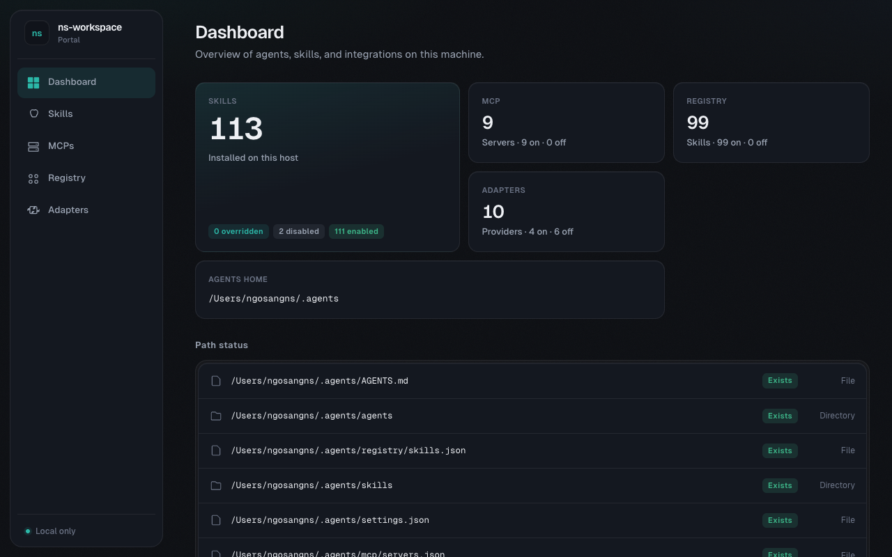
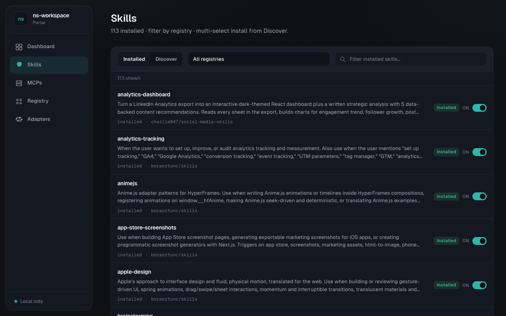
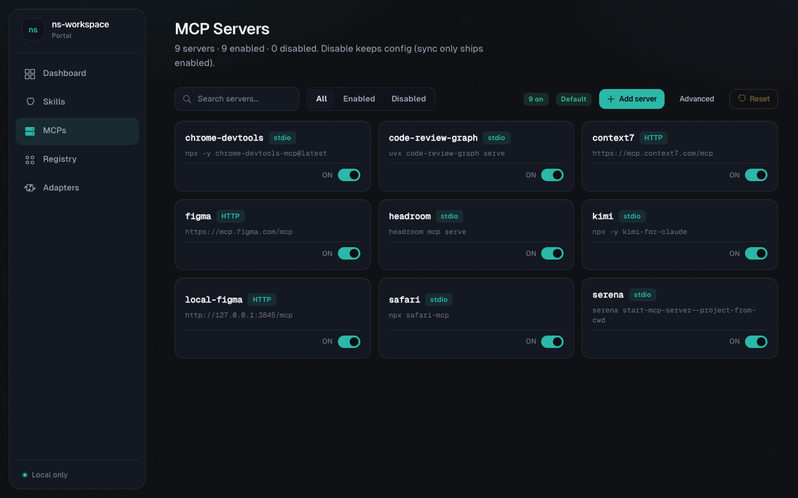
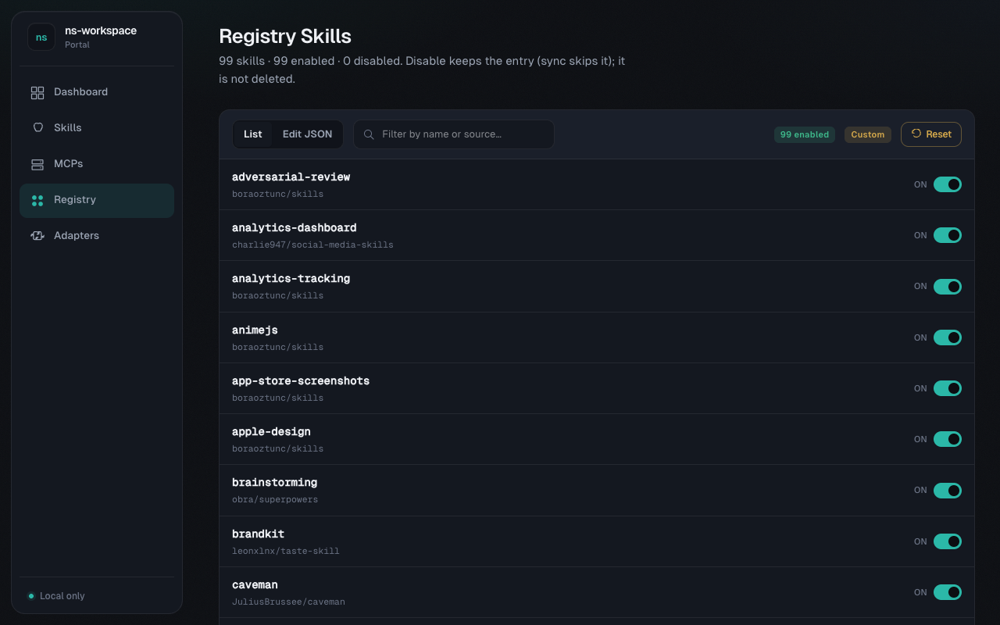
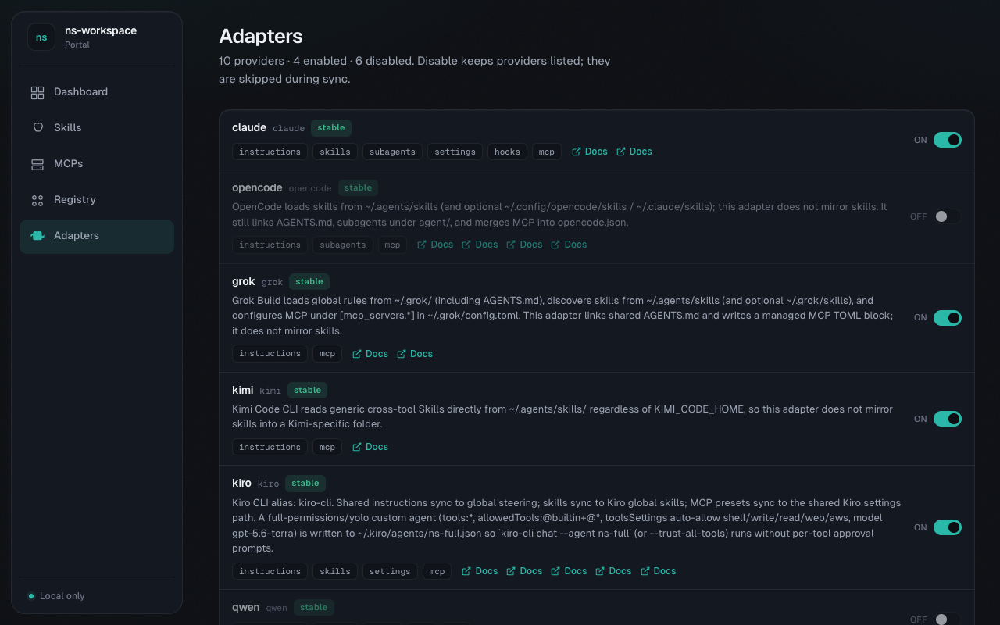

# ns-workspace

`ns-workspace` là Go CLI để bootstrap và đồng bộ cấu hình AI coding agent cá nhân. Repo gom preset dùng chung cho instructions, skills, subagents, settings, hooks, registry và MCP servers, rồi materialize chúng sang các vị trí native của Claude Code, OpenCode, Grok Build, Kimi, Kiro, Qwen, Antigravity, Codex, Cline, ZCode và các adapter khác.

Ý tưởng chính là dùng `~/.agents` làm nguồn cấu hình chung. Từ đó, mỗi agent nhận cùng workflow, trigger skill và convention mà không phải bảo trì thủ công từng thư mục cấu hình riêng.

Repo cũng có các lệnh đọc knowledge base: `preview` serve SolidJS SPA + PreviewHandler cho `docs/`, `search` mở Search/Code Graph standalone, `graph` chạy query terminal dạng text/JSON, `export` dump docs + graph thành một file HTML tĩnh self-contained (viewer SolidJS), `mcp` cung cấp command-line truy cập `docs/` dưới dạng JSON (list/lookup/search), còn `lsp` quản lý language server dùng cho Code Graph qua graph-query LSP registry.

## Screenshots

Portal UI (`task ns:portal` / `ns-workspace portal`) quản lý skills, MCP, registry và adapters trên máy local.

### Dashboard



### Skills



### MCP Servers



### Registry



### Adapters



## Trạng Thái

Đây là dự án cá nhân, phát triển nhanh để phục vụ workflow riêng. Một số adapter path, hook command, MCP config hoặc generated artifact có thể phụ thuộc vào phiên bản tool và môi trường local.

Trước khi apply lên môi trường quan trọng, hãy dùng `doctor`, `status` và `--dry-run`. Lệnh `update` ghi đè managed output tại chỗ (replace-in-place).

## Quickstart

Một lệnh duy nhất để có toàn bộ commands của `ns-workspace` dưới dạng [go-task](https://taskfile.dev/):

```bash
go run github.com/ngosangns/ns-workspace@latest setup    # sinh Taskfile.yml ở cwd
task --list                                              # xem tất cả task có sẵn
task ns:status                                           # chạy bất kỳ task nào
```

## Lệnh `setup`

Sinh (hoặc merge) `Taskfile.yml` ở cwd liệt kê toàn bộ scripts/commands của `ns-workspace` (nhóm `ns:*`), npm scripts (nhóm `lint:*`, `format:*`, `build:*`) và Go tasks (`go:*`).

```bash
go run github.com/ngosangns/ns-workspace@latest setup                # tạo/merge Taskfile.yml ở cwd
go run github.com/ngosangns/ns-workspace@latest setup --dry-run      # xem nội dung sẽ ghi
go run github.com/ngosangns/ns-workspace@latest setup --force        # ghi đè Taskfile.yml thay vì merge
go run github.com/ngosangns/ns-workspace@latest setup --target ~/p   # ghi Taskfile.yml vào thư mục khác
```

Setup flags:

```bash
--target PATH     directory to write Taskfile.yml, default current directory
--dry-run         print planned Taskfile.yml on stdout instead of writing
--force           replace existing Taskfile.yml instead of merging
```

Khi merge, **task trùng tên** trong `Taskfile.yml` hiện có sẽ bị rewrite từ preset. Đặt tên task riêng — không dùng các prefix `ns:`, `lint:`, `format:`, `build:`, `go:` — để giữ task do bạn tự định nghĩa. Các top-level key khác (`vars`, `includes`, ...) được giữ nguyên.

## Sử Dụng Nhanh

Sau khi `setup`, mọi command của ns-workspace chạy qua [go-task](https://taskfile.dev/):

```bash
task ns:status               # trạng thái cài đặt agents
task ns:doctor               # validate JSON config + report local agent CLI
task ns:init                 # cài cấu hình shared sang adapter native
task ns:init -- --dry-run    # xem trước khi ghi
task ns:update               # cập nhật config từ preset embedded
task ns:harness:list         # liệt kê harness task
task ns:harness:run -- --task <id>    # chạy harness task
```

Dùng `--` để truyền flag cho command gốc bên trong task (vd `task ns:init -- --dry-run`).

Trong repo khác, `task ns:preview` mặc định đọc `--project .` (cwd). Để preview một project khác, override bằng `task ns:preview -- --project /path/to/project`.

## Lệnh Chính

Sau khi `setup`, mỗi lệnh dưới đây được wrap thành task `ns:<command>` (vd `task ns:status`). Truyền flag bằng cú pháp `task ns:<command> -- --flag value`.

| Lệnh       | Mục đích                                                                                                                                       |
| ---------- | ---------------------------------------------------------------------------------------------------------------------------------------------- |
| `init`     | Tạo cấu hình shared và link/copy sang adapter native. Mặc định bỏ qua file đã tồn tại, trừ khi dùng `--force`.                                 |
| `update`   | Rewrite các phần config do tool quản lý từ preset embedded (replace-in-place) và xóa nội dung managed không còn trong preset.     |
| `portal`   | Local web UI quản lý skills (installed + discover/catalog), MCP catalog, registry, adapters và chạy sync qua SSE.                                |
| `status`   | Hiển thị path đã cài, path thiếu và link hiện có.                                                                                              |
| `doctor`   | Validate JSON config và report các local agent CLI.                                                                                            |
| `registry` | Cài các skill lấy từ registry.                                                                                                                 |
| `agents`   | Liệt kê adapter được hỗ trợ, support tier và artifact support.                                                                                 |
| `catalog`  | Alias của `agents`.                                                                                                                            |
| `harness`  | Chạy harness task: list, run, eval, status, resume, stop. Hỗ trợ self-correct loop, multi-agent routing và memory persistence.                 |
| `preview`  | Serve SolidJS docs SPA + PreviewHandler cho thư mục `docs/` của một project.                                                                   |
| `search`   | Mở Search/Code Graph standalone bằng HTML launcher và local API server.                                                                        |
| `graph`    | Chạy query terminal bằng cùng backend Search/LSP Code Graph.                                                                                   |
| `export`   | Xuất toàn bộ docs + graph thành một file HTML tĩnh self-contained, mở offline qua `file://`.                                                   |
| `mcp`      | Command-line truy cập `docs/` dưới dạng JSON: `list-docs`, `lookup-doc`, `search-docs` (mỗi lần chạy một command).                             |
| `kb`       | Thao tác OKF trên docs: `kb validate` kiểm conformance, `kb index` sinh lại `index.md` từng thư mục.                                           |
| `setup`    | Sinh hoặc merge `Taskfile.yml` ở cwd để chạy toàn bộ scripts/commands của ns-workspace qua [go-task](https://taskfile.dev/).                   |
| `lsp`      | Liệt kê hoặc cài language server mà LSP Code Graph dùng.                                                                                       |

## Flag Hay Dùng

```bash
--agents-home ~/.agents
--config ~/.config/ns-workspace/config.json
--tools all
--tools stable
--tools claude,opencode,grok,kimi,kiro,qwen,antigravity,codex,cline
--tools kiro-cli
--dry-run
--force
--copy
--no-mcp
--no-registry
```

Harness flags:

```bash
--project PATH   project root to inspect, default current directory
--task ID        task id for run/eval/status/resume/stop
--dry-run        show planned actions without running
```

Dùng `--copy` với `init` nếu không muốn tạo symlink. Lệnh `update` luôn copy (không symlink) vì một số tool (đặc biệt Kiro IDE) không follow skill-directory symlink. Dùng `--config <file>` trỏ tới file JSON user-level để override hoặc bổ sung embedded preset (xem [User Config Overlay](#user-config-overlay)).

## User Config Overlay

`ns-workspace` cho phép cá nhân hoá preset mà không cần fork repo. Tạo file JSON ở vị trí mặc định `~/.config/ns-workspace/config.json` (override bằng `NS_WORKSPACE_CONFIG` hoặc `--config`) với format:

```json
{
  "presets/agents/AGENTS.md": "/home/me/.config/ns-workspace/AGENTS.md",
  "presets/opencode/opencode.json": "/home/me/.config/ns-workspace/opencode.json",
  "presets/skills/custom-skill/SKILL.md": "/home/me/.config/ns-workspace/skill.md"
}
```

Key là preset path (bắt đầu bằng `presets/`, dùng `/`), value là đường dẫn tuyệt đối tới file user. User file đè embedded preset; nếu key chỉ vào path mà embedded không có (vd: `presets/skills/custom-skill/SKILL.md`), file đó được cài như skill mới.

Ví dụ preset mặc định opencode với full authorization + tăng timeout:

```json
// ~/.config/ns-workspace/opencode.json
{
  "permission": "allow",
  "timeout": 300000
}
```

Sau `ns-workspace init`/`update`, `~/.config/opencode/opencode.json` sẽ có cả `permission` lẫn `timeout`. Tắt overlay bằng `--config ""`.

## Dữ Liệu Được Quản Lý

- Shared instructions: `~/.agents/AGENTS.md`
- Shared subagents: `~/.agents/agents/*.md`
- Custom/private skills: `~/.agents/skills/<name>/SKILL.md`
- Registry-managed skills: `~/.agents/registry/skills.json`
- Shared settings/hooks: `~/.agents/settings.json`
- Shared MCP presets: `~/.agents/mcp/servers.json`

Stable adapters ghi vào các user-level path đã biết:

| Agent         | User-level targets                                                                                                                                                                 |
| ------------- | ---------------------------------------------------------------------------------------------------------------------------------------------------------------------------------- |
| Claude Code   | `~/.claude/CLAUDE.md`, `~/.claude/settings.json` với hooks, `~/.claude/skills`, `~/.claude/agents`, generated MCP commands                                                         |
| OpenCode      | `$XDG_CONFIG_HOME/opencode/AGENTS.md`, `agent/`, `opencode.json` với MCP; skills đọc native từ `~/.agents/skills` (không mirror)                                                   |
| Grok Build    | `~/.grok/AGENTS.md`, managed MCP block trong `~/.grok/config.toml`; skills đọc native từ `~/.agents/skills` (không mirror)                                                         |
| Kimi Code CLI | `~/.kimi/AGENTS.md`, `~/.kimi/mcp.json`; skills không mirror vì Kimi đọc thẳng `~/.agents/skills` (generic, độc lập với `KIMI_CODE_HOME`)                                          |
| Kiro / CLI    | `~/.kiro/steering/AGENTS.md`, `~/.kiro/skills`, `~/.kiro/settings/mcp.json`, `~/.kiro/agents/ns-full.json` (full-permissions custom agent); `--tools kiro-cli` là alias của `kiro` |
| Qwen Code     | `~/.qwen/QWEN.md`, `~/.qwen/skills`, `~/.qwen/settings.json` với hooks và MCP                                                                                                      |
| Antigravity CLI (`agy`) | Instructions `~/.gemini/GEMINI.md`; settings `~/.gemini/antigravity-cli/settings.json` (`toolPermission`/`artifactReviewPolicy`); skills mirror `~/.gemini/antigravity-cli/skills`; MCP riêng `~/.gemini/config/mcp_config.json` (remote dùng `serverUrl`, không `url`/`httpUrl`) |
| Codex CLI     | `~/.codex/AGENTS.md`, managed MCP block trong `~/.codex/config.toml`; Codex không có `~/.codex/skills` — chỉ đọc `.agents/skills` (repo) và `~/.agents/skills` (user) nên không cần mirror |
| Cline         | `~/.cline/skills`, `~/.cline/agents`, `~/.cline/data/settings/cline_mcp_settings.json`                                                                                             |
| ZCode         | `~/.zcode/AGENTS.md` (link từ shared); skills đọc native `~/.agents/skills` (không mirror)                                                                                        |

## Portal

`portal` serve localhost UI (SolidJS) để bật/tắt skills, MCP, registry entries và adapters, discover/install skill từ GitHub registry, và chạy `init`/`update`/`registry`/`doctor`/`status` với log SSE. Overlay user ghi dưới `~/.config/ns-workspace/portal/` (không sửa embedded presets). Xem [docs/features/portal.md](docs/features/portal.md).

```bash
task ns:portal
go run . portal --open
```

## Preview, Search, Graph Và Harness

`preview` chạy localhost web server để đọc thư mục `docs/` của project. Dashboard có sidebar tài liệu, Markdown/HTML preview, Graph tab và Search tab. Search có các panel Docs Semantic, Docs Graph, Code Semantic và Code Graph; Code Graph index symbol từ LSP trên file code tracked bởi Git, bỏ qua generated preview UI artifacts của repo, rồi mở rộng caller/callee hoặc references khi language server hỗ trợ.

`harness` chạy task tự động hóa workflow dev với self-correct loop. Mỗi task là file YAML/JSON trong `.harness/tasks/`, định nghĩa requirements, scope, acceptance criteria, routing và stopping rules. Loop đi qua các phase plan → execute → verify → diagnose, lưu checkpoint sau mỗi phase và dừng khi verify pass, state lặp, hết hypothesis, hoặc phát hiện ambiguity. Ngoài task dev generic, harness còn hỗ trợ task type `enrich-docs`: enrich docs từ seed URL với hard caps code-enforced (`max_pages`, `allowed_hosts`, `max_depth`, timeout) và chỉ ghi file bên trong docs root. Xem thêm [docs/features/agentic-loop.md](docs/features/agentic-loop.md) và [docs/modules/harness.md](docs/modules/harness.md).

```bash
task ns:preview -- --project ~/path/to/project --open
task ns:preview -- --project . --open
```

Preview flags:

```bash
--project PATH
--docs-dir docs
--addr 127.0.0.1:0
--open
--no-reload
```

`search` dùng cùng backend search với `preview`, nhưng mở entry Search standalone từ HTML launcher. Command cần tiếp tục sống trong terminal để frontend gọi local API server.

`graph` chỉ chạy query terminal: không sinh launcher, không mở browser và không giữ server sống. Mặc định command tự ensure language server còn thiếu cho project trước khi query, cài vào cache user của `ns-workspace` và vẫn fail-open nếu cài đặt lỗi hoặc server không hỗ trợ relation expansion.

```bash
task ns:search -- --project . --out ./search.html
task ns:graph -- --project . --query buildPreviewSearchResponse --json
task ns:graph -- --project . --no-ensure-lsp --query buildPreviewSearchResponse --json
task ns:graph -- --project . --query auth,session --keyword-op difference --limit 5
```

Graph flags:

```bash
--project PATH
--docs-dir docs
--query "symbol-or-concept"
--limit 8
--keyword-op sum|difference
--ensure-lsp
--no-ensure-lsp
--json
```

## Export Tĩnh Và MCP

`export` build một file HTML duy nhất, self-contained, nhúng toàn bộ knowledge base rồi render client-side bằng **OKF Bundle Viewer** (port từ [GoogleCloudPlatform/knowledge-catalog](https://github.com/GoogleCloudPlatform/knowledge-catalog), Apache 2.0). Viewer có force-directed graph (Cytoscape.js), detail panel hiện frontmatter + body render bằng marked, danh sách "Cited by" backlinks, search theo title/id/tag, filter theo type và đổi layout (cose/concentric/breadth-first/circle/grid). Mặc định `--inline-assets=true` nhúng luôn thư viện render nên file mở được qua `file://` mà không gọi mạng; `--inline-assets=false` tham chiếu CDN. Command tái dùng cùng knowledge core với `preview`/`search`, validate docs dir trước khi ghi và fail-open khi một doc lỗi. Internal link `.md` giữa các doc được rewrite sang dạng OKF bundle-relative để điều hướng ngay trong viewer.

```bash
task ns:export -- --project . --out ./ns-workspace-kb.html --open
task ns:export -- --project . --name "ns-workspace KB"
task ns:export -- --project . --no-graph
task ns:export -- --project . --inline-assets=false
```

Export flags:

```bash
--project PATH        project root to export, default current directory
--docs PATH           docs directory, default docs
--out PATH            output HTML file path, default ./ns-workspace-kb.html
--name NAME           display name in the viewer header, default project name
--no-graph            export documents only, without the relationship edges
--inline-assets       inline render libraries for fully offline output, default true
--open                open the generated file after writing
```

`mcp` chạy các command một lần để truy vấn `docs/` và in kết quả JSON ra stdout. Các command hiện có: `list-docs` (liệt kê docs, filter theo `type`/`tag`), `lookup-doc` (lấy full content + metadata theo id), `search-docs` (search bằng cùng pipeline với preview/search). Không còn vòng lặp server persistent; command được gọi khi cần và thoát ngay sau khi trả kết quả.

```bash
task ns:mcp -- list-docs --type module
```

`preview` serve SolidJS SPA local (docs list/detail, search, graph) qua PreviewHandler API. Build frontend: `npm run build:preview` (TypeScript 7 + Solid).

```bash
task ns:preview
```

MCP usage:

```bash
mcp [global-flags] <command> [command-flags]

# Global flags (phải đứng trước command):
--project PATH        project root, default current directory
--docs PATH           docs directory, default docs
```

## Metadata Docs Theo OKF

Docs có thể khai báo metadata bằng YAML frontmatter chuẩn (`---`) theo tinh thần OKF, với các key `type`, `description`, `tags`, `timestamp` cùng các key tương thích (`status`, `version`, `compliance`, `priority`, `links`). `tags` nhận cả string đơn lẫn array và được normalize về `[]string`. Parser là permissive consumer: key lạ hoặc `type` không biết vẫn được chấp nhận, không báo lỗi.

Frontmatter tương thích ngược với section `## Meta` dạng prose đang dùng: doc chỉ có `## Meta` hoạt động y như trước; doc có cả hai thì frontmatter thắng ở key trùng và `## Meta` điền các field còn trống. Nếu frontmatter lỗi cú pháp, hệ thống fallback sang `## Meta`, ghi warning và không panic.

## Lệnh kb (OKF)

`kb` gom các thao tác trên knowledge base theo Open Knowledge Format:

- `kb validate` kiểm OKF conformance: mọi doc (trừ file reserved `index.md`/`log.md`) phải có YAML frontmatter parse được với `type` không rỗng. Thiếu key khuyến nghị (`title`/`description`/`timestamp`) là warning; `--strict` nâng warning thành lỗi. Exit non-zero khi có doc không conformant nên dùng được trong CI. `--json` xuất report cho tooling.
- `kb index` sinh lại file `index.md` cho từng thư mục (progressive disclosure, theo OKF SPEC §6): group entry theo `type`, kèm description, và liệt kê subdirectory. `--dry-run` in danh sách file sẽ ghi mà không ghi thật.

```bash
task ns:kb:validate
task ns:kb:validate -- --strict --json
task ns:kb:index -- --dry-run
task ns:kb:index
```

KB flags:

```bash
--project PATH        project root, default current directory
--docs PATH           docs directory, default docs
--json                (validate) in report dạng JSON
--strict              (validate) coi warning key khuyến nghị là lỗi
--dry-run             (index) in file sẽ ghi mà không ghi
```

## LSP Cho Code Graph

`lsp` hỗ trợ HTML, CSS, SCSS/Sass, JavaScript, TypeScript, Go/Golang và Kotlin. `lsp install` cài vào cache user của `ns-workspace` thay vì sửa project được inspect. Mặc định dùng `os.UserCacheDir()/ns-workspace/lsp`; có thể override bằng `NS_WORKSPACE_LSP_CACHE`.

Resolver ưu tiên binary có sẵn trong `PATH`, Go bin dirs và `node_modules/.bin` của project/checkout trước cache. Kotlin dùng `kotlin-lsp`; `lsp install kotlin` tải JetBrains Kotlin LSP standalone archive theo OS/arch, verify SHA-256 đã pin, extract vào cache versioned và tạo wrapper `<cache>/kotlin/bin/kotlin-lsp`.

```bash
task ns:lsp:list -- --project . --json
task ns:lsp:install -- auto --project .
task ns:lsp:install -- kotlin --project .
```

## Phát Triển

Xem [DEVELOPER.md](./DEVELOPER.md) để biết cấu trúc repo, workflow test/lint/format và các quy ước khi sửa preset, adapter hoặc preview web.

## Copyright

Xem [COPYRIGHT.md](./COPYRIGHT.md). Repo hiện chưa khai báo open-source license riêng; không mặc định có quyền sử dụng lại ngoài quyền được nêu trong file đó hoặc thỏa thuận bằng văn bản.
