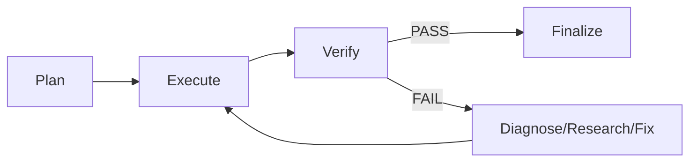

# Agentic Loop

## Meta

- **Status**: active
- **Description**: Feature looping agentic cho phép chạy self-correct loop với multi-agent routing và memory persistence.
- **Compliance**: current-state
- **Links**: [Chỉ mục](../_index.md), [Module harness](../modules/harness.md), [Spec harness looping agentic](../specs/planning/harness-looping-agentic.md)

## Tổng Quan

Agentic loop là vòng lặp tự động `plan → execute → verify → diagnose → execute ...` cho đến khi đạt điều kiện dừng.

## Luồng



## Đặc Điểm

- Không dùng `max iterations` hay `timeout` cứng.
- Dừng dựa trên tính đúng đắn, tiến triển và sự can thiệp.
- Hỗ trợ multi-agent routing theo phase, domain và task type.
- Lưu checkpoint sau mỗi phase.
- Có thể pause và resume.

## Điều Kiện Dừng

| Điều kiện            | Mô tả                                            |
| -------------------- | ------------------------------------------------ |
| Verify pass          | Tất cả acceptance criteria pass                  |
| State lặp            | Hash state trùng với history                     |
| Hết hypothesis       | Không còn untried hypothesis                     |
| Consecutive failures | Vượt `max_consecutive_failures`                  |
| Ambiguity            | Phát hiện ambiguity hoặc cần quyết định thiết kế |
| Acceptance criteria  | Tất cả đều pass                                  |
| Subtasks done        | Tất cả subtask hoàn thành                        |

## Routing

Routing được định nghĩa trong task file:

```yaml
routing:
  default: opencode
  plan:
    domain: backend
    agent: opencode-planner
  execute:
    domain: backend
    agent: opencode-executor
  verify:
    agent: eval-judge
  diagnose:
    agent: opencode-fixer
```

## Human-in-the-loop

Khi phát hiện ambiguity hoặc stuck:

- **Interactive**: pause terminal, in câu hỏi, chờ user trả lờirồi resume.
- **CI/non-interactive**: ghi `decision-request.md` và dừng, user chỉnh rồi `harness resume`.

## Sử Dụng

```bash
go run . harness run --task refactor-auth --project .
go run . harness status --task refactor-auth
go run . harness resume --task refactor-auth
```

## Trigger

- `//l`: loop
- `//hl`: harness + loop
- `//hlv`: harness + loop + eval
- `//hle`: harness + loop + execution
