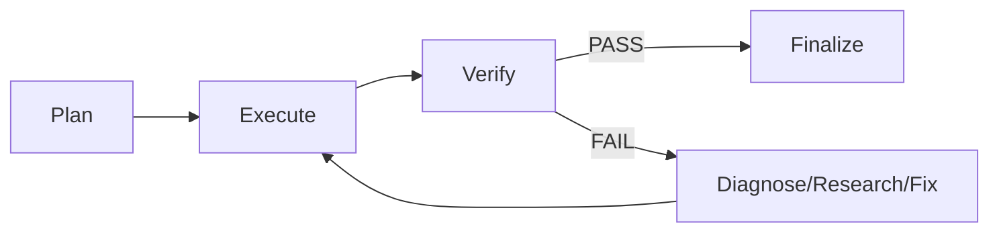

# Module Harness

## Meta

- **Status**: active
- **Description**: Module harness cung cấp engine, task registry, evaluator, loop controller, dispatcher và memory store cho `ns-workspace` CLI.
- **Compliance**: current-state
- **Links**: [Chỉ mục](../_index.md), [Feature agentic loop](../features/agentic-loop.md)

## Tổng Quan

Module `internal/harness` quản lý vòng đở của một harness task: đọc task, chạy eval, điều phối loop, dispatch subagent và lưu state.

## Thành Phần

| File              | Vai trò                                |
| ----------------- | -------------------------------------- |
| `task.go`         | Định nghĩa task struct, load YAML/JSON |
| `memory.go`       | State struct và dual memory store      |
| `evaluator.go`    | Chạy eval commands từ nhiều nguồn      |
| `dispatcher.go`   | Subagent driver abstraction            |
| `loop.go`         | Loop controller và guardrails          |
| `enrich.go`       | Task type `enrich-docs` với hard caps  |
| `engine.go`       | Harness engine và CLI-facing API       |
| `harness_test.go` | Tests                                  |

## Engine API

```go
engine := harness.NewEngine(projectRoot, reporter)
engine.ListTasks()
engine.LoadTask(id)
engine.Run(ctx, id, dryRun)
engine.Eval(id)
engine.Status(id)
engine.Resume(ctx, id)
engine.Stop(id)
```

## Task File

Task định nghĩa trong `.harness/tasks/<id>.yaml` hoặc `.json`:

```yaml
id: sample
description: Sample task
requirements:
  - id: REQ-1
    text: Do something
scope:
  include:
    - internal/**
acceptance:
  - command: go test ./...
    must_pass: true
phases:
  - plan
  - execute
  - verify
routing:
  default: opencode
  plan:
    agent: opencode-planner
  execute:
    agent: opencode-executor
  verify:
    agent: eval-judge
stopping:
  max_consecutive_failures: 3
  require_human_on_ambiguity: true
```

## Evaluator

Evaluator kết hợp:

1. Task-defined acceptance commands/scripts
2. `package.json` scripts: `test`, `lint`, `typecheck`, `build`
3. `go test ./...` mặc định

## Dispatcher

`SubagentDriver` là interface để dispatch subagent. Hiện tại có:

- `OpenCodeDriver`: gọi `opencode run --dangerously-skip-permissions`
- `MockDriver`: dùng trong tests

## Memory

Dual store:

- Project path: `.harness/state/<id>.json`
- Shared path: `~/.agents/harness/<project>/<id>.json`

Load ưu tiên project path, fallback shared path. Save ghi cả hai.

## Loop Controller

Luồng phase:



Guardrails:

- Verify pass
- State lặp lại
- Hết hypothesis
- Consecutive failures vượt ngưỡng
- Ambiguity
- Acceptance criteria thỏa mãn
- Subtasks hoàn thành

## Task `enrich-docs`

Khi `task.Type == "enrich-docs"`, loop controller chạy nhánh enrichment riêng (`runEnrich` trong `enrich.go`) ngay từ phase plan; phase execute là no-op còn phase verify vẫn chạy acceptance command như thường. Luồng: plan (LLM đề xuất URL ứng viên từ seeds) → fetch (guarded, fail-open) → execute (LLM tổng hợp corpus thành doc change JSON) → write (ghi file giới hạn trong docs root).

Cấu hình qua `EnrichConfig` trong task:

```yaml
type: enrich-docs
enrich:
  seeds:
    - url: https://example.com/guide
    - file: docs/seed-notes.md
  caps:
    max_pages: 10
    max_depth: 1
    allowed_hosts:
      - example.com
    fetch_timeout_seconds: 15
  target:
    mode: references # references | enrich
    references_dir: docs/references
```

Hard caps là code-enforced, không dựa vào LLM tự giới hạn:

- `max_pages`: chặn số trang fetch (mặc định 10 khi <= 0).
- `allowed_hosts` ∪ host của seeds: chỉ fetch URL trong allowlist; redirect đổi host bị chặn.
- `max_depth`: giới hạn link-follow; depth 0 chỉ fetch seeds + URL do plan đề xuất.
- `fetch_timeout_seconds`: timeout mỗi fetch (mặc định 15s), body cap 5 MiB.

Fetch lỗi/timeout hay URL ngoài allowlist được ghi vào `state.Warnings` qua `State.AddWarning` và loop tiếp tục (fail-open). Mode `references` tạo doc mới trong `references_dir` với frontmatter `type: reference`; mode `enrich` chỉ sửa doc đã tồn tại. Mọi đường ghi đều đi qua `confineToDocsRoot` để chặn path traversal ra ngoài docs root.

## Quan Hệ

- `internal/cli/harness.go` gọi `internal/harness`.
- `main.go` route command `harness`.
- Preset skills/subagents cung cấp instruction cho AI agents.
