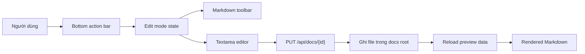

# Edit Markdown Trong Preview

## Meta

- **Status**: implemented
- **Description**: Kế hoạch bổ sung chế độ sửa Markdown trực tiếp trong preview web, với nút Edit/Save nổi và toolbar chỉnh Markdown phù hợp.
- **Compliance**: current-state
- **Links**: [Preview web](../../features/preview-web.md), [Module preview](../../modules/preview.md), [Quy ước frontend preview](../../development/conventions/preview-frontend.md), [Chỉ mục](../../_index.md)

## Bối Cảnh

Preview web hiện là công cụ đọc và điều hướng tài liệu trong `docs/`. Doc tab render Markdown ở client bằng `markdown-it`, hỗ trợ highlight, Mermaid, LikeC4, raw Markdown toggle, copy reference theo selection, preview modal và hot reload qua `/api/events`.

Frontend chính nằm ở `internal/preview/preview_ui_src/`, còn `internal/preview/preview_ui/` là output build được Go embed. Backend hiện chỉ có API đọc như `/api/docs/{id}` và `/api/files`; chưa có API ghi nội dung Markdown. Vì vậy tính năng edit cần bổ sung cả contract backend lẫn state/UI frontend.

Tài liệu hiện đang được sync tại commit `1b7d73e`, còn HEAD hiện tại là `a8c8bc9`, nên kế hoạch này dựa trên docs như bối cảnh và đã đối chiếu thêm với code preview hiện tại.

## Mục Tiêu

- Cho phép sửa Markdown của tài liệu đang mở trong Doc tab.
- Hiển thị cụm nút nổi bottom center trong trạng thái đọc: `Edit`; khi có thay đổi trong trạng thái sửa: `Save` và trạng thái lưu rõ ràng.
- Khi nhấn `Edit`, chuyển Markdown sang vùng editable và hiển thị toolbar edit nổi top center.
- Toolbar phải phù hợp với Markdown, ưu tiên thao tác quen thuộc: heading, bold, italic, link, unordered list, ordered list, quote, code inline, code block, table và preview/raw toggle nếu cần.
- Lưu file vào đúng tài liệu trong docs root, không cho path escape project/docs root.
- Sau khi lưu, UI cập nhật state hiện tại, reload danh sách/graph/search data khi cần và giữ route/spec đang mở.

## Ngoài Phạm Vi

- Không xây editor WYSIWYG đầy đủ hoặc rich text nested editing theo từng block.
- Không hỗ trợ sửa file ngoài docs root qua `/api/files`.
- Không xử lý merge conflict phức tạp nếu file bị thay đổi đồng thời ngoài preview; chỉ cần phát hiện và báo lỗi hoặc reload an toàn.
- Không thêm dependency editor lớn nếu `<textarea>` và helper Markdown commands đáp ứng được yêu cầu.

## Logic Nghiệp Vụ

Chỉ tài liệu Markdown trong docs root được edit. Điều kiện edit dựa trên `spec.language === "markdown"` hoặc extension `.md`/`.markdown` sau khi backend resolve đúng spec id sang path thật.

Khi người dùng bật edit, UI dùng raw Markdown hiện tại làm `draft`. Vùng nội dung chuyển từ rendered article sang editor textarea có kích thước ổn định, font monospace, line wrapping dễ đọc và không phá layout sidebar/topbar. Toolbar thao tác bằng cách chèn hoặc bao quanh selection trong textarea.

Trạng thái lưu cần phân biệt:

- `clean`: draft giống raw hiện tại, có thể thoát edit.
- `dirty`: draft khác raw hiện tại, hiển thị nút Save bottom center.
- `saving`: khóa nút Save và toolbar để tránh double submit.
- `saved`: cập nhật raw/spec hiện tại, render lại Markdown, báo thành công ngắn.
- `error`: giữ draft, hiển thị lỗi lưu và cho thử lại.

Nếu người dùng hủy hoặc thoát khi dirty, UI nên hỏi xác nhận bằng dialog browser native hoặc confirm nhẹ trước khi bỏ draft.

## Cấu Trúc Giải Pháp



## Backend API

Thêm endpoint ghi vào route hiện có `/api/docs/{id}` bằng method `PUT` hoặc `POST`. Đề xuất dùng `PUT` vì thao tác thay thế toàn bộ nội dung tài liệu:

```http
PUT /api/docs/{id}
Content-Type: application/json

{ "raw": "# Nội dung mới" }
```

Response trả lại `specDocument` đã scan lại sau khi ghi, để frontend cập nhật title, metadata, compliance, graph source line và rendered content theo dữ liệu mới.

Ràng buộc backend:

- Chỉ nhận method `GET` và `PUT` ở `/api/docs/{id}`.
- Resolve `id` qua `ps.load()` thay vì tin path từ client.
- Chỉ ghi khi document language là Markdown và path nằm trong docs root.
- Giới hạn kích thước body hợp lý dựa trên `maxSearchFileBytes` hoặc một constant riêng.
- Ghi UTF-8 text bằng `os.WriteFile` với permission bảo toàn nếu file tồn tại.
- Sau khi ghi, gọi `ps.load()` lại và trả document tương ứng; nếu metadata đổi làm id không còn tồn tại, trả document theo path hoặc lỗi rõ ràng.

## Frontend UI

Doc tab nên có thêm hai vùng control:

- Bottom center action bar cố định theo viewport, chỉ hiện ở Doc tab và khi tài liệu Markdown đang mở. Trạng thái đọc có icon pencil `Edit`; trạng thái edit có icon save `Save`, spinner khi saving và icon close/cancel nếu dirty.
- Top center edit toolbar cố định theo viewport, chỉ hiện khi edit mode bật. Toolbar dùng icon-only buttons có `aria-label` và `title`, đồng bộ style với DaisyUI/lucide hiện có.

Editor dùng `<textarea>` thay cho rendered Markdown trong `#specContent` khi edit mode bật. Textarea cần:

- Chiếm cùng max width với Markdown hiện tại.
- Có min height đủ lớn, resize vertical, line-height đọc được.
- Giữ focus và selection sau khi áp dụng command.
- Không chạy Mermaid/highlight trong lúc edit; render lại chỉ sau khi save hoặc khi thoát edit về preview.

Các command Markdown đề xuất:

| Command        | Hành vi                                                         |
| -------------- | --------------------------------------------------------------- |
| Heading        | Prefix dòng selection bằng `## ` hoặc xoay vòng heading cơ bản. |
| Bold           | Bao selection bằng `**...**`.                                   |
| Italic         | Bao selection bằng `_..._`.                                     |
| Link           | Chèn `[text](url)` hoặc bao selection thành link placeholder.   |
| Unordered list | Prefix từng dòng selection bằng `- `.                           |
| Ordered list   | Prefix từng dòng selection bằng `1.`, `2.` theo thứ tự.         |
| Quote          | Prefix từng dòng bằng `> `.                                     |
| Inline code    | Bao selection bằng backtick.                                    |
| Code block     | Bao selection bằng fenced code block.                           |
| Table          | Chèn skeleton bảng Markdown nhỏ.                                |

## State Frontend

Mở rộng `PreviewState` với các field:

- `editingMarkdown: boolean`
- `markdownDraft: string`
- `markdownSaveState: "idle" | "dirty" | "saving" | "saved" | "error"`
- `markdownSaveError: string`

Luồng chính:

1. `selectSpec()` load spec như hiện tại, reset edit state nếu chuyển tài liệu.
2. `enterMarkdownEdit()` lấy `state.currentSpec.raw` vào draft và render editor.
3. Toolbar command sửa draft qua textarea selection API.
4. `saveMarkdownDraft()` gửi `PUT /api/docs/{id}`.
5. Khi thành công, cập nhật `state.currentSpec`, `state.specs`, gọi `reloadPreviewData()` hoặc cập nhật tối thiểu docs/graph, tắt dirty và render lại Markdown.

Hot reload cần xử lý cẩn thận: nếu đang edit dirty, không tự overwrite draft khi SSE báo thay đổi; hiển thị trạng thái có thay đổi ngoài editor và cho người dùng lưu hoặc reload thủ công.

## File Và Module Bị Ảnh Hưởng

- `internal/preview/preview_api.go`: thêm request/response save Markdown và validation ghi file.
- `internal/preview/preview.go`: route `/api/docs/{id}` giữ nguyên nhưng `handleSpec` hỗ trợ thêm method ghi.
- `internal/preview/preview_ui_src/app.ts`: thêm edit state, render editor, toolbar commands, save flow và hot reload guard.
- `internal/preview/preview_ui/index.html`: thêm action bar và toolbar DOM.
- `internal/preview/preview_ui/style.css`: thêm layout float bottom/top, editor textarea và responsive behavior.
- `internal/preview/preview_test.go`: thêm backend API tests và UI string tests cho edit controls.
- `internal/preview/preview_ui/app.js`: generated output sau `npm run build:preview`.

## Công Việc Đã Triển Khai

1. Backend save Markdown an toàn cho `/api/docs/{id}` bằng `PUT`.
2. Test backend cho save thành công và reject non-Markdown document.
3. DOM skeleton cho bottom action bar và top toolbar trong preview HTML.
4. TypeScript state/rendering để chuyển giữa rendered Markdown và textarea editor.
5. Markdown toolbar commands bằng textarea selection API.
6. Save flow, error state và reload/update sau save.
7. CSS responsive cho floating controls và editor.
8. UI tests bắt các integration string quan trọng.
9. Validation bằng `npm run check:preview`, `npm run lint:preview`, `npm run build:preview`, `npm run format:preview:check` và `go test ./...`.

## Rủi Ro Và Ràng Buộc

- Hot reload hiện reload data khi docs đổi; nếu không guard dirty draft thì người dùng có thể mất nội dung đang sửa.
- Metadata thay đổi sau save có thể đổi title, graph links hoặc category; frontend cần reload docs/graph thay vì chỉ patch raw.
- Editor textarea đơn giản không preview live; đây là tradeoff có chủ ý để giữ scope nhỏ và không thêm dependency nặng.
- Floating controls cần tránh che nội dung cuối trang; Doc tab nên có padding bottom khi action bar hiện.
- Selection copy context menu hiện dùng selection trong Doc/preview; khi edit textarea focus, logic copy reference không nên hiện sai.

## Kiểm Chứng

- Unit/API: `go test ./...`.
- TypeScript: `npm run check:preview`.
- Lint: `npm run lint:preview`.
- Build generated assets: `npm run build:preview`.
- Manual preview sau khi duyệt triển khai: mở `go run . preview --project . --no-reload`, edit một file Markdown test trong docs, dùng toolbar chèn heading/list/link/code/table, save, reload trang và xác nhận nội dung persisted.

## Tiêu Chí Chấp Nhận

- [x] Doc Markdown có nút Edit nổi bottom center khi đang đọc.
- [x] Nhấn Edit hiển thị toolbar Markdown nổi top center và vùng nội dung chuyển thành editable.
- [x] Toolbar thao tác đúng trên selection hoặc chèn placeholder hợp lý khi không có selection.
- [x] Khi draft thay đổi, nút Save nổi bottom center lưu được file Markdown hiện tại.
- [x] Save thành công render lại Markdown, diagram/code highlight vẫn hoạt động như trước.
- [x] Save lỗi không làm mất draft và hiển thị lỗi rõ.
- [x] Không thể ghi file ngoài docs root hoặc file không phải Markdown.
- [x] Generated preview assets đồng bộ với source TypeScript.
