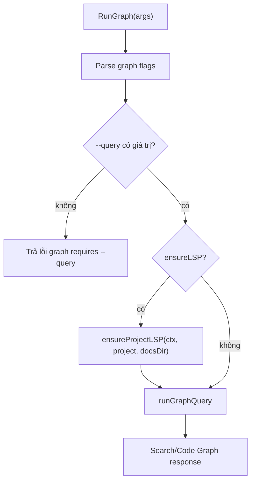

# Tự Động Ensure LSP Khi Query Graph

## Meta

- **Status**: implemented
- **Description**: Kế hoạch đổi `graph --query` thành workflow tự chuẩn bị LSP mặc định, để agent không phải nhớ thêm `--ensure-lsp` khi cần Code Graph.
- **Compliance**: current-state
- **Links**: [Tự động cài LSP cho Graph Query](./auto-install-lsp-for-graph.md), [Mở rộng LSP coverage](./expand-lsp-language-coverage.md), [LSP Code Graph Search](./lsp-code-graph-search.md), [Module preview](../../modules/preview.md), [Preview web](../../features/preview-web.md)

## Bối Cảnh

Flow hiện tại đã có registry LSP, cache `NS_WORKSPACE_LSP_CACHE`, lệnh `lsp list/install`, resolver cache và auto-ensure mặc định trong `graph --query`. Code Graph hiện hỗ trợ HTML, CSS/SCSS/Sass, JavaScript/TypeScript, Go/Golang và Kotlin. Kotlin dùng `kotlin-lsp` với manual install guide; các server Go/npm có installer cache.

Trước thay đổi này, contract CLI vẫn là opt-in:

- `graph --query ...` chỉ query, không cài gì.
- `graph --ensure-lsp --query ...` mới detect language và chạy `ensureProjectLSP()` trước khi query.
- Skill `lsp-code-graph` phải tự thêm `--ensure-lsp`.
- Warning missing LSP vẫn nhắc "one-shot" bằng `graph --ensure-lsp`.

Yêu cầu mới là đảm bảo tự động cài LSP khi query graph. Vì `graph` là command terminal/agent-first, không phải HTTP request, có thể đổi default của CLI query path để tự ensure LSP trước khi chạy search. Preview/Search UI vẫn phải giữ fail-open, không tự cài package trong request web.

Ghi chú sync: `docs/_sync.md` đang ghi `Last Synced Commit` cũ hơn HEAD, nên tài liệu được dùng làm bối cảnh và đã được verify lại bằng code hiện tại. Code path hiện tại xác nhận `RunGraph()` chỉ gọi `ensureProjectLSP()` khi `opt.ensureLSP` được bật bởi flag.

## Nguyên Nhân Và Lý Do Thiết Kế

Triệu chứng trực tiếp:

- Agent hoặc user chạy `go run . graph --project <repo> --query <term> --json` có thể nhận `codeGraph: 0` dù registry LSP đã biết cách cài server.
- Missing-LSP warning yêu cầu chạy lại bằng `--ensure-lsp`, tạo thêm một vòng command không cần thiết.
- Skill phải ghi nhớ flag cài đặt thay vì dựa vào hành vi mặc định của command graph.

Nguyên nhân gốc rễ:

- Thiết kế trước xem cài LSP là side effect cần opt-in tuyệt đối, nên `graph --query` mặc định không gọi installer.
- Sau khi user đã chấp nhận graph là command query dành cho agent, default này không còn khớp kỳ vọng "query graph thì tự chuẩn bị graph dependencies".
- HTTP preview/search và CLI graph đang bị gom chung trong mô tả "Search/Code Graph", nhưng mức chấp nhận side effect khác nhau: HTTP request phải read-only; CLI `graph --query` có thể có side effect cài tool cache nếu output vẫn ổn định.

Lý do chọn hướng đi:

- Đổi default của `graph --query` sang auto-ensure để giải quyết đúng workflow agent: một command query đủ để chuẩn bị LSP và lấy graph context.
- Giữ opt-out rõ ràng cho môi trường không muốn network hoặc install package, ví dụ CI, audit read-only hoặc debugging warning.
- Giữ `--ensure-lsp` để không phá script hiện có; flag này trở thành alias/no-op khi default đã bật.
- Không đổi HTTP `/api/search`, `preview` hoặc `search`, vì các bề mặt này có request lifecycle ngắn và không nên tải package ngầm.

## Phạm Vi Tập Trung

Phạm vi nằm trong CLI graph và docs/skill:

- `internal/preview/graph.go`: parse option, default ensure, opt-out, warning behavior.
- `internal/preview/preview_lsp_setup.go`: có thể cần message warning mới nếu default ensure đã chạy mà vẫn thiếu server.
- `internal/preview/preview_test.go`: thêm coverage cho default auto-ensure và opt-out.
- `README.md`, docs feature/module/planning và `presets/skills/lsp-code-graph/SKILL.md`: cập nhật command examples và warning text.

Ngoài phạm vi:

- Không tự cài LSP trong HTTP `/api/search`, `preview`, `search` UI hoặc Search standalone server request.
- Không thay đổi installer Kotlin thành auto-download archive.
- Không mutate target project, không thêm dependency vào repo được inspect.
- Không thêm UI, không đổi output schema của `/api/search`.

## Mục Tiêu

- `go run . graph --project <repo> --query <term> --json` tự detect language và chạy ensure LSP trước khi query.
- JSON stdout vẫn chỉ chứa JSON response; mọi progress/install log đi qua stderr hoặc `warnings`.
- Có opt-out rõ ràng:
  - `--no-ensure-lsp` để bỏ qua auto install.
  - `--ensure-lsp=false` nếu muốn dùng bool flag style của Go.
- `--ensure-lsp` vẫn được chấp nhận để giữ tương thích script/skill hiện tại.
- Nếu install một phần fail, graph vẫn fail-open: response có warnings install failure + missing server warning, các panel khác vẫn hoạt động.
- Nếu project không có language được hỗ trợ, ensure chạy nhanh và không tạo side effect.

## Logic Nghiệp Vụ

### Default mới cho query graph

`graph --query` nên có default:

```text
ensureLSP = true
```

Sau parse flags:

- Nếu user truyền `--no-ensure-lsp`, set `ensureLSP = false`.
- Nếu user truyền `--ensure-lsp=false`, set `ensureLSP = false`.
- Nếu user truyền `--ensure-lsp` hoặc không truyền gì, giữ `ensureLSP = true`.

`--ensure-lsp` vẫn nên xuất hiện trong help với mô tả tương thích:

```text
--ensure-lsp        ensure missing LSP servers before querying (default true)
--no-ensure-lsp     skip automatic LSP install before querying
```

### Luồng thực thi



### Cảnh báo và thông điệp

Khi default auto-ensure đã chạy mà vẫn thiếu server, warning "Or one-shot: graph --ensure-lsp ..." không còn phù hợp vì command hiện tại đã là one-shot. Warning hiện tại nêu command `lsp install <language>` và nhắc `graph --query` auto-ensure theo mặc định:

- Với HTTP preview/search hoặc `graph --no-ensure-lsp`, warning vẫn gợi ý:
  - `Run: go run . lsp install <language>`
  - `Or rerun graph without --no-ensure-lsp`
- Với default `graph --query`, warning nói:
  - install đã fail hoặc server vẫn missing;
  - command explicit để sửa là `go run . lsp install <language>`;
  - Kotlin cần manual install nếu applicable.

Implementation dùng `lspUnavailableWarning()` chung để tránh thêm contract mới cho HTTP và CLI; helper này không còn gợi ý chạy lại bằng `--ensure-lsp`.

### Side effect và cache

Auto ensure vẫn cài vào user cache của `ns-workspace`:

```text
os.UserCacheDir()/ns-workspace/lsp
```

Không chạm target project. Resolver vẫn ưu tiên `PATH`, Go bin dirs và project/checkout `node_modules/.bin` trước cache để không override môi trường user.

## Hướng Tiếp Cận Đề Xuất

### 1. Đổi graph option default

Trong `RunGraph()`:

- Khởi tạo `graphOptions{ensureLSP: true}`.
- Giữ flag `--ensure-lsp` bound vào cùng field.
- Thêm flag `--no-ensure-lsp` riêng để set skip.
- Sau parse, nếu `noEnsureLSP` true thì ép `opt.ensureLSP = false`.

Điểm cần giữ:

- `graph` vẫn yêu cầu `--query`.
- `search` command và preview server không đổi.
- `runGraphQueryWithProvider()` không nên tự ensure; ensure thuộc `RunGraph()` để test fake provider và helper query vẫn read-only.

### 2. Giữ output ổn định

`ensureProjectLSP()` hiện nhận `Progress: os.Stderr`, nên JSON stdout không bị bẩn. Cần giữ invariant này và thêm test nếu chưa có.

Nếu install warnings phát sinh, tiếp tục append vào `response.Warnings` trước warnings của scan/search như hiện tại.

### 3. Cập nhật warning context

Docs/skill không còn hướng dẫn "mặc định dùng `--ensure-lsp`", và warning code đã được chỉnh để không gợi ý chạy lại bằng flag đó:

- `lspUnavailableWarning()` tiếp tục gợi ý `lsp install`.
- Text warning nhắc `graph --query` auto-ensure LSP mặc định và chỉ dùng `--no-ensure-lsp` khi cần bỏ qua side effect.

Helper warning chung được giữ để tránh thêm contract riêng cho HTTP và CLI, nhưng nội dung không còn stale.

### 4. Tests cần thêm

Thêm tests trong `internal/preview/preview_test.go`:

- `TestRunGraphAutoEnsuresLSPByDefault`:
  - dùng temp project có source language auto-installable;
  - không chạy network thật bằng cách tạo fake binary trong temp cache hoặc refactor nhẹ để inject ensure hook;
  - assert `ensureProjectLSP` được gọi khi không truyền `--ensure-lsp`.
- `TestRunGraphCanSkipAutoEnsureLSP`:
  - truyền `--no-ensure-lsp`;
  - assert ensure hook không chạy.
- `TestRunGraphEnsureProgressDoesNotBreakJSON`:
  - giả lập warning/progress và assert stdout decode được JSON.
- Nếu không muốn refactor hook rộng, tách helper `runGraphEnsureIfNeeded(ctx, opt)` để test trực tiếp bằng fake project/cache.

Khuyến nghị kỹ thuật: dùng một package-level hook nhỏ chỉ trong package test được:

```go
var ensureProjectLSPForGraph = ensureProjectLSP
```

`RunGraph()` gọi hook này. Test override hook và restore bằng `t.Cleanup()`. Cách này tránh network, giữ diff nhỏ, không thay đổi public API.

### 5. Docs và skill

Cập nhật các nơi sau:

- README:
  - `graph --query` tự ensure mặc định.
  - `--no-ensure-lsp` là opt-out.
- `docs/features/preview-web.md`:
  - CLI graph auto-ensures by default; HTTP preview/search vẫn không tự cài.
- `docs/modules/preview.md`:
  - module behavior và constraints tương ứng.
- `docs/specs/planning/auto-install-lsp-for-graph.md`:
  - chuyển phần default query cũ thành historical/updated.
- `presets/skills/lsp-code-graph/SKILL.md` và bản local skill nếu cần:
  - command mẫu bỏ `--ensure-lsp` hoặc ghi flag chỉ còn optional/compat.
  - không fallback UI/API.

## Rủi Ro Và Ràng Buộc

- Auto install có network và có thể chậm. Vì vậy cần opt-out rõ ràng và timeout hiện tại 2 phút nên được giữ hoặc cấu hình rõ.
- Một query graph đầu tiên có thể tạo cache user. Đây là side effect chấp nhận được cho CLI graph nhưng phải ghi rõ trong docs.
- CI hoặc môi trường read-only có thể không muốn install. `--no-ensure-lsp` và `NS_WORKSPACE_LSP_CACHE` nên được document.
- `go install @latest` và npm install không pin version; đây là rủi ro đã tồn tại trong installer hiện tại.
- Kotlin vẫn manual; auto ensure chỉ có thể emit warning manual install, không tải `kotlin-lsp`.
- Nếu nhiều graph process chạy song song, guard hiện tại chỉ process-local; cross-process lock vẫn ngoài scope.

## Kiểm Chứng

Validation sau implementation:

```sh
GOCACHE=/private/tmp/ns-workspace-go-build go test ./...
npm run format:docs:check
git diff --check
go run . graph --project <fixture> --query "<known-symbol>" --json
go run . graph --project <fixture> --no-ensure-lsp --query "<known-symbol>" --json
go run . lsp install auto --project <fixture> --dry-run --json
```

Fixture nên có ít nhất:

```text
src/app.ts
src/index.html
src/style.css
```

Để tránh network trong smoke test, có thể dùng `NS_WORKSPACE_LSP_CACHE` trỏ tới temp cache có fake executable hoặc dùng project chỉ có language đã installed trong môi trường local. Unit tests mới phải chứng minh behavior default mà không phụ thuộc network.

## Tiêu Chí Chấp Nhận

- `graph --query` tự gọi ensure LSP trước query mà không cần `--ensure-lsp`.
- `graph --query --json` vẫn in JSON hợp lệ ra stdout.
- `graph --no-ensure-lsp --query` giữ behavior cũ: không cài, fail-open với warning nếu thiếu LSP.
- `preview`, `search` và HTTP `/api/search` không tự cài LSP.
- Docs/skill không còn xem `--ensure-lsp` là bắt buộc cho workflow chuẩn.
- Tests khóa được default auto ensure và opt-out.
