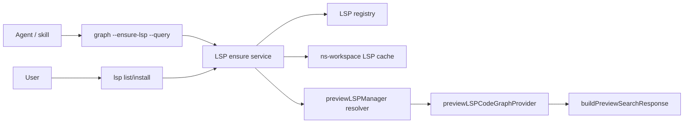

# Tự Động Cài LSP Cho Graph Query

## Meta

- **Status**: implemented
- **Description**: Kế hoạch thêm flow phát hiện và cài language server cho LSP Code Graph, để lệnh `graph` có thể tự chuẩn bị môi trường thay vì chỉ trả warning thiếu LSP.
- **Compliance**: current-state
- **Links**: [LSP Code Graph Search](./lsp-code-graph-search.md), [LSP Search Graph Command Và Skill](./package-lsp-search-graph-command-skill.md), [Module preview](../../modules/preview.md), [Preview web](../../features/preview-web.md), [Knowns LSP CLI](https://github.com/knowns-dev/knowns/blob/main/internal/cli/lsp.go), [Knowns LSP installer](https://github.com/knowns-dev/knowns/blob/main/internal/lsp/installer.go)

## Bối Cảnh

`graph` hiện là command query-only cho Search/LSP Code Graph. Backend `internal/preview` có `previewLSPManager`, `lspLanguageForPath()`, resolver binary, provider `previewLSPCodeGraphProvider` và registry cài đặt LSP cho HTML, CSS/SCSS/Sass, JavaScript/TypeScript, Go/Golang và Kotlin. Khi thiếu binary như `gopls`, `typescript-language-server`, `vscode-html-language-server`, `vscode-css-language-server` hoặc `kotlin-lsp`, preview/search vẫn fail-open: Code Semantic có kết quả, Code Graph rỗng và response có warning kèm command sửa lỗi.

Flow chuẩn hiện tại là explicit: user hoặc agent có thể chạy `lsp list/install` để chuẩn bị môi trường, hoặc dùng `graph --ensure-lsp` như one-shot trước khi query. Install không chạm target project; binary được cài vào cache user của `ns-workspace`, rồi resolver tìm được cache đó sau các vị trí local quen thuộc.

Tham khảo `knowns-dev/knowns`: Knowns tách code intelligence khỏi semantic search, có nhóm lệnh `knowns lsp list`, `knowns lsp install <language>` và `knowns lsp cleanup`; docs của họ mô tả Code Intelligence dựa trên LSP với thao tác list/install rõ ràng. Implementation cũng có adapter theo ngôn ngữ, prerequisite check, install guide, trạng thái install và installer có cache/cleanup/concurrent-install guard.

## Nguyên Nhân Và Lý Do Thiết Kế

Triệu chứng trực tiếp:

- `graph --query` chạy được nhưng `panels.codeGraph` có thể rỗng nếu binary LSP thiếu.
- Warning hiện chỉ nói binary không tìm thấy, chưa đưa flow cài đặt thống nhất.
- Nếu agent chạy từ môi trường GUI hoặc checkout khác, `PATH` và `node_modules/.bin` dễ lệch.

Nguyên nhân gốc rễ:

- LSP runtime hiện chỉ là resolver/executor, chưa có registry cài đặt. `lspLanguageForPath()` biết command cần chạy, nhưng không biết prerequisite, install command, install target, version hay trạng thái.
- Cài LSP là side effect có network và có thể thay đổi hệ thống, nên không nên nằm ngầm trong `/api/search` hoặc preview web request.
- `graph` là entrypoint agent-friendly hơn preview/search UI, nên nó là nơi hợp lý để có flow `ensure` rõ ràng, có opt-in và có output machine-readable.

Lý do chọn hướng đi:

- Tách `lsp` management thành lớp riêng giống Knowns để giữ trách nhiệm sạch: list/install/status thuộc CLI setup; query thuộc `graph`; web preview chỉ đọc trạng thái và fail-open.
- Cài vào tool cache của `ns-workspace` thay vì sửa project hoặc bắt user cài global. Resolver hiện đã có khái niệm "known local tool locations"; thêm cache riêng sẽ giảm phụ thuộc `PATH`, không chạm `package.json`, không làm bẩn repo được inspect.
- `graph` nên có flag explicit như `--ensure-lsp` để agent có one-shot workflow, nhưng mặc định vẫn không tự cài để tránh side effect bất ngờ trong command query.

## Góc Nhìn Tổng Quan Và Phạm Vi Tập Trung

Phạm vi tập trung là Go CLI và backend LSP resolver trong repo này:

- CLI `main.go`: thêm nhóm command `lsp`.
- Package mới hoặc file mới trong `internal/preview`: registry LSP install/status, cache path, installer wrappers.
- `internal/preview/preview_lsp.go`: resolver biết thêm cache path đã cài.
- `graph`: thêm opt-in `--ensure-lsp` để tự cài các LSP thiếu cho project trước khi query.
- Docs và `lsp-code-graph` skill: cập nhật workflow command-first.

Không cần thay frontend preview trong vòng này. Search UI chỉ cần nhận warning tốt hơn từ backend hiện tại.

## Mục Tiêu

- Có lệnh quản lý LSP rõ ràng:
  - `go run . lsp list --project /path/to/project`
  - `go run . lsp install typescript`
  - `go run . lsp install go`
  - `go run . lsp install auto --project /path/to/project`
- Có workflow one-shot cho agent:
  - `go run . graph --project /path/to/project --ensure-lsp --query "Symbol" --json`
- Binary được cài vào cache do `ns-workspace` quản lý, ví dụ `os.UserCacheDir()/ns-workspace/lsp` hoặc `NS_WORKSPACE_LSP_CACHE`, và resolver tìm được cache đó.
- Cài đặt có prerequisite check rõ: Go cho `gopls`, Node/npm cho TypeScript.
- Missing LSP vẫn fail-open khi không bật ensure/install, nhưng warning kèm command cụ thể để sửa.
- Output `lsp list` và `graph --ensure-lsp --json` đủ ổn định cho skill dùng.

## Ngoài Phạm Vi

- Không auto-install ngầm trong HTTP `/api/search`, `preview` hoặc `search` UI.
- Không cài mọi language server Knowns đang hỗ trợ; registry hiện chỉ cover HTML, CSS/SCSS/Sass, JavaScript/TypeScript, Go/Golang và Kotlin theo nhu cầu hiện tại của `ns-workspace`.
- Không thêm MCP code editing tool, rename, diagnostics hoặc safe edits như Knowns.
- Không mutate target project bằng cách thêm devDependency vào `package.json` nếu chưa có yêu cầu riêng.
- Không tải binary archive chưa có checksum. Nếu dùng npm/go toolchain thì toolchain tự quản lý artifact; nếu sau này tải archive trực tiếp, phải có checksum/pin rõ.

## Logic Nghiệp Vụ

### Registry ngôn ngữ

Tạo model nhỏ dùng chung cho resolver, status và installer:

```go
type lspInstallSpec struct {
  ID           string
  Name         string
  ServerID     string
  Extensions   []string
  Command      string
  Args         []string
  CheckArgs    []string
  Prerequisites []lspPrerequisite
  Install      lspInstallStrategy
}
```

Mapping vòng đầu:

- `go`: `.go`, binary `gopls`, args `serve`, check `gopls version`, install qua `go install golang.org/x/tools/gopls@latest`.
- `typescript`: `.ts`, `.tsx`, `.js`, `.jsx`, binary `typescript-language-server`, args `--stdio`, check `--version`, install qua `npm install --prefix <cache> typescript-language-server typescript` hoặc package manager được chọn rõ.

Các `lspLanguage` hiện tại nên được sinh từ registry để tránh lệch giữa runtime và installer.

### Cache cài đặt

Cache theo user:

```text
~/.cache/ns-workspace/lsp/
├── go/
│   └── bin/gopls
└── typescript/
    └── node_modules/.bin/typescript-language-server
```

Trên macOS/Linux, dùng `$XDG_CACHE_HOME/ns-workspace/lsp` nếu có, fallback `~/.cache/ns-workspace/lsp`. Trên Windows dùng local app data tương ứng nếu cần; vòng đầu có thể đi qua helper dựa trên `os.UserCacheDir()`.

Resolver cần tìm theo thứ tự:

1. Binary override nếu sau này có config hoặc env.
2. `PATH`.
3. Project-local tools hiện có: project `node_modules/.bin`, checkout `node_modules/.bin`, Go bin dirs.
4. `ns-workspace` LSP cache.

Thứ tự này giữ ưu tiên cho user/project trước cache do tool cài.

### Cài đặt explicit

`lsp install <language>`:

- Validate language ID.
- Check binary đã có bằng resolver; nếu đã có thì báo installed và không làm gì, trừ `--force`.
- Check prerequisite:
  - Go: `go version`.
  - TypeScript: `node --version`, `npm --version`.
- Cài vào cache:
  - Go: chạy `go install` với env `GOBIN=<cache>/go/bin`.
  - TypeScript: chạy `npm install --prefix <cache>/typescript typescript-language-server typescript`.
- Verify binary bằng `CheckArgs`.
- In path đã cài và source cache.

`lsp install auto --project PATH`:

- Dùng cùng source scan với `lspSourceFiles()` hoặc detector nhẹ từ registry.
- Chỉ xét file tracked bởi Git khi project là Git checkout, để nhất quán với Code Graph.
- Dedupe language theo `ServerID`.
- Cài những language thiếu và auto-installable.
- Với language không auto-installable hoặc thiếu prerequisite, in hướng dẫn thay vì fail cả batch; exit non-zero chỉ khi user chỉ định language cụ thể và install thất bại.

### Graph ensure flow

`graph --ensure-lsp --project PATH --query TEXT --json`:

1. Normalize project.
2. Detect languages từ project.
3. Ensure missing language servers cho detected languages trước khi tạo provider.
4. Chạy query như hiện tại.
5. Nếu ensure fail một phần, response vẫn fail-open nhưng warnings thêm chi tiết install failure.

Mặc định `graph --query` không cài gì. Điều này giữ contract hiện tại và tránh network side effect không mong muốn.

### Warning và skill

Warning hiện tại:

```text
typescript-language-server not found in PATH or known local tool locations
```

Nên đổi thành warning có action:

```text
TypeScript LSP is unavailable: typescript-language-server not found.
Run: go run . lsp install typescript
Or one-shot: go run . graph --ensure-lsp --project <path> --query "<term>" --json
```

Skill `lsp-code-graph` nên dùng:

```sh
cd /Users/ngosangns/Github/ns-workspace
go run . graph --project /path/to/project --ensure-lsp --query "<symbol-or-concept>" --json
```

Nếu install fail do prerequisite thiếu, skill đọc warning rồi fallback sang `rg`/code inspection, không fallback qua UI/API.

## Cấu Trúc Giải Pháp



## Hướng Đã Áp Dụng

### 1. Thêm registry LSP nội bộ

Tạo file nhỏ trong `internal/preview`, ví dụ `preview_lsp_registry.go`, để chứa:

- danh sách language specs;
- helper lookup theo ID, extension, server ID;
- helper install command/guide;
- prerequisite check;
- cache path.

Không kéo abstraction quá rộng. Registry hiện phục vụ nhóm language đã yêu cầu và vẫn đủ rõ để thêm language khác sau.

### 2. Thêm service cài đặt và status

Tạo `preview_lsp_install.go` với các hàm:

- `lspListStatus(ctx, projectRoot string) []lspStatusRow`
- `installLSP(ctx, spec, opts) (installedPath string, err error)`
- `ensureProjectLSP(ctx, projectRoot string, opts) []warning/error`

Status row nên có:

```json
{
  "id": "typescript",
  "name": "TypeScript",
  "detected": true,
  "status": "missing|installed|disabled|installable|unsupported",
  "binary": "typescript-language-server",
  "source": "path|project|cache|missing",
  "path": "...",
  "installCommand": "go run . lsp install typescript"
}
```

### 3. Thêm CLI `lsp`

Vì CLI hiện dùng `flag` package thủ công, tránh thêm dependency command framework. Dispatch trong `run()`:

```text
lsp list [--project PATH] [--json]
lsp install <language|auto> [--project PATH] [--force] [--dry-run] [--json]
lsp cleanup [--json]
```

`cleanup` có thể chỉ xóa cache cũ nếu cache versioned; nếu vòng đầu chưa versioned thì có thể để ngoài phạm vi hoặc chỉ xóa temp/empty dirs. Nếu thêm `cleanup`, giữ behavior đơn giản và test được.

### 4. Gắn `graph --ensure-lsp`

Thêm flag `ensureLSP bool` vào `graphOptions`.

Trước `runGraphQuery()`, gọi `ensureProjectLSP()` khi flag bật. Vì `runGraphQuery()` tạo provider mới, resolver sẽ thấy binary cache sau khi cài.

Nếu `--json`, warnings install nên đi vào JSON response thay vì stdout xen vào. Cách sạch nhất:

- `ensureProjectLSP()` trả `[]string` warnings/status messages.
- `runGraphQueryWithProvider()` hoặc `buildGraphQueryResponse()` nhận `preWarnings []string`.
- Text output in warnings như hiện tại; JSON output giữ trong `warnings`.

Tránh in progress log lên stdout khi `--json`. Nếu cần progress, dùng stderr.

### 5. Cập nhật resolver

`previewLSPManager.commandCandidates()` cần thêm cache paths:

- TypeScript: `<cache>/typescript/node_modules/.bin/typescript-language-server`.
- Go: `<cache>/go/bin/gopls`.

Có thể thêm qua registry thay vì hardcode theo command, nhưng giữ helper nhỏ để tránh refactor lớn:

```go
for _, candidate := range lspCachedCommandCandidates(command) {
  ...
}
```

### 6. Cập nhật docs và skill

- README: thêm `lsp list/install`, `graph --ensure-lsp`.
- `docs/modules/preview.md`: mô tả LSP cache và ensure flow.
- `docs/features/preview-web.md`: giữ preview fail-open, không auto-install trong UI.
- `docs/specs/planning/lsp-code-graph-search.md`: cập nhật phần "Không auto-install" thành trạng thái mới nếu triển khai.
- `presets/skills/lsp-code-graph/SKILL.md`: dùng `--ensure-lsp` làm command mặc định.

## Chi Tiết Triển Khai

### Lệnh `lsp list`

Text output nên đơn giản:

```text
Language      Detected  Status     Binary                      Install
go            yes       installed  /Users/me/go/bin/gopls      -
typescript    yes       missing    -                           go run . lsp install typescript
```

JSON output nên dùng array status rows. Không cần thêm spinner/progress.

### Lệnh `lsp install`

Các tình huống cần xử lý:

- Language không hỗ trợ: error rõ và list supported IDs.
- Binary đã có: báo source và exit 0.
- Prerequisite thiếu: exit non-zero với install hint.
- Install command thất bại: exit non-zero, stderr chứa command/package manager và output rút gọn.
- Install thành công nhưng resolver không thấy: error, vì đây là bug cache path/resolver.

### `graph --ensure-lsp`

Behavior:

- Nếu project không có file LSP-supported: bỏ qua ensure và query bình thường.
- Nếu missing và cài thành công: query Code Graph có cơ hội trả result ngay.
- Nếu cài thất bại: query vẫn chạy, `warnings` có install failure và fallback LSP missing.

Không nên hỏi xác nhận interactive trong `graph`; agent workflow cần deterministic. Side effect đã được opt-in bằng flag.

### Version và package manager

Installer hiện tại:

- Go dùng `golang.org/x/tools/gopls@latest` để đơn giản, nhưng plan nên để constants dễ pin sau.
- TypeScript dùng `typescript-language-server@latest` và `typescript@latest` trong cache prefix.
- HTML và CSS/SCSS/Sass dùng `vscode-langservers-extracted` trong cache prefix riêng.
- Kotlin dùng resolver/manual install guide cho `kotlin-lsp`, chưa tự tải archive.
- Chọn `npm` mặc định để giảm biến số. Có thể detect `npm` trước, sau đó mới cân nhắc `pnpm`/`bun` nếu muốn. KnownS dùng preferred package manager, nhưng với repo này `npm` đã là dependency chuẩn qua `package-lock.json`.

### Concurrency và cache lock

Vì `graph --ensure-lsp` có thể chạy song song trong cùng process, installer dùng process-local mutex theo language ID và kiểm tra lại resolver sau khi lấy lock. Guard này tránh hai goroutine trong cùng CLI/server process cùng cài một cache entry. Nó không phải cross-process file lock; nếu nhiều process độc lập cài cùng lúc thì npm/go toolchain vẫn là lớp chịu trách nhiệm xử lý cache/package install của chúng.

## Phạm Vi Đã Áp Dụng

1. Registry LSP nội bộ hỗ trợ HTML, CSS/SCSS/Sass, JavaScript/TypeScript, Go/Golang và Kotlin.
2. Cache path dựa trên `os.UserCacheDir()` với override `NS_WORKSPACE_LSP_CACHE`.
3. Status/list detector dùng source scan hiện có để biết project cần language nào.
4. Installer hiện có:
   - `gopls` qua `GOBIN=<cache>/go/bin go install golang.org/x/tools/gopls@latest`.
   - `typescript-language-server` qua `npm install --prefix <cache>/typescript typescript-language-server typescript`.
   - `vscode-html-language-server` và `vscode-css-language-server` qua `npm install --prefix <cache>/<id> vscode-langservers-extracted`.
   - `kotlin-lsp` qua resolver/manual install guide; `lsp install kotlin` trả status `manual` nếu thiếu binary.
5. Resolver tìm binary trong cache sau `PATH`, Go bin dirs và `node_modules/.bin` local.
6. CLI có `lsp list/install` trong `main.go` và usage.
7. `graph --ensure-lsp` chạy ensure trước query và đưa install warnings vào response.
8. Warning thiếu LSP có command sửa lỗi.
9. `lsp-code-graph` skill dùng `--ensure-lsp` mặc định và không fallback qua UI/API.
10. README và docs shipped mô tả behavior mới.
11. Unit tests hiện phủ cache resolver, `lsp install auto --dry-run`, explicit JSON failure và path Code Graph missing-LSP fail-open.

## Rủi Ro Và Ràng Buộc

- Cài package có network và có thể chậm; không được chạy ngầm trong HTTP request.
- `go install @latest` và npm `@latest` không pin chặt version. Nếu muốn reproducible hơn, cần version constants hoặc lock manifest.
- TypeScript, HTML và CSS language servers cần Node/npm; Go language server cần Go toolchain. Missing prerequisite phải rõ, không che bằng warning generic. Kotlin hiện cần user cài `kotlin-lsp` thủ công.
- Cài vào cache không sửa project, nhưng language server vẫn có thể cần dependency project để hiểu code sâu. Ví dụ TypeScript server hoạt động tốt hơn khi project có `typescript` hoặc tsconfig phù hợp; cache có `typescript` fallback nhưng không thay thế project config.
- Resolver order phải tôn trọng project/PATH trước cache để không override môi trường user đã chuẩn bị.
- Nếu `graph --ensure-lsp --json` in progress vào stdout, JSON sẽ hỏng. Mọi progress phải đi stderr hoặc warnings JSON.
- File lock cross-platform có thể làm scope lớn. Nếu chưa làm lock file ngay, cần document process-local guard và test idempotency.

## Kiểm Chứng

Validation tối thiểu sau implementation:

```sh
go test ./...
npm run format:docs:check
go run . lsp list --project . --json
go run . lsp install auto --project . --dry-run
go run . graph --project . --ensure-lsp --query buildPreviewSearchResponse --json
```

Coverage hiện có:

- Resolver tìm cache TypeScript binary ngoài `PATH`.
- `lsp install auto --dry-run` phát hiện TypeScript từ project và trả command cache đúng.
- `lsp install <language> --json` vẫn trả non-zero khi explicit install fail.
- Missing prerequisite không panic và được serialize thành install result `failed`.
- `graph --ensure-lsp` đã được kiểm thử thủ công để gọi query và trả Code Graph khi LSP sẵn sàng.

Gaps còn lại:

- Chưa có fake executor riêng để assert command `go install`/`npm install` mà không phụ thuộc toolchain thật.
- Chưa có unit test riêng cho cache `gopls`, dù resolver dùng cùng helper cache theo command.
- Chưa có test riêng chứng minh `graph --query` không gọi ensure khi thiếu `--ensure-lsp`; behavior hiện được giữ bằng flag branch trong `RunGraph`.

## Tiêu Chí Chấp Nhận

- Agent có thể chạy một command duy nhất `graph --ensure-lsp --query` để chuẩn bị LSP thiếu và query Code Graph.
- User có thể xem trạng thái và cài thủ công bằng `lsp list/install`.
- Preview/Search UI vẫn fail-open, không tự cài LSP trong request web.
- Warning thiếu LSP luôn có command sửa lỗi rõ ràng.
- Cài đặt không làm bẩn target project và không yêu cầu chỉnh `PATH` thủ công.
- Skill `lsp-code-graph` không còn cần fallback qua UI/API để xử lý thiếu LSP.
