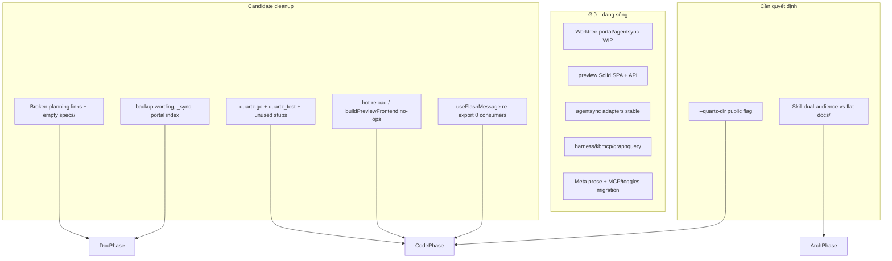

# Cleanup Toàn Bộ Repo

## Meta

- **Status**: implemented
- **Description**: Plan dọn dead docs, dead code legacy (Quartz/preview stubs), docs drift, và artifacts sau audit full-repo.
- **Compliance**: current-state
- **Links**: [Chỉ mục](../../_index.md), [Tài liệu dự án](../../README.md), [Module preview](../../modules/preview.md), [Module agentsync](../../modules/agentsync.md), [Portal](../../features/portal.md)

## Bối Cảnh

Audit toàn bộ repo `ns-workspace` (worktree hiện tại + HEAD) để tìm dead code, dead flows, dead docs và legacy artifacts. Worktree đang có thay đổi lớn chưa commit (portal skills catalog / MCP UI, agentsync MCP overlay). Phần work-in-progress đó **không** phải candidate cleanup.

Nguồn bằng chứng: `git status` / `git diff --stat`, `docs/_index.md` vs filesystem, grep reachability cho Quartz/stubs/portal components, lịch sử xóa planning specs (`d17552a`, worktree hiện tại).

## Nguyên Nhân Và Lý Do Thiết Kế

### Nguyên nhân gốc rễ

1. **Planning docs bị xóa khi implement xong, nhưng graph index không được cập nhật.** Commit `d17552a` đã xóa ~12 file `docs/specs/planning/*` đã shipped; worktree đang xóa nốt 4 file còn lại. `_index.md`, module Meta links và aspect inventory vẫn trỏ path đã mất → dead docs + graph gãy.
2. **Preview đã migrate Solid SPA nhưng lớp Quartz/hot-reload chưa được gỡ.** `preview` không còn gọi Quartz; `quartz.go` chỉ còn test vòng quanh chính nó và var stub không được gọi từ production path.
3. **Docs mô tả behavior cũ.** Architecture/module agentsync vẫn nói `update` backup trước khi ghi; code đã chuyển replace-in-place (commit `450e3ee` và test comments “no backups are left behind”).
4. **Skill templates mô tả dual-audience `docs/business` + `docs/developer` trong khi knowledge base vẫn flat `docs/`.** Mọi skill `plan` / `read-search-docs` / `cleanup` kỳ vọng path không tồn tại → friction và plan path lệch.
5. **`_sync.md` và portal index lệch current-state.** Last synced commit cũ; feature portal shipped nhưng không có hàng trong bảng Modules của `_index.md`.

### Vì sao cleanup theo phase

- Phase docs-only an toàn, không đụng runtime.
- Phase gỡ Quartz/stubs đụng test surface và public flag `--quartz-dir` → cần validation Go tests.
- Phase dual-audience docs là quyết định kiến trúc riêng (migrate thật hoặc thu hẹp skill templates) — không gộp với xóa dead code.

## Góc Nhìn Tổng Quan Và Phạm Vi Tập Trung



## Mục Tiêu

1. Knowledge base graph không còn link gãy tới `docs/specs/planning/*` đã xóa.
2. Module/feature docs phản ánh behavior shipped (không backup-before-overwrite; portal có trong index).
3. Gỡ production-dead Quartz stack và no-op preview stubs (kèm test/flag contract rõ ràng).
4. Gỡ re-export portal đã migrate hết sang `usePageFeedback`.
5. Làm rõ (không tự chọn) chiến lược dual-audience docs vs skill templates.
6. Không phá work-in-progress portal/agentsync trong worktree.

## Ngoài Phạm Vi

- Hoàn thiện hoặc commit worktree portal skills catalog / MCP UI (trừ khi user yêu cầu riêng sau duyệt).
- Refactor lớn agentsync, harness, graphquery không liên quan dead surface.
- Xóa legacy `## Meta` prose parser (vẫn được dùng, fillEmptyMeta).
- Xóa migration `toggles.jsonc` / MCP JSONC comment disable (còn path đọc tương thích user overlay).
- Dọn `node_modules`, generated hashed assets đang được `index.html` trỏ tới.
- Gộp/biến mất dual lint Biome+ESLint (ESLint chỉ cover `scripts/**` và config JS — có lý do, không dead).
- Migrate toàn bộ docs sang `docs/business` + `docs/developer` trong cleanup này (chỉ lập quyết định / plan follow-up).

## Inventory Candidate (có bằng chứng)

### A. Dead docs — **đủ bằng chứng để sửa**

| # | Candidate | Bằng chứng | Hành động đề xuất |
| - | --------- | ---------- | ----------------- |
| A1 | `_index.md` Links + bảng Modules + section Specs trỏ ~13 planning path không tồn tại | `rg specs/planning docs/` vs `find docs`; commit `d17552a` xóa bulk; worktree xóa 4 file còn lại; `docs/specs/` rỗng | Viết lại index: bỏ hàng planning đã implement/archived; chỉ giữ plan còn active (plan cleanup này) |
| A2 | Module Meta links gãy: `agentsync.md`, `graphquery.md`, `harness.md`, `agentic-loop.md`, `aspect-inventory.md` | Links tới `../specs/planning/...` file missing | Xóa link hoặc thay bằng current-state module/feature doc |
| A3 | `adopt-ai-devkit-concepts.md` trong index | Không có file; `git log -- '**/adopt-ai-devkit*'` rỗng | Xóa entry (chưa từng materialize) |
| A4 | Architecture/module agentsync: “backup trước khi ghi” | `docs/architecture/overview.md`, `docs/modules/agentsync.md` vs không còn helper backup trong `internal/agentsync/*.go` (chỉ comment test “no backups”) | Sửa prose: replace-in-place, không backup |
| A5 | `_sync.md` stale | Last synced `a6beaf5…` vs HEAD `068f620…`; Known Unsynced mô tả cleanup skill cũ | Refresh sau khi cleanup docs xong |
| A6 | Feature portal thiếu trong `_index` Modules | File `docs/features/portal.md` tồn tại; `_index` không list; README Links cũng không | Thêm portal vào index + graph edges |
| A7 | Working document Kiro | `docs/working-documents/kiro-agent-loads-synced-resources.md` — có thể đã ship qua commits settings kiro | Đọc diff hiện tại; archive hoặc fold vào module agentsync nếu behavior đã current-state |

### B. Dead code — **đủ bằng chứng để xóa (sau phase docs hoặc song song có test)**

| # | Candidate | Bằng chứng | Hành động đề xuất |
| - | --------- | ---------- | ----------------- |
| B1 | `internal/preview/quartz.go` (~268 LOC) | Không caller production; `Run` chỉ warn nếu `--quartz-dir` set; `prepareQuartzWorkspaceForTest` / `runQuartzServeForTest` declare nhưng **không được đọc** ngoài assignment | Xóa file + `quartz_test.go` + var stubs ở cuối `preview.go` |
| B2 | No-op `runHotReloadSupervisor`, `buildPreviewFrontend`, `buildPreviewFrontendForTest` | Comment “no-op stub”; production `Run` không gọi | Xóa stubs + test chỉ exercise no-op nếu không còn value |
| B3 | `useFlashMessage.ts` | Chỉ re-export `usePageFeedback`; 0 import từ views (Skills/MCPs/Registry/Adapters đều import `lib/usePageFeedback`) | Xóa file deprecated |
| B4 | Flag `--quartz-dir` | Public CLI compatibility | **Phase 1:** giữ warn deprecated; **Phase 2 (optional):** remove flag + usage text + test `Run with deprecated --quartz-dir` sau một chu kỳ |

### C. Legacy — **giữ** (không đủ bằng chứng / vẫn cần)

| Candidate | Lý do giữ |
| --------- | --------- |
| `## Meta` prose parser trong `spec_project.go` | Vẫn fill metadata khi frontmatter thiếu; docs shipped còn dùng |
| `PortalTogglesPath` / `ParseMCPServersJSONC` migration | User overlay cũ có thể còn toggles.jsonc / JSONC comments |
| Codex “legacy MCP TOML managed block” | Behavior adapter hiện tại |
| Dual lint Biome (TS/TSX) + ESLint (scripts JS) | Tách scope có chủ đích trong `eslint.config.mjs` |
| `previewModuleRoot` | Vẫn dùng trong `preview_lsp.go` và tests |
| `coverage_test.go` lớn | Không dead; là test surface coverage — không xóa hàng loạt trong cleanup này |

### D. Cần xác minh thêm / quyết định user

| # | Candidate | Câu hỏi |
| - | --------- | ------- |
| D1 | Dual-audience docs | **Option 1:** migrate knowledge base sang `docs/business` + `docs/developer`. **Option 2 (khuyến nghị cho cleanup này):** giữ flat `docs/`, chỉnh skill templates + CONVENTIONS trỏ path thật (`docs/specs/planning/`, `docs/modules/`, …). |
| D2 | Worktree đang xóa 4 planning files | Xác nhận intentional (đã implement) — plan này coi là intentional và fold vào A1. |
| D3 | `skills-lock.json` untracked | Có phải artifact registry local cần commit, ignore, hay chỉ máy dev? |
| D4 | `previewPort` | Chỉ thấy test + helper; xác nhận không còn path serve nào cần trước khi đụng (ưu tiên thấp, không block). |

### E. Không đụng (WIP)

- Toàn bộ diff portal UI kit, skills catalog API, agentsync MCP overlay, generated `portal_ui/assets/*` mới.
- Các component portal mới (`EmptyState`, `EnableSwitch`, …) đều có reference ngoài file — không dead.

## Hướng Tiếp Cận Đề Xuất

**Phase 0 — Ranh giới worktree**  
Không `git restore` / discard WIP portal. Cleanup docs/code chỉ trên file candidate.

**Phase 1 — Dead docs (ưu tiên, rủi ro thấp)**  
1. Viết lại `docs/_index.md`: Modules chỉ file tồn tại + portal; Specs chỉ plan còn active (`cleanup-repo.md` và plan future nếu có).  
2. Sửa Meta links gãy trong modules/features/research.  
3. Sửa architecture + agentsync: bỏ claim backup.  
4. Đánh giá working-document Kiro → archive note hoặc gộp.  
5. Refresh `_sync.md` sau phase 1.  
6. Chạy `npm run lint:doc` (hoặc markdownlint scoped) nếu có trong workflow.

**Phase 2 — Dead code Quartz + portal flash re-export**  
1. Xóa `quartz.go`, `quartz_test.go`, unused `prepareQuartzWorkspaceForTest` / `runQuartzServeForTest`.  
2. Cập nhật `docs/modules/preview.md` (bỏ hàng quartz legacy).  
3. Gỡ no-op hot-reload/build frontend stubs **chỉ khi** test không còn phụ thuộc meaningful; nếu test chỉ assert no-op, xóa test theo.  
4. Xóa `useFlashMessage.ts`.  
5. `go test ./internal/preview/...` và `./...` scoped.  
6. **Giữ** `--quartz-dir` deprecated warn trừ khi user chọn remove ngay.

**Phase 3 — Skill / docs layout alignment (quyết định D1)**  
- Nếu Option 2: patch `presets/skills/{plan,cleanup,read-search-docs,update-docs,init}/` + `_shared/CONVENTIONS.md` + templates để path = flat `docs/`.  
- Nếu Option 1: plan migrate riêng (không gộp execution cleanup).

**Phase 4 (optional) — Public contract**  
Remove `--quartz-dir` khỏi CLI/usage/tests sau khi không còn consumer script ngoài repo.

## Chi Tiết Triển Khai (Phase 1–2)

### Docs index shape mong muốn

- **Modules table:** README, `_sync`, architecture, aspect-inventory, agentsync, harness, preview, kbmcp, graphquery, portal (feature), preview-web, agentic-loop, glossary, frontend conventions, cleanup-repo (planning).
- **Mermaid:** bỏ edges tới planning đã xóa; thêm `features/portal.md` từ architecture hoặc agentsync.
- **Không** giữ hàng “implemented planning” trỏ file đã xóa; current-state nằm ở module/feature docs.

### Quartz removal checklist

- [ ] Xóa `internal/preview/quartz.go`
- [ ] Xóa `internal/preview/quartz_test.go`
- [ ] Xóa var stubs cuối `preview.go` (lines ~553–557)
- [ ] Rà `preview_run_test.go` test `--quartz-dir` — giữ nếu flag còn
- [ ] Cập nhật module preview + DEVELOPER.md nếu còn mô tả quartz helpers như code path

## Công Việc Cần Làm

1. **Duyệt plan** (user).
2. Phase 1 docs graph + prose drift.
3. Phase 2 dead code Quartz/stubs/flash.
4. Phase 3 skill path alignment (theo lựa chọn D1).
5. Optional Phase 4 remove `--quartz-dir`.
6. Validation + cập nhật `_sync.md`.

## Rủi Ro Và Ràng Buộc

| Rủi ro | Mức | Mitigation |
| ------ | --- | ---------- |
| Xóa nhầm WIP portal | Cao | Không touch paths portal WIP; review `git status` trước commit cleanup |
| User script ngoài repo dùng `--quartz-dir` | Trung bình | Giữ flag deprecated ở Phase 2 |
| User còn `toggles.jsonc` / Meta-only docs | Trung bình | Không đụng migration parsers |
| Skill dual-audience break agent workflows | Trung bình | Phase 3 cần chọn Option 1 vs 2 rõ |
| Test coverage sụt sau xóa quartz_test | Thấp | Acceptable — test chỉ cover dead path |
| Plan path skill vs repo | Thấp | Plan này đặt tại `docs/specs/planning/` theo README hiện hành |

## Kiểm Chứng

Sau từng phase:

```bash
# Docs links (manual + tooling)
rg -n 'specs/planning/' docs/
test ! -e docs/specs/planning/refactor-agentsync-preset-architecture.md   # example broken target should stay gone
# hoặc script: mọi link relative trong docs/_index.md resolve được

# Code
go test ./internal/preview/...
go test ./internal/portal/...   # nếu chạm flash re-export
go test ./internal/agentsync/...  # nếu chỉ sửa docs agentsync thì optional

# Frontend typecheck nếu xóa useFlashMessage
npm run check:portal
```

Acceptance:

- [ ] Không còn link trong `docs/**` trỏ file planning không tồn tại (trừ chính plan active).
- [ ] `_index.md` Modules khớp filesystem + có portal.
- [ ] Không còn `quartz.go` / production Quartz helpers.
- [ ] `useFlashMessage` không còn trong source.
- [ ] Docs agentsync/architecture không còn claim backup-before-write.
- [ ] WIP portal vẫn intact trong worktree.
- [ ] `go test` packages chạm pass.

## Câu Hỏi Chờ Duyệt

1. **D1 dual-audience:** giữ flat docs + sửa skills (khuyến nghị), hay migrate `docs/business`+`docs/developer`?
2. **B4 `--quartz-dir`:** giữ deprecated, hay gỡ luôn trong Phase 2?
3. **Scope execution:** chỉ Phase 1 docs, hay Phase 1+2 ngay sau duyệt?
4. **`skills-lock.json`:** commit / gitignore / bỏ qua?

---

**Trạng thái:** đã triển khai theo duyệt full (flat docs, giữ `--quartz-dir` deprecated, không đụng portal WIP).
