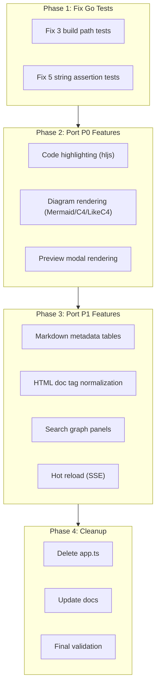

# Hoàn Thiện Preview Web Vue 3 Migration

## Meta

- **Status**: draft
- **Description**: Kế hoạch hoàn thiện preview web sau migration Vue 3, bao gồm sửa Go tests, port missing features từ app.ts sang Vue components, và xóa app.ts legacy.
- **Compliance**: planned
- **Links**: [Preview web](../../features/preview-web.md), [Module preview](../../modules/preview.md), [Quy ước frontend preview](../../development/conventions/preview-frontend.md), [Chỉ mục](../../_index.md)

## Bối Cảnh

Preview web đã migration từ vanilla TypeScript (`app.ts` monolith ~3487 dòng) sang Vue 3 + TypeScript với component architecture. Tuy nhiên migration chỉ hoàn thành một phần:

- **Vue components** đã implement: routing cơ bản, sidebar, doc viewer (Markdown/HTML/code cơ bản), graph viewer (Sigma.js), search panel (semantic cơ bản), preview modal.
- **Còn thiếu trong Vue**: Mermaid/C4/LikeC4 diagram rendering, svg-pan-zoom, hot reload (SSE), metadata table rendering, HTML doc tag normalization, search graph panels, code syntax highlighting đầy đủ, selection context menu, document title management.
- **`app.ts` vẫn tồn tại** và chứa toàn bộ logic cũ. Go tests đọc `app.ts` cho string assertions.
- **3 Go tests fail** vì đọc `preview_ui/app.js` (không còn tồn tại sau Vite build).

## Nguyên Nhân

Vue 3 migration đã tạo component architecture mới nhưng chỉ port ~40% features. Các feature phức tạp (diagram rendering, HTML doc normalization, metadata parsing, search graph panels) vẫn chỉ có trong `app.ts`. Go tests không được cập nhật để phản ánh kiến trúc mới.

## Mục Tiêu

1. Sửa 3 Go tests fail vì build output path (`app.js` → Vite hashed assets).
2. Sửa 5 Go tests fail vì strings đã bị xóa khỏi `app.ts` (topbar, sidebar, search, dark mode, graph).
3. Port missing P0 features sang Vue: code highlighting, diagram rendering, preview modal rendering.
4. Port missing P1 features: metadata tables, HTML doc tags, search graph panels, hot reload.
5. Xóa `app.ts` sau khi toàn bộ features đã port.
6. Cập nhật docs shipped.

## Ngoài Phạm Vi

- Không thay đổi backend Go (API endpoints, data models).
- Không thay đổi CDN libraries (Mermaid, Sigma, Graphology, TOAST UI, Lucide, DOMPurify).
- Không thêm SSR hoặc hydration.
- Không rewrite search algorithm.

## Cấu Trúc Giải Pháp



## Chi Tiết Triển Khai

### Phase 1: Sửa Go Tests (3 + 5 tests)

#### 1.1. Sửa 3 tests fail vì build output

**`TestPreviewHTTPHandlers`** (line 178-186):

- Test assert `/js/graph.js` được serve. Vite bundles graph.ts vào hashed asset.
- Fix: Thay assertion `/js/graph.js` bằng check `preview_ui/assets/` directory có files.

**`TestPreviewUIHasTypeScriptToolchain`** (line 686-687):

- Test check `preview_ui/app.js` và `preview_ui/js/graph.js` tồn tại.
- Fix: Thay `preview_ui/app.js` → check `preview_ui/assets/` directory. Thay `preview_ui/js/graph.js` → check `preview_ui_src/js/graph.ts`.

**`TestPreviewUIUsesDedicatedFrontendLibraries`** (line 708):

- Test đọc `preview_ui/app.js` cho CDN patterns.
- Fix: Đọc `preview_ui/assets/index-CSOUHp_C.js` (hoặc glob `preview_ui/assets/index-*.js`).

#### 1.2. Sửa 5 tests fail vì strings đã xóa khỏi app.ts

Các tests sau đọc `app.ts` và check strings đã bị xóa trong Vue migration:

**`TestPreviewUIRendersDocsGraphWithSigma`** (line 754):

- Check `type="module" src="/app.js"` trong index.html. Built index.html giờ có `src="/assets/index-CSOUHp_C.js"`.
- Fix: Thay pattern check thành `src="/assets/index-`.

**`TestPreviewTopbarUsesIconOnlyTabs`** (line 790-797):

- Check `aria-label="Preview sections"`, `data-tab="graph"`, `data-lucide="git-fork"`, `data-tab="search"`, `data-lucide="search"`, `project.projectRoot`.
- Fix: Đọc thêm `App.vue` và `Sidebar.vue` vào text concatenation.

**`TestPreviewUIRendersFourPanelSearchPage`** (line 810+):

- Check nhiều search-related strings.
- Fix: Đọc thêm `SearchPanel.vue` vào text concatenation.

**`TestPreviewSidebarIsFixedTreeWithIcons`** (line 1144+):

- Check `lg:fixed`, `buildSpecTree`, `renderFolderNode`, `folder-open`, `data-lucide="file-text"`.
- Fix: Đọc thêm `Sidebar.vue` và `TreeNode.vue` vào text concatenation.

**`TestPreviewUISupportsDarkMode`** (line 1224+):

- Check `id="themeToggle"`, `applyTheme`, `mermaidThemeConfig`.
- Fix: Đọc thêm `App.vue` vào text concatenation.

### Phase 2: Port P0 Features

#### 2.1. Code Syntax Highlighting

Tạo `utils/code-highlight.ts`:

- `languageFromPath(path)` — map extension → hljs language.
- `normalizeHighlightLanguage(lang)` — normalize language name.
- `highlightRenderedCode(container)` — tìm `<pre><code>` blocks, apply hljs.
- `decorateCodePreviewLines(container)` — thêm line numbers với `data-line`.
- `scrollPreviewToLine(container, line)` — scroll to specific line.

Cập nhật `DocViewer.vue` và `PreviewModal.vue` để gọi `highlightRenderedCode` sau khi render.

#### 2.2. Diagram Rendering

Tạo `components/DiagramViewer.vue`:

- `renderMermaidBlocks(container)` — tìm mermaid code fences, render SVG.
- `mermaidSourceForTheme(source, theme)` — theme overrides cho C4 diagrams.
- `mermaidC4ElementStyles(source)` — C4 element styling.
- `mermaidC4RelationStyles(source)` — C4 relation styling.
- `decorateDiagram(diagramEl)` — thêm toolbar (zoom in/out/fit).
- `registerDiagramPanZoom(svg)` — svg-pan-zoom setup.
- `destroyDiagramsIn(container)` — cleanup pan-zoom instances.
- `renderLikeC4Blocks(container)` — LikeC4 model → Mermaid C4 conversion.

Tích hợp vào `DocViewer.vue` và `PreviewModal.vue`.

#### 2.3. Preview Modal Rendering

Cập nhật `PreviewModal.vue`:

- Render Markdown bằng TOAST UI Viewer (giống DocViewer).
- Render HTML bằng sanitizer + custom tag normalizer.
- Render code bằng hljs.
- Render diagrams sau khi content load.
- Cleanup diagrams khi modal close.

### Phase 3: Port P1 Features

#### 3.1. Markdown Metadata Tables

Tạo `utils/metadata.ts`:

- `renderableMarkdownMetadata(raw)` — parse frontmatter và `## Meta` section.
- `markdownMetadataRows(metadata)` — tạo rows từ metadata.
- `renderMetadataTable(rows)` — render HTML table.
- `renderMetadataValue(value, key)` — render value với badges/links.
- `cleanMetadataScalar(value)` — clean string values.

Cập nhật `DocViewer.vue` để hiển thị metadata table trước Markdown body.

#### 3.2. HTML Doc Tag Normalization

Tạo `utils/html-doc-tags.ts`:

- `normalizeHTMLDocTags(container)` — normalize custom tags.
- `replaceDocElement(el, tag)` — replace single element.
- `htmlMetadataRows(docMeta)` — extract metadata từ `doc-meta`.
- `scopeMVPStylesheet()` — scope MVP.css cho `.html-doc`.

Cập nhật `DocViewer.vue` để normalize HTML tags sau sanitize.

#### 3.3. Search Graph Panels

Cập nhật `SearchPanel.vue`:

- Thêm graph rendering cho Docs Graph và Code Graph panels.
- `searchResultsToGraph(results)` — convert results sang graph data.
- `renderSearchGraphPanel(container, graphData)` — render Sigma graph.
- `selectSearchGraphNode(nodeId)` — node selection.
- `renderSearchGraphDetails(nodeId)` — details panel.

#### 3.4. Hot Reload (SSE)

Cập nhật `App.vue`:

- `connectHotReload()` — tạo EventSource tới `/api/events`.
- `parseEventToken(event)` — parse SSE token.
- Gọi `reloadPreviewData()` khi docs thay đổi.

### Phase 4: Cleanup

#### 4.1. Xóa app.ts

Sau khi toàn bộ features đã port:

- Xóa `preview_ui_src/app.ts`.
- Xóa `preview_ui_src/types.d.ts` (types đã port vào Vue components).
- Cập nhật Go tests để không đọc `app.ts` nữa.

#### 4.2. Cập nhật docs

- Cập nhật `docs/features/preview-web.md` nếu behavior thay đổi.
- Cập nhật `docs/modules/preview.md` nếu architecture thay đổi.
- Cập nhật `docs/development/conventions/preview-frontend.md` nếu conventions thay đổi.

#### 4.3. Final validation

```bash
npm run check:preview
npm run lint:preview
npm run build:preview
npm run format:preview:check
go test ./internal/preview/...
```

## Công Việc Cần Làm

### Phase 1: Fix Go Tests (ưu tiên cao nhất)

1. [ ] Sửa `TestPreviewHTTPHandlers` — bỏ assertion `/js/graph.js`
2. [ ] Sửa `TestPreviewUIHasTypeScriptToolchain` — thay `app.js` check bằng `assets/` directory
3. [ ] Sửa `TestPreviewUIUsesDedicatedFrontendLibraries` — đọc Vite output thay vì `app.js`
4. [ ] Sửa `TestPreviewUIRendersDocsGraphWithSigma` — đọc Vue files, sửa `app.js` pattern
5. [ ] Sửa `TestPreviewTopbarUsesIconOnlyTabs` — đọc `App.vue` + `Sidebar.vue`
6. [ ] Sửa `TestPreviewUIRendersFourPanelSearchPage` — đọc `SearchPanel.vue`
7. [ ] Sửa `TestPreviewSidebarIsFixedTreeWithIcons` — đọc `Sidebar.vue` + `TreeNode.vue`
8. [ ] Sửa `TestPreviewUISupportsDarkMode` — đọc `App.vue`

### Phase 2: Port P0 Features

9. [ ] Tạo `utils/code-highlight.ts` — code syntax highlighting
10. [ ] Tích hợp code highlighting vào `DocViewer.vue`
11. [ ] Tích hợp code highlighting vào `PreviewModal.vue`
12. [ ] Tạo `components/DiagramViewer.vue` — Mermaid/C4/LikeC4 rendering
13. [ ] Tích hợp diagram rendering vào `DocViewer.vue`
14. [ ] Tích hợp diagram rendering vào `PreviewModal.vue`
15. [ ] Cập nhật `PreviewModal.vue` — render content đúng cách

### Phase 3: Port P1 Features

16. [ ] Tạo `utils/metadata.ts` — Markdown metadata parsing
17. [ ] Tích hợp metadata tables vào `DocViewer.vue`
18. [ ] Tạo `utils/html-doc-tags.ts` — HTML doc tag normalization
19. [ ] Tích hợp HTML doc tags vào `DocViewer.vue`
20. [ ] Cập nhật `SearchPanel.vue` — search graph panels
21. [ ] Cập nhật `App.vue` — hot reload (SSE)

### Phase 4: Cleanup

22. [ ] Xóa `app.ts` và `types.d.ts`
23. [ ] Cập nhật docs shipped
24. [ ] Chạy full validation

## Rủi Ro Và Ràng Buộc

- **Diagram rendering phức tạp**: Mermaid C4 và LikeC4 có nhiều edge cases. Cần test kỹ với real docs.
- **TOAST UI Viewer lifecycle**: Cleanup đúng khi component unmount để tránh memory leaks.
- **Sigma.js lifecycle**: Search graph panels cần cleanup renderer khi panel đóng.
- **Go tests**: Thay đổi test assertions có thể bỏ lỡ regression thật. Cần giữ intent của tests.
- **CDN globals**: Vue components cần truy cập `window.hljs`, `window.mermaid`, `window.svgPanZoom` đúng cách.

## Kiểm Chứng

```bash
npm run check:preview
npm run lint:preview
npm run build:preview
npm run format:preview:check
go test ./internal/preview/...
```

Manual QA:

- Mở preview, chọn Markdown doc → diagrams render đúng.
- Mở preview modal → content render đúng (không phải raw source).
- Search tab → 4 panels hiển thị kết quả.
- Hot reload → preview cập nhật khi docs thay đổi.
- Dark/light theme → diagrams và graph đổi theme đúng.
