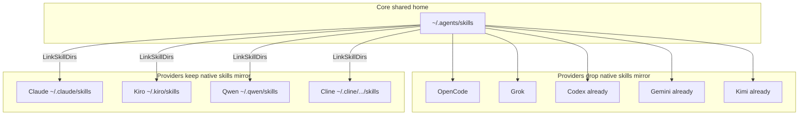

# Bỏ Mirror Skills Provider-Specific Khi Đã Hỗ Trợ `~/.agents`

## Bối Cảnh

`ns-workspace` materialize shared home `~/.agents` (skills, AGENTS.md, agents, MCP preset, …) rồi fan-out sang native path của từng coding agent.

Nhiều provider gần đây đã adopt convention **Agent Skills** dưới:

- user: `~/.agents/skills/<name>/SKILL.md`
- project: `.agents/skills/<name>/SKILL.md` (walk repo)

Với các provider đó, mirror thêm sang `~/.claude/skills`, `~/.config/opencode/skill`, `~/.grok/skills`, … là **dư** (duplicate discovery, symlink churn, backup rác).

Nguyên tắc user đặt ra:

> Nếu provider **đã hỗ trợ** folder `.agents` / `~/.agents` cho artifact đó → **không** còn cần update vào specific folder của provider cho artifact đó.

Phạm vi plan này: chủ yếu **skills** (và ghi chú ngắn subagents/instructions). **Không** gỡ MCP/settings/hooks — các artifact đó gần như luôn vendor-specific (JSON/TOML path riêng), không nằm trong `~/.agents` discovery chuẩn.

## Nguyên Nhân Và Lý Do Thiết Kế

### Nguyên nhân gốc

Khi adapter được viết, nhiều CLI chỉ có native path (`~/.claude/skills`, `~/.qwen/skills`, …). Shared `~/.agents` là convention mới hơn (agentskills.io / multi-tool installers như `npx skills add --agent universal`).

Code hiện tại **chưa đồng nhất**:

| Pattern | Provider |
| --- | --- |
| Đã **không** mirror skills (đúng hướng) | Codex, Gemini, Kimi |
| Vẫn mirror skills dù docs đã đọc `~/.agents/skills` | OpenCode, Grok (và notes ZCode mâu thuẫn) |
| Mirror vì **không** có evidence `.agents` | Claude, Kiro, Qwen (docs), Cline |

### Lý do thiết kế

- **Source of truth duy nhất** cho skill content: `~/.agents/skills` (core phase luôn materialize).
- Adapter chỉ fan-out khi vendor **không** discover shared path.
- Giảm I/O, giảm dual-path / dedupe race, giảm stale symlink sau `update`.

## Góc Nhìn Tổng Quan Và Phạm Vi Tập Trung

```text
Core (giữ):
  presets/skills/*  →  ~/.agents/skills/*

Adapter skills (chỉ khi vendor KHÔNG đọc ~/.agents/skills):
  ~/.agents/skills/*  →  <vendor>/skills/*

Adapter vẫn giữ (ngoài scope gỡ mirror skills):
  instruction, MCP, settings, hooks, custom agent files
```

## Ma Trận Provider (Theo Docs Vendor + Code Hiện Tại)

Chú thích cột:

- **Native skills path**: path vendor document
- **Đọc `~/.agents/skills`?**
- **Code hiện tại**: có set `Targets.Skills` không
- **Đề xuất**: `drop` = xóa `Targets.Skills`; `keep` = giữ mirror; `already` = đã đúng

| Provider | Evidence docs | Đọc `~/.agents/skills`? | Code hiện tại | Đề xuất skills |
| --- | --- | --- | --- | --- |
| **Claude Code** | Personal skills: `~/.claude/skills/`; project: `.claude/skills/`. SDK docs không liệt kê `~/.agents`. | **Không** (theo docs chính thức) | Mirror `~/.claude/skills` + agents + CLAUDE.md | **keep** mirror skills (+ agents) |
| **OpenCode** | [opencode.ai/docs/skills](https://opencode.ai/docs/skills/): global gồm `~/.agents/skills/*/SKILL.md` (và `~/.config/opencode/skills`, `~/.claude/skills`) | **Có** | Mirror `~/.config/opencode/skill` + agent + AGENTS.md | **drop** skills mirror; **keep** AGENTS.md + agent + opencode.json/MCP |
| **Grok Build** | Skills: `~/.grok/skills/` **và** `~/.agents/skills/`; global rules: `~/.grok/` (AGENTS.md family) | **Có** (skills) | Mirror skills + link `~/.grok/AGENTS.md` + MCP TOML | **drop** skills mirror; **keep** AGENTS.md + MCP |
| **Kimi** | Docs: generic group `~/.agents/skills/` (và `~/.config/agents/skills`); brand group `~/.kimi/skills` exclusive với claude/codex | **Có** | Không mirror skills (notes đúng) | **already** |
| **Kiro** | CLI/IDE: `.kiro/skills/` + `~/.kiro/skills/` only | **Không** (docs) | Mirror `~/.kiro/skills` + steering + mcp + ns-full agent | **keep** skills mirror |
| **Qwen Code** | Docs: personal `~/.qwen/skills/`, project `.qwen/skills/`. Có issue community “Support loading skills from .agents” — **chưa** là docs shipped | **Chưa** (docs) | Mirror `~/.qwen/skills` | **keep** (revisit khi docs merge `.agents`) |
| **Gemini CLI** | Docs: user `~/.gemini/skills/` **hoặc** alias `~/.agents/skills/`; workspace `.agents/skills/` | **Có** | Không mirror skills (notes đúng) | **already** |
| **Codex** | [developers.openai.com/codex/skills](https://developers.openai.com/codex/skills): USER `$HOME/.agents/skills`; repo `.agents/skills` walk | **Có** (skills only) | Không mirror skills; link `~/.codex/AGENTS.md` + MCP TOML | **already** (skills); **keep** instruction + MCP |
| **Cline** | Docs: global `~/.cline/skills/`; project `.cline/skills`, `.claude/skills`. **Không** liệt kê `.agents` | **Không** (docs) | Mirror `~/.cline/data/skills` + agents + MCP | **keep** (và **audit path**: docs nói `~/.cline/skills` vs code `~/.cline/data/skills` — verify Cline CLI version trước khi đổi path) |
| **ZCode** | Evidence yếu (notes nội bộ: cả `~/.zcode/skills` và `~/.agents/skills`) | **Có?** (notes; không có first-party public docs trong repo) | Mirror skills + AGENTS.md | **verify** bằng install/docs ZCode; nếu confirm `.agents` → **drop** skills mirror; nếu không → **keep** |

### Artifact không thuộc “gỡ vì `.agents`”

Các target sau **không** được gỡ chỉ vì skills đã shared:

| Artifact | Lý do giữ fan-out |
| --- | --- |
| MCP (settings.json, config.toml, mcp.json, …) | Schema/path vendor-specific |
| Settings / permission / hooks | Vendor-specific |
| Instruction user-level (`CLAUDE.md`, `~/.grok/AGENTS.md`, `GEMINI.md`, …) | Hầu hết **không** load `~/.agents/AGENTS.md` như global instruction |
| Subagents (`~/.claude/agents`, OpenCode `agent/`, Cline agents) | Format/path vendor; `.agents/agents` không phải contract chuẩn multi-tool |
| Kiro `ns-full.json` custom agent | Capability/permissions riêng Kiro |

## Mục Tiêu

1. Cập nhật `AdapterTargets.Skills` (và notes/docs/tests) để **không** `LinkSkillDirs` khi vendor đã discover `~/.agents/skills`.
2. Giữ core materialize `presets/skills` → `~/.agents/skills` không đổi.
3. Giữ MCP/settings/instruction fan-out hiện có (trừ khi artifact đó cũng proven shared — không áp dụng trong PR này).
4. Tài liệu hóa ma trận discovery trong `docs/modules/agentsync.md` + README table.
5. (Optional follow-up) Cleanup symlink cũ trên máy user khi `update` — **ngoài scope mặc định** trừ khi user yêu cầu.

## Ngoài Phạm Vi

- Đổi shared skill layout / registry install (`npx skills add`).
- Gỡ mirror Claude skills “vì Grok/OpenCode cũng đọc `.claude`” — Claude vẫn cần native path.
- Implement Qwen `.agents` support phía vendor.
- Sửa Cline path `data/skills` vs `skills` (chỉ note + verify task).
- Gỡ instruction links (Codex/Grok/OpenCode AGENTS.md) — không equivalent `~/.agents/AGENTS.md` cho mọi tool.
- Auto-delete stale provider skill trees trên disk (có thể PR2).

## Logic Nghiệp Vụ

### Quy tắc quyết định (per adapter)

```text
IF vendor_docs.discover_user_skills includes "$HOME/.agents/skills"
   OR vendor_docs.discover_user_skills includes "~/.agents/skills"
THEN Targets.Skills = ""   // không mirror
ELSE Targets.Skills = <native path>
```

Áp dụng **chỉ** khi evidence là docs chính thức hoặc code path đã ship (không đoán từ issue mở).

### Thay đổi cụ thể đề xuất (PR1)

| Adapter | Diff |
| --- | --- |
| **opencode** | Xóa `Targets.Skills`. Notes: “skills from ~/.agents/skills (+ optional ~/.config/opencode/skills); adapter does not mirror.” Giữ Instruction, Subagents, MCP merge. |
| **grok** | Xóa `Targets.Skills`. Notes: skills native via `~/.agents/skills`; adapter chỉ link `AGENTS.md` + managed MCP. |
| **zcode** | Sau verify: nếu đúng `.agents` → xóa `Targets.Skills`; nếu không → giữ. |
| claude, kiro, qwen, cline | Không đổi skills targets trong PR1. |
| kimi, gemini, codex | Không đổi (đã đúng). |

### Catalog / capabilities

- `artifactsFromSpec`: không còn `ArtifactSkills` cho opencode/grok sau khi drop — **đúng** (skills live ở shared).
- `agents`/`doctor` notes cập nhật để tránh hiểu nhầm “provider không có skills”.

### Tests

- `TestGrokSelectionCreatesNativeSkills`: đổi assert — **không** require `~/.grok/skills/...`; vẫn require `~/.agents/skills` + AGENTS.md + MCP.
- Full init test: bỏ `mustExist ~/.grok/skills/...` nếu drop.
- OpenCode tests: bỏ expect skill tree dưới `~/.config/opencode/skill` nếu drop; giữ opencode.json/MCP asserts.
- Thêm table-driven test hoặc catalog notes test: adapters with empty Skills but known shared discovery still report notes mentioning `~/.agents/skills`.
- ZCode tests: align sau quyết định verify.

### Docs

- README bảng targets: OpenCode/Grok skills → “shared `~/.agents/skills` only”.
- `docs/modules/agentsync.md`: mục “Skills discovery matrix” + rule “no mirror if `.agents` supported”.
- Plan này là source decision record.

## Cấu Trúc Giải Pháp

```text
internal/agentsync/adapter_registry.go   # clear Targets.Skills (+ notes)
internal/agentsync/agentsync_test.go     # expectations
internal/agentsync/coverage_test.go      # if any hardcode paths
README.md
docs/modules/agentsync.md
docs/features/... (nếu có mention mirror)
```

Không cần primitive mới: `fileLinkOps` đã skip khi `Skills == ""`.

## Mô Hình C4



## Hướng Tiếp Cận Đề Xuất

**PR1 (khuyến nghị, nhỏ, an toàn):**

1. Drop skills mirror: **opencode**, **grok** (evidence docs rõ).
2. Verify **zcode** (đọc skill-creator / inspect binary/docs) → drop hoặc keep trong cùng PR nếu đủ chắc.
3. Cập nhật tests + README + agentsync module doc.
4. Không đụng Claude/Kiro/Qwen/Cline.

**PR2 (optional):**

- Cleanup stale skill trees: khi `update` và adapter không còn `Targets.Skills`, optionally remove managed symlinks under old roots (cần labeling “managed by ns-workspace” hoặc dry-list — rủi ro cao, cần design riêng).
- Revisit Qwen khi docs ship `.agents`.
- Cline path audit (`~/.cline/skills` vs `~/.cline/data/skills`).

## Chi Tiết Triển Khai

### 1. Registry

```go
// opencode — remove Skills from Targets
Targets: AdapterTargets{
  Instruction: filepath.Join(xdg, "opencode", "AGENTS.md"),
  Subagents:   filepath.Join(xdg, "opencode", "agent"),
  // Skills intentionally empty: OpenCode loads ~/.agents/skills
},

// grok — remove Skills
Targets: AdapterTargets{
  Instruction: filepath.Join(home, ".grok", "AGENTS.md"),
  // Skills empty: Grok loads ~/.agents/skills
},
```

Cập nhật `Notes` + `Docs` URL skills nếu thiếu.

### 2. Không đổi `BaseAdapter.fileLinkOps`

Empty `Skills` → không emit `LinkSkillDirs`.

### 3. Tests / fixtures

- Sửa mọi `mustExist(.../.grok/skills...)`, `.../opencode/skill...` cho full init / selection tests.
- Giữ assert shared skills luôn có sau init.

### 4. Docs user-facing

Bảng README:

| Agent | Skills target |
| --- | --- |
| OpenCode | `~/.agents/skills` (native discovery; không mirror) |
| Grok | `~/.agents/skills` (+ optional `~/.grok/skills` user-managed; tool không mirror) |
| Claude | `~/.claude/skills` (mirror) |
| … | … |

## Công Việc Cần Làm

1. [ ] Finalize ZCode: confirm hoặc reject `.agents` skills discovery (docs/binary).
2. [ ] Edit `adapter_registry.go`: drop `Targets.Skills` cho opencode + grok (+ zcode nếu OK).
3. [ ] Update notes/docs URLs trong registry.
4. [ ] Fix/extend tests (selection, full layout, catalog notes).
5. [ ] Update `README.md` + `docs/modules/agentsync.md` matrix.
6. [ ] `go test ./internal/agentsync ./internal/cli`.
7. [ ] (Optional PR2) stale cleanup design.

## Rủi Ro Và Ràng Buộc

| Rủi Ro | Mức | Giảm thiểu |
| --- | --- | --- |
| OpenCode version cũ không đọc `~/.agents/skills` | Trung bình | Docs hiện tại đã document; notes nêu min version nếu biết; user có thể tự symlink |
| Grok slash-command chỉ ưu tiên `~/.grok/skills` | Thấp–TB | Docs: user-level `~/.agents/skills` được discover; slash commands từ skills ở mọi tier |
| User đã phụ thuộc symlink cũ dưới provider path | Thấp | Drop chỉ ngừng *ghi mới*; không xóa tree cũ trừ PR2 |
| Qwen sau này ship `.agents` | Thấp | Revisit; hiện keep mirror theo docs |
| Catalog mất ArtifactSkills → UI portal tưởng “không skills” | Thấp | Notes + docs; optional artifact flag “shared-skills” sau này |

## Kiểm Chứng

```bash
go test ./internal/agentsync -count=1
go test ./internal/cli -count=1
```

Acceptance:

- [ ] `init --tools opencode`: **không** tạo tree skill dưới `~/.config/opencode/skill` (hoặc không link từ shared); shared `~/.agents/skills` có skill; opencode.json MCP vẫn đúng.
- [ ] `init --tools grok`: **không** mirror `~/.grok/skills`; vẫn có `~/.grok/AGENTS.md` + managed MCP; shared skills có.
- [ ] `init --tools claude|kiro|qwen|cline`: vẫn mirror skills native như trước.
- [ ] `init --tools codex|gemini|kimi`: vẫn không mirror skills (regression lock).
- [ ] Docs/README khớp matrix.

## Quyết Định Chờ Duyệt

1. **PR1 scope:** chỉ drop OpenCode + Grok (+ ZCode nếu verify xong), hay bắt buộc verify ZCode trước khi merge?
2. **Stale trees:** có muốn PR2 auto-clean symlink cũ dưới `~/.grok/skills` / `~/.config/opencode/skill` không?
3. **Cline path:** có muốn audit `data/skills` vs docs `~/.cline/skills` trong cùng initiative không (mở rộng scope)?

---

**Trạng thái:** draft — chờ phê duyệt trước khi sửa source code.
