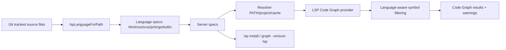

# Mở Rộng LSP Coverage Cho Web, Go Và Kotlin

## Meta

- **Status**: implemented
- **Description**: Kế hoạch đảm bảo LSP Code Graph và flow `lsp install` hỗ trợ HTML, CSS, SCSS, JavaScript, TypeScript, Go/Golang và Kotlin.
- **Compliance**: current-state
- **Links**: [LSP auto install](./auto-install-lsp-for-graph.md), [LSP Code Graph Search](./lsp-code-graph-search.md), [Module preview](../../modules/preview.md), [Preview web](../../features/preview-web.md)

## Bối Cảnh

Flow LSP đã có CLI `lsp list/install`, cache `NS_WORKSPACE_LSP_CACHE`, resolver cache và `graph --ensure-lsp`. Trước thay đổi coverage này, registry runtime chỉ map Code Graph cho Go và TypeScript/JavaScript:

- `.go` dùng `gopls serve`.
- `.ts`, `.tsx`, `.js`, `.jsx`, `.cjs`, `.mjs` dùng `typescript-language-server --stdio`.

Trong khi đó Code Semantic và preview frontend đã nhận diện nhiều language hơn. `isPreviewableFilePath()` đã cho phép `.css`, `.scss`, `.sass`, `.html`, `.kt`, `.kts`; `languageForPath()` cũng trả `css`, `scss`, `html`, `kotlin`. Thay đổi này đưa HTML/CSS/SCSS/Kotlin vào cùng registry LSP Code Graph và `lsp install auto`.

Tham khảo local checkout `knowns-dev/knowns`: Knowns có registry/adapter riêng cho Go, TypeScript và SCSS/Sass/CSS, nhưng chưa có adapter Kotlin hoặc HTML trong phần tham chiếu đã đọc. Vì vậy không nên copy nguyên adapter Knowns; nên giữ pattern adapter/registry, nhưng tự thiết kế coverage cho language user yêu cầu.

## Nguyên Nhân Và Lý Do Thiết Kế

Triệu chứng trực tiếp:

- `lsp list --project` chỉ báo Go và TypeScript/JavaScript dù project có HTML, CSS, SCSS hoặc Kotlin.
- `graph --ensure-lsp` không cài server cho HTML/CSS/SCSS/Kotlin.
- `lspLanguageForPath()` bỏ qua `.html`, `.htm`, `.css`, `.scss`, `.sass`, `.kt`, `.kts`, nên Code Graph không index các file này.

Nguyên nhân gốc rễ:

- Registry hiện đang gộp "language detected", "LSP server process" và "install target" vào cùng một model. Điều này đủ cho Go và TypeScript, nhưng không đủ khi nhiều language dùng chung một server hoặc một package cài nhiều binary.
- `flattenLSPSymbols()` chỉ tạo result node cho callable symbol kinds: method, constructor và function. Quy tắc này đúng cho Go/TypeScript/Kotlin, nhưng HTML/CSS/SCSS thường trả element, selector, property hoặc rule symbol. Nếu chỉ thêm LSP server, các language markup/style vẫn có thể có Code Graph rỗng.
- CLI hiện chỉ có install IDs `go` và `typescript`, nên chưa hỗ trợ alias người dùng kỳ vọng như `golang`, `javascript`, `html`, `css`, `scss`, `kotlin`.

Lý do chọn hướng đi:

- Tách model language/server/install để hỗ trợ alias và server dùng chung mà không làm sai output hiện tại.
- Dùng các LSP server phổ biến, cài vào cache user giống flow hiện tại, không mutate project.
- Giữ Preview/Search HTTP fail-open; chỉ `lsp install` và `graph --ensure-lsp` mới có side effect.
- Với HTML/CSS/SCSS, coi Code Graph là symbol/reference graph thay vì hứa caller/callee đầy đủ.

## Mục Tiêu

- `lspLanguageForPath()` nhận diện đủ:
  - HTML: `.html`, `.htm`
  - CSS: `.css`
  - SCSS: `.scss`, `.sass`
  - JavaScript: `.js`, `.jsx`, `.cjs`, `.mjs`
  - TypeScript: `.ts`, `.tsx`
  - Go/Golang: `.go`
  - Kotlin: `.kt`, `.kts`
- `lsp list --project` hiển thị trạng thái cho các language user-facing hoặc ít nhất hiển thị rõ server nào cover các language trên.
- `lsp install <language>` chấp nhận các ID/alias: `html`, `css`, `scss`, `sass`, `javascript`, `js`, `typescript`, `ts`, `go`, `golang`, `kotlin`, `kt`, `auto`.
- `lsp install auto --project` phát hiện đủ language từ source files và cài các server thiếu.
- `graph --ensure-lsp` chuẩn bị đủ server cho những language được phát hiện rồi query như hiện tại.
- Code Graph có kết quả phù hợp cho HTML/CSS/SCSS bằng symbol kinds phù hợp, không chỉ callable symbols.
- Warning thiếu LSP phải nói đúng language/server và command sửa lỗi.

## Ngoài Phạm Vi

- Không thêm UI mới cho Preview/Search.
- Không tự cài LSP trong HTTP `/api/search`, `preview` hoặc `search`.
- Không sửa target project, không thêm dependency vào `package.json` của project được inspect.
- Không hứa call hierarchy đầy đủ cho HTML/CSS/SCSS nếu server không hỗ trợ. Các language này chỉ cần symbol/reference context có path/line rõ.
- Không thêm toàn bộ language khác ngoài danh sách user yêu cầu.

## Logic Nghiệp Vụ

### Coverage mục tiêu

| User-facing language | Extensions                    | LSP server                    | Install source đề xuất                                  | Ghi chú                                                                            |
| -------------------- | ----------------------------- | ----------------------------- | ------------------------------------------------------- | ---------------------------------------------------------------------------------- |
| `html`               | `.html`, `.htm`               | `vscode-html-language-server` | npm package `vscode-langservers-extracted`              | Chạy `--stdio`; Code Graph dùng symbol/reference, không caller/callee.             |
| `css`                | `.css`                        | `vscode-css-language-server`  | npm package `vscode-langservers-extracted`              | Chạy `--stdio`; có thể dùng chung server package với HTML.                         |
| `scss`               | `.scss`, `.sass`              | `vscode-css-language-server`  | npm package `vscode-langservers-extracted`              | Language ID gửi LSP là `scss` hoặc `sass`; install alias về CSS server.            |
| `javascript`         | `.js`, `.jsx`, `.cjs`, `.mjs` | `typescript-language-server`  | npm package `typescript-language-server` + `typescript` | Cùng server với TypeScript; cần alias install riêng.                               |
| `typescript`         | `.ts`, `.tsx`                 | `typescript-language-server`  | npm package `typescript-language-server` + `typescript` | Giữ behavior hiện tại.                                                             |
| `go`/`golang`        | `.go`                         | `gopls`                       | `go install golang.org/x/tools/gopls@latest`            | Giữ behavior hiện tại, thêm alias `golang`.                                        |
| `kotlin`             | `.kt`, `.kts`                 | `kotlin-lsp`                  | manual install guide                                    | Resolver hỗ trợ `kotlin-lsp --stdio`; `lsp install kotlin` trả hướng dẫn thủ công. |

Kotlin là phần rủi ro nhất. Implementation đã chọn official `kotlin-lsp` và không bật auto-download archive vì release assets/checksum chưa đủ ổn định để tải tự động an toàn. Thay vào đó, tool hỗ trợ detect/resolver/warning/install guide; khi user cài `kotlin-lsp` vào `PATH` hoặc cache, Code Graph dùng được Kotlin như các language khác.

### Tách language spec khỏi install/server spec

Implementation tách language detection khỏi server/install bằng `lspLanguageSpec` và `lspInstallSpec` server-oriented:

```go
type lspLanguageSpec struct {
  ID         string
  Name       string
  Extensions []string
  ServerID   string
  LanguageID string
  Aliases    []string
  SymbolMode lspSymbolMode
}

type lspInstallSpec struct {
  ID            string
  Name          string
  Aliases       []string
  ServerID      string
  Command       string
  Args          []string
  CheckArgs     []string
  Prerequisites []lspPrerequisite
  InstallKind   lspInstallKind
}
```

Trong đó:

- Language spec quyết định `lspLanguageForPath()`, language ID gửi qua LSP và symbol filter.
- Install spec quyết định process lifecycle, resolver, install command và cache path cho server tương ứng.
- `lsp install <arg>` resolve arg qua language ID, alias hoặc server ID rồi map về server spec.
- `lsp install auto` dedupe theo `ServerID`, để project có cả `.ts` và `.js` chỉ cài TypeScript server một lần; `.css` và `.scss` chỉ cài CSS server một lần.

### Symbol modes

Giữ default cho code languages:

- `callable`: chỉ method, constructor, function thành result node; container chỉ làm owner label.

Thêm mode cho markup/style:

- `document-symbol`: chấp nhận symbol LSP có name/range hợp lệ, loại bỏ symbol rỗng, có thể giới hạn các kind nhiễu nếu server trả quá nhiều.
- `selector-symbol`: dành cho CSS/SCSS nếu server trả selector/rule/property; ưu tiên selector/rule, không biến mọi property nhỏ thành node nếu gây noise.

Implementation nên bắt đầu conservative:

- HTML: accept document symbols có range và name rõ, score theo tag/id/class/text symbol name.
- CSS/SCSS: accept selector/rule symbols trước; nếu server chỉ trả property symbols, giới hạn bằng score/evidence để query không thành dump toàn file.
- Kotlin: dùng mode `callable` giống Go/TypeScript.

### Warning và output

Warning thiếu LSP cần nói theo language user nhìn thấy, nhưng dedupe theo server:

```text
Code Graph LSP server for HTML is unavailable: vscode-html-language-server not found.
Run: go run . lsp install html
Or one-shot: go run . graph --ensure-lsp --project <path> --query <term> --json
```

Với server dùng chung:

- Nếu thiếu `vscode-css-language-server` và project có `.css` + `.scss`, warnings không nên spam hai dòng giống nhau. Có thể ghi `CSS/SCSS LSP server ...` hoặc một warning theo server với `languages: css, scss`.

## Cấu Trúc Giải Pháp



## Hướng Đã Áp Dụng

### 1. Chuẩn hóa registry language/server

Refactor nhỏ trong `internal/preview/preview_lsp_setup.go` và `preview_lsp.go`:

- Tạo danh sách `lspLanguageSpecs()`.
- Tạo danh sách `lspServerSpecs()` hoặc đổi `lspInstallSpecs()` thành server-oriented.
- `lspLanguageForPath()` lookup từ language specs thay vì switch hardcoded.
- `detectedLSPInstallSpecs()` đổi thành detect language specs rồi dedupe server specs.
- `lspInstallSpecByID()` nhận alias language/server.
- Usage hiển thị supported install aliases rõ hơn.

Giữ behavior cũ:

- `lsp install go` vẫn cài `gopls`.
- `lsp install typescript` vẫn cài TS server.
- JSON field hiện có không bị xóa; chỉ thêm field mới nếu cần như `languages`, `aliases`, `serverId`.

### 2. Thêm server specs cho HTML/CSS/SCSS

Thêm install strategy npm hiện có dùng được:

- Server `html`:
  - Command: `vscode-html-language-server`
  - Args: `--stdio`
  - Check: `--version`
  - Package: `vscode-langservers-extracted`
  - Prereq: Node.js 18+, npm

- Server `css`:
  - Command: `vscode-css-language-server`
  - Args: `--stdio`
  - Check: `--version`
  - Package: `vscode-langservers-extracted`
  - Prereq: Node.js 18+, npm

Hai server có thể dùng cùng package nhưng cache target riêng (`<cache>/html`, `<cache>/css`) để resolver đơn giản. Nếu muốn giảm duplicate npm install, có thể dùng shared server ID `vscode-web`, nhưng vòng đầu nên ưu tiên clarity và testability.

### 3. Giữ JavaScript/TypeScript chung server nhưng thêm alias

Hiện JS đã được map sang TypeScript server. Cần làm rõ bằng alias:

- `lsp install javascript` và `lsp install js` resolve về server `typescript`.
- `lsp list --project` khi chỉ có `.js` không nên làm user nghĩ "TypeScript" là sai. Row text nên hiển thị `TypeScript/JavaScript` hoặc `javascript -> typescript-language-server`.
- Warning cho `.js` nên nói `JavaScript` nhưng command có thể là `lsp install javascript`.

### 4. Thêm Go alias `golang`

Go support đã có. Cần thêm alias:

- `lsp install golang` resolve về server `go`.
- Warnings và docs có thể ghi `Go/Golang` ở user-facing text.

### 5. Thêm Kotlin support có kiểm soát

Language spec:

- Extensions: `.kt`, `.kts`
- Language ID: `kotlin`
- Server command: `kotlin-lsp`
- Args: `--stdio`
- Symbol mode: `callable`.

Installer Kotlin dùng hướng resolver + install guide:

- `lsp list` phát hiện Kotlin và báo missing kèm install guide.
- `lsp install kotlin` trả status `manual` nếu binary thiếu.
- `graph --ensure-lsp` không fail cả query, warning nêu rõ Kotlin cần cài thủ công.
- Khi official release có artifact/checksum đủ ổn định, có thể thêm archive installer sau mà không đổi language spec.

### 6. Thêm language-aware symbol filtering

Refactor `flattenLSPSymbols()`:

- Truyền `file.Language` vào helper `lspSymbolIsResultNode(lang, sym)`.
- Default giữ `lspSymbolIsCallable()`.
- HTML/CSS/SCSS dùng symbol mode riêng.
- `lspCodeNodeTitle()` và `lspCodeNodeHaystack()` giữ contract result hiện có nhưng cho phép kind label `symbol`, `selector`, `element`, `rule` nếu xác định được.

Nếu CSS/HTML server không trả symbol đủ tốt trong test fixture, fallback có kiểm soát:

- Không hand-roll parser lớn.
- Có thể tạo minimal lexical symbols cho CSS selectors và HTML tags có `id`/`class` như fallback riêng khi LSP trả symbols rỗng, nhưng chỉ nếu test chứng minh LSP server không đáp ứng. Fallback này phải nằm sau LSP, không thay thế Code Semantic.

## Chi Tiết Triển Khai

### CLI behavior

Text output `lsp list` nên có ít nhất:

```text
Language      Detected  Status     Server                         Install
html          yes       missing    vscode-html-language-server     go run . lsp install html
css           yes       installed  vscode-css-language-server      -
scss          yes       installed  vscode-css-language-server      -
javascript    yes       installed  typescript-language-server      -
typescript    no        installed  typescript-language-server      -
go            yes       installed  gopls                          -
kotlin        yes       missing    kotlin-lsp                     go run . lsp install kotlin
```

JSON nên giữ rows ổn định, có thể thêm:

```json
{
  "id": "scss",
  "serverId": "css",
  "name": "SCSS",
  "detected": true,
  "status": "installed",
  "binary": "vscode-css-language-server",
  "aliases": ["sass"]
}
```

Nếu muốn giữ row per server để ít noise, cần có field `languages:["css","scss"]`. Tuy nhiên do user yêu cầu theo language, row per language dễ kiểm chứng hơn.

### Resolver/cache

Cache layout đề xuất:

```text
<cache>/
├── go/bin/gopls
├── typescript/node_modules/.bin/typescript-language-server
├── html/node_modules/.bin/vscode-html-language-server
├── css/node_modules/.bin/vscode-css-language-server
└── kotlin/bin/kotlin-lsp
```

`lspCacheCommandDirs(command)` nên lấy từ server specs thay vì switch theo install kind.

### Docs/skill

Cập nhật:

- README command examples: list supported language aliases.
- `docs/modules/preview.md`: coverage table hiện tại.
- `docs/features/preview-web.md`: nhắc web request vẫn fail-open, CLI setup mới cover các language này.
- `docs/specs/planning/auto-install-lsp-for-graph.md`: hoặc link sang plan này, hoặc cập nhật coverage nếu implementation xong.
- `presets/skills/lsp-code-graph/SKILL.md` và bản local `~/.agents/skills/lsp-code-graph/SKILL.md`: nói rõ supported languages và Kotlin caveat nếu auto installer chưa bật.

## Công Việc Đã Thực Hiện

1. Refactor registry thành language specs + install/server specs.
2. Thêm alias install cho `javascript`, `js`, `golang`, `kt`, `scss`, `sass`, `ts`, `tsx`, `jsx`.
3. Thêm `html` language/server spec và npm install qua `vscode-langservers-extracted`.
4. Thêm `css`/`scss` language specs và server spec dùng `vscode-css-language-server`.
5. Thêm Kotlin language spec dùng `kotlin-lsp --stdio` với manual install strategy.
6. Mở rộng `lspLanguageForPath()` để lookup theo registry, gồm `.html`, `.htm`, `.css`, `.scss`, `.sass`, `.kt`, `.kts`.
7. Mở rộng `lsp list/install auto` để detect và dedupe server theo language specs.
8. Refactor warning missing LSP để dùng user-facing server/language và tránh duplicate server warnings.
9. Thêm language-aware symbol filter cho HTML/CSS/SCSS.
10. Thêm tests cho resolver cache của `vscode-html-language-server`, `vscode-css-language-server`, `kotlin-lsp`.
11. Thêm tests cho `lsp install <alias> --dry-run --json`.
12. Thêm fixture project có `.html`, `.css`, `.scss`, `.js`, `.ts`, `.go`, `.kt` để assert `lsp install auto` phát hiện đủ.
13. Thêm test symbol-mode cho HTML/CSS/Go callable filtering.
14. Cập nhật README, docs và skill sau khi behavior được implement.

## Rủi Ro Và Ràng Buộc

- Kotlin auto-install có thể cần archive downloader, version pin và checksum. Không nên tải binary từ URL động nếu chưa xác minh.
- HTML/CSS/SCSS server có thể không support call hierarchy. Code Graph phải degrade sang symbols/references và không gắn nhãn caller/callee sai.
- CSS/SCSS symbols có thể rất nhiều. Cần giới hạn result nodes bằng symbol mode và score/evidence để search không nhiễu.
- `vscode-langservers-extracted` cài một package sinh nhiều binary. Nếu cache tách theo html/css, npm install bị duplicate nhưng dễ kiểm soát; nếu cache shared, resolver phức tạp hơn.
- Refactor row output của `lsp list` có thể ảnh hưởng tests hoặc skill. Giữ JSON backward-compatible bằng cách không xóa field hiện có.
- `.html` trong docs root vẫn thuộc Docs Semantic/Docs Graph, không nên bị Code Graph index như source code. `.html` ngoài docs root mới là code source.

## Kiểm Chứng

Validation tối thiểu:

```sh
go test ./internal/preview
go test ./...
npm run format:docs:check
go run . lsp list --project . --json
go run . lsp install auto --project <fixture> --dry-run --json
go run . graph --project <fixture> --ensure-lsp --query "<known-symbol>" --json
```

Fixture cần có:

```text
src/index.html
src/styles.css
src/theme.scss
src/app.js
src/app.ts
cmd/app/main.go
src/main.kt
```

Acceptance:

- `lsp list --json` thể hiện đầy đủ HTML, CSS, SCSS, JavaScript, TypeScript, Go/Golang và Kotlin khi fixture có file tương ứng.
- `lsp install auto --dry-run --json` dedupe đúng server: HTML, CSS, TypeScript, Go, Kotlin.
- `lsp install javascript`, `lsp install typescript`, `lsp install golang`, `lsp install scss` đều resolve đúng server.
- Code Graph có node từ fake LSP cho từng language trong fixture.
- `graph --ensure-lsp --json` không làm hỏng JSON stdout và vẫn fail-open khi Kotlin installer chưa có prerequisite hoặc chưa bật auto-download an toàn.
