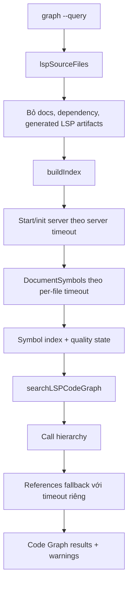

# Sửa Timeout Làm LSP Code Graph Trả Thiếu Kết Quả

## Meta

- **Status**: implemented
- **Description**: Kế hoạch sửa tình trạng `graph --query` không có đủ LSP Code Graph vì timeout khi index symbol hoặc mở rộng quan hệ caller/callee.
- **Compliance**: planning
- **Links**: [Chỉ mục](../../_index.md), [Module graph query](../../modules/graphquery.md), [Module preview](../../modules/preview.md), [Preview web](../../features/preview-web.md), [Thay Code Graph Graphify Bằng LSP](./lsp-code-graph-search.md), [Tự động ensure LSP khi query graph](./auto-ensure-lsp-on-graph-query.md), [Mở rộng LSP coverage](./expand-lsp-language-coverage.md)

## Bối Cảnh

`graph --query` chạy cùng pipeline Search/LSP Code Graph của Preview. CLI tự ensure language server theo mặc định, sau đó tạo `previewLSPCodeGraphProvider`, scan source files tracked bởi Git, gọi LSP `textDocument/documentSymbol` để dựng index symbol, rồi mở rộng caller/callee bằng call hierarchy hoặc fallback `references`.

Kế hoạch này đã được triển khai cho tình trạng query vào chính repo từng trả graph partial vì LSP symbol index hết deadline ở generated preview UI artifact trước khi đến source Go/TypeScript liên quan. Trạng thái hiện tại:

- LSP source scan bỏ `internal/preview/preview_ui/**` và giữ `internal/preview/preview_ui_src/**`.
- Symbol index dùng timeout toàn cục `lspIndexTimeout`, timeout start server `lspServerStartTimeout` và timeout từng file `lspSymbolFileTimeout`.
- Một file symbol timeout chỉ tạo warning và không dừng các file tiếp theo.
- Index bị total timeout không được cache như graph hoàn chỉnh.
- Relation expansion tách timeout phase call hierarchy và references fallback, đồng thời giữ warning incoming/outgoing timeout.

## Sự Cố Đã Khắc Phục

- `graph --query` từng có thể trả thiếu hoặc rỗng panel `codeGraph` trong khi `codeSemantic` vẫn tìm thấy file/symbol liên quan.
- Warning cũ chỉ nói "showing partial results", nhưng không cho biết bao nhiêu file đã index, file nào bị bỏ qua do generated artifact, hoặc timeout xảy ra ở phase nào.
- Một file HTML nhỏ trong output frontend generated (`internal/preview/preview_ui/index.html`) từng có thể làm index LSP hết deadline chung, khiến graph Go/TypeScript phía sau bị thiếu.
- Với preview server dài hạn, partial index có node từng có thể được cache theo token source, nên kết quả thiếu có nguy cơ được tái sử dụng đến khi source đổi hoặc server restart.
- Relation expansion từng có timeout riêng nhưng call hierarchy và references chia sẻ cùng context, nên khi phase đầu ăn hết deadline, fallback cũng dễ bị hủy.

## Nguyên Nhân Đã Khắc Phục

Nguyên nhân trực tiếp trước khi sửa:

- `cachedIndex()` từng dùng một `context.WithTimeout(ctx, lspRequestTimeout)` duy nhất cho toàn bộ `buildIndex()`.
- `buildIndex()` xử lý file tuần tự theo thứ tự path. Nếu một request `DocumentSymbols()` chậm, nó tiêu thụ deadline chung và vòng lặp dừng sớm.
- `lspSourceFiles()` lấy source từ `git ls-files` và chỉ bỏ qua docs root, dependency/cache/generated folder phổ biến như `dist` hoặc `build`. Repo này có build output embedded trong `internal/preview/preview_ui/`, không nằm trong các folder bị skip, nên HTML/CSS/JS generated vẫn được đưa vào LSP Code Graph.
- `lspMaxIndexedFileBytes` loại được asset JS lớn hơn 256 KiB, nhưng vẫn index các asset nhỏ như `preview_ui/index.html`, `preview_ui/search.html`, `preview_ui/style.css` và một số JS bundle nhỏ.
- `relationsForNode()` ưu tiên call hierarchy rồi fallback references, nhưng các request incoming/outgoing bỏ qua lỗi cục bộ; khi context hết hạn, kết quả có thể thiếu edge mà warning không đủ cụ thể.

Nguyên nhân gốc rễ đã được xử lý bằng lọc corpus và tách timeout:

- LSP Code Graph từng dùng cùng một khái niệm "tracked code files" cho cả source thật và artifact build được track để embed. Với LSP graph, generated assets có chi phí LSP cao nhưng giá trị điều hướng thấp hơn source trong `preview_ui_src/`, Go backend và package graphquery.
- Timeout cũ là một ngân sách global cứng cho toàn bộ index, chưa tách lifecycle server, symbol request từng file và relation expansion. Vì vậy hệ thống fail-open đúng tinh thần, nhưng fail-open quá sớm và không bảo toàn đủ graph hữu ích.
- Index cũ chưa có trạng thái chất lượng rõ ràng như complete, partial do file timeout, partial do global timeout hoặc partial do missing LSP. Không có trạng thái này thì caching, warning và kiểm chứng đều khó chính xác.

## Mục Tiêu

- `graph --query` lấy được LSP Code Graph đủ hữu ích cho source thật của repo, nhất là Go/TypeScript symbols liên quan đến query.
- Một file chậm hoặc một generated artifact không được làm dừng toàn bộ symbol index.
- Generated frontend assets đã có source tương ứng không còn làm nhiễu LSP graph hoặc ăn timeout của graph.
- Relation expansion vẫn fail-open, nhưng khi thiếu caller/callee do timeout hoặc server capability thì warning phải rõ phase và không che mất fallback references.
- Giữ nguyên response shape chính của `/api/search` và `graph --json`; warnings vẫn nằm trong `warnings`, stdout JSON vẫn sạch.

## Ngoài Phạm Vi

- Không thay đổi installer/cache LSP trong `internal/graphquery`.
- Không thêm language server mới hoặc mở rộng coverage ngoài HTML, CSS/SCSS/Sass, JavaScript/TypeScript, Go/Golang và Kotlin hiện có.
- Không tự cài LSP trong HTTP Preview/Search request.
- Không xây daemon LSP persistent ngoài preview server hiện tại.
- Không thay Code Semantic bằng LSP hoặc bỏ fail-open behavior.

## Contract Và Invariant

- `graph --query --json` vẫn exit thành công khi Code Graph partial, miễn project/docs scan không lỗi không phục hồi được.
- Progress hoặc install log vẫn đi stderr, không đi stdout JSON.
- HTTP `/api/search` vẫn read-only: không auto-install package trong request.
- Code Graph chỉ index file tracked bởi Git khi project là Git checkout, bỏ docs root và file quá lớn.
- Frontend Search panel không cần đổi contract: `panels.codeGraph`, `neighbors`, `flowRole`, `matchedBy`, `confidence` và `warnings` vẫn tương thích.

## Cấu Trúc Giải Pháp



## Thiết Kế Đã Triển Khai

### 1. Lọc corpus riêng cho LSP Code Graph

Helper `shouldSkipLSPSourcePath(rel string)` được dùng trong `lspSourceFiles()` thay vì chỉ dựa vào `shouldSkipGitSearchPath()`.

Quy tắc hiện tại hẹp và có test:

- Bỏ `internal/preview/preview_ui/**` vì đây là build output embedded của frontend preview.
- Giữ `internal/preview/preview_ui_src/**` vì đây là source thật.
- Giữ các source HTML/CSS/TS ngoài generated output để không làm mất coverage web đã thiết kế.
- Tiếp tục dựa trên search skip helpers cho dependency/cache folder hiện có, nhưng không thêm skip quá rộng như mọi folder tên `assets` nếu chưa có bằng chứng.

Lý do chọn hướng này: vấn đề quan sát được không phải HTML LSP nói chung, mà là generated artifact được track trong repo. Lọc đúng corpus giúp giảm timeout mà không làm tụt coverage source thật.

### 2. Tách timeout theo server và từng file

`buildIndex()` không dùng một deadline duy nhất cho toàn bộ vòng lặp.

Thiết kế hiện tại:

- Giữ một total budget theo request để không treo query, nhưng dùng per-file timeout khi gọi `DocumentSymbols()`.
- Tách server start/initialize timeout khỏi symbol request timeout. File đầu tiên của mỗi language server không nên phải chia cùng timeout quá ngắn cho cả khởi động server và đọc symbols.
- Nếu một file timeout, ghi warning cho file đó rồi tiếp tục file kế tiếp khi total budget vẫn còn.
- Nếu total budget thật sự hết, dừng vòng lặp và ghi summary warning.

Timeout hiện tại:

```text
lspIndexTimeout = 20s
lspServerStartTimeout = 6s
lspSymbolFileTimeout = 3s
lspRelationTimeout = 3s
lspRelationPhaseTimeout = 1500ms
```

Con số hiện tại được khóa bằng test và smoke test thay vì chỉ tăng timeout global. Mục tiêu là cô lập file chậm, không phải làm mọi query chờ lâu hơn.

### 3. Thêm trạng thái chất lượng cho index

`lspCodeGraphIndex` có trạng thái đủ để cache và warning chính xác hơn:

```go
type lspCodeGraphIndex struct {
  Nodes map[string]lspCodeNode
  ByPath map[string][]string
  Warnings []string
  Supported bool
  TimedOut bool
  IndexedFiles int
  TimedOutFiles int
}
```

Nguyên tắc cache:

- Index complete được cache bình thường theo token.
- Index partial do một vài file timeout có thể cache nếu phần còn lại đã duyệt hết, nhưng warning phải đi kèm và metric phải rõ.
- Index partial do total timeout không nên được cache như authoritative. Với preview server, nên rebuild ở request sau hoặc cache ngắn hạn có dấu `TimedOut`.

Implementation hiện tại không set `p.token` khi `TimedOut == true` do total budget. Điều này tránh preview server giữ mãi graph thiếu.

### 4. Sửa relation expansion để fallback thật sự hữu ích

`expandLSPCodeGraphCallFlow()` vẫn tạo `lspRelationTimeout` cho mỗi anchor, còn `relationsForNode()` tách budget theo phase:

- `prepareCallHierarchy` có timeout riêng.
- `incomingCalls` và `outgoingCalls` không được nuốt lỗi timeout hoàn toàn; lỗi nên được gom thành warning ngắn.
- Nếu call hierarchy không trả edge hoặc timeout, chạy `references` bằng context mới khi parent context còn sống.
- Nếu cả hai path đều không usable, warning nên nói rõ: `call hierarchy timed out`, `references timed out`, hoặc `server does not support relation expansion`.

Giữ edge contract hiện tại:

- Call hierarchy tạo relation `calls`.
- References fallback tạo relation `references`.
- Direct anchor vẫn được trả ngay cả khi không mở rộng được relation.

### 5. Cải thiện warning và text output

Schema response chính không đổi. Warnings cô đọng hơn:

```text
Code Graph indexed 32/33 LSP source files; skipped 1 file(s) after symbol timeout.
Code Graph skipped internal/preview/preview_ui_src/index.html after 3s symbol timeout.
Code Graph relation expansion for Foo.Bar() fell back to references after call hierarchy timeout.
```

Nếu thêm số liệu vào `stats`, cần tránh làm frontend hiểu nhầm vì `stats` hiện là count theo panel. Ưu tiên warning text hoặc field mới optional nếu thật sự cần.

## Chi Tiết Triển Khai

Các vùng code chính:

- `internal/preview/preview_lsp.go`
  - `lspIndexTimeout`, `lspServerStartTimeout`, `lspSymbolFileTimeout`, `lspRelationTimeout`, `lspRelationPhaseTimeout`
  - `cachedIndex()`
  - `buildIndex()`
  - `lspSourceFiles()`
  - `expandLSPCodeGraphCallFlow()`
  - `relationsForNode()`
  - `callHierarchyEdges()`
  - `referenceEdges()`
- `internal/preview/preview_search.go`
  - shared skip helpers nếu cần tách `shouldSkipLSPSourcePath()` khỏi semantic search.
- `internal/preview/preview_test.go`
  - test source scan, timeout, cache và relation fallback.

Hạng mục đã triển khai:

1. Thêm test cho `lspSourceFiles()` chứng minh `internal/preview/preview_ui/**` bị loại khỏi LSP graph nhưng `internal/preview/preview_ui_src/**` vẫn được giữ.
2. Thêm helper skip LSP source path và cập nhật `lspSourceFiles()`.
3. Refactor `buildIndex()` để tiếp tục sau per-file timeout, đồng thời ghi trạng thái `TimedOut`, `IndexedFiles` và `TimedOutFiles`.
4. Điều chỉnh `cachedIndex()` để không cache index bị total timeout như complete.
5. Refactor relation expansion thành các timeout riêng cho call hierarchy và references.
6. Cập nhật warning text và tests liên quan.
7. Chạy smoke query để xác nhận query trước đây thiếu graph đã có Code Graph tốt hơn.

## Rủi Ro Và Ràng Buộc

- Nếu skip generated path quá rộng, có thể làm mất source hợp lệ ở project khác. Vì vậy vòng đầu chỉ skip path có bằng chứng rõ hoặc pattern rất phổ biến đã có trong search.
- Per-file timeout quá ngắn có thể bỏ qua file source thật khi language server đang warm up. Cần tách server start timeout để giảm rủi ro này.
- Không cache total-timeout partial index có thể làm preview request sau tiếp tục tốn chi phí nếu project rất lớn. Nếu điều này xảy ra, bước sau có thể thêm cache partial ngắn hạn hoặc background rebuild.
- References fallback không tương đương call graph đầy đủ. Warning và relation label phải giữ đúng kỳ vọng.
- HTML/CSS language server có thể chậm hoặc ít symbol hơn Go/TypeScript. Không nên vì một language kém ổn định mà làm mất graph của language khác.

## Kiểm Chứng

Unit tests mục tiêu:

- `TestLSPSourceFilesSkipsGeneratedPreviewUIButKeepsPreviewUISource`
- `TestLSPIndexContinuesAfterFileSymbolTimeout`
- `TestLSPIndexDoesNotCacheTotalTimeoutAsComplete`
- `TestLSPRelationFallsBackToReferencesAfterCallHierarchyTimeout`
- `TestLSPRelationWarningsIncludeIncomingOutgoingTimeout`

Validation command:

```sh
go test ./internal/preview
go test ./internal/graphquery
go test ./...
go run . graph --project . --query previewLSPCodeGraphProvider --limit 5 --json
go run . graph --project . --query buildIndex --limit 5 --json
go run . graph --project . --query relationsForNode --limit 5 --json
```

Kỳ vọng sau sửa:

- Không còn warning timeout từ `internal/preview/preview_ui/index.html` trong query của repo này.
- Query `buildIndex` và `relationsForNode` có kết quả trong `panels.codeGraph`, không chỉ `codeSemantic`.
- Nếu vẫn có file source thật timeout, warning nêu rõ file đó bị skip nhưng các file khác vẫn được index.
- JSON stdout vẫn decode được và warnings không lẫn progress install.

## Tiêu Chí Chấp Nhận

- LSP Code Graph không bị rỗng chỉ vì một file generated hoặc một file LSP chậm.
- `graph --query` trả graph context đủ cho các callable symbol nội bộ như `buildIndex`, `relationsForNode` và `previewLSPCodeGraphProvider`.
- Partial result được báo rõ và không bị cache như index hoàn chỉnh khi timeout toàn cục.
- Relation expansion có fallback references hoạt động với timeout riêng và warning đúng phase.
- HTTP Preview/Search vẫn fail-open, không tự install LSP và không đổi response contract chính.
