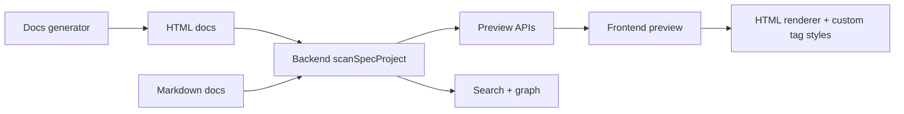

# Generate Docs Bằng HTML Tailwind Và Custom Tags

## Meta

- **Status**: draft
- **Description**: Kế hoạch đổi hướng generate docs từ Markdown sang HTML dùng Tailwind và custom tag style, đồng thời giữ preview/search/graph đọc được metadata và quan hệ tài liệu.
- **Compliance**: planned
- **Links**: [Chỉ mục](../../_index.md), [Module preview](../../modules/preview.md), [Preview web](../../features/preview-web.md), [Quy ước frontend preview](../../development/conventions/preview-frontend.md)

## Bối Cảnh

Knowledge base hiện dùng Markdown làm định dạng nguồn chính. Preview backend scan toàn bộ file text dưới `docs/`, ưu tiên `_index.md`, `_sync.md`, metadata `## Meta`, bảng Markdown và link Markdown để tạo `specDocument`, summary, graph, search corpus và API JSON. Frontend preview nhận `raw` Markdown rồi render bằng TOAST UI Viewer, hỗ trợ WYSIWYG Markdown editor, raw Markdown toggle, metadata table, Mermaid/LikeC4 code fence, internal Markdown links và save bằng `PUT /api/docs/{id}`.

Yêu cầu mới là thay đổi cách generate docs: output docs nên là HTML dùng Tailwind và custom tag style thay vì Markdown. Vì hiện tại Markdown vừa là source authoring vừa là preview/render contract, thay đổi này không nên chỉ thay renderer ở frontend; cần xác định lại contract tài liệu, metadata, graph và edit/save behavior.

## Nguyên Nhân Và Lý Do Thiết Kế

Markdown hiện đơn giản cho authoring nhưng khó kiểm soát layout, component style và semantic block phức tạp. HTML có Tailwind và custom tags cho phép generate docs giàu cấu trúc hơn: callout, relationship, metadata, module card, diagram container, API block hoặc invariant block có thể là tag rõ nghĩa thay vì convention Markdown dễ vỡ.

Hướng nên chọn là tách rõ:

- **Nguồn dữ liệu docs**: HTML document có semantic custom tags.
- **Preview rendering**: render HTML đã sanitize theo allowlist, dùng Tailwind utility và CSS custom tag.
- **Metadata/graph extraction**: parse DOM hoặc token HTML có cấu trúc, không còn phụ thuộc hoàn toàn vào regex Markdown.
- **Migration compatibility**: Markdown hiện có vẫn đọc được trong giai đoạn chuyển tiếp để không làm hỏng docs đang tồn tại.

## Mục Tiêu

- Cho phép generated docs trong `docs/` dùng `.html` hoặc `.docs.html` với Tailwind utility classes và custom tags.
- Định nghĩa một bộ custom tags ổn định cho metadata, relation, module index, warning/callout, diagram và code block.
- Generated HTML phải ngắn gọn: ưu tiên semantic custom tags và nội dung cần thiết, không xuất wrapper lồng nhau, inline style, id ngẫu nhiên, attribute framework/runtime hoặc class trang trí dư thừa.
- Metadata phải là contract bắt buộc, đủ để backend parse `title`, `description`, `status`, `compliance`, `priority`, `links` và relation graph mà không phải đọc text trình bày.
- Backend scan được metadata, title, description, status, compliance, links và graph edges từ HTML.
- Frontend preview render HTML an toàn, cùng visual system với Tailwind/DaisyUI hiện có.
- Search corpus vẫn lấy text sạch từ docs HTML, không index raw tag noise quá nhiều.
- Giữ Markdown đọc được trong giai đoạn chuyển tiếp, nhưng implementation mới ưu tiên HTML docs khi file đã migrate.

## Ngoài Phạm Vi

- Không thiết kế CMS hoặc editor HTML WYSIWYG hoàn chỉnh trong bước đầu.
- Không rewrite toàn bộ docs hiện có trong cùng một thay đổi nếu chưa cần.
- Không bỏ ngay Markdown preview/editor đang hoạt động.
- Không thêm SSR server hoặc bundler mới cho preview runtime.

## Logic Nghiệp Vụ

Một HTML doc hợp lệ cần có metadata machine-readable ở đầu file. Đề xuất dùng custom tags:

```html
<doc-meta status="active" compliance="current-state" priority="P0">
  <doc-title>Module Preview</doc-title>
  <doc-description>Tài liệu module internal/preview.</doc-description>
  <a href="../features/preview-web.html">Preview web</a>
</doc-meta>
```

Metadata là phần duy nhất nên chứa các field điều hướng/graph ở dạng machine-readable. Nội dung body không nên lặp lại metadata chỉ để parser đọc lại. Nếu cần hiển thị metadata trong preview, frontend render từ `doc-meta` thành table/badge giống Markdown metadata hiện tại.

Nội dung body dùng HTML thường và custom tags:

```html
<doc-callout tone="warning">Nội dung cần chú ý.</doc-callout>
<doc-relation type="depends" target="../modules/preview.html">Preview consumes docs graph.</doc-relation>
<doc-diagram type="mermaid"> flowchart LR A["Docs HTML"] --> B["Preview"] </doc-diagram>
```

Quy tắc đề xuất:

- `doc-meta` là nguồn metadata chính cho HTML docs.
- `doc-meta` chỉ được dùng các attribute đã định nghĩa: `status`, `compliance`, `priority`, `version` nếu cần. Không emit `class`, `style`, `id`, `data-*`, `aria-*` trên `doc-meta`.
- `doc-title`, `doc-description` và `<a href="...">label</a>` là child hợp lệ của `doc-meta`; không cần wrapper trung gian.
- Link trong `doc-meta` phải dùng thẻ `<a>` chuẩn: label là content trong thẻ, target đặt trong `href`, và parser tạo quan hệ graph kiểu `references` nếu không có metadata relation rõ hơn.
- `doc-relation` tạo typed edge theo cùng allowlist hiện có: `references`, `implements`, `depends`, `blocks`, `follows`, `related`, `provides`, `consumes`.
- `doc-diagram type="mermaid"` thay thế code fence Mermaid trong HTML docs.
- `doc-code language="go"` hoặc `<pre><code class="language-go">` đều preview được.
- Tailwind classes chỉ được phép khi tạo khác biệt layout/semantics thật sự; tránh class dài trên mọi node. Baseline style của custom tags phải đủ đẹp khi không có class.
- Sanitize phải chặn script, inline event handler, external unsafe URL, inline `style`, `id` dư thừa và mọi `data-*` không nằm trong allowlist preview.

## HTML Output Contract

Generated HTML phải là body fragment tối giản, không phải full app shell. Generator không được emit các phần sau:

- `<!doctype>`, `<html>`, `<head>`, `<body>` nếu preview chỉ cần fragment.
- Inline `<script>`, `<style>` hoặc event handler như `onclick`.
- Attribute runtime/framework như `data-reactroot`, `ng-*`, `x-*`, `v-*`, `wire:*`, `hx-*`.
- `id` tự sinh chỉ để styling. Chỉ emit `id` khi cần anchor ổn định cho heading hoặc link nội bộ.
- `class` rỗng, class trùng lặp, class chỉ phục vụ reset mặc định, hoặc class Tailwind không làm thay đổi rendering.
- `aria-*` trừ khi element thật sự interactive hoặc cần accessible label.

HTML tối thiểu mong muốn:

```html
<doc-meta status="active" compliance="current-state">
  <doc-title>Preview Web</doc-title>
  <doc-description>Dashboard local để đọc, search và điều hướng docs.</doc-description>
  <a href="./modules/preview.html">Module preview</a>
</doc-meta>

<h1>Preview Web</h1>
<p>Lệnh preview chạy một web server local để đọc thư mục docs.</p>
```

HTML không đạt yêu cầu:

```html
<section id="section-1700000000" class="relative block w-full text-base" data-generated="true" style="margin:0">
  <div class="container mx-auto px-4">
    <doc-meta class="hidden" data-kind="meta" status="active" onclick="noop()">
      <doc-title>Preview Web</doc-title>
    </doc-meta>
  </div>
</section>
```

Contract này giúp backend parse dễ hơn, preview sanitize đơn giản hơn và diff docs dễ đọc hơn khi generated output thay đổi.

## Cấu Trúc Giải Pháp



Backend cần có adapter theo format tài liệu:

- `markdownDocumentAdapter`: giữ logic hiện tại cho `.md`.
- `htmlDocumentAdapter`: parse HTML, extract metadata, title, links, relations, plain text và diagram blocks.
- `specDocument.Format` hoặc field tương tự để frontend biết render theo HTML hay Markdown.

Frontend cần renderer theo format:

- Markdown tiếp tục dùng TOAST UI Viewer/Editor.
- HTML dùng DOMPurify sanitize, render trực tiếp vào preview surface, rồi decorate custom tags thành UI Tailwind/DaisyUI thống nhất.
- Raw toggle đổi nhãn từ raw Markdown sang raw source tùy format.

## Hướng Tiếp Cận Đề Xuất

Triển khai theo hướng additive trước: thêm HTML docs support mà chưa xóa Markdown. Sau khi HTML generator ổn định và một vài docs mẫu được migrate, mới quyết định có bỏ Markdown authoring/editing hay không.

Lý do là preview hiện có nhiều hành vi bám Markdown: source line ranges, internal links, TOAST UI editor, Mermaid fence, metadata panel, save API và test string-based. Nếu thay toàn bộ trong một lần, rủi ro regression cao và khó phân biệt lỗi parser với lỗi UI.

## Chi Tiết Triển Khai

### Backend

- Mở rộng `languageForPath` hoặc thêm `documentFormatForPath` để nhận diện `.html` và `.docs.html` là docs HTML.
- Thêm parser HTML có cấu trúc bằng Go tokenizer/parser thay vì regex thuần.
- Extract metadata từ `doc-meta`, fallback title từ `<h1>` hoặc `<title>`.
- Validate metadata tối thiểu: `doc-title` hoặc `<h1>` phải có; `status` và `compliance` nên có với docs chính; `doc-description` nên có để search result ưu tiên description như Markdown hiện tại.
- Normalize metadata về `moduleMeta` hiện có để `projectSummary`, `specDocument.description`, graph và search không cần biết nguồn là Markdown hay HTML.
- Extract links từ `<a href>` trong `doc-meta`, anchor nội bộ trong body và `doc-relation[target]`.
- Extract searchable text bằng cách bỏ tag, script/style và normalize whitespace.
- Bỏ metadata raw khỏi searchable body hoặc giảm trọng số để search không bị nhiễu bởi tag/attribute.
- `parseSpecGraph` nhận relation từ cả Markdown và HTML docs.
- `PUT /api/docs/{id}` ở bước đầu chỉ tiếp tục cho Markdown, hoặc chỉ cho HTML nếu request giữ nguyên raw source và có validation sanitize trước khi lưu. Đề xuất bước đầu: HTML docs read-only trong preview.

### Frontend

- Thêm nhánh render `language === "html"` hoặc `format === "html"` trong `renderSpecDocumentContent`.
- Dùng DOMPurify sanitize với allowlist custom tags và attributes tối thiểu: `doc-meta`, `doc-title`, `doc-description`, `doc-relation`, `doc-callout`, `doc-diagram`, `doc-code`, `status`, `compliance`, `priority`, `version`, `tone`, `type`, `target`, `href`, `language`, `class`. Link dùng thẻ `<a>` chuẩn, không dùng custom `doc-link`.
- Với `class`, chỉ giữ class nằm trong allowlist prefix an toàn nếu cần, ví dụ `prose`, `text-*`, `font-*`, `grid`, `flex`, `gap-*`, `mt-*`, `mb-*`, `p-*`, `rounded*`, `border*`, `bg-*`, nhưng tránh cho phép arbitrary value tùy ý nếu không kiểm soát được.
- Style custom tags bằng CSS trong `preview_ui/style.css`; baseline custom tag style phải là nguồn chính, Tailwind utility trong generated HTML chỉ là override có chủ đích.
- Reuse diagram pipeline bằng cách chuyển `doc-diagram[type="mermaid"]` thành surface tương đương Mermaid block hiện có.
- Disable Markdown edit toolbar cho HTML docs cho đến khi có editor riêng.

### Generator

- Nếu generator hiện tạo Markdown docs, đổi output template sang HTML semantic tags.
- Template HTML chỉ nên chứa body fragment có `doc-meta` đầu file để preview embed dễ hơn.
- Generator phải có bước minify/normalize semantic nhẹ:
  - Xóa attribute rỗng.
  - Xóa class trùng lặp.
  - Xóa wrapper chỉ có một child và không mang semantic.
  - Sort attribute theo thứ tự ổn định để diff nhỏ.
  - Không emit timestamp/hash/id ngẫu nhiên.
- Tailwind classes nên là utility rõ nghĩa trên layout/block, còn custom tags giữ semantic để backend không phụ thuộc class name.
- Metadata phải được generate từ model dữ liệu, không scrape ngược từ body text.

## Công Việc Cần Làm

1. Xác nhận phạm vi generator cụ thể đang muốn đổi: knowledge base docs trong `docs/`, generated helper docs trong `~/.agents/generated`, hay cả hai.
2. Định nghĩa spec custom tags chính thức, metadata schema và attribute allowlist.
3. Thêm HTML output normalizer cho generator để xóa wrapper/attribute/class dư thừa.
4. Thêm HTML document adapter ở backend, gồm metadata, relation, title, text extraction và tests.
5. Mở rộng `specDocument`/API để frontend phân biệt format tài liệu.
6. Thêm HTML renderer frontend, custom tag styles và diagram bridge.
7. Thêm docs HTML mẫu hoặc migrate một doc nhỏ để làm fixture.
8. Cập nhật tests preview backend/frontend theo contract mới, gồm test negative cho attribute dư thừa.
9. Chạy validation: `go test ./internal/preview`, `npm run check:preview`, `npm run lint:preview`, `npm run build:preview`, `npm run format:preview:check`.

## Rủi Ro Và Ràng Buộc

- HTML docs có rủi ro XSS cao hơn Markdown nếu sanitize không chặt.
- Tailwind CDN/runtime hiện có trong preview, nhưng generated HTML không nên phụ thuộc vào class động không được scan/build nếu sau này chuyển khỏi CDN.
- Nếu generator emit nhiều class/attribute dư, docs diff sẽ ồn và backend parser dễ bị coupling với presentation.
- Nếu metadata quá tối giản hoặc optional quá nhiều, search/graph sẽ mất description, status hoặc relation đang có từ Markdown.
- Custom tag parser phải ổn định với HTML fragment không hoàn hảo.
- Graph/search hiện phụ thuộc nhiều convention Markdown; cần test kỹ để không mất relations trong `_index` và docs chính.
- HTML docs read-only có thể tạm thời làm mất khả năng edit trực tiếp với các doc đã migrate.

## Kiểm Chứng

- Backend scan được cả `.md` và `.html` trong `docs/`.
- HTML fixture có `doc-meta`, `<a href>`, `doc-relation` xuất hiện đúng trong `/api/docs`, `/api/project`, `/api/graph` và `/api/search`.
- HTML fixture không có attribute dư thừa: không `style`, không event handler, không framework `data-*`, không id ngẫu nhiên, không class rỗng/trùng.
- Metadata tối thiểu được parse từ HTML và map đúng vào `specDocument.title`, `description`, `status`, `compliance`, `priority`.
- Preview render custom tags đúng style, không hiển thị raw custom metadata không mong muốn trong body.
- Script tag, event handler như `onclick`, unsafe URL và inline style nguy hiểm bị sanitize.
- Markdown docs hiện tại vẫn render/edit được như trước.
- Generated preview assets đồng bộ sau build.
