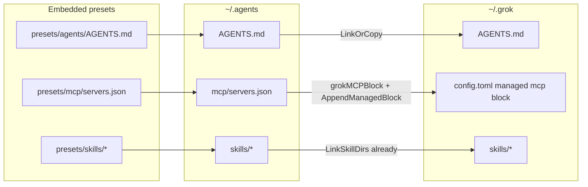

# Grok Adapter: MCP Managed Block + User-Level AGENTS.md

## Bối Cảnh

Adapter `grok` hiện là `SimpleAdapter` stable, chỉ mirror skills sang `~/.grok/skills`. Grok Build thực tế hỗ trợ thêm:

- User-level project rules / instructions dưới `~/.grok/` (họ `AGENTS.md`)
- MCP servers trong `~/.grok/config.toml` dưới section `[mcp_servers.<name>]`
- Skills tại `~/.grok/skills/` (đã support) và đồng thời discover `~/.agents/skills/`

Các stable peer (Claude, OpenCode, Qwen, Codex, Kimi, Kiro…) materialize ít nhất instruction và/hoặc MCP. Grok đứng dưới parity: `init --tools grok` không ghi `~/.grok/AGENTS.md` và không đưa shared MCP preset vào native config.

Audit trước đó đã xác nhận: không duplicate adapter; dual skills path là intentional; gap chính là **MCP native** và **user-level AGENTS.md**.

## Nguyên Nhân Và Lý Do Thiết Kế

### Nguyên nhân gốc

Adapter Grok được thêm theo mô hình “skills-only” (mirror `~/.grok/skills`) vì Grok cũng đọc `~/.agents/skills` và project `AGENTS.md`. Thiết kế đó đủ cho slash-command skills, nhưng:

1. **User-level instructions** không được Grok load từ `~/.agents/AGENTS.md`. Docs Grok chỉ coi global rules dưới `~/.grok/` (và Claude/Cursor compat). Shared `~/.agents/AGENTS.md` do đó **không** đến Grok trừ khi user có project file hoặc Claude compat.
2. **MCP** của Grok là TOML trong `config.toml`, không phải JSON `mcpServers` path mà `BaseAdapter.profileAndMcpOps` biết ghi. Không set `MCPPath` → không có operation MCP.
3. Claude compat (`~/.claude.json`, `~/.claude/CLAUDE.md`) chỉ là đường **gián tiếp**, phụ thuộc adapter Claude + thao tác tay (helper `mcp.commands.sh`), không thay native Grok managed config.

### Lý do thiết kế đề xuất

- Tái sử dụng primitive đã có: `LinkOrCopy` cho instruction, `AppendManagedBlock` cho TOML (pattern Codex).
- Không đụng settings-profile JSON (`presets/manifest.json` / `presets/adapters/*.json`) vì Grok không dùng JSON settings.
- Giữ skills mirror hiện tại; không xóa dual path.
- Managed block có marker `# >>> ns-workspace mcp >>>` / `# <<< ns-workspace mcp <<<` để `update` rewrite chỉ phần tool quản lý, **không** đụng model/UI/auth do user cấu hình.

## Góc Nhìn Tổng Quan Và Phạm Vi Tập Trung

```text
presets/mcp/servers.json  ──►  grokMCPBlock(TOML)
presets/agents/AGENTS.md  ──►  ~/.agents/AGENTS.md  ──►  ~/.grok/AGENTS.md
presets/skills/*          ──►  ~/.agents/skills/*   ──►  ~/.grok/skills/*   (đã có)
```

Phạm vi tập trung: `internal/agentsync` (registry, plugin/renderer MCP, tests) + docs/README mô tả target Grok.

## Mục Tiêu

1. `init` / `update` với `--tools grok` (hoặc `stable` / `all`) link `~/.agents/AGENTS.md` → `~/.grok/AGENTS.md`.
2. Cùng luồng đó, ghi/update managed MCP block trong `~/.grok/config.toml` từ shared MCP preset, đúng schema Grok (`command`/`args`/`env` hoặc `url`/`headers`; không cần `type`).
3. `status` / `agents` (catalog) phản ánh artifacts `instructions` + `skills` + `mcp`.
4. `--no-mcp` bỏ qua block MCP; skills + AGENTS.md vẫn sync.
5. Không phá `config.toml` hiện có ngoài managed block.
6. Cập nhật docs/README cho khớp behavior.

## Ngoài Phạm Vi

- Full-bypass / `permission_mode = "always-approve"` managed trong `config.toml` (follow-up riêng).
- Sync hooks sang `~/.grok/hooks/`.
- Sync subagents/agents sang `~/.grok/agents/` (format frontmatter Grok khác OpenCode/Claude preset).
- Settings profile JSON / entry `presets/manifest.json` cho grok.
- Plugin marketplace, models, personas, `~/.grok/commands/`.
- Sửa dual skills path hoặc bỏ mirror `~/.grok/skills`.
- Tự động import MCP từ Claude `~/.claude.json` vào Grok.

## Logic Nghiệp Vụ

### AGENTS.md

| Bước | Hành vi |
| --- | --- |
| Core phase | Vẫn materialize `presets/agents/AGENTS.md` → `~/.agents/AGENTS.md` |
| Adapter phase | `LinkOrCopy` shared → `~/.grok/AGENTS.md` (symlink mặc định; `--copy` thì copy) |
| `init` không `--force` | Giữ rule `LinkOrCopy` hiện tại (skip nếu đích tồn tại và không replace) |
| `update` / `--force` | Replace link/file theo primitive hiện có |

### MCP

| Bước | Hành vi |
| --- | --- |
| Nguồn | `readMCPManifest(ctx)` — shared home hoặc embedded preset + user overlay |
| Render | `grokMCPBlock(manifest)` → TOML sections `[mcp_servers.<name>]` |
| Ghi | `AppendManagedBlock{Dst: ~/.grok/config.toml, Label: "mcp", Replace: true}` |
| `NoMCP` | Không emit operation MCP |
| Server rỗng | Không emit block (hoặc emit block trống có marker — **chọn: không emit khi rỗng**, giống Codex early-return khi `len == 0`) |
| Update | `replaceManagedBlock` thay nội dung giữa marker; phần TOML user (models, ui, marketplace…) giữ nguyên |
| Trùng tên server | User tự khai báo `[mcp_servers.foo]` **ngoài** managed block có thể trùng với preset trong block → Grok có thể lỗi/ghi đè theo precedence vendor; docs ghi chú: server managed chỉ nằm trong marker |

### Schema map từ shared JSON

Shared preset (`presets/mcp/servers.json`):

```json
{ "type": "http", "url": "https://..." }
{ "command": "npx", "args": ["..."], "env": { ... } }
```

Grok TOML mục tiêu:

```toml
# >>> ns-workspace mcp >>>
[mcp_servers.context7]
url = "https://mcp.context7.com/mcp"

[mcp_servers.safari]
command = "npx"
args = ["safari-mcp"]

[mcp_servers.example]
command = "npx"
args = ["-y", "some-mcp"]
env = { "API_KEY" = "..." }
# <<< ns-workspace mcp <<<
```

Quy tắc render:

- Bỏ field `type` (Grok không dùng discriminator JSON).
- HTTP/SSE: giữ `url`; nếu có `headers` map → `headers = { "K" = "V" }`.
- stdio: `command`, `args`, `env` khi có.
- Sort tên server để diff ổn định (như Codex).
- Key section: dùng bare key an toàn (`[mcp_servers.context7]`) khi name match `[A-Za-z0-9_-]+`; nếu không, quote TOML. Preset hiện tại chỉ dùng tên an toàn.

## Cấu Trúc Giải Pháp

```text
internal/agentsync/
  adapter_registry.go     # Targets.Instruction + Plugin: GrokPlugin
  adapter_plugins.go      # GrokPlugin (capabilities, ExtraOperations, status)
  mcp.go                  # grokMCPBlock(+ lookup seam nếu cần)
  agentsync_test.go       # assert AGENTS.md + MCP block
  coverage_test.go        # unit grokMCPBlock / plugin nếu thiếu coverage
README.md
docs/modules/agentsync.md
docs/architecture/overview.md   # chỉ nếu câu catalog adapter cần chỉnh mô tả target
```

Không thêm `presets/adapters/grok.json` hay settings preset.

## Mô Hình C4



## Hướng Tiếp Cận Đề Xuất

**Khuyến nghị: `SimpleAdapter` + `GrokPlugin` (ExtraOperations emit MCP).**

Lý do:

- Instruction chỉ cần set `Targets.Instruction` — `BaseAdapter.fileLinkOps` lo hết.
- MCP TOML không đi qua `MCPPath`/`MergeJSON`; plugin `ExtraOperations` là đúng hook (Codex tách `CodexAdapter.Plan` vì còn `stripMCPOps`; Grok không cần strip).
- Ít type mới hơn `GrokAdapter` full concrete.

Phương án thay thế (không chọn trừ khi review muốn symmetry Codex):

- `GrokAdapter.Plan` copy pattern `CodexAdapter` — dài hơn, không mang lợi ích strip.

## Chi Tiết Triển Khai

### 1. Registry

Trong `NewAdapterRegistry`, adapter `grok`:

```go
Targets: AdapterTargets{
  Instruction: filepath.Join(home, ".grok", "AGENTS.md"),
  Skills:      filepath.Join(home, ".grok", "skills"),
},
Plugin: GrokPlugin{},
Notes:  // cập nhật: mirror skills + link AGENTS.md + managed MCP block trong config.toml
```

`artifactsFromSpec` sẽ tự thêm `instructions` + `skills`. Plugin thêm `mcp`.

### 2. `GrokPlugin`

| Method | Hành vi |
| --- | --- |
| `ExtendCapabilities` | Append `ArtifactMCP` |
| `ExtraOperations` | Nếu `!NoMCP` và manifest có server → `AppendManagedBlock` vào `~/.grok/config.toml`, label `mcp`, `Replace: true` |
| `ExtraStatusPaths` | `~/.grok/config.toml` |
| `TransformMCPServers` | Identity (render TOML đọc shared shape trực tiếp) |

### 3. `grokMCPBlock`

- Đặt cạnh `codexMCPBlock` trong `mcp.go`.
- Có thể extract helper nhỏ shared (sort names, emit args/env) **chỉ nếu** không làm đục Codex; ưu tiên copy-adapt rõ ràng trước, DRY sau nếu lặp thật sự đau.
- Không gọi `transformMCPServersForAdapter("grok")` trừ khi sau này JSON path xuất hiện; TOML renderer tự drop `type`.

### 4. Docs comment trong `transformMCPServersForAdapter`

Thêm ghi chú: `grok` không dùng JSON transform path; MCP qua `grokMCPBlock`. Tránh người sau set `MCPPath` nhầm.

### 5. Tests

| Test | Kỳ vọng |
| --- | --- |
| `TestGrokSelectionCreatesNativeSkills` (mở rộng hoặc test mới) | Tồn tại `~/.grok/AGENTS.md`, `~/.grok/skills/...`, `~/.grok/config.toml` chứa managed markers + `context7` / `url` |
| `TestApplyCreatesStableAndManualAgentLayout` | Assert thêm `~/.grok/AGENTS.md` + MCP trong grok config (tương tự codex) |
| Unit `TestGrokMCPBlock` | HTTP → `url`; stdio → `command`/`args`; sort names; drop `type`; optional `env`/`headers` |
| `--no-mcp` + `--tools grok` | Có AGENTS.md + skills; **không** có managed MCP markers (hoặc file config không được tạo chỉ vì MCP) |
| Preserve user TOML | Pre-seed `config.toml` với `[ui] permission_mode = "always-approve"`; sau update, section user còn, block MCP đổi theo preset |

### 6. Docs user-facing

- `README.md` bảng targets Grok: thêm `~/.grok/AGENTS.md`, managed MCP trong `~/.grok/config.toml`.
- `docs/modules/agentsync.md`: mô tả plugin Grok (TOML managed block) cạnh Codex; cập nhật notes adapter catalog nếu có.
- Không bắt buộc đổi architecture overview trừ câu “chỉ skills”.

## Công Việc Cần Làm

1. [ ] Cập nhật `AdapterSpec` grok: `Instruction` + `Plugin: GrokPlugin{}` + notes.
2. [ ] Implement `GrokPlugin` trong `adapter_plugins.go`.
3. [ ] Implement `grokMCPBlock` (và seam lookup nếu mirror Codex defensively) trong `mcp.go`.
4. [ ] Mở rộng / thêm tests (selection, full init, unit block, no-mcp, preserve user TOML).
5. [ ] Cập nhật `README.md` + `docs/modules/agentsync.md`.
6. [ ] Chạy `go test ./internal/agentsync ./internal/cli`.
7. [ ] (Optional follow-up commit docs-only nếu `_sync.md` policy yêu cầu — ngoài luồng code nếu user không yêu cầu sync index.)

## Rủi Ro Và Ràng Buộc

| Rủi ro | Mức | Giảm thiểu |
| --- | --- | --- |
| Ghi đè `config.toml` user | Cao | Chỉ rewrite qua `AppendManagedBlock` markers; test preserve section ngoài block |
| Trùng `[mcp_servers.X]` user + managed | Trung bình | Document; không merge deep TOML full file |
| `init` tạo `config.toml` chỉ có MCP trên máy chưa có Grok | Thấp | Chấp nhận; Grok merge default khi chạy |
| Header/env secret trong preset | Thấp | Preset hiện không chứa secret; renderer quote TOML đúng |
| Format section key khác Codex (`%q` vs bare) | Thấp | Khớp docs Grok bare key; test lock-in |
| Claude compat vẫn load MCP song song | Thấp | Ngoài scope; user có thể tắt `[compat.claude] mcps` |
| `LinkOrCopy` AGENTS.md trên Windows / `--copy` | Thấp | Dùng primitive hiện có |

## Kiểm Chứng

```bash
go test ./internal/agentsync
go test ./internal/cli
# optional narrow:
go test ./internal/agentsync -run 'Grok|ApplyCreatesStable'
```

Acceptance:

- [ ] `--tools grok` tạo `~/.grok/AGENTS.md` trỏ/copy từ shared.
- [ ] `~/.grok/config.toml` chứa managed MCP block với server từ preset (ít nhất `context7` có `url`).
- [ ] `update` đổi preset MCP → block đổi; key user ngoài block giữ nguyên.
- [ ] `--no-mcp` không ghi managed MCP block.
- [ ] Skills path cũ vẫn pass.
- [ ] Catalog/capabilities grok gồm instructions, skills, mcp.
- [ ] Docs/README mô tả đúng targets.

## Quyết Định Chờ Duyệt

1. **Phạm vi PR này chỉ MCP + AGENTS.md** (đúng plan); permission_mode / hooks / agents để follow-up.
2. **Plugin ExtraOperations** thay vì concrete `GrokAdapter` — confirm orthogontal với Codex.
3. **Khi manifest MCP rỗng:** không emit operation (không xóa block cũ?).  
   - Codex: `len == 0` → không append op → **block cũ có thể còn** sau update nếu preset trở thành rỗng.  
   - Plan đề xuất **giữ behavior Codex** (không emit khi rỗng). Nếu muốn cleanup block khi preset rỗng, cần emit block rỗng với `Replace: true` — nói rõ nếu user muốn khác.

---

**Trạng thái:** draft — chờ phê duyệt trước khi sửa source code.
