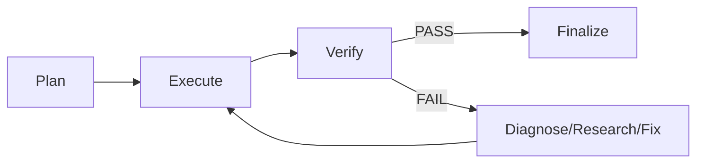
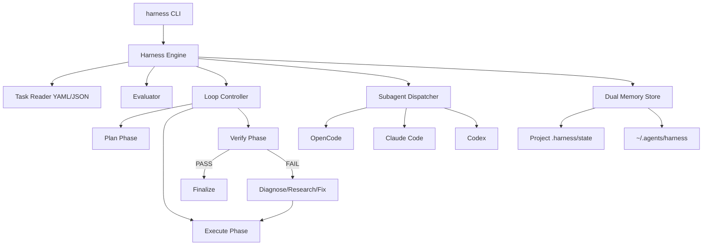

# Bộ Harness Và Looping Agentic

## Meta

- **Status**: implemented
- **Description**: Thiết kế và triển khai bộ harness và looping agentic cho `ns-workspace`, hỗ trợ self-correct loop, multi-agent routing, eval harness và memory persistence.
- **Compliance**: current-state
- **Links**: [Chỉ mục](../_index.md), [Module harness](../modules/harness.md), [Feature agentic loop](../features/agentic-loop.md), [Skill harness](../../presets/skills/harness/SKILL.md), [Skill loop](../../presets/skills/loop/SKILL.md), [Skill eval](../../presets/skills/eval/SKILL.md)

## Bối Cảnh

`ns-workspace` đã có skill pipeline (`//r`, `//p`, `//e`, `//f`, `//s`) và subagent spawning qua `spawn-opencode`. Tuy nhiên, thiếu một runtime để tự động hóa, giám sát và đánh giá quy trình này một cách có cấu trúc.

## Nguyên Nhân Và Lý Do Thiết Kế

- Skill pipeline hiện tại dựa trên trigger của user; cần thêm khả năng tự động lặp lại khi verify fail.
- Cần một bộ harness định nghĩa rõ requirements, scope, acceptance criteria cho từng task.
- Cần eval harness để chạy và đánh giá skill/subagent theo tiêu chí khách quan.
- Cần runtime harness để orchestrate multi-step loop với khả năng tự sửa lỗi.

## Góc Nhìn Tổng Quan Và Phạm Vi Tập Trung

Bộ harness và looping agentic bao gồm:

- Go CLI command `harness` trong `internal/harness/` và `internal/cli/harness.go`.
- Task file YAML/JSON định nghĩa requirements, scope, acceptance, routing, memory.
- Evaluator kết hợp task commands, `package.json` scripts và `go test ./...`.
- Loop controller điều phối plan → execute → verify → diagnose.
- Subagent dispatcher abstraction, mặc định dùng OpenCode.
- Dual memory store: project path và shared path.
- Preset skills `harness`, `loop`, `eval` và subagents `harness-runner`, `loop-controller`, `eval-judge`.

## Mục Tiêu

- Thêm command `harness` vào `ns-workspace` CLI.
- Hỗ trợ self-correct loop không dùng max iterations hay timeout cứng.
- Hỗ trợ multi-agent routing theo phase, domain và task type.
- Lưu state/checkpoint để resume và share.
- Cung cấp preset skills và subagents để các agent khác sử dụng.

## Ngoài Phạm Vi

- Thay đổi core preview web UI.
- Thay đổi agentsync core.
- Triển khai AI model mới.

## Logic Nghiệp Vụ

### Vòng Lặp Self-Correct



### Điều Kiện Dừng

- Verify pass
- State đã xuất hiện trước đó (loop detection)
- Không còn hypothesis mới để thử
- Verify fail quá nhiều lần liên tiếp
- Phát hiện ambiguity hoặc cần quyết định thiết kế
- Tất cả acceptance criteria thỏa mãn
- Không còn subtask chưa hoàn thành

### Routing

Routing chọn subagent theo phase, domain và task type. Dispatcher là abstraction để sau này hỗ trợ nhiều backend.

### Memory

State lưu ở cả project path (`.harness/state/<id>.json`) và shared path (`~/.agents/harness/<project>/<id>.json`).

## Cấu Trúc Giải Pháp



## Hướng Tiếp Cận Đề Xuất

1. Tạo package `internal/harness` với engine, task, evaluator, loop, dispatcher, memory.
2. Tạo `internal/cli/harness.go` để route command.
3. Cập nhật `main.go` để nhận command `harness`.
4. Tạo preset skills và subagents.
5. Cập nhật `AGENTS.md` với trigger mới.
6. Viết tests cho core logic.

## Chi Tiết Triển Khai

### CLI Commands

```bash
go run . harness list
go run . harness run --task <id> --project <path> [--dry-run]
go run . harness eval --task <id> --project <path>
go run . harness status --task <id> --project <path>
go run . harness resume --task <id> --project <path>
go run . harness stop --task <id> --project <path>
```

### Task File

```yaml
id: refactor-auth
description: Refactor auth module
domain: backend
type: refactor
requirements:
  - id: REQ-1
    text: Separate auth logic from handler
scope:
  include:
    - internal/auth/**
  exclude:
    - internal/auth/_legacy/**
acceptance:
  - command: go test ./internal/auth/...
    must_pass: true
  - command: go run . lint
    must_pass: true
phases:
  - plan
  - execute
  - verify
routing:
  default: opencode
  plan:
    agent: opencode-planner
  execute:
    agent: opencode-executor
  verify:
    agent: eval-judge
memory:
  project_path: .harness/state/refactor-auth.json
  shared_path: ~/.agents/harness/<project>/refactor-auth.json
stopping:
  max_consecutive_failures: 3
  require_human_on_ambiguity: true
```

### Trigger Skills

| Trigger | Pipeline                   |
| ------- | -------------------------- |
| `//h`   | Harness run/eval           |
| `//l`   | Loop run                   |
| `//v`   | Eval                       |
| `//hl`  | Harness + loop             |
| `//hv`  | Harness + eval             |
| `//hlv` | Harness + loop + eval      |
| `//hle` | Harness + loop + execution |

## Công Việc Cần Làm

- [x] Tạo package `internal/harness`.
- [x] Tạo `internal/cli/harness.go`.
- [x] Cập nhật `main.go`.
- [x] Tạo preset skills `harness`, `loop`, `eval`.
- [x] Tạo subagents `harness-runner`, `loop-controller`, `eval-judge`.
- [x] Cập nhật `AGENTS.md`.
- [x] Viết tests.
- [x] Viết docs/specs/planning.
- [x] Viết docs/modules/harness.md.
- [x] Viết docs/features/agentic-loop.md.
- [x] Cập nhật docs/\_index.md và glossary.

## Rủi Ro Và Ràng Buộc

| Rủi ro           | Giảm thiểu                                                       |
| ---------------- | ---------------------------------------------------------------- |
| Infinite loop    | Loop detection, hypothesis exhaustion, consecutive failure limit |
| State corruption | Dual memory store, backup checkpoint                             |
| Subagent cost    | Dry-run mode, human-in-the-loop gate                             |
| Race condition   | File-based state với project-scoped writes                       |

## Kiểm Chứng

- `go test ./internal/harness/...`
- `go run . harness list`
- `go run . harness run --task sample --dry-run`
- `go run . harness eval --task sample`
