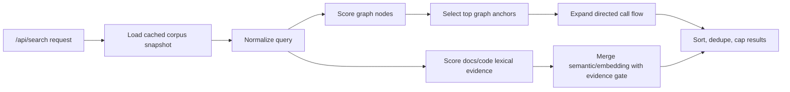

# Cải Thiện Thuật Toán Search Backend Preview

## Meta

- **Status**: implemented
- **Description**: Thiết kế hiện tại và phần còn lại cho ranking/evidence của backend Search tab preview.
- **Compliance**: current-state
- **Links**: [Trang search preview](./add-preview-search-page.md), [Directed Code Graph Search](./improve-code-graph-call-flow-readability.md), [Preview web](../../features/preview-web.md), [Module preview](../../modules/preview.md)

## Bối Cảnh

Search page của preview hiện trả bốn panel: Docs Semantic, Docs Graph, Code Semantic và Code Graph. Backend chính nằm trong `internal/preview/preview_search.go`, đọc docs project, scan code files, tùy chọn embedding index và graphify graph rồi trả `/api/search`.

Thiết kế hiện tại tách Docs/Code tab, giữ Code Graph là directed graph, lọc Code Graph theo Git-tracked callable nodes, dùng keyword evidence gate cho Code Semantic, và chọn direct Code Graph matches ổn định trước khi mở rộng call flow. Phần còn lại của kế hoạch tập trung vào cache corpus search và dọn helper graph anchor cũ.

## Động Lực Thiết Kế

Search backend cần giữ ba invariant:

- Code result phải có evidence người dùng nhìn thấy được trong title, path, symbol hoặc content.
- Code Graph phải chọn direct matches ổn định trước khi mở rộng call flow.
- Graphify source paths phải được normalize về project-relative path trước khi so với `git ls-files`.

Phần ranking/evidence hiện đã bám các invariant này. Hai hướng còn lại là tối ưu hiệu năng bằng search corpus snapshot và dọn các helper semantic-anchor graph search không còn nằm trên đường search chính.

Backend search nên tiếp tục giữ rõ ba lớp trách nhiệm:

1. Thu thập corpus ổn định.
2. Match và score query theo evidence có thể giải thích.
3. Expand graph context sau khi đã chọn anchors tốt nhất.

Khi ba lớp này bị trộn vào nhau, kết quả dễ đúng trên test nhỏ nhưng mất ổn định hoặc kém liên quan trên repo thật.

## Trạng Thái Kỹ Thuật

### Đã xử lý: Code Graph expansion không phụ thuộc thứ tự map

`searchCodeGraphByQuery` thu direct matches vào `codeGraphCandidate`, tính score/evidence theo field, sort theo score, exactness, title, path và node id, rồi mới mở rộng từng anchor qua directed `calls`.

Mỗi anchor dùng một map kết quả cục bộ trước khi merge vào kết quả global, nên một anchor đến sớm không chiếm toàn bộ expansion budget của anchors khác.

### Đã xử lý: Code Semantic dùng chung keyword evidence gate

Embedding code hits và fallback local đều đi qua `codeKeywordEvidence`. Semantic/fuzzy score chỉ được dùng để boost sau khi file đã có evidence nhìn thấy được trong title, path, symbol hoặc content.

Rule này chỉ áp dụng cứng cho Code Semantic; Docs Semantic vẫn rộng hơn để phục vụ khám phá nội dung tài liệu.

### Đã cải thiện: Scoring code search phân biệt field evidence

Code search dùng `searchFieldEvidence` cho code files và Code Graph nodes. Score phân biệt:

- exact symbol match,
- exact path segment match,
- exact phrase trong title/path,
- token match trong content,
- content token match.

Fuzzy/stem-like semantic score không còn đủ để tạo Code Semantic result nếu thiếu evidence lexical.

### Đã cải thiện: Symbol extraction bao phủ nhiều declaration hơn

`codeSymbols` nhận thêm exported const/function, class/interface/enum/struct, TypeScript/Vue-style method shorthand, Kotlin `fun`, Go receiver functions và Java/C#-style methods.

Control-flow keywords như `if`, `for`, `while`, `switch`, `catch` không được coi là symbols.

### Đã xử lý: Git/path normalization của graphify

Code Graph normalize `source_file` từ graphify trước khi so với `git ls-files`, nên các path dạng `./tracked.go` vẫn match tracked file `tracked.go`.

### Còn lại: Search request đang rebuild/reload nhiều

Một `/api/search` hiện gọi `ps.load`, `loadGraphifyGraph`, scan docs, scan code và `gitTrackedFiles` trong nhiều helper. Với project lớn, search-as-you-type dễ chậm và tạo latency không đều.

### Còn lại: Dead path semantic-anchor graph search còn nằm trong backend

Các helper `searchDocsGraphFromSemantic`, `searchGraphifyFromSemantic`, `expandDocsGraphAnchor` và `expandGraphifyAnchor` không còn được gọi trên đường search chính. Docs hiện nói graph search trực tiếp bằng query. Giữ dead path làm tăng nhiễu khi bảo trì search.

## Mục Tiêu

- Kết quả search phải ổn định giữa các lần chạy cùng input.
- Code Semantic chỉ hiển thị file có keyword evidence rõ ràng, kể cả khi dùng fallback local.
- Code Graph chọn anchors theo score trước rồi mới expand call flow.
- Scoring code phân biệt symbol/path/content và giải thích được `matchedBy`.
- Search backend có thể giảm số lần scan filesystem/git/graphify trên mỗi request khi thêm snapshot cache.
- Test coverage có regression guard cho các lỗi trên.

## Ngoài Phạm Vi

- Không thay schema public lớn của `/api/search` nếu UI chưa cần.
- Không đổi graphify CLI hoặc format `graphify-out/graph.json`.
- Không làm fuzzy search engine đầy đủ kiểu trigram/index database trong bước đầu.
- Không thay frontend layout ngoài việc dùng thêm metadata backend nếu cần.

## Cấu Trúc Giải Pháp

## Hướng Tiếp Cận Đề Xuất

### 1. Tách match và expansion trong Code Graph

- Tạo danh sách `codeGraphCandidate` gồm node, score, title/path evidence và owner label.
- Sort candidates theo score, exactness, title, path, node id.
- Chỉ expand top candidates theo budget rõ ràng.
- Mỗi anchor có budget expansion riêng nhỏ, sau đó merge global và sort lại.
- Direct match luôn có priority cao hơn caller/callee expansion cùng score.

### 2. Chuẩn hóa evidence gate cho Code Semantic

- Tạo helper dùng chung kiểu `codeKeywordEvidence`.
- Evidence hợp lệ gồm exact query part, token trong title/path/symbol hoặc token trong content.
- Với hybrid fallback, nếu `keywordScore == 0` nhưng chỉ fuzzy semantic match thì không đưa vào Code Semantic; có thể giữ fuzzy làm boost phụ sau khi đã có evidence.
- Giữ Docs Semantic thoáng hơn Code Semantic vì docs search có mục tiêu khám phá nội dung rộng hơn.

### 3. Cải thiện field-aware scoring

- Tách score thành `searchEvidenceScore` có các field: exact title, exact path segment, exact symbol, token title/path, token symbol, token content, fuzzy token.
- Trả `matchedBy` chi tiết hơn nếu cần, ví dụ `keyword-title`, `keyword-symbol`, `keyword-content`, nhưng vẫn giữ `keyword` để tương thích UI.
- Giảm weight của content-only match khi title/path/symbol không có evidence.
- Với multi-keyword `sum`, cộng evidence từng keyword nhưng tránh một file content dài thắng symbol exact match.

### 4. Mở rộng symbol extraction cho code files

- Thêm patterns tối thiểu cho Kotlin `fun`, Java/C#/Swift method declarations, TypeScript method shorthand, exported const/function, Vue `<script setup>` functions.
- Tái sử dụng graphify callable nodes để enrich code doc symbols khi graphify có sẵn và source file tracked bởi Git.

### 5. Làm corpus snapshot nhẹ cho preview server

- Thêm cache trong `previewServer` cho search corpus theo token gồm docs newest mod token, graphify file mod token và git index token.
- Trong snapshot, giữ Git tracked files, docs search docs, code search docs và graphify graph đã load.
- Invalidate khi token đổi; request search tiếp theo rebuild snapshot.

### 6. Dọn dead graph anchor path

- Xóa hoặc tách rõ các helper semantic-anchor graph search không còn được gọi.
- Nếu muốn giữ lại cho experiment, đặt sau build tag/test-only hoặc ghi chú rõ chưa dùng.

## Công Việc Cần Làm

1. [x] Thêm regression tests cho Code Graph deterministic anchor selection khi nhiều nodes match cùng query.
2. [x] Thêm regression tests cho Code Semantic fallback không trả file thiếu keyword evidence.
3. [x] Thêm tests cho `./relative` graphify source path vẫn match Git tracked file.
4. [x] Refactor `searchCodeGraphByQuery` theo candidate list rồi expand.
5. [x] Tạo helper evidence/scoring dùng chung cho Code Semantic và embedding filter.
6. [x] Mở rộng `codeSymbols` theo các ngôn ngữ đang có trong allowlist.
7. [ ] Thêm search corpus snapshot cache trong `previewServer`.
8. [ ] Dọn dead semantic-anchor graph helpers nếu không còn dùng.
9. [x] Cập nhật docs current-state sau khi triển khai.

## Rủi Ro Và Ràng Buộc

- Caching cần tránh stale result khi user sửa file trong preview hot reload; dùng token theo filesystem/git thay vì cache vĩnh viễn.
- Evidence gate quá chặt có thể làm mất semantic discovery trong Code Semantic; nên áp dụng cho code trước, không áp dụng cứng cho docs.
- Refactor scoring có thể đổi thứ tự tests cũ; tests nên assert invariant quan trọng thay vì vị trí quá chi tiết.
- Graphify edges có thể chứa inferred call sai; ranking cần giữ direct match nổi bật hơn expansion.

## Kiểm Chứng

- `go test ./internal/preview -run 'PreviewSearch|CodeGraph'`
- `go test ./internal/preview -run TestPreviewCodeGraphExpandsCallFlowAndSkipsFileOnlyNodes -count=20`
- Thêm test mới chạy nhiều lần hoặc seed nhiều candidates để bắt nondeterminism.
- Với project thật, gọi `/api/search?q=onboarding` và xác nhận Code Semantic/Code Graph không trả file thiếu keyword evidence.
- Nếu chạm frontend hoặc embedded assets, chạy `npm run check:preview`, `npm run lint:preview` và `npm run build:preview` theo quy ước hiện có.
