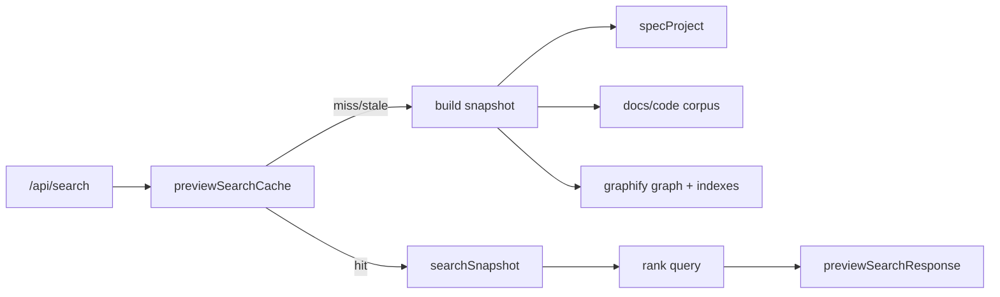

# Cải Thiện Tốc Độ Preview Search

> Ghi chú 2026-05-27: phần Code Graph/Graphify trong kế hoạch này là bối cảnh lịch sử. Thiết kế hiện tại thay Code Graph bằng LSP runtime trong [Thay Code Graph Graphify Bằng LSP](./lsp-code-graph-search.md); các ý tưởng cache còn lại chỉ áp dụng cho docs/code semantic search và embedding index.

## Bối Cảnh

Preview Search hiện phục vụ cả Search tab trong `preview` và Search standalone của lệnh `search`. Backend chính nằm trong `internal/preview/preview_search.go`; entry HTTP là `handleSearch()`, sau đó gọi `ps.load()`, `loadGraphifyGraph()` và `buildPreviewSearchResponse()`.

Theo docs hiện tại, Search trả bốn panel: Docs Semantic, Docs Graph, Code Semantic và Code Graph. Docs Semantic đã mở rộng sang toàn bộ file Markdown/HTML trong repo; Code Semantic scan file code tracked bởi Git; Code Graph dùng `graphify-out/graph.json` nếu có. Graphify report của repo cũng chỉ ra `buildPreviewSearchResponse()` là node trung tâm của cụm search.

Đo nhanh trên `ns-workspace` cho thấy mỗi query khoảng 220-260ms. Đo trên project lớn hơn `example-project` cho thấy mỗi query khoảng 4.3-4.8s. Corpus của `example-project` có khoảng 4.9k tracked files, 3.6k code-like files, 584 Markdown/HTML tracked files, và `graphify-out/graph.json` khoảng 41MB với 27k nodes/53k links.

## Nguyên Nhân Và Lý Do Thiết Kế

Triệu chứng là mỗi lần gõ search có thể mất vài giây, đặc biệt ở project có nhiều file hoặc graphify lớn.

Nguyên nhân trực tiếp:

- `handleSearch()` gọi `ps.load()` cho mỗi request, khiến docs root được scan và parse lại.
- `loadGraphifyGraph()` đọc và unmarshal toàn bộ `graphify-out/graph.json` cho mỗi request.
- `scanDocsSearchDocs()` và `scanCodeSearchDocs()` gọi `git ls-files`, `stat`, `readFile`, UTF-8 check và build corpus lại cho mỗi query.
- `searchCodeSemantic()` tính `codeSymbols()` lại trên từng file cho từng query.
- `searchCodeGraph()` gọi `newGraphifyIndex()` và duyệt graphify nodes/links theo query thay vì tái dùng index đã dựng sẵn.
- Frontend debounce hiện là 180ms, thấp hơn nhiều so với thời gian backend ở repo lớn, nên người dùng gõ liên tục có thể tạo nhiều request nặng. Abort ở frontend hủy response phía client nhưng backend vẫn đã bắt đầu làm việc.
- Nếu embedding được cấu hình, `loadOrBuildPreviewEmbeddingIndex()` vẫn dựng chunks từ toàn corpus và có thể ghi cache metadata mỗi lần, làm đường nóng càng nặng.

Nguyên nhân gốc rễ là Search đang được thiết kế như pipeline stateless theo request: mỗi query tự dựng lại mọi dữ liệu đầu vào, thay vì tách “chuẩn bị corpus/index” khỏi “rank theo query”. Khi corpus nhỏ thì đơn giản này chấp nhận được; khi corpus và graphify lớn thì chi phí I/O, JSON parse và indexing lặp lại lấn át scoring.

Động lực thiết kế mới là biến preview server thành nơi giữ cache đọc-only theo project snapshot. Query nên chỉ làm phần thật sự phụ thuộc vào query: tokenize, score, sort, limit và render response.

## Góc Nhìn Tổng Quan Và Phạm Vi Tập Trung

Phạm vi tập trung:

- Backend `internal/preview`: cache project/docs/search corpus/graphify/index trong đời sống server.
- API `/api/search`: giữ contract response hiện tại, giảm latency.
- Frontend `SearchPanel.vue`: giảm số request thừa và tránh render graph không cần thiết.
- Tests: thêm regression/performance guard cho cache và graphify large path.

Ngoài phạm vi:

- Không đổi định dạng response `/api/search`.
- Không đổi thuật toán ranking lớn nếu không cần để giảm latency.
- Không thay thế Graphology/Sigma hoặc graphify format.
- Không xây persistent search daemon ngoài preview server.

## Mục Tiêu

- Query lặp lại trên project lớn không còn đọc/unmarshal graphify 41MB mỗi lần.
- Docs/code corpus không còn `git ls-files` và đọc lại toàn bộ file ở mỗi query.
- Search vẫn phản ánh thay đổi file trong local dev bằng invalidation dựa trên token/mtime hợp lý.
- Frontend không gửi request mới quá dày khi backend đang bận.
- Có số đo trước/sau và test chứng minh cache được tái dùng.

Mục tiêu thực tế đề xuất:

- Project nhỏ như `ns-workspace`: giữ dưới 250ms/query hoặc tốt hơn.
- Project lớn như `example-project`: giảm từ 4.3-4.8s/query xuống dưới 800ms cho query nóng sau lần warm-up.
- Lần query đầu hoặc sau invalidation có thể chậm hơn nhưng cần được báo/giữ ổn định.

## Logic Nghiệp Vụ

Search vẫn gồm bốn panel như hiện tại:

- Docs Semantic: Markdown/HTML toàn repo, tracked-only khi có Git.
- Docs Graph: docs graph và graphify doc nodes.
- Code Semantic: source code previewable, bỏ Markdown/HTML và docs root.
- Code Graph: callable graphify code nodes tracked bởi Git.

Thay đổi đề xuất không thay semantic contract mà chỉ thay lifecycle dữ liệu:

- Corpus và graphify được load theo project snapshot.
- Query chỉ dùng snapshot đã chuẩn bị.
- Khi docs/code/graphify thay đổi, snapshot bị invalidated và build lại ở request kế tiếp hoặc nền.

## Cấu Trúc Giải Pháp



## Hướng Tiếp Cận Đề Xuất

### 1. Tạo search snapshot trong `previewServer`

Thêm cache vào `previewServer`, ví dụ:

```go
type previewServer struct {
  opt previewOptions
  srv *http.Server
  searchMu sync.RWMutex
  searchCache previewSearchCache
}
```

Snapshot nên chứa:

- `specProject`
- `graphifyGraph`
- `docsSearchDoc[]`
- `codeSearchDoc[]`
- `graphifyIndex` cho docs và code nếu có thể reuse
- token/mtime để invalidation
- warnings cố định theo snapshot

`handleSearch()` sẽ lấy snapshot qua helper như `ps.searchSnapshot()`, rồi gọi hàm rank query không làm I/O nặng.

### 2. Dùng token invalidation rõ ràng

Token nên phản ánh các nguồn search:

- docs root newest/count hiện có.
- `git ls-files` output hash hoặc mtime fallback khi không Git.
- newest/count cho tracked Markdown/HTML và code corpus, hoặc tổng hợp size/mtime khi build corpus.
- `graphify-out/graph.json` size/mtime.
- config embedding nếu dùng semantic embedding.

Không cần perfect real-time cho mọi file ở mọi request nếu chi phí token còn quá cao. Có thể dùng TTL ngắn kết hợp mtime của nguồn lớn:

- `graphify-out/graph.json`: stat file là đủ.
- Git tracked set: cache `git ls-files` với TTL hoặc refresh khi snapshot rebuild.
- File content: dùng token từ mtime/size trong lúc scan corpus, không walk toàn repo chỉ để hỏi token nếu điều đó gần bằng build lại.

### 3. Tách build corpus khỏi query scoring

Đưa các bước hiện trong `scanDocsSearchDocs()` và `scanCodeSearchDocs()` vào snapshot builder. Khi build corpus:

- Đọc tracked files một lần.
- Lưu `Content`, `Title`, `Path`.
- Tính trước `Headings` cho docs và `Symbols` cho code để query không gọi lại `headingsFromMarkdown()` hoặc `codeSymbols()` trên từng file.
- Có thể thêm normalized/lowercase fields phục vụ keyword scoring.

Sau đó đổi `docsSearchDoc` và `codeSearchDoc` để chứa metadata đã tính sẵn, hoặc tạo struct index riêng để không phá contract cũ quá nhiều.

### 4. Cache graphify parse và index

`loadGraphifyGraph()` nên chỉ chạy khi `graphify-out/graph.json` thay đổi. Ngoài graph raw, snapshot nên giữ:

- `graphifyGraph`
- docs `graphifyIndex`
- code `graphifyIndex`
- danh sách candidate code graph callable nodes đã filter tracked/file-only/class container.

`searchCodeGraph()` hiện gọi `newGraphifyIndex()` mỗi query và duyệt nodes để tính evidence. Có thể giữ index/candidate list trong snapshot rồi query chỉ score candidates.

### 5. Giảm request và render thừa ở frontend

Frontend nên:

- Tăng debounce từ 180ms lên khoảng 350-500ms, hoặc dùng adaptive debounce khi request trước còn chạy.
- Không gọi `scheduleSearch()` hai lần khi đổi keyword operator.
- Chỉ render graph panel đang active; hiện logic đã làm phần này, cần giữ.
- Hiển thị trạng thái “indexing/loading corpus” nếu backend đang build snapshot lần đầu.

### 6. Embedding cache không ghi mỗi query

Nếu embedding được bật:

- Chỉ gọi `loadOrBuildPreviewEmbeddingIndex()` khi snapshot/corpus hash thay đổi.
- Không cập nhật `IndexedAt` và ghi file nếu không có chunk mới hoặc embedding mới.
- Tách warning “embedding unavailable” khỏi đường nóng để không resolve config mỗi query nếu project không dùng embedding.

## Chi Tiết Triển Khai

### Backend

1. Thêm `previewSearchSnapshot` và `previewSearchCache` trong package `preview`.
2. Thêm method `func (ps *previewServer) searchSnapshot() (previewSearchSnapshot, error)`.
3. Dời `ps.load()`, `loadGraphifyGraph()`, `scanDocsSearchDocs()`, `scanCodeSearchDocs()`, embedding chunk build vào snapshot builder.
4. Tách `buildPreviewSearchResponse()` thành hai phần:
   - phần nhận snapshot đã chuẩn bị,
   - phần scoring query.
5. Refactor `searchDocsSemantic()` và `searchCodeSemantic()` để dùng headings/symbols đã precompute.
6. Refactor `searchDocsGraph()` và `searchCodeGraph()` để reuse graphify indexes/candidates.
7. Đảm bảo cache thread-safe với `sync.RWMutex`; chỉ một goroutine build snapshot khi stale.
8. Khi docs directory thiếu, vẫn build snapshot code/graphify như behavior hiện tại.

### Frontend

1. Xóa duplicate `scheduleSearch()` trong watcher `keywordOperator`.
2. Tăng debounce hoặc thêm adaptive debounce.
3. Nếu backend thêm field warning/status nhẹ như “indexing”, render trong summary. Nếu không đổi API, chỉ giữ loading hiện tại.

### Tests Và Benchmark

Thêm hoặc cập nhật tests:

- Search cache không gọi graphify loader/read file nhiều lần khi token không đổi.
- Graphify large test cho query nóng chạy trong budget thấp hơn.
- Corpus scanner repo-wide Markdown/HTML vẫn đúng sau cache.
- Invalidation khi graphify mtime/size đổi.
- Invalidation khi docs file đổi.
- Embedding index không ghi lại nếu không có chunk thay đổi.

Thêm benchmark hoặc test helper:

- Benchmark `buildPreviewSearchResponse`/snapshot query với fixture có nhiều code docs.
- Benchmark graphify large path bằng graph in-memory 20k+ nodes hoặc synthetic fixture nhỏ nhưng đủ bắt regression indexing.

## Công Việc Cần Làm

- Thiết kế struct snapshot/cache và token invalidation.
- Refactor `handleSearch()` để dùng snapshot.
- Precompute docs headings/code symbols/lowercase searchable text.
- Cache `git ls-files` result trong snapshot.
- Cache graphify graph/index/candidates.
- Tối ưu embedding index lifecycle.
- Cập nhật frontend debounce và duplicate scheduling.
- Cập nhật docs `docs/features/preview-web.md` và `docs/modules/preview.md` sau khi behavior/cache shipped.
- Chạy validation và benchmark trước/sau trên `ns-workspace` và `example-project`.

## Rủi Ro Và Ràng Buộc

- Cache có thể làm kết quả stale nếu invalidation quá yếu. Cần ưu tiên đúng hơn nhanh ở các nguồn user hay sửa: docs/code files và graphify file.
- Token invalidation nếu walk toàn repo mỗi request sẽ triệt tiêu lợi ích. Cần tránh biến “check stale” thành full scan.
- Giữ graphify 41MB parsed trong memory sẽ tăng RAM, nhưng hợp lý hơn parse lại mỗi query. Cần theo dõi memory cho project rất lớn.
- Nếu nhiều request đến cùng lúc lúc cache cold, cần tránh stampede bằng lock hoặc single-flight đơn giản.
- Embedding config có network probe; không nên chạy probe mỗi query khi chưa bật embedding rõ ràng.

## Kiểm Chứng

- Đo trước/sau bằng local server:
  - `go run . preview --no-reload --project .`
  - `curl /api/search?q=search`
  - `go run . preview --no-reload --project ~/path/to/project`
  - `curl /api/search?q=search`, `preview`, `graph`, `auth`, `class`
- Kỳ vọng:
  - `ns-workspace`: query nóng không tệ hơn hiện tại.
  - `example-project`: query nóng giảm từ khoảng 4.3-4.8s xuống dưới 800ms.
- Chạy:
  - `go test ./internal/preview`
  - `go test ./...`
  - `npm run check:preview`
  - `npm run lint:preview`
  - `npm run lint:docs`
- Nếu frontend đổi:
  - `npm run build:preview`
  - `npm run format:preview:check`
