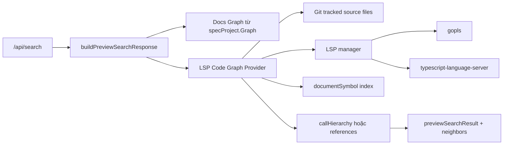

# Thay Code Graph Graphify Bằng LSP

## Meta

- **Status**: implemented
- **Description**: Kế hoạch thay Code Graph Search đang dựa vào `graphify-out/graph.json` bằng graph được truy vấn từ LSP, tham khảo hướng Code Intelligence của `knowns-dev/knowns`.
- **Compliance**: planning
- **Links**: [Chỉ mục](../../_index.md), [Kiến trúc tổng quan](../../architecture/overview.md), [Preview web](../../features/preview-web.md), [Module preview](../../modules/preview.md), [Cải thiện tốc độ preview search](./improve-preview-search-performance.md)

## Bối Cảnh

Trạng thái hiện tại: kế hoạch này đã được áp dụng ở backend preview, preset agent mặc định và docs user-facing. Code Graph hiện dùng LSP provider runtime thay vì đọc `graphify-out/graph.json`. Preview/Search HTTP vẫn fail-open khi thiếu language server, còn CLI có flow setup explicit qua `lsp list/install` và `graph --ensure-lsp`.

Preview/Search hiện có bốn panel: Docs Semantic, Docs Graph, Code Semantic và Code Graph. Docs Graph dùng graph tài liệu được scan từ `docs/_index.md`, metadata và relationship map. Code Graph lại dùng file local `graphify-out/graph.json` nếu file này tồn tại, sau đó filter node callable, file tracked bởi Git, caller/callee và neighbor trước khi trả về contract `/api/search`.

Yêu cầu mới là tham khảo `knowns-dev/knowns` và áp dụng cách search graph bằng LSP thay cho Graphify cho dự án này. Điểm đáng học từ `knowns` là Code Intelligence không còn nằm trong semantic search hay artifact graph sinh sẵn, mà đi qua lifecycle LSP: detect language server theo file dự án, start server theo nhu cầu, mở file bằng `textDocument/didOpen`, lấy `textDocument/documentSymbol`, `textDocument/definition`, `textDocument/references`, diagnostics và thao tác code an toàn qua một manager fail-open. Hướng này phù hợp với `ns-workspace` vì Code Graph nên phản ánh source hiện tại của project mà không bắt user phải sinh `graphify-out`.

Docs hiện tại đang synced ở commit cũ hơn HEAD, nên các mô tả về Graphify trong `docs/features/preview-web.md`, `docs/modules/preview.md`, `README.md` và `DEVELOPER.md` cần được xem là bối cảnh hiện hành nhưng sẽ phải cập nhật sau khi behavior mới được ship.

## Nguyên Nhân Và Lý Do Thiết Kế

Triệu chứng hiện tại:

- Project không có `graphify-out/graph.json` thì Code Graph rỗng, dù Code Semantic vẫn đọc được source code.
- Project có Graphify thì chất lượng graph phụ thuộc vào artifact ngoài vòng đời preview, có thể stale so với source hiện tại.
- Preset agent đang cài `graphify` skill và PreToolUse hook ép đọc `graphify-out/GRAPH_REPORT.md`, làm workflow khám phá code bị neo vào một tool ngoài.
- Plan performance hiện có chỉ cache Graphify, nhưng không giải quyết ràng buộc gốc là cần artifact graph sinh trước.

Nguyên nhân trực tiếp là `internal/preview/preview_search.go` trộn Code Graph với các type `graphifyGraph`, `graphifyNode`, `graphifyIndex` và `loadGraphifyGraph()`. `handleSearch()` đọc/unmarshal Graphify mỗi request rồi `searchCodeGraph()` score node và expand call flow từ các cạnh `calls`.

Nguyên nhân gốc rễ là Code Graph đang dùng mô hình artifact-first thay vì code-intelligence-first. Graphify là snapshot tách khỏi runtime, còn preview server mới là nơi có project root, Git tracked set, source files và lifecycle search. LSP đưa source of truth về language server của project, giảm cảnh stale và góp Code Graph vào workflow mà developer đã có sẵn: `gopls`, `typescript-language-server`, và các server tương đương.

## Góc Nhìn Tổng Quan Và Phạm Vi Tập Trung

Phạm vi tập trung:

- Backend `internal/preview`: thêm LSP manager/client, symbol index và Code Graph builder.
- API `/api/search`: giữ shape response hiện tại để frontend SearchPanel/Graph renderer không phải đổi lớn.
- CLI `preview` và `graph`: Code Graph mới dùng chung backend LSP khi server đang chạy.
- Presets/docs/tests: loại bỏ dependency Graphify khỏi runtime, agent hook, registry skill và mô tả user-facing.

Ngoài phạm vi:

- Không xây MCP code editing tool như `knowns`; chỉ lấy phần LSP cần cho search graph.
- Không auto-install LSP server trong HTTP `/api/search`, `preview` hoặc `search` UI. Nếu binary thiếu, các bề mặt này fail-open và trả warning có command cài đặt; CLI setup explicit nằm ở `lsp install` và `graph --ensure-lsp`.
- Không thay thế Docs Graph bằng LSP. Docs Graph vẫn là typed docs graph của repo.
- Không viết persistent daemon ngoài preview server.
- Không giữ tương thích bắt buộc với `graphify-out/graph.json` nếu mục tiêu đã là thay Graphify. Nếu cần giai đoạn migration, chỉ để fallback tạm thời và có ngày gỡ bỏ rõ ràng.

## Mục Tiêu

- Code Graph Search chạy được trên source code tracked bởi Git mà không cần `graphify-out/graph.json`.
- Kết quả Code Graph vẫn có `nodeId`, `title`, `path`, `line`, `neighbors`, `matchedBy`, `flowRole`, `anchor` và `confidence` để UI render graph hiện tại.
- Query trực tiếp theo symbol name, file path hoặc owner label vẫn trả node match trước, sau đó mở rộng caller/callee nếu LSP support.
- Missing LSP server không làm `/api/search` lỗi; response có warning kèm command `lsp install <language>` hoặc `graph --ensure-lsp`.
- Preset agent không còn cài hoặc nhắc Graphify như source of truth bắt buộc.

## Logic Nghiệp Vụ

Code Graph mới nên có hai lớp:

1. Symbol index từ `textDocument/documentSymbol`:
   - Quét file code tracked bởi Git, bỏ qua docs root, dependency/cache/generated folder và file quá lớn.
   - Detect language theo extension và server có sẵn trên PATH.
   - Flatten document symbols thành node có path, range, selection range, owner/container và kind.
   - Chỉ function/method/constructor trở thành result node mặc định. Class/interface/struct/module là container để tạo owner label, không thành node riêng trong Code Graph, giống behavior Graphify hiện tại.

2. Relation expansion từ LSP:
   - Ưu tiên `textDocument/prepareCallHierarchy` + `callHierarchy/incomingCalls` + `callHierarchy/outgoingCalls` để tạo cạnh caller/callee có hướng.
   - Fallback sang `textDocument/references` khi call hierarchy không có. References được map về containing callable symbol trong file từ symbol index để tìm direct callers; nếu không map được thì bỏ qua cạnh đó.
   - Nếu cả call hierarchy và references đều không có, vẫn trả direct symbol matches và warning "Code Graph relation expansion is unavailable for this language server."

Kết quả query giữ semantic hiện tại:

- Direct match: `matchedBy=["graph"]`, `flowRole="match"`.
- Caller: `matchedBy` có `graph-caller` hoặc `graph-root-caller`, `flowRole="caller"` hoặc `root-caller`.
- Callee: `matchedBy` có `graph-callee`, `flowRole="callee"`.
- Neighbor cần có `sourceId`, `targetId`, `direction`, `relation`, `path`, `line` để details panel chọn node đúng.

## Cấu Trúc Giải Pháp



## Hướng Tiếp Cận Đề Xuất

### 1. Thêm LSP core nhỏ, có ranh giới riêng

Tạo package hoặc file nhóm riêng trong `internal/preview`, ưu tiên `internal/preview/lsp/` để tách khỏi search scoring. Có thể tham khảo cấu trúc của `knowns/internal/lsp` nhưng không copy nguyên khối:

- `Registry` map language/extensions sang command: Go `gopls serve`, TypeScript/JavaScript `typescript-language-server --stdio`. Resolver kiểm tra `PATH`, Go bin dirs (`GOBIN`, `GOPATH/bin`, `~/go/bin`) và local `node_modules/.bin` để không phụ thuộc vào PATH của shell tương tác.
- `Detector` chỉ scan tracked source files trong project và check binary bằng `exec.LookPath`.
- `Manager` giữ server theo language, lazy start khi Code Graph cần, stop khi preview server shutdown.
- `Server` xử lý JSON-RPC stdio, `initialize`, `initialized`, `shutdown`, `didOpen`, `didClose`, `DocumentSymbols`, `References`, `Definition` và call hierarchy.
- URI, UTF-16 position và `DocumentSymbol` parsing phải đúng LSP spec; cần support cả hierarchical `DocumentSymbol[]` và flat `SymbolInformation[]` vì `gopls` có thể trả format phẳng.

Nếu muốn giảm blast radius cho vòng đầu, chỉ implement read-only methods. Rename/edit/diagnostics như `knowns` để ngoài scope.

### 2. Gắn LSP lifecycle vào `previewServer`

Mở rộng `previewServer`:

```go
type previewServer struct {
  opt previewOptions
  srv *http.Server
  lspMu sync.Mutex
  lspManager *previewLSPManager
  codeGraphCache previewLSPCodeGraphCache
}
```

`shutdown()` cần stop LSP servers trước/sau HTTP shutdown. `handleSearch()` lấy provider từ server thay vì gọi loader stateless. Nếu docs root lỗi, Code Semantic và LSP Code Graph vẫn được build từ project root như behavior search without docs hiện tại.

### 3. Thay Graphify Code Graph bằng `lspCodeGraph`

Thêm các type mới:

- `lspCodeGraph`: nodes, edges, file symbol index, warnings.
- `lspCodeNode`: id, name, fullName, kind, language, path, line, range, selectionRange, owner.
- `lspCodeEdge`: source, target, relation, direction, fromRanges/toRanges.
- `lspCodeGraphCandidate`: tương đương `codeGraphCandidate` nhưng không phụ thuộc `graphifyNode`.

`searchCodeGraph()` nên nhận provider hoặc snapshot LSP thay vì `graphifyGraph`. Flow mới:

1. Build/reuse symbol index theo token tracked files + size/mtime.
2. Score candidate bằng `searchFieldEvidence(query, tokens, title, path, symbols, content)`.
3. Sort direct candidates giống hiện tại: score, exactness, title, path, id.
4. Với từng anchor tốt nhất, gọi relation expansion query-specific.
5. Merge/dedupe result bằng `nodeId`.

ID node nên ổn định trong một file, ví dụ:

```text
lsp:go:internal/preview/preview_search.go:buildPreviewSearchResponse:268:5
```

Path/line là contract preview, ID chỉ cần stable để graph UI merge node đúng trong response.

### 4. Giữ Docs Graph tách khỏi Graphify

`searchDocsGraph()` nên chỉ search `specProject.Graph`. Phần `searchGraphifyNodes(..., docs=true)` có thể bị gỡ bỏ, vì docs graph của repo đã có source chính thức từ docs metadata/links/relationship map. Nếu muốn giữ docs graphify fallback, cần đặt sau feature flag, nhưng không nên là đường mặc định của yêu cầu này.

### 5. Cập nhật presets và docs để hết ràng buộc Graphify

Sau khi backend mới có test:

- Gỡ bỏ `graphify` entry khỏi `presets/registry/skills.json` nếu không còn cần cài mặc định.
- Thay PreToolUse hook trong `presets/settings/settings.json`. Lựa chọn đề xuất là xóa hook Graphify thay vì tạo hook mới, vì LSP search là runtime của preview/search, không nên ép mọi Bash/Grep phải đọc artifact nào.
- Cập nhật `presets/skills/update-docs/SKILL.md` để bỏ bước refresh `graphify update .`; nếu cần hướng dẫn mới, nội dung nên là chạy preview/graph search hoặc validation docs thay vì refresh artifact.
- Cập nhật `README.md`, `DEVELOPER.md`, `docs/features/preview-web.md`, `docs/modules/preview.md`, `docs/architecture/overview.md` và các plan cũ có nhắc Graphify để phân biệt "kế hoạch cũ" với thiết kế mới.
- Cập nhật tests `main_test.go` và `internal/agentsync/agentsync_test.go` đang assert Graphify hook/file.

## Chi Tiết Triển Khai

### Backend LSP

- Thêm fakeable interfaces để test không phụ thuộc binary thật:
  - `type codeGraphProvider interface { Search(ctx, query, tokens, exclusionQuery string, exclusionTokens []string, limit int) ([]previewSearchResult, []string) }`
  - `type lspServer interface { DocumentSymbols(...); PrepareCallHierarchy(...); IncomingCalls(...); OutgoingCalls(...); References(...) }`
- Dùng context timeout ngắn cho LSP request, vì `/api/search` không được treo vô hạn khi language server index chậm.
- Cache symbol index theo token file, nhưng relation expansion có thể query on demand. Token nên dựa vào Git tracked set + size/mtime của source files được support.
- Nếu server đang index, có thể trả warning "Code Graph is warming up" và direct symbol results từ file đã có, thay vì fail cả request.

### Search Refactor

- Đổi `buildPreviewSearchResponse()` để không nhận `graphifyGraph`; thay bằng một `codeGraphProvider` hoặc prebuilt `lspCodeGraph`.
- Đổi warning khi docs missing từ "searching code and graphify data only" thành "searching code and LSP code graph only".
- Xóa hoặc tách các helper Graphify sau khi tests đã qua: `loadGraphifyGraph`, `newGraphifyIndex`, `graphifyNodeTitle`, owner label heuristics, graphify docs search.
- Giữ các helper scoring và flow chung: `searchFieldEvidence`, `sortCodeGraphCandidates`, `codeGraphFlowMatchedBy`, `codeGraphFlowRole`, `mergeGraphResult`, `limitNeighbors`.

### Frontend

Không cần đổi lớn nếu API giữ contract. Chỉ cần cân nhắc:

- Label/warning không hiện "graphify".
- `confidence` có thể là `lsp`, `lsp-call-hierarchy`, `lsp-references` thay vì `graphify`.
- Nếu UI đang ẩn confidence `"graphify"` riêng, cập nhật để ẩn hoặc hiện các confidence mới theo ý đồ thiết kế.

### Tests

Cần thay nhóm test Graphify bằng fake LSP:

- Fake server trả document symbols cho Go files và call hierarchy incoming/outgoing.
- Code Graph direct query không cần Code Semantic.
- Code Graph chỉ dùng Git tracked files, bỏ qua untracked.
- Missing LSP server trả warning và Code Graph rỗng, `/api/search` vẫn 200.
- Call hierarchy fallback sang references tạo caller edge đúng containing symbol.
- Class/container symbols chỉ dùng làm owner label, không thành result node.
- Direct matches sort deterministic.
- `previewServer.shutdown()` stop fake/real LSP manager.

Có thể thêm một integration test skip nếu thiếu `gopls`:

- Tạo temp Go module, chạy preview search query trên function, kỳ vọng Code Graph có direct symbol. Test này skip an toàn khi `gopls` không có trong PATH.

## Công Việc Cần Làm

1. Tạo LSP read-only client/manager trong `internal/preview`.
2. Thêm LSP code graph provider và cache symbol index theo tracked source token.
3. Refactor `/api/search` để Code Graph dùng provider mới, Docs Graph dùng spec graph thuần.
4. Gỡ bỏ đường đọc/unmarshal `graphify-out/graph.json` khỏi runtime preview search.
5. Cập nhật fake/unit tests cho Code Graph LSP và xóa fixture Graphify trong tests liên quan.
6. Cập nhật preset registry/settings/update-docs skill để không cài hoặc ép Graphify.
7. Cập nhật README, DEVELOPER và docs shipped về behavior LSP Code Graph.
8. Cập nhật generated preview assets nếu frontend source thay đổi.

## Rủi Ro Và Ràng Buộc

- LSP server khác nhau về support call hierarchy. `gopls` và TypeScript server có khả năng phù hợp, nhưng server khác có thể chỉ trả symbols/references.
- Cold start LSP có thể chậm hơn đọc graph JSON ở query đầu. Cần timeout, cache và warning rõ để UX không treo.
- `textDocument/references` không tương đương call graph đầy đủ; fallback references chỉ nên coi là relation context, không hứa đầy đủ caller/callee như call hierarchy.
- Mapping UTF-16 range sang line/column và containing symbol cần cẩn thận, đặc biệt với Unicode trong source.
- Vue files có thể cần adapter riêng (`vue-language-server`/Volar) nếu muốn Code Graph phủ frontend `.vue`; vòng đầu có thể để `.vue` ở Code Semantic nếu chưa có server ổn định.
- Xóa Graphify khỏi presets có thể ảnh hưởng user đang dùng skill graphify riêng. Nếu cần giai đoạn chuyển tiếp, nên để skill này opt-in thay vì default.

## Kiểm Chứng

Chạy tối thiểu:

```sh
go test ./internal/preview
go test ./...
```

Nếu frontend source hoặc docs format đổi:

```sh
npm run check:preview
npm run lint:preview
npm run build:preview
npm run lint:docs
```

Kiểm thử thủ công:

- `go run . preview --no-reload --project . --open`, search `buildPreviewSearchResponse`, kỳ vọng Code Graph có symbol từ LSP mà không cần `graphify-out/graph.json`.
- Tạm thời đổi tên `graphify-out/` nếu có, search vẫn có Code Graph khi LSP binary sẵn sàng.
- `go run . search --project . --out /tmp/ns-workspace-search.html --no-open`, mở Search standalone và xác nhận Code Graph giống preview.
- Tạo project thiếu `gopls`/`typescript-language-server` trong PATH mô phỏng, `/api/search` trả 200 với warning thay vì lỗi.

## Tiêu Chí Chấp Nhận

- Code Graph không còn phụ thuộc vào file `graphify-out/graph.json` để có kết quả.
- `/api/search` giữ backward-compatible response shape cho frontend.
- Missing LSP server được báo warning, không làm Search/Preview fail.
- Tests cũ về Graphify được thay bằng tests LSP tương đương.
- Presets mặc định không còn cài/nhắc Graphify như bước bắt buộc khi search code graph.
