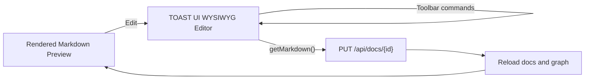

# Markdown Preview Editable

## Meta

- **Status**: implemented
- **Description**: Kế hoạch thay raw Markdown textarea editor bằng chế độ sửa trực tiếp trên Markdown preview bằng WYSIWYG Markdown editor.
- **Compliance**: current-state
- **Links**: [Preview web](../../features/preview-web.md), [Module preview](../../modules/preview.md), [Edit Markdown trong preview](./add-markdown-editing-preview.md), [Quy ước frontend preview](../../development/conventions/preview-frontend.md), [Chỉ mục](../../_index.md)

## Bối Cảnh

Preview web hiện đã có flow edit Markdown nhưng editor đang là textarea raw Markdown. Người dùng muốn đổi hướng: không edit raw Markdown, mà làm phần Markdown preview trở thành editable. Nói cách khác, khi nhấn Edit, nội dung vẫn nên có cảm giác là preview/rendered document, nhưng người dùng có thể click vào nội dung, sửa rich text, dùng toolbar phù hợp Markdown và Save để lưu lại Markdown.

Backend `PUT /api/docs/{id}` hiện đã đủ gần với nhu cầu mới: nhận raw Markdown, validate Markdown document trong docs root, ghi file atomically và trả lại `specDocument` đã scan lại. Phần cần đổi chủ yếu nằm ở frontend: thay textarea/state command tự viết bằng một WYSIWYG Markdown editor có khả năng import Markdown và export Markdown.

## Nghiên Cứu Công Cụ

### TOAST UI Editor

TOAST UI Editor là lựa chọn phù hợp nhất cho trạng thái hiện tại của preview app.

- Có package `@toast-ui/editor` dạng Plain JavaScript component, không bắt buộc React/Vue.
- Có CDN jsDelivr cho `@toast-ui/editor` version `3.2.2`.
- Mô tả chính thức là GFM Markdown WYSIWYG editor, hỗ trợ Markdown mode và WYSIWYG mode, có thể switch mode.
- Hỗ trợ CommonMark + GFM, toolbar, table, copy/paste, dark theme và plugin cơ bản.
- API có thể lấy Markdown từ editor bằng `getMarkdown()`, phù hợp backend hiện nhận raw Markdown.

Nguồn đã kiểm tra:

- [TOAST UI Editor GitHub](https://github.com/nhn/tui.editor)
- [TOAST UI Editor latest docs](https://nhn.github.io/tui.editor/latest/)
- [jsDelivr package page](https://www.jsdelivr.com/package/npm/%40toast-ui/editor)

### Milkdown

Milkdown là WYSIWYG Markdown editor framework hiện đại, plugin-driven, headless và xây trên ProseMirror/Remark. Nó hợp nếu muốn editor preview rất tùy biến, slash menu, custom block cho Mermaid/LikeC4 hoặc integration sâu về sau. Điểm bất lợi trong repo hiện tại là cần nhiều setup và theme/CSS hơn, có khả năng phải đổi frontend từ CDN script đơn giản sang dependency/bundling nghiêm túc hơn.

Nguồn đã kiểm tra:

- [Milkdown docs](https://milkdown.dev/docs)

### Tiptap Markdown

Tiptap có Markdown extension bidirectional, parse Markdown sang document model và serialize ngược lại Markdown. Tuy nhiên docs hiện ghi extension Markdown còn beta và có edge cases. Tiptap mạnh cho rich text framework dài hạn, nhưng không phải lựa chọn nhẹ nhất cho preview app không dùng framework.

Nguồn đã kiểm tra:

- [Tiptap Markdown docs](https://tiptap.dev/docs/editor/markdown)
- [Tiptap Markdown Editor API](https://tiptap.dev/docs/editor/markdown/api/editor)

### EasyMDE/SimpleMDE Và CodeMirror

Các editor dòng này thiên về raw Markdown + preview/split view hơn là chỉnh trực tiếp trên rendered preview. Vì yêu cầu mới là không edit raw Markdown, nhóm này không nên chọn cho implementation chính.

## Quyết Định Đề Xuất

Chọn TOAST UI Editor cho bước triển khai tiếp theo.

Lý do chính: preview app hiện là TypeScript thuần, static HTML, CDN runtime và Go embed assets. TOAST UI Editor có đường tích hợp ngắn nhất: thêm CSS CDN, load ESM bundle từ CDN trong app module, khởi tạo editor vào `#specContent`, đặt `initialEditType: "wysiwyg"`, ẩn mode switch để tránh quay lại raw Markdown, dùng `getMarkdown()` khi Save và giữ backend save API hiện có.

Milkdown/Tiptap nên giữ làm hướng nâng cấp sau nếu cần editor custom block sâu cho Mermaid/LikeC4 editable hoặc muốn kiểm soát schema ProseMirror tốt hơn.

## Mục Tiêu

- Khi nhấn Edit, nội dung Markdown trong Doc tab chuyển thành editor WYSIWYG, không textarea raw Markdown.
- Editor hiển thị nội dung theo dạng preview editable: paragraph, heading, list, quote, table, code block và link được thao tác trực tiếp.
- Metadata của frontmatter hoặc section `## Meta` được render thành panel editable riêng để người dùng sửa như form, không phải sửa raw Markdown.
- Toolbar floating top center vẫn tồn tại nhưng điều khiển command của editor thay vì chèn Markdown string vào textarea.
- Nút Save floating bottom center lưu Markdown output từ editor.
- Backend save API hiện có được giữ lại.
- Sau Save, Doc tab trở về rendered preview hiện tại, Mermaid/LikeC4/highlight vẫn render bằng pipeline preview hiện có.

## Ngoài Phạm Vi

- Không xây editor framework custom từ ProseMirror.
- Không bắt editor WYSIWYG phải render Mermaid/LikeC4 live giống preview pipeline trong lúc đang edit. Code fence Mermaid/LikeC4 có thể hiển thị như code block trong editor; render diagram đầy đủ sau Save hoặc Cancel về preview.
- Không cho người dùng chuyển sang Markdown source mode trong editor.
- Không sửa Preview modal sang editable.

## Logic Nghiệp Vụ

Chỉ Markdown documents trong docs root được edit. Khi `Edit`:

1. Destroy diagram instances đang nằm trong `#specContent`.
2. Tách metadata nếu raw Markdown có frontmatter hoặc section `## Meta` dạng bullet; giữ metadata dạng bảng trong body để TOAST UI table editor xử lý.
3. Render metadata đã tách thành panel editable riêng phía trên editor.
4. Mount TOAST UI Editor vào vùng nội dung body.
5. Set initial content từ Markdown body sau khi bỏ metadata.
6. Bật WYSIWYG mode và ẩn mode switch.
7. Lắng nghe `change` từ editor và input từ metadata panel để đánh dấu dirty.

Khi `Save`:

1. Lấy Markdown body bằng editor API.
2. Serialize metadata panel về đúng dạng frontmatter hoặc section `## Meta`.
3. Ghép metadata + body thành raw Markdown.
4. Gửi `PUT /api/docs/{id}` với `{ raw }`.
5. Destroy editor instance.
6. Reload project/docs/graph như flow hiện tại.
7. Render lại preview bằng `renderSpecDocumentContent()`.

Khi `Cancel`:

1. Nếu dirty thì confirm bỏ thay đổi.
2. Destroy editor instance.
3. Render lại Markdown preview từ `state.currentSpec.raw`.

Hot reload vẫn phải guard khi editor đang mounted. Nếu có SSE change trong lúc edit, không reload data đè editor state; chỉ set `markdownExternalChange` và hiển thị cảnh báo.

## Cấu Trúc Giải Pháp



## Chi Tiết Frontend

### HTML/CSS Runtime

Thêm vào `internal/preview/preview_ui/index.html` và frontend module:

- TOAST UI Editor CSS từ CDN.
- TOAST UI Editor ESM bundle được load động từ CDN trong `preview_ui_src/app.ts`.
- Không thêm React/Vue wrapper.

`types.d.ts` cần khai báo constructor/editor instance tối thiểu để TypeScript build sạch.

### State

Thay state/logic textarea bằng editor instance:

- `markdownEditor: ToastMarkdownEditor | null`
- `markdownMetadata: EditableMarkdownMetadata | null`
- `markdownEditorReady: boolean`
- `markdownSaveState`
- `markdownSaveError`
- `markdownExternalChange`

`markdownDraft` không còn là nguồn thao tác chính. Dirty state dựa vào editor `change` event và so sánh `getMarkdown()` với `state.currentSpec.raw` khi cần.

### Mount/Unmount

Thay `renderMarkdownEditor()` hiện tại bằng:

- `mountMarkdownPreviewEditor()`
- `destroyMarkdownPreviewEditor()`
- `markdownEditorMarkdown()`

Editor host nên dùng `div`, không dùng `textarea`. Class có thể đổi từ `markdown-editor-input` sang `markdown-wysiwyg-host`.

### Toolbar

Toolbar top center giữ icon hiện tại, nhưng `applyMarkdownCommand()` đổi sang command bridge:

| UI Command     | TOAST UI command dự kiến                                               |
| -------------- | ---------------------------------------------------------------------- |
| Heading        | `exec("heading", { level: 2 })` hoặc toolbar item native               |
| Bold           | `exec("bold")`                                                         |
| Italic         | `exec("italic")`                                                       |
| Link           | native link command/dialog hoặc fallback `exec("link")` nếu API hỗ trợ |
| Unordered list | `exec("ul")`                                                           |
| Ordered list   | `exec("ol")`                                                           |
| Quote          | `exec("blockQuote")`                                                   |
| Inline code    | `exec("code")` nếu hỗ trợ                                              |
| Code block     | `exec("codeBlock")` nếu hỗ trợ                                         |
| Table          | floating button proxy sang toolbar native `table` ẩn của TOAST UI      |

Trong implementation cần kiểm tra tên command thật của TOAST UI Editor v3. Nếu command nào không public/ổn định, ưu tiên dùng toolbar native của editor cho command đó và chỉ giữ custom floating toolbar cho command chắc chắn. Table hiện xuất hiện trên floating toolbar nhưng click vào table item native ẩn của TOAST UI vì command `exec()` cho table không ổn định và có thể làm sai metadata table.

### Styling

Editor cần giống preview:

- Host nằm trong max width `max-w-5xl`.
- Không card lồng card.
- Padding top/bottom giữ floating toolbar không che nội dung.
- Dark theme dùng TOAST UI dark theme nếu khả dụng hoặc CSS override tối thiểu để đọc được.
- Text trong editor không được bị toolbar/bottom actions che.

## Backend

Không cần đổi contract backend chính. Có thể giữ:

```http
PUT /api/docs/{id}
Content-Type: application/json

{ "raw": "..." }
```

Nếu editor tạo Markdown lớn hơn limit hiện tại, giữ limit backend để bảo vệ preview server và báo lỗi rõ trong UI.

## Tests Và Validation

Tests cần cập nhật từ “textarea raw editor” sang “WYSIWYG preview editor”:

- UI string test không còn tìm `markdown-editor-input` hoặc textarea behavior.
- Test HTML có TOAST UI Editor CSS/JS CDN.
- Test TypeScript có `mountMarkdownPreviewEditor`, `destroyMarkdownPreviewEditor`, `getMarkdown`, ESM loader cho `@toast-ui/editor`, `initialEditType: "wysiwyg"` và `hideModeSwitch: true`.
- Test không còn dùng helper raw-string selection như `replaceSelectedLines`, `wrapMarkdownSelection`, `replaceMarkdownSelection`.
- Backend tests hiện có cho `PUT /api/docs/{id}` vẫn giữ.

Validation:

```bash
npm run check:preview
npm run lint:preview
npm run build:preview
npm run format:preview:check
go test ./...
```

Manual QA sau khi duyệt triển khai:

- Mở preview local.
- Chọn một Markdown doc.
- Nhấn Edit và xác nhận không thấy textarea/raw Markdown.
- Sửa heading/paragraph/list/table trong preview editable.
- Save, reload trang và xác nhận file Markdown đã lưu.
- Kiểm tra Mermaid/LikeC4 vẫn render sau khi Save.

## Rủi Ro Và Ràng Buộc

- TOAST UI Editor có release mới nhất `3.2.2` từ 2023, không quá mới nhưng ổn định và phù hợp CDN/plain JS. Nếu cần ecosystem active hơn, Milkdown/Tiptap là hướng sau.
- WYSIWYG editor có thể serialize Markdown khác format ban đầu, ví dụ normalize table/list spacing. Đây là tradeoff cần chấp nhận khi không edit raw.
- Mermaid/LikeC4 custom fences có thể không preview live trong editor. Giữ chúng như code block trong edit mode là an toàn nhất.
- TOAST UI command names cần verify trực tiếp khi implement; không hardcode quá nhiều command nếu API không public.
- Existing raw Markdown toggle nên vẫn là read-only toggle, không phải edit source mode.

## Tiêu Chí Chấp Nhận

- [x] Nhấn Edit không hiển thị textarea raw Markdown.
- [x] Markdown preview trở thành vùng WYSIWYG editable.
- [x] Metadata được render thành panel editable riêng và serialize lại khi Save.
- [x] Floating top toolbar thao tác trên editor hoặc nhường command không chắc chắn cho toolbar native của editor.
- [x] Save lấy Markdown từ editor và dùng backend `PUT /api/docs/{id}` hiện có.
- [x] Cancel hủy editor và quay về preview rendered hiện tại.
- [x] Hot reload không ghi đè nội dung khi editor đang mở.
- [x] Tests/build/lint/format/go test đều xanh.
