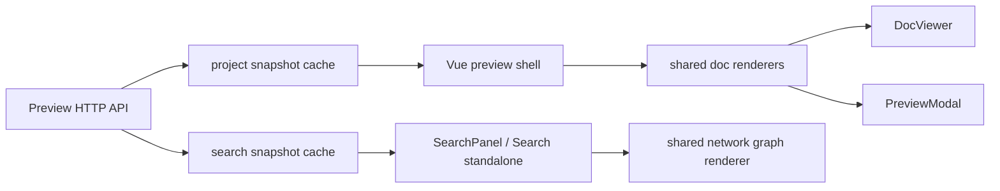

# Tối Ưu Và Rút Gọn Preview Web

## Meta

- **Status**: implemented
- **Description**: Kế hoạch rà soát, tối ưu và rút gọn toàn bộ preview web, bao gồm frontend Vue, renderer tài liệu, search/graph, cache backend và test guard.
- **Compliance**: current-state
- **Links**: [Chỉ mục](../../_index.md), [Preview web](../../features/preview-web.md), [Module preview](../../modules/preview.md), [Quy ước frontend preview](../../development/conventions/preview-frontend.md), [Cải thiện tốc độ Preview Search](./improve-preview-search-performance.md)

## Bối Cảnh

> Ghi chú triển khai 2026-06-03: kế hoạch này đã được thực thi theo phạm vi tối ưu an toàn gồm gỡ legacy frontend source, dùng shared renderer modules cho Doc view/modal, lazy-load Graph API, thêm project/search snapshot backend, bỏ generated preview UI khỏi search corpus, cập nhật tests/build assets và sync docs. Các ý tưởng tách composable sâu hơn hoặc tách riêng `SearchPanel` component được giữ lại như hướng cleanup tương lai nếu cần.

Preview web hiện là bề mặt đọc knowledge base của `ns-workspace`, gồm Doc view, folder route, Graph view, Search tab, Search standalone, preview modal, Markdown/HTML rendering, Mermaid/LikeC4 diagram, LSP Code Graph và hot reload. Docs hiện hành mô tả preview là read-only, source frontend chính nằm trong `internal/preview/preview_ui_src/`, generated assets nằm trong `internal/preview/preview_ui/`, và sau khi sửa UI phải chạy build để đồng bộ static assets.

Rà soát hiện trạng cho thấy preview đang có nhiều lớp chức năng tích tụ:

- `internal/preview/preview_ui_src/app.ts` dài hơn 3.500 dòng, chứa shell vanilla TypeScript cũ, không được import bởi `main.ts`, `search-main.ts`, `index.html`, `search.html` hoặc `vite.config.ts`, nhưng vẫn được nhiều test đọc trực tiếp.
- `internal/preview/preview_ui_src/js/graph.ts` chỉ còn được import từ `app.ts`, trong khi Vue shell thật đang dùng `GraphViewer.vue` và `network_graph.ts`.
- `DocViewer.vue`, `PreviewModal.vue` và `app.ts` có nhiều logic render Markdown/HTML/metadata gần giống nhau nhưng không cùng mức hỗ trợ. Docs mô tả HTML preview hỗ trợ `doc-section`, `doc-grid`, `doc-card`, `doc-steps`, `doc-flow`, `doc-metrics` và nhiều class nội dung, nhưng Vue `DocViewer.vue` và `PreviewModal.vue` hiện chỉ whitelist/normalize một tập nhỏ.
- `/api/project`, `/api/docs`, `/api/docs/{id}`, `/api/graph` và `/api/search` đều gọi `ps.load()` riêng, nên scan docs/graph có thể lặp lại trên nhiều request trong cùng một phiên preview.
- `buildPreviewSearchResponse()` vẫn scan docs/code corpus và resolve embedding search trong đường nóng của mỗi query. Plan cũ về search performance đã nêu hướng snapshot/cache, nhưng chưa bao phủ việc rút gọn toàn bộ preview web.
- Code Semantic/Docs Semantic có thể trả kết quả từ generated preview assets như `internal/preview/preview_ui/assets/...` hoặc generated `preview_ui/*.html`, làm nhiễu kết quả khi review chính source preview.

## Nguyên Nhân Và Lý Do Thiết Kế

Triệu chứng chính không chỉ là preview nhiều code, mà là nhiều nguồn sự thật cùng tồn tại:

- UI thực tế đã chuyển sang Vue, nhưng legacy `app.ts` vẫn giữ logic cũ và test vẫn dựa vào nó.
- Renderer tài liệu được copy từng phần giữa Doc view, modal preview và legacy shell, làm contract trong docs dễ lệch khỏi behavior thật.
- Backend API đang giữ cách scan stateless theo request, phù hợp lúc nhỏ nhưng khiến preview/search tốn I/O khi repo lớn hoặc người dùng nhập search liên tục.
- Test đang kiểm tra bằng chuỗi rải rác trong file legacy/generate thay vì contract người dùng nhìn thấy hoặc module source thật, nên có thể “pass” dù Vue shell thiếu hành vi đã mô tả.

Nguyên nhân gốc rễ là preview đã phát triển theo từng mảng tính năng riêng lẻ: Search standalone, LSP Code Graph, Vue migration, HTML custom tags và diagram rendering đều được thêm vào sau, nhưng chưa có một boundary chung cho renderer, route state, search snapshot và test contract.

Động lực thiết kế mới là biến preview thành một hệ nhỏ có nguồn sự thật rõ ràng:

- Vue source là UI source of truth.
- Renderer tài liệu nằm trong shared modules, được Doc view và modal dùng chung.
- Backend giữ project/search snapshot đọc-only theo token thay đổi.
- Search corpus bỏ generated artifacts và dead source.
- Test bám vào module thật và behavior, không bám vào fossil source.

## Góc Nhìn Tổng Quan Và Phạm Vi Tập Trung

Phạm vi tập trung:

- Frontend Vue trong `internal/preview/preview_ui_src/`.
- Static generated assets trong `internal/preview/preview_ui/` chỉ sau khi build.
- Backend preview/search trong `internal/preview`.
- Test preview liên quan UI source, search corpus và cache.
- Docs preview/module sau khi behavior thật được sửa.

Ngoài phạm vi:

- Không thay đổi contract lớn của `/api/search` hoặc bốn panel hiện tại.
- Không thay thế Sigma/Graphology, TOAST UI Viewer, Mermaid hoặc svg-pan-zoom.
- Không thêm framework test frontend mới nếu static/source tests đủ chặn regression trong bước đầu.
- Không thay đổi LSP installer/cache trong `internal/graphquery`, trừ khi cần điều chỉnh filter preview source cho search.

## Mục Tiêu

- Xóa hoặc retire hoàn toàn legacy `app.ts` và `js/graph.ts` nếu xác nhận không nằm trên đường build.
- Đưa Markdown/HTML metadata, HTML custom tag normalization, MVP.css scoping, code preview và diagram lifecycle vào helper shared để Doc view và modal dùng cùng logic.
- Giữ HTML preview đúng contract đã ghi trong docs, hoặc giảm contract trong docs nếu quyết định rút gọn tính năng.
- Giảm scan lặp bằng project snapshot cho các API đọc docs/graph và search snapshot cho corpus/search index.
- Loại generated preview assets khỏi Docs/Code Semantic search để kết quả ưu tiên source thật.
- Lazy-load dữ liệu và code nặng: chỉ fetch `/api/graph` khi Graph tab cần, chỉ render graph panel đang active, và cân nhắc dynamic import graph renderer.
- Chuyển test từ kiểm tra chuỗi trong legacy file sang kiểm tra module Vue/shared helper/backend behavior thật.

## Logic Nghiệp Vụ Cần Giữ

- Preview và Search standalone vẫn read-only.
- Doc tab không có editor, không có raw toggle; raw chỉ nằm trong preview modal.
- Markdown vẫn render client-side bằng TOAST UI Viewer và sanitize sau render.
- HTML docs vẫn sanitize trước khi normalize custom tags.
- Mermaid, Mermaid C4 và LikeC4 model vẫn render client-side, có pan/zoom, và dark theme giữ tương phản cạnh/label.
- Search vẫn có Docs Semantic, Docs Graph, Code Semantic và Code Graph; keyword operator vẫn là `sum` hoặc `difference`.
- Search HTTP không tự cài LSP; CLI `graph --query` mới tự ensure LSP theo mặc định.

## Hướng Tiếp Cận Đề Xuất

### 1. Chốt source of truth frontend

Trước tiên xác nhận bằng `rg` và Vite input rằng `app.ts` không được import. Sau đó:

- Xóa `internal/preview/preview_ui_src/app.ts` nếu thật sự dead.
- Xóa hoặc nhập lại `internal/preview/preview_ui_src/js/graph.ts`; nếu chỉ phục vụ `app.ts`, xóa cùng lúc.
- Cập nhật hot reload source token để không phụ thuộc tên legacy.
- Cập nhật tests đang đọc `app.ts` sang đọc `App.vue`, `SearchStandaloneApp.vue`, `DocViewer.vue`, `PreviewModal.vue`, `SearchPanel.vue`, `GraphViewer.vue`, `js/diagrams.ts`, `js/internal-links.ts` và `js/network_graph.ts`.
- Thêm test âm rằng `app.ts` không tồn tại hoặc ít nhất không xuất hiện trong build/import graph nếu quyết định giữ tạm để migration.

### 2. Tách shared renderer modules

Tạo các module nhỏ trong `preview_ui_src/js/` hoặc `preview_ui_src/rendering/`:

- `metadata.ts`: parse/render metadata rows, link badges, scalar/list cleanup.
- `markdown.ts`: render Markdown viewer, strip frontmatter/`## Meta`, fallback code preview.
- `html-doc.ts`: sanitize config, MVP.css scoped loader, normalize custom tags, normalize relation/code/diagram/metric/card tags.
- `code-preview.ts`: escape HTML, render code preview, decorate line numbers, scroll to target line.
- `preview-source.ts`: chuyển `SpecDocument`/file response thành preview source model nếu cần.

`DocViewer.vue` và `PreviewModal.vue` sẽ chỉ điều phối props/state, còn render content dùng helper chung. Như vậy Doc view và modal không còn lệch HTML feature parity.

### 3. Rút gọn App và Search standalone state

`App.vue` và `SearchStandaloneApp.vue` đang lặp theme, route query, preview open/close và fetch JSON. Nên tách:

- `useThemePreference()`: system/dark/light, localStorage, media query listener.
- `usePreviewSource()`: open doc/file preview, close/toggle raw.
- `useSearchRouteQuery()`: đọc/replace `q` và `keywordOp`.
- `useProjectData()`: fetch `/api/project`, `/api/docs`, lazy fetch `/api/graph`.

Trong bước này cũng nên lazy fetch graph:

- Khi vào `/graph` hoặc click Graph lần đầu mới gọi `/api/graph`.
- Nếu theme đổi, chỉ rerender graph nếu graph đã mount.
- Search standalone không cần load graph/docs graph dữ liệu riêng ngoài API search.

### 4. Chuẩn hóa SearchPanel và graph panels

`SearchPanel.vue` đang tự render nhiều HTML string cho result card, graph details và warning summary. Nên giảm dần:

- Tách `SearchResultList.vue` cho semantic cards.
- Tách `SearchGraphPanel.vue` dùng chung cho Docs Graph và Code Graph.
- Giữ `network_graph.ts` là renderer Sigma duy nhất.
- Tăng debounce hoặc dùng adaptive debounce khi request trước đang chạy, dựa trên plan performance cũ.
- Đảm bảo chỉ graph của domain active được render; khi domain đổi, renderer cũ được kill.

### 5. Thêm project/search snapshot backend

Thêm cache vào `previewServer`:

- `projectSnapshot()` dùng token từ docs root và static/source relevant state để reuse kết quả `scanSpecProject()` cho `/api/project`, `/api/docs`, `/api/docs/{id}`, `/api/graph`.
- `searchSnapshot()` giữ docs search docs, code search docs, precomputed headings/symbols/lowercase fields, embedding config/index nếu có và warning ổn định.
- Search query chỉ tokenize, filter exclusion, score, sort, limit và gọi Code Graph provider đã cache LSP index.

Điều này kế thừa ý tưởng trong `improve-preview-search-performance.md`, nhưng mở rộng sang toàn bộ preview API thay vì chỉ `/api/search`.

### 6. Siết search corpus và generated filters

Đồng bộ filter giữa Code Semantic, Docs Semantic và LSP Code Graph:

- Bỏ `internal/preview/preview_ui/**` khỏi mọi corpus search vì đây là generated embed output.
- Giữ `internal/preview/preview_ui_src/**` vì là source thật, nhưng cân nhắc để `.html` source đi vào Code Semantic hoặc một nhóm source riêng thay vì Docs Semantic nếu kết quả docs bị nhiễu.
- Bỏ legacy `app.ts` khỏi corpus bằng cách xóa file, không chỉ filter.
- Thêm regression test cho query preview/search không trả generated JS bundle hoặc generated HTML.

### 7. Cập nhật test contract

Thay nhóm test string-based lớn bằng các guard rõ hơn:

- Backend:
  - API dùng project cache khi token không đổi.
  - Search corpus bỏ generated preview assets.
  - Search snapshot không đọc lại toàn bộ corpus cho query nóng.
  - Docs/file preview vẫn giữ path-safety và UTF-8/allowlist.
- Frontend source:
  - `DocViewer` và `PreviewModal` import shared renderer.
  - HTML sanitize config có đủ custom tags đã quyết định giữ.
  - Route `/spec`, `/graph`, `/search` vẫn sync query/history.
  - Theme composable dùng `spec-preview-theme` và system preference.
  - Graph/Search renderer cleanup gọi `kill()` khi unmount/domain đổi.
- Generated:
  - `npm run build:preview` tạo `index.html`, `search.html`, hashed assets và không tham chiếu source dead.

## Chi Tiết Triển Khai

### Frontend

1. Kiểm tra import graph với `rg` để xác nhận `app.ts` và `js/graph.ts` không còn entry thật.
2. Tạo shared renderer modules, bắt đầu từ metadata và HTML doc vì đây là nơi lệch behavior rõ nhất.
3. Refactor `DocViewer.vue` sang helper shared.
4. Refactor `PreviewModal.vue` sang helper shared, giữ raw/source toggle và line scroll.
5. Tách theme/preview/query composables để giảm lặp giữa `App.vue` và `SearchStandaloneApp.vue`.
6. Lazy fetch `/api/graph` trong `App.vue` và chỉ mount/render Graph viewer khi tab active hoặc đã có graph data.
7. Tách `SearchGraphPanel.vue` nếu việc refactor `SearchPanel.vue` vẫn giữ được scope an toàn.
8. Xóa `app.ts` và `js/graph.ts`, rồi cập nhật tests tương ứng.
9. Chạy build để cập nhật `internal/preview/preview_ui/`.

### Backend

1. Thêm `previewProjectCache` với mutex và token.
2. Đổi `ps.load()` thành `ps.projectSnapshot()` hoặc giữ `load()` làm wrapper có cache.
3. Dùng snapshot trong `/api/project`, `/api/docs`, `/api/docs/{id}`, `/api/graph`.
4. Thêm `previewSearchSnapshot` chứa docs/code corpus precomputed.
5. Refactor `buildPreviewSearchResponse()` thành phần nhận snapshot và phần scoring query.
6. Precompute `headingsFromMarkdown()` cho docs và `codeSymbols()` cho code.
7. Chỉ resolve embedding config/index khi snapshot/corpus thay đổi.
8. Thêm generated preview UI filter dùng chung cho docs/code semantic.
9. Giữ LSP Code Graph provider hiện tại vì đã có cache index/token riêng.

### Docs

Sau khi implementation được duyệt và hoàn tất:

- Cập nhật [Preview web](../../features/preview-web.md) nếu HTML custom tag contract thay đổi hoặc lazy graph/cache behavior cần ghi nhận.
- Cập nhật [Module preview](../../modules/preview.md) để mô tả project/search snapshot và filter generated artifacts.
- Cập nhật [Quy ước frontend preview](../../development/conventions/preview-frontend.md) để nói rõ Vue/shared renderer là source of truth và legacy `app.ts` đã bị bỏ.
- Cập nhật `_index.md` và `_sync.md` theo quy trình update docs.

## Công Việc Cần Làm

- [x] Xác nhận và gỡ legacy frontend source.
- [x] Tạo shared renderer modules cho metadata, Markdown, HTML doc và code preview.
- [x] Refactor Doc view/modal dùng shared renderer.
- [ ] Rút gọn App/SearchStandalone bằng composables sâu hơn.
- [x] Lazy fetch Graph tab.
- [ ] Tách graph search panels thành component riêng.
- [x] Thêm backend project snapshot cache.
- [x] Thêm backend search snapshot cache và precompute corpus fields.
- [x] Loại generated preview UI khỏi search corpus.
- [x] Cập nhật tests từ fossil string checks sang contract thật.
- [x] Build lại generated assets.
- [x] Cập nhật docs shipped sau khi behavior đã đổi.

## Rủi Ro Và Ràng Buộc

- Xóa `app.ts` sẽ làm nhiều test fail trước khi test được cập nhật; cần làm cùng một nhịp với test migration.
- Shared renderer nếu tách quá rộng ngay từ đầu có thể tạo diff lớn. Nên tách theo thứ tự metadata/HTML trước, rồi Markdown/code preview.
- Cache project/search có rủi ro stale. Token cần ưu tiên đúng cho docs/code files, nhưng không được biến stale check thành full scan nặng mỗi request.
- Lazy graph có thể làm route `/graph?q=...` hiển thị loading lâu hơn lần đầu; cần state loading rõ và không rewrite URL về `/spec`.
- Generated asset hash sẽ đổi sau build; cần review diff để chắc chắn chỉ do build preview.
- HTML custom tags nên được quyết định rõ: hoặc giữ đầy đủ như docs hiện tại, hoặc cắt bớt contract và sửa docs. Không để docs nói một đằng, Vue render một nẻo.

## Kiểm Chứng

Trong bước execution sau khi được duyệt:

- `go test ./internal/preview`
- `go test ./...`
- `npm run check:preview`
- `npm run lint:preview`
- `npm run format:preview:check`
- `npm run build:preview`
- Chạy preview local bằng `go run . preview --no-reload --project . --addr 127.0.0.1:0` và kiểm tra các route `/spec/...`, `/graph?q=preview`, `/search?q=preview`.
- Dùng browser screenshot sau implementation để kiểm tra desktop/mobile: Doc view, HTML doc custom tags, Graph tab, Search Docs/Code tabs, preview modal raw/rendered, dark theme và graph fullscreen.
- Query search như `preview`, `graph`, `DocViewer`, `search` phải không trả generated JS bundle hoặc generated `preview_ui/*.html` trừ khi người dùng tìm trực tiếp generated artifact.

## Tiêu Chí Chấp Nhận

- Không còn dead `app.ts` trên đường source/build/test, hoặc file được giữ tạm phải có lý do rõ và không còn là nơi test chính bám vào.
- Doc view và preview modal render cùng một contract Markdown/HTML.
- Search kết quả sạch hơn, ưu tiên source thật và docs thật thay vì generated embed output.
- Query nóng không scan lại toàn bộ docs/code corpus khi token không đổi.
- Initial preview load không fetch/render Graph nếu người dùng đang ở Doc/Search.
- Test suite phản ánh behavior thật của Vue/backend hiện tại.
- Docs shipped được cập nhật sau implementation để mô tả đúng source of truth mới.
