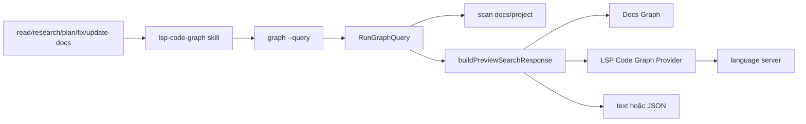

# Đóng Gói LSP Search Graph Thành Command Và Skill

## Bối Cảnh

Preview web hiện đã có Search tab và Search standalone của lệnh `search`. Search UI dùng chung backend trong `internal/preview`: `/api/search` gọi `buildPreviewSearchResponse()`, Docs Graph lấy từ docs graph, còn Code Graph lấy từ `previewLSPCodeGraphProvider`. Provider này index symbol từ language server trên file code tracked bởi Git và mở rộng caller/callee bằng call hierarchy hoặc fallback references khi language server hỗ trợ.

Lệnh `search` giữ trải nghiệm UI: nó sinh HTML launcher, start local API server, mở `search.html`, rồi giữ process sống để frontend gọi API động. Lệnh `graph` giữ workflow command-first cho agent/skill cần truy vấn LSP Code Graph từ terminal, lấy kết quả có cấu trúc rồi tiếp tục inspect file.

Docs `_sync.md` đang ghi synced commit cũ hơn HEAD và worktree hiện chưa có diff tracked trong repo, nên plan này xem docs là bối cảnh cần verify bằng code hiện tại. Code hiện tại xác nhận `graph` đã tồn tại, `newPreviewServer()` đã gắn `newPreviewLSPCodeGraphProvider()`, và tests đã có fake `staticCodeGraphProvider` cho Code Graph search.

## Nguyên Nhân Và Lý Do Thiết Kế

Nguyên nhân trực tiếp là LSP Search Graph đang bị đóng trong hai bề mặt dùng cho web: HTTP API của preview server và UI standalone. Skill không nên phải mở browser hoặc giữ một server sống chỉ để hỏi “symbol này nằm đâu, caller/callee là gì”. Nếu skill fallback sang `rg` ngay, nó mất phần giá trị chính của LSP: symbol-aware search, owner label, caller/callee và references.

Nguyên nhân gốc rễ là repo chưa có contract CLI cho Search Graph. Backend đã có source of truth đúng là `buildPreviewSearchResponse()` và `previewCodeGraphProvider`; thiếu một adapter CLI mỏng biến cùng pipeline đó thành output text/JSON rồi exit. Thiết kế nên tái dùng command `graph` hiện có thay vì tạo command rời, vì tên `graph` đã là entry cho Search/Code Graph và đã có flags `--project`, `--docs-dir`, `--addr`, `--out`, `--no-open`.

## Góc Nhìn Tổng Quan Và Phạm Vi Tập Trung

Phạm vi chính gồm ba lớp:

- CLI `graph`: thêm chế độ query non-interactive để chạy Search Graph từ terminal.
- Skill mới: tạo skill local/preset hướng dẫn agent dùng command này như bước code graph context.
- Skill liên quan: cập nhật `read-search-docs`, `research`, `plan`, `fix`, `update-docs` để gọi skill mới khi cần quan hệ symbol/call/reference.

Ngoài phạm vi của plan này:

- Không viết lại Preview web UI hoặc SearchPanel.
- Không đổi response contract `/api/search` đang phục vụ frontend.
- Không auto-install `gopls`, `typescript-language-server` hoặc language server khác.
- Không tạo daemon persistent ngoài preview server/CLI query.
- Không thay Docs Graph bằng LSP.

## Mục Tiêu

- Agent có thể chạy một command terminal để query Search Graph/LSP Code Graph của project hiện tại mà không mở browser.
- Command dùng cùng search semantics với Preview web: Docs Semantic, Docs Graph, Code Semantic, Code Graph, `keywordOp`, warnings và fail-open khi LSP thiếu.
- Skill mới mô tả workflow ngắn, trigger rõ, output expectations rõ, và fallback khi language server thiếu.
- Các skill liên quan dùng skill mới thay cho hướng dẫn mơ hồ “dùng Preview/Search Code Graph”.

## Logic Nghiệp Vụ

Chế độ query của `graph` nên được kích hoạt khi có `--query`:

```sh
go run . graph --project . --query "buildPreviewSearchResponse" --json
go run github.com/ngosangns/ns-workspace@latest graph --project /path/to/project --query "AuthService.login"
```

Quy tắc:

- `--query` làm command chạy non-interactive: không sinh launcher, không start long-running HTTP server, không mở browser.
- `--project`, `--docs-dir`, `--limit` và `--keyword-op` áp dụng giống `/api/search`.
- `--json` in raw `previewSearchResponse` hoặc wrapper ổn định tương đương rồi exit code `0` nếu search chạy được, kể cả khi có warnings.
- Text output mặc định nên ưu tiên agent-readable: query, warnings, stats, rồi các nhóm Docs Graph và Code Graph trước Code Semantic khi mục tiêu là graph context.
- Missing language server không làm command fail; warnings phải xuất hiện rõ để skill biết fallback sang `rg`/code inspection.
- Lỗi parse flags, project root không hợp lệ, hoặc lỗi IO không phục hồi được vẫn trả error và exit non-zero.

## Cấu Trúc Giải Pháp



## Chi Tiết Triển Khai

### CLI

- Mở rộng `graphOptions` trong `internal/preview/graph.go` với:
  - `query string`
  - `limit int`
  - `keywordOperator string`
  - `jsonOutput bool`
  - có thể thêm `timeout` nếu LSP cold start cần guard rõ.
- Nếu `query` rỗng, giữ nguyên behavior hiện tại của `RunGraph`: launcher + server + browser.
- Nếu `query` không rỗng, gọi một path mới, ví dụ `runGraphQuery(opt)`.
- `runGraphQuery` không cần HTTP server; nó scan project bằng `newPreviewServer(previewOptions{...})` hoặc helper tách riêng, gọi `ps.load()`, dùng `ps.codeGraph`, rồi gọi `buildPreviewSearchResponse(context, project, ps.codeGraph, ...)`.
- Đảm bảo `ps.shutdown(ctx)` hoặc `ps.codeGraph.Close(ctx)` được gọi để stop language server sau query.
- Thêm formatter output:
  - JSON dùng `json.Encoder` với indentation khi cần dễ đọc.
  - Text output giới hạn noise, hiển thị path:line, title, source, confidence, flowRole, neighbors ngắn.

### Tests

- Thêm unit test cho `graph --query --json` bằng fake/static code graph provider hoặc helper output thuần, tránh phụ thuộc real LSP trong test mặc định.
- Thêm test flag behavior:
  - `graph --query needle --json` không gọi launcher writer và không mở browser.
  - `graph --query needle --limit 3 --keyword-op difference` truyền đúng limit/operator.
  - Missing LSP warning vẫn serialize trong output.
- Giữ test launcher hiện có để đảm bảo UI mode không regress.

### Skill Mới

Tạo skill tên đề xuất `lsp-code-graph`:

```text
presets/skills/lsp-code-graph/SKILL.md
$HOME/.agents/skills/lsp-code-graph/SKILL.md
```

Frontmatter nên mô tả trigger:

- Khi cần tìm symbol, entry point, owner/container, caller/callee, references hoặc code graph context.
- Khi thay thế workflow Graph artifact cũ bằng LSP Search Graph.
- Khi user nhắc “code graph”, “LSP graph”, “search graph”, “caller/callee”, “symbol references”.

Body giữ gọn:

1. Chạy command query trước khi search raw files nếu cần code graph context:

   ```sh
   go run github.com/ngosangns/ns-workspace@latest graph --project . --query "<symbol-or-concept>" --json
   ```

2. Nếu đang trong checkout `ns-workspace`, dùng `go run . graph ...`.
3. Đọc warnings; nếu thiếu LSP, nêu fallback và dùng `rg`.
4. Dùng kết quả `codeGraph` cho symbol/caller/callee và `docsGraph` cho docs relationship.
5. Sau đó inspect file path/line liên quan bằng `sed`/`rg`.

Không cần thêm scripts hoặc references nếu `SKILL.md` đủ ngắn.

### Cập Nhật Skill Liên Quan

Cập nhật cả preset trong repo và local skill đang dùng:

- `presets/skills/read-search-docs/SKILL.md`
- `presets/skills/research/SKILL.md`
- `presets/skills/plan/SKILL.md`
- `presets/skills/fix/SKILL.md`
- `presets/skills/update-docs/SKILL.md`
- `$HOME/.agents/skills/...` tương ứng

Các skill này không nên tự mô tả dài về command. Chỉ cần câu định tuyến:

> Khi cần code graph context, dùng skill `lsp-code-graph` trước; nếu command báo thiếu language server hoặc không có kết quả đủ, fallback sang `rg`/code inspection và nói rõ.

Nếu muốn skill mới được cài mặc định vào shared agents home khi chạy `init/update`, thêm folder vào `presets/skills` là đủ vì embed pattern hiện tại lấy `presets/skills/*`. Không cần thêm vào `presets/registry/skills.json` vì đây là skill local do repo ship, không phải registry upstream.

## Công Việc Cần Làm

1. Refactor `internal/preview/graph.go` để lệnh `search` giữ UI launcher mode còn lệnh `graph` chỉ giữ query mode.
2. Thêm flags `--query`, `--limit`, `--keyword-op`, `--json` cho command `graph`.
3. Tạo helper output text/JSON và đảm bảo close LSP provider sau query.
4. Thêm hoặc cập nhật tests trong `internal/preview/preview_test.go`/file test phù hợp cho query mode.
5. Cập nhật `README.md`, `DEVELOPER.md`, `docs/features/preview-web.md`, `docs/modules/preview.md` nếu CLI behavior mới là user-facing.
6. Tạo skill `lsp-code-graph` trong `presets/skills` và local `.agents/skills`.
7. Cập nhật các skill liên quan trong preset và local để route sang skill mới.
8. Cập nhật `docs/_index.md` và `docs/_sync.md` sau khi implementation/docs hoàn tất.

## Rủi Ro Và Ràng Buộc

- Cold start LSP có thể chậm; query mode cần context timeout hoặc reuse timeout hiện có để không treo terminal.
- JSON output nên ổn định vì skill sẽ dựa vào nó. Tránh in log xen vào stdout khi `--json`; warnings thuộc JSON response, còn diagnostic không-JSON nên đi stderr nếu cần.
- `graph --query` dùng cùng `buildPreviewSearchResponse()` nên có thể trả nhiều panel hơn nhu cầu code graph. Đây là điểm tốt cho skill vì nó có cả docs graph lẫn code graph, nhưng text output phải tránh quá dài.
- Nếu language server thiếu, command vẫn exit `0` với warnings để agent không hiểu nhầm là lỗi command; chỉ lỗi không thể scan project/docs mới nên non-zero.
- UI launcher thuộc lệnh `search`; `graph` chỉ nên giữ query mode để tránh lẫn workflow agent với workflow web.

## Kiểm Chứng

- `go test ./internal/preview`
- `go test ./...` nếu thay đổi main/usage hoặc agentsync/presets ảnh hưởng rộng.
- `go run . graph --project . --query buildPreviewSearchResponse --json`
- `go run . graph --project . --query buildPreviewSearchResponse --limit 3`
- `go run . search --project . --out /tmp/ns-workspace-search.html --no-open` để xác nhận launcher mode vẫn hoạt động.
- `rg -n "lsp-code-graph|Preview/Search Code Graph|graph --project" presets/skills $HOME/.agents/skills` để xác nhận các skill route đúng.
