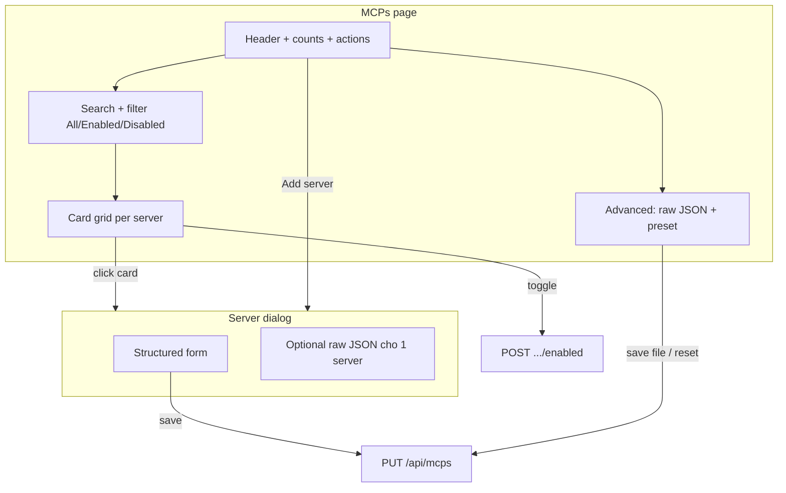
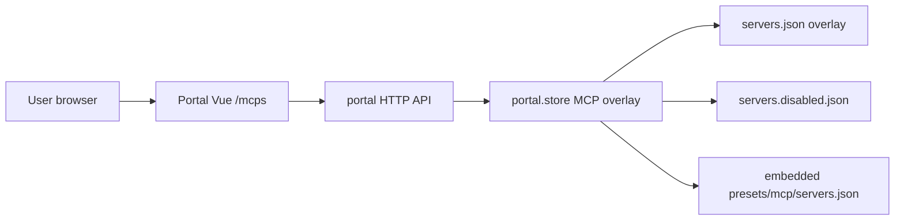

# Thiết Kế Lại UI MCP Servers Trong Portal

## Bối Cảnh

Portal (`internal/portal`) quản lý MCP servers qua:

- **List** toggle enable/disable (move giữa `servers.json` và `servers.disabled.json`)
- **File** editor JSON toàn bộ file enabled
- **Embedded preset** read-only

API hiện tại đã đủ cho list + toggle + save bulk + reset:

| Method | Endpoint | Vai trò |
| ------ | -------- | ------- |
| GET | `/api/mcps` | Manifest: `items[]`, `content`, `overridden` |
| PUT | `/api/mcps` | Ghi enabled overlay (`content` hoặc `mcpServers`) |
| DELETE | `/api/mcps` | Reset overlay |
| POST | `/api/mcps/{name}/enabled` | Bật/tắt từng server |
| GET | `/api/mcps/preset` | Preset embedded |

Trang Skills/Adapters dùng **card grid** + (Skills) **dialog chi tiết**. MCPs vẫn là **list phẳng + raw `JSON.stringify(config)`** — khó đọc, khó thao tác, lệch design system.

## Nguyên Nhân Và Lý Do Thiết Kế

### Triệu chứng

- Mỗi dòng chỉ hiện name + blob JSON truncated → không biết transport (`http` vs `command`/stdio), URL, args.
- Badge **Enabled/Disabled** trùng với checkbox **On/Off**.
- Tab **File (enabled)** / **Embedded preset** lộ chi tiết storage (`servers.disabled.json`) trước khi user cần.
- Không có chỗ xem config đầy đủ của **một** server (phải mở JSON file).
- Không thêm / sửa / xóa server từ UI có cấu trúc — chỉ sửa bulk JSON.
- Empty state và toolbar kém hơn Skills/Adapters.

### Nguyên nhân gốc

UI được làm theo model “JSON editor + thin list”, không model “danh sách resource có schema”. MCP config thực tế có shape tương đối ổn định:

```text
stdio:  { command, args?, env?, ... }
http:   { type: "http" | "sse", url, headers?, ... }
```

Preset hiện tại (`presets/mcp/servers.json`) chỉ gồm hai họ: **HTTP** (`type` + `url`) và **stdio** (`command` + `args`). UI nên phản ánh shape đó, không dump object thô.

## Góc Nhìn Tổng Quan Và Phạm Vi Tập Trung



**Trong phạm vi:** frontend portal (`MCPs.vue`, helpers/components nhỏ nếu cần), cập nhật `docs/features/portal.md` sau khi implement. **Ưu tiên không đổi backend** — save từng server = merge vào map enabled/disabled rồi `PUT` / `POST enabled`.

**Ngoài phạm vi (v1):** API CRUD per-server mới, validate kết nối MCP thật, env secrets vault, drag-reorder, multi-select bulk, redesign Registry (cùng anti-pattern nhưng task riêng).

## Mục Tiêu

1. **Scan nhanh:** nhìn card biết name, loại transport, endpoint/command, trạng thái enabled.
2. **Thao tác chính 1 click:** bật/tắt server.
3. **Chi tiết có cấu trúc:** dialog form (stdio vs HTTP) + fallback raw JSON cho field lạ.
4. **Thêm / sửa / xóa server** không bắt buộc mở editor file.
5. **Power user:** vẫn có advanced raw file + xem preset + reset overlay.
6. **Đồng bộ visual** với Skills/Adapters (grid, surface card, status pill, dialog).

## Ngoài Phạm Vi

- Đổi schema storage (`servers.json` / `servers.disabled.json`).
- Đổi behavior sync materialize MCP.
- Redesign Registry / Adapters (chỉ tái sử dụng pattern).
- Test connection / health check MCP runtime.
- Auth UI hay remote portal.

## Logic Nghiệp Vụ

Giữ nguyên:

- **Disable ≠ xóa:** disable chuyển entry sang `servers.disabled.json`; list luôn hiển thị cả enabled + disabled.
- **Save file** chỉ ghi enabled overlay; disabled không nằm trong file enabled.
- **Reset** xóa overlay (enabled + disabled) về embedded preset.
- **Rename:** coi là xóa name cũ + thêm name mới (hoặc disable+delete flow); v1 cho phép edit name khi create; khi edit existing, name khóa hoặc rename = delete+create trong cùng PUT.

Luồng form save (edit existing, enabled):

1. User sửa form → UI build `config` object.
2. Lấy `mcpServers` hiện tại từ manifest enabled, replace key `name`.
3. `PUT /api/mcps` với `{ mcpServers }` hoặc serialize `content`.
4. Refresh manifest.

Luồng form save (disabled server):

- Chỉ cho edit config khi **enabled**, **hoặc** edit rồi giữ disabled: merge vào `disabledServers` cần API hỗ trợ.  
  **Quyết định v1:** cho phép mở dialog read-only khi disabled; muốn sửa thì bật server trước, hoặc edit raw advanced. (Tránh backend mới.)  
  **Tuỳ chọn v1.1:** nếu user Save khi disabled, frontend gọi enable → PUT config → disable lại (2–3 round-trip; chấp nhận được cho local portal).

Luồng **Add server:**

1. Dialog trống: name + type (stdio | http).
2. Validate name unique (case-sensitive theo key JSON).
3. Merge vào enabled map → PUT.

Luồng **Remove server:**

1. Confirm dialog.
2. Xóa key khỏi cả enabled map (và nếu đang disabled: cần remove khỏi disabled).  
   **Vấn đề:** không có API “delete disabled entry” riêng.  
   **Cách v1:**  
   - Nếu **enabled:** PUT map không còn key đó (entry biến mất hẳn — khác disable).  
   - Nếu **disabled:** cần backend hỗ trợ hoặc workaround.  
   **Đề xuất v1 tối thiểu:** nút Remove chỉ hiện khi **enabled** (xóa khỏi enabled overlay). Disabled: “Enable rồi Remove”, hoặc “Disable = ẩn khỏi sync” là hành động chính; Remove = destructive “xóa hẳn khỏi overlay”.  
   **Backend nhỏ (khuyến nghị nếu Remove full):** `DELETE /api/mcps/{name}` xóa khỏi enabled **và** disabled. Nếu chưa làm, UI chỉ “Remove from enabled” + copy rõ ràng.

**Khuyến nghị plan:** thêm endpoint nhỏ `DELETE /api/mcps/{name}` để xóa hẳn entry (enabled hoặc disabled). Scope backend tối thiểu, tránh hack. Toggle enabled giữ nguyên.

## Cấu Trúc Giải Pháp

### 1. Primary view — Card grid

Layout giống Skills:

- Header: title **MCP Servers**, subtitle đếm `N servers · X enabled · Y disabled` (bớt jargon path).
- Toolbar: **Add server**, **Advanced** (dropdown hoặc secondary buttons: Edit raw JSON, View preset, Reset to preset).
- Search input filter theo name.
- Segmented filter: All | Enabled | Disabled.
- Grid `1 / 2 / 3` cột.

**Card fields:**

| Element | Nguồn |
| ------- | ----- |
| Title | `item.name` (mono hoặc semibold) |
| Transport badge | suy ra: `config.type === "http"\|"sse"` → HTTP/SSE; có `command` → stdio; else Unknown |
| Primary line | HTTP: `url`; stdio: `command` + args join ngắn |
| Meta line (optional) | args count / env keys count |
| Toggle | enable/disable (giữ checkbox hoặc chuyển switch CSS nhỏ — cùng pattern Skills) |
| Status | một pill Enabled/Disabled **hoặc** chỉ dựa vào toggle — **bỏ trùng** (chỉ toggle + visual opacity) |

Click body card → mở dialog chi tiết.

### 2. Server dialog

- Title: name; subtitle: transport + enabled state.
- Mode **View/Edit form**:
  - **stdio:** command (required), args (chip list hoặc textarea 1 arg/line), env (key=value lines).
  - **http/sse:** type select, url (required), headers optional (key=value).
  - **Extra fields:** nếu config có key ngoài schema → section “Additional JSON” merge khi save.
- Actions: Save, Cancel; nếu overridden per-server không có — reset chỉ page-level.
- Tab phụ trong dialog: **Raw** — JSON của đúng 1 server (edit advanced per-entry).

### 3. Advanced panel (thay 3 tab ngang)

Thay segmented **List | File | Preset** bằng:

- Mặc định: list/grid (không tab).
- **Advanced** mở drawer/dialog full-width hoặc panel collapse dưới page:
  - **Enabled file** — CodeEditor + Save + ghi chú disabled file.
  - **Embedded preset** — read-only.
  - **Reset to preset** — danger/warning button khi `overridden`.

Giữ keyboard/power-user path, không chiếm primary chrome.

### 4. Helpers frontend

File mới gợi ý (tùy implement):

- `portal_ui_src/lib/mcpConfig.ts` — `inferTransport`, `summarizeConfig`, `buildConfigFromForm`, `parseArgsLines`.
- Optional `components/McpServerCard.vue`, `McpServerDialog.vue` nếu `MCPs.vue` phình.

### 5. Backend (tối thiểu, optional nhưng nên có)

| Thay đổi | Lý do |
| -------- | ----- |
| `DELETE /api/mcps/{name}` | Xóa hẳn server khỏi enabled + disabled overlay |
| (Không bắt buộc) `PUT /api/mcps/{name}` body config | Save 1 server sạch hơn; có thể trì hoãn nếu merge client đủ |

Tests: `handlers_mcps` / `store` cho delete-by-name.

### 6. Docs

Sau implement: cập nhật `docs/features/portal.md` mục Giao Diện MCPs (card grid, dialog, advanced).

## Mô Hình C4



## Hướng Tiếp Cận Đề Xuất

**Phase A — UI-only (ưu tiên):** rewrite `MCPs.vue` card + dialog form + advanced panel; save qua merge + existing PUT; remove chỉ khi enabled (hoặc disable-first messaging).

**Phase B — Backend nhỏ:** `DELETE /api/mcps/{name}` để remove sạch cả disabled.

**Phase C — Polish:** empty state illustration copy, filter persistence sessionStorage, keyboard focus trap dialog (đã có UiDialog), a11y labels.

Khuyến nghị ship **A + B** trong một PR nếu effort cho phép; nếu cần cắt scope: **A only**.

## Chi Tiết Triển Khai

### Transport inference

```ts
function inferTransport(config: unknown): "http" | "sse" | "stdio" | "unknown" {
  if (!config || typeof config !== "object") return "unknown";
  const c = config as Record<string, unknown>;
  if (c.type === "sse") return "sse";
  if (c.type === "http" || typeof c.url === "string") return "http";
  if (typeof c.command === "string") return "stdio";
  return "unknown";
}
```

### Summary line

- stdio: `npx -y chrome-devtools-mcp@latest` (command + args join, truncate ~72 chars)
- http: full url truncate middle if dài

### Form → config

- Không ghi field rỗng (`args: []` có thể omit).
- Giữ unknown keys từ original config khi edit form (merge), trừ khi user sửa tab Raw.

### Visual tokens

Dùng class hiện có: `surface`, `status-pill`, `page-header`, `fade-in-up`, accent teal. Không invent design system mới.

### File đụng chính

| File | Việc |
| ---- | ---- |
| `internal/portal/portal_ui_src/views/MCPs.vue` | Rewrite layout + state |
| `internal/portal/portal_ui_src/lib/mcpConfig.ts` | (mới) pure helpers + unit nếu có harness JS; không bắt buộc test runner riêng |
| `internal/portal/portal_ui_src/components/McpServerDialog.vue` | (mới, optional extract) |
| `internal/portal/portal_ui_src/api.ts` | Thêm `deleteMCP(name)` nếu Phase B |
| `internal/portal/handlers_mcps.go` + store | Phase B delete |
| `internal/portal/portal_ui/` | `npm run build:portal` embed artifacts |
| `docs/features/portal.md` | Mô tả UI mới |

## Công Việc Cần Làm

1. [ ] Implement helpers `inferTransport` / `summarizeConfig` / form mappers.
2. [ ] Rewrite list → card grid + search + filter + header counts.
3. [ ] Server dialog: form stdio/http + raw tab + save merge PUT.
4. [ ] Add server flow + validation name unique.
5. [ ] Advanced panel: raw enabled file, preset, reset (thay 3-tab bar).
6. [ ] (Khuyến nghị) `DELETE /api/mcps/{name}` + API client + Remove button.
7. [ ] `npm run check:portal` / `lint:portal`; build portal assets.
8. [ ] Cập nhật `docs/features/portal.md`.
9. [ ] Smoke manual: toggle, add, edit, disable, reset, raw save.

## Rủi Ro Và Ràng Buộc

| Rủi ro | Giảm thiểu |
| ------ | ---------- |
| Config MCP vendor có field lạ (timeout, cwd, …) | Form merge unknown keys; luôn có Raw tab |
| PUT ghi đè race khi toggle song song | Disable controls khi `saving`/`toggling`; re-apply manifest response |
| User nhầm Remove với Disable | Copy rõ: Disable = giữ config, không sync; Remove = xóa hẳn |
| JSON file editor và form lệch | Save form luôn reload manifest; raw file là source of truth khi đang mở Advanced |
| Scope creep Registry | Không đụng Registry trong plan này |

## Kiểm Chứng

- [ ] Grid hiển thị đúng 6 server preset (hoặc overlay user) với badge transport + summary.
- [ ] Toggle enable/disable cập nhật pill/opacity và flash message; list không mất entry.
- [ ] Add server stdio + http → xuất hiện enabled, có trong raw file.
- [ ] Edit command/url → save → reload page vẫn đúng.
- [ ] Advanced raw save invalid JSON → error, không corrupt.
- [ ] Reset to preset khi overridden → trở lại embedded.
- [ ] (B) Remove enabled/disabled → entry biến mất cả hai file overlay.
- [ ] Typecheck/lint portal pass; Go tests portal pass nếu có đổi backend.

## Tóm Tắt Cho Review

**Vấn đề:** MCPs page là list + JSON dump, không usable so với Skills.

**Hướng:** Card grid + dialog form (stdio/HTTP) + advanced JSON; API giữ nguyên trừ optional DELETE per name.

**Chờ duyệt** trước khi sửa code.
