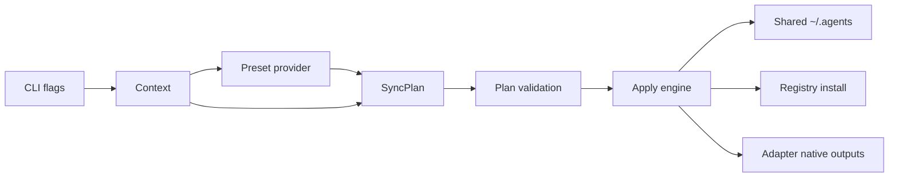

# Tối Ưu Agentsync, Preset Và Cấu Trúc CLI

## Meta

- **Status**: in-progress
- **Description**: Kế hoạch review và tái cấu trúc tính năng `update`, cấu trúc preset và cấu trúc dự án CLI ngoài preview web, với trọng tâm rút gọn, tăng tính đa hình và giữ an toàn khi ghi user-level config.
- **Compliance**: planning
- **Links**: [Chỉ mục](../../_index.md), [Kiến trúc tổng quan](../../architecture/overview.md), [Module agentsync](../../modules/agentsync.md), [Aspect inventory](../../research/aspect-inventory.md), [Thuật ngữ](../../shared/glossary.md)

## Bối Cảnh

`ns-workspace` có hai bề mặt lớn: CLI đồng bộ cấu hình agent và preview/search web. Phạm vi kế hoạch này chỉ xử lý phần CLI đồng bộ cấu hình agent, gồm `init`, `update`, `status`, `doctor`, `registry`, `agents/catalog`, cấu trúc `presets/` và cấu trúc code liên quan tới `internal/agentsync`. Preview web, Search standalone, Graph query và LSP runtime không nằm trong phạm vi triển khai, trừ tác động cấu trúc tối thiểu ở `main.go` nếu cần tách dispatch CLI.

Hiện tại `internal/agentsync/agentsync.go` chứa hầu hết mọi thứ: data model, operation engine, adapter definitions, adapter-specific behavior, registry install, MCP transforms, path helpers, shell quoting, backup/write logic và JSON merge. Code vẫn chạy được và đã có polymorphism qua `AgentAdapter` và `Operation`, nhưng polymorphism bị chôn trong một file lớn và nhiều rule được encode bằng field flags trên `fileAdapter`.

Baseline và mốc triển khai đầu đã kiểm tra:

- `go test ./internal/agentsync` chạy được.
- `go test ./internal/cli` chạy được.
- `go test .` chạy được tại thời điểm review.
- `go run . update --dry-run --no-registry --no-mcp --tools stable` chạy được.
- Code Graph và review code đã xác nhận registry flow đi qua `writeRegistryHelpers`, `installRegistrySkills` và `registryCommand`; mốc triển khai đầu đã chuyển `Manager.Apply` sang `buildPlan` rồi `SyncPlan.Apply`.

## Đánh Giá Hiện Trạng

### Điểm đang tốt

- Public behavior có invariant rõ: `init` không overwrite nếu không `--force`; `update` rewrite managed output và backup trước khi ghi; `--copy` tránh symlink; `--no-mcp` và `--no-registry` tách side effect.
- Có hai abstraction lõi đúng hướng: `AgentAdapter` đại diện cho adapter-specific behavior và `Operation` đại diện cho thao tác materialization.
- Tests đã phủ các case quan trọng: layout stable/manual, stale content bị rewrite, tool selection, `KIRO_HOME`, dry-run không ghi, registry dùng `AGENTS_HOME` đúng.
- Preset content nằm trong `presets/` và được embed, nên binary có source of truth ổn định.

### Vấn đề chính

1. `agentsync.go` là module nguyên khối.
   File này làm quá nhiều việc, khiến thêm một adapter hoặc một artifact mới phải đọc qua cả backup, registry, shell quoting, JSON merge và special cases. Đây là nguyên nhân gốc rễ làm code khó rút gọn và dễ sinh regression.

2. Plan và apply mới tách ở lớp orchestration.
   `Manager.Apply` đã build `SyncPlan` trước khi apply và phase order đã có contract tests. Phần còn lại là tách sâu `ApplyEngine`, write policy và dry-run rendering để mọi write/link/copy/backup bám vào một engine duy nhất.

3. Adapter polymorphism đã tách bước đầu nhưng catalog vẫn nằm trong Go code.
   Adapter phổ thông đã dùng `AdapterSpec`; Claude, OpenCode, Codex và Aider đã dùng plugin behavior nhỏ. Phần còn lại là đưa data catalog sang manifest typed và tách file theo domain để việc thêm adapter mới không cần đọc toàn bộ module.

4. Preset model chưa có manifest trung tâm.
   `presets/` chứa source content, nhưng adapter target paths, support tier, alias, docs URL và transform rule vẫn nằm trong Go code. Preset là source of truth cho content, nhưng chưa là source of truth cho catalog/config model.

5. Registry là một phase đặc biệt nhưng chưa được model hóa như phase.
   Registry helpers được ghi trong core phase, registry install chạy trước adapter fan-out, rồi adapter link/copy skills. Luồng này đúng, nhất là sau khi registry target là `universal`, nhưng contract này chỉ nằm trong code và docs mô tả, chưa có plan object/test đủ rõ.

6. CLI root đang kéo nhiều subsystem vào một binary dispatch.
   `main.go` import cả `internal/preview` và `internal/graphquery`. Về sản phẩm đây là bình thường, nhưng khi review phần agentsync, một lỗi compile ở preview có thể làm các command cùng binary bị ảnh hưởng. Kế hoạch này không sửa preview, nhưng nên tách CLI dispatch để agentsync command test độc lập hơn.

7. Validation còn nghiêng về integration hơn contract.
   Tests hiện kiểm tra output sau apply. Còn thiếu tests cho plan shape, adapter catalog invariants, registry phase order, backup policy và generated helper scripts.

## Nguyên Nhân Gốc Rễ

Thiết kế hiện tại phát triển theo hướng thêm case mới vào một lõi đang chạy được. Ban đầu cách này nhanh và hợp lý: một `fileAdapter` plus vài special adapters đủ để bootstrap nhiều tool. Khi số adapter, preset surface, registry skill và MCP behavior tăng lên, các khái niệm domain thật sự đã xuất hiện nhưng chưa được nâng thành model riêng:

- `SyncPlan`: kế hoạch gồm core phase, registry phase và adapter phase.
- `Artifact`: instruction, skills, subagents, settings, hooks, MCP, managed block, manual guidance.
- `Target`: native path hoặc generated guidance path có template theo home/XDG/env.
- `Renderer/Transformer`: cách chuyển preset shared sang định dạng của adapter.
- `ApplyEngine`: nơi duy nhất xử lý write, link/copy, backup, dry-run và log.

Không có các model này nên nhiều rule quan trọng phải sống trong if/field flags, làm code khó đa hình và khó rút gọn.

## Mục Tiêu

- Rút gọn `internal/agentsync` thành các file/module có boundary rõ, đọc được theo domain.
- Biến `update` thành flow có `SyncPlan` rõ ràng trước khi apply, giúp dry-run, status và tests bám vào cùng một contract.
- Đảm bảo tính đa hình bằng adapter/plugin model thay vì một struct cờ lớn.
- Đưa phần catalog và preset config về manifest typed ở mức hợp lý, không đẩy mọi thứ vào code.
- Giữ public behavior quan trọng của `init`, `update`, `registry`, `status`, `doctor`, `agents/catalog`.
- Chấp nhận thay đổi contract nội bộ mạnh tay nếu làm kiến trúc sạch hơn.

## Ngoài Phạm Vi

- Không refactor preview web, Search standalone, Graph query hoặc LSP runtime.
- Không thay đổi nội dung skill/preset trừ khi cần di chuyển cấu trúc hoặc cập nhật manifest.
- Không xác minh lại tính đúng đắn remote của từng agent vendor URL, trừ những URL đang được test hoặc cần chuyển vào manifest.
- Không thay đổi public CLI flags trừ khi có lý do rõ và có migration notes.

## Logic Nghiệp Vụ Và Invariant Cần Giữ

- `init` tạo shared home và native outputs nhưng không overwrite path tồn tại nếu không `--force`.
- `update` rewrite managed artifacts, backup trước khi thay thế hoặc remove, và không giữ stale managed entries.
- `--dry-run` không ghi file, không tạo directory, không chạy registry installer và không xóa gì.
- `--no-registry` vẫn ghi registry helper files nhưng không chạy install.
- Registry install cài vào shared universal skills home trước, adapter fan-out link/copy từ `~/.agents/skills`.
- `--no-mcp` bỏ qua shared MCP output và adapter MCP materialization.
- `--copy` dùng copy thay vì symlink, gồm cả directory skills/subagents.
- Tool filter chọn adapter theo name, alias hoặc tier, nhưng core shared home vẫn là source chung.
- JSON native invalid phải fail trước khi ghi đè để tránh phá config user.
- Manual/experimental adapters chỉ tạo generated guidance, không tự ghi native path chưa chắc chắn.

## Cấu Trúc Giải Pháp Đề Xuất

### Module boundary mới trong `internal/agentsync`

Giữ package `internal/agentsync` để tránh churn import, nhưng tách file theo domain:

- `types.go`: `Options`, `Context`, `Manager`, `Reporter`, support tier, artifact kind.
- `plan.go`: `SyncPlan`, `Phase`, `PlanBuilder`, plan summary và dry-run rendering.
- `operations.go`: `Operation` types và operation constructors.
- `engine.go`: `ApplyEngine`, backup policy, write/link/copy helpers, dry-run filesystem behavior.
- `presets.go`: `PresetProvider`, manifest readers, typed validation.
- `adapters.go`: `Adapter`, `AdapterSpec`, adapter registry và selection.
- `adapter_builtin.go`: built-in adapter specs hoặc registry factory.
- `adapter_plugins.go`: special adapters như Claude MCP command script, OpenCode MCP transform, Codex TOML block, Aider conventions block.
- `registry.go`: registry skills manifest, helper script và installer.
- `mcp.go`: MCP transforms và command generation.
- `json.go`: JSON merge/replace helpers.
- `paths.go`: path expansion, env resolver và shell quoting.

Nếu sau bước tách file mà package vẫn khó đọc, mới cân nhắc subpackages. Mặc định không tạo subpackages ngay để giảm churn.

### Model đa hình mới

Thay `fileAdapter` cờ lớn bằng hai lớp:

1. `AdapterSpec` cho phần data-driven:
   - name, aliases, tier, docs URL, notes.
   - artifact targets: instruction, skills, subagents, settings, hooks, MCP.
   - path template: `${HOME}`, `${XDG_CONFIG_HOME}`, `${AGENTS_HOME}`, `${KIRO_HOME}`.

2. `AdapterPlugin` cho behavior riêng:
   - `ExtraOperations(ctx, planContext)`.
   - `TransformMCP(manifest)`.
   - `RenderManagedBlock(manifest)`.
   - `RenderManualGuide(spec)`.

Adapter phổ thông chỉ cần `AdapterSpec`. Claude, OpenCode, Codex và Aider dùng plugin nhỏ. Cách này giữ đa hình ở behavior thật, còn data catalog chuyển sang manifest.

### Preset manifest

Thêm manifest typed, ví dụ:

```text
presets/manifest.json
presets/adapters/*.json
```

Manifest không thay thế content files như `AGENTS.md`, `skills/*`, `mcp/servers.json`. Nó chỉ mô tả catalog, target và transforms:

- shared artifact roots.
- registry install target `universal`.
- adapter name, alias, tier, executable, docs, notes.
- native targets theo artifact.
- transform id nếu cần, ví dụ `mcp:opencode-http-to-remote`, `mcp:codex-toml-block`.

Không đưa logic phức tạp vào JSON. Transform id vẫn resolve sang Go plugin typed để giữ compile-time safety.

### Flow `update` mới

`Manager.Apply` nên trở thành:

```text
context -> load presets -> build SyncPlan -> validate SyncPlan -> apply plan
```

Dry-run chỉ build và render plan. Apply engine là nơi duy nhất biết write/link/copy/backup.



Phase order trong `SyncPlan`:

1. Core shared dirs và shared preset content.
2. Registry helper files.
3. Registry install nếu enabled.
4. Shared MCP preset nếu enabled.
5. Adapter native operations theo selected adapters.

Phase order này cần snapshot/contract tests.

## Hướng Tiếp Cận Đề Xuất

### Đề xuất chính

Đập và xây lại phần `internal/agentsync` theo hướng trên, nhưng làm theo các mốc nhỏ để không mất behavior đang chạy tốt. Không bắt đầu bằng di chuyển toàn bộ file ngay. Trước hết đóng băng contract bằng tests, sau đó refactor từng layer.

Mốc đầu hiện đã triển khai:

- `Manager.Apply` build `SyncPlan` trước rồi apply plan.
- Phase order core, registry helpers, registry install, MCP và adapters đã có contract test.
- Registry script command và runtime command dùng chung builder.
- `internal/cli` đã tách parse/dispatch agentsync command khỏi root `main.go`.
- Update plan đọc MCP/settings từ embedded presets để stale shared output không lan sang native configs.
- Adapter phổ thông đã chuyển sang `AdapterSpec`; behavior riêng của Claude, OpenCode, Codex và Aider đã chuyển sang plugin nhỏ.
- `UserConfig` overlay đã ship: `Options.ConfigPath` trỏ tới file JSON user-level, `readPresetFile`/`readOpenCodeConfigValues` merge user file trên embedded preset, áp dụng cho `InstallPresetFile`, `InstallPresetTree` (cả override lẫn addition), `readMCPManifest`, `readSettingsManifest`, `readRegistryManifest`, `readOpenCodeConfigManifest`. OpenCode plugin đọc full preset dưới dạng map nên user-defined key (`timeout`, `provider`, ...) đều flow qua. Default location `~/.config/ns-workspace/config.json` (XDG-aware) hoặc `NS_WORKSPACE_CONFIG`; `--config ""` tắt overlay.
- MiniMax CLI (`mmx`) adapter đã thêm: stable tier, alias `minimax-cli`/`mmx`, plugin ghi default model/region presets vào `~/.mmx/config.json` qua `MergeJSON` (cùng pattern opencode). mmx-cli không có user-level skills/agents/MCP directory nên không fan-out các artifact đó.

### Vì sao không chỉ chia file cơ học

Chia file cơ học sẽ làm code dễ nhìn hơn một chút, nhưng không giải quyết nguyên nhân gốc: plan/apply chưa tách, adapter data và behavior chưa phân lớp, registry phase chưa là contract. Nếu chỉ move code, thêm adapter mới vẫn phải nhét field vào `fileAdapter` và thêm special case.

### Vì sao không chuyển mọi thứ sang manifest ngay

Một số adapter cần transform có logic thật, ví dụ OpenCode đổi MCP type, Codex render TOML block, Claude render command script. Nếu ép hết sang JSON, manifest sẽ thành ngôn ngữ lập trình tệ. Hướng tốt hơn là manifest mô tả data và gọi transform id được implement bằng Go plugin nhỏ.

## Chi Tiết Triển Khai

### 1. Đóng băng contract hiện tại

- Thêm tests cho `BuildPlan` hoặc helper tạm để mô tả expected phase order.
- Thêm golden/snapshot nhỏ cho `registry install.sh` để bắt target `universal`, `AGENTS_HOME` và `--copy`.
- Thêm adapter catalog invariant tests:
  - name unique.
  - aliases unique.
  - tier hợp lệ.
  - stable adapter có ít nhất một native artifact hoặc explicit exception.
  - manual/experimental không ghi native path thật.
- Thêm tests cho backup behavior:
  - file changed tạo backup.
  - directory update backup/remove đúng.
  - dry-run không tạo backup thật.
  - repeated backup path unique.

### 2. Tách `SyncPlan`

- Thêm `SyncPlan`, `PlanPhase`, `PlannedOperation`.
- Đổi `Manager.Apply` để gọi `BuildPlan` rồi `ApplyPlan`.
- Giữ `Operation` interface nhưng thêm metadata: phase, owner, artifact kind, replace policy.
- Dry-run render từ plan thay vì dựa vào mỗi operation tự in.
- `Status` và `Doctor` có thể vẫn dùng adapter status paths ở vòng đầu.

### 3. Tách apply engine

- Gom `writeFileManaged`, `linkOrCopy`, `copyAny`, `backupPath`, `ensureDir` vào `engine.go`.
- Tạo `BackupPolicy` và `WriteMode`:
  - `CreateOnly`.
  - `ReplaceWithBackup`.
  - `ManagedBlockReplace`.
  - `MergeJSON`.
- Đảm bảo mọi operation dùng chung engine để không còn mỗi operation tự quyết định backup rải rác.
- Làm log bớt nhiễu: `mkdir` chỉ in khi thực sự cần tạo hoặc dry-run plan muốn thể hiện create dir.

### 4. Tách preset provider và typed manifests

- Tạo `PresetProvider` đọc embedded FS hoặc filesystem test.
- Tạo typed manifests:
  - `SharedPresetManifest`.
  - `RegistryManifest`.
  - `MCPManifest`.
  - `SettingsManifest`.
  - `OpenCodeConfigManifest` hoặc transform config tương đương.
- Validate manifest sớm trong `BuildPlan`.
- Giữ JSON source hiện tại, nhưng chuẩn bị `presets/manifest.json` và `presets/adapters/*.json` cho adapter catalog.

### 5. Refactor adapter polymorphism

- Tạo `AdapterSpec` cho common file/link adapters.
- Tạo `AdapterPlugin` cho behavior riêng.
- Chuyển stable adapters phổ thông sang spec data:
  - Kimi, Kiro, Qwen, Gemini, Cline, Windsurf, Grok.
- Chuyển special adapters sang plugin:
  - Claude: generated MCP command script.
  - OpenCode: MCP transform và permission config.
  - Codex: TOML managed block.
  - Aider: conventions managed block.
- Manual/experimental adapters dùng một `ManualPlugin`.

### 6. Làm rõ registry phase

- Tách `RegistryInstaller` interface để test không cần fake `npx` qua PATH ở mọi case.
- Giữ implementation thật gọi `npx --yes skills add ... --global --agent universal --yes`.
- Helper script và runtime command dùng cùng builder để tránh lệch.
- Contract test registry install order: core shared skills -> registry install -> adapter link/copy.

### 7. Điều chỉnh cấu trúc CLI ngoài preview

- Tách parse/dispatch agentsync commands ra khỏi `main.go`, ví dụ `internal/cli/agentsync.go`.
- `main.go` chỉ nhận command và chuyển đến group command tương ứng.
- Không refactor preview internals. Nếu cần, chỉ giữ import boundary rõ hơn để agentsync tests không phụ thuộc preview.
- Cân nhắc test agentsync command ở package không import preview, còn root smoke test chỉ kiểm tra dispatch cơ bản.

### 8. Cập nhật docs

- Cập nhật [Module agentsync](../../modules/agentsync.md) để mô tả `SyncPlan`, phase order, adapter spec/plugin và registry phase.
- Tạo hoặc cập nhật doc shared preset model nếu manifest mới đủ lớn.
- Cập nhật [Aspect inventory](../../research/aspect-inventory.md), [Kiến trúc tổng quan](../../architecture/overview.md), [README.md](../../../README.md) và [DEVELOPER.md](../../../DEVELOPER.md) nếu public workflow hoặc validation đổi.
- Cập nhật `docs/_index.md` và `docs/_sync.md` sau implementation.

## Công Việc Cần Làm

1. Hoàn tất tách apply engine và backup/write/link/copy helpers.
2. Thêm manifest preset/adapters và chuyển catalog data dần sang manifest.
3. Tách thêm file trong `internal/agentsync` theo domain còn lại.
4. Cập nhật docs hiện trạng khi từng mốc chuyển thành behavior shipped.
5. Chạy validation đầy đủ theo phạm vi.

## Rủi Ro Và Ràng Buộc

- Đây là refactor chạm user-level config writer, nên test temp home phải đủ mạnh trước khi chạy update thật.
- Adapter vendor paths có thể thay đổi theo thời gian; manifest giúp dễ audit nhưng không tự đảm bảo đúng nếu vendor đổi.
- Chuyển sang manifest quá sớm có thể làm tăng complexity. Nên tách spec/plugin trước, manifest sau.
- `--tools` hiện vẫn luôn cập nhật shared core. Nếu muốn đổi behavior này, cần quyết định public contract riêng. Kế hoạch mặc định giữ nguyên.
- Registry install là side effect network/process qua `npx`; tests nên dùng fake installer và chỉ smoke-test dry-run command thật.
- Có worktree preview web đang thay đổi ngoài phạm vi. Không dùng preview tests làm gate cho agentsync refactor trừ khi root command compile bị ảnh hưởng.

## Kiểm Chứng

Validation tối thiểu cho từng mốc:

```bash
go test ./internal/agentsync
go test .
go run . init --dry-run --no-registry
go run . update --dry-run --no-registry --no-mcp --tools stable
go run . registry --dry-run --agents-home /tmp/ns-workspace-registry-dry-run
```

Sau khi đổi docs hoặc preset Markdown:

```bash
npm run lint:docs
npm run format:docs:check
```

Sau khi hoàn tất toàn bộ refactor:

```bash
go test ./...
go run . status
go run . doctor
go run . update --dry-run
```

Chỉ chạy `go run . update` thật sau khi dry-run đúng phạm vi và user đồng ý.

## Tiêu Chí Chấp Nhận

- `internal/agentsync/agentsync.go` không còn là file chứa toàn bộ module; các boundary chính có file riêng.
- `update` có `SyncPlan` inspectable trước apply, và dry-run render từ plan.
- Adapter phổ thông được mô tả bằng `AdapterSpec`; behavior riêng nằm trong plugin nhỏ.
- Registry helper script và runtime install command dùng cùng builder, target `universal` được test.
- Preset/adapters catalog có manifest typed hoặc ít nhất có data model sẵn để chuyển manifest.
- Tests chứng minh `init`, `update`, `registry`, tool filter, backup, dry-run, MCP transforms và managed blocks giữ behavior.
- Docs mô tả đúng phase order, preset model và adapter polymorphism mới.
