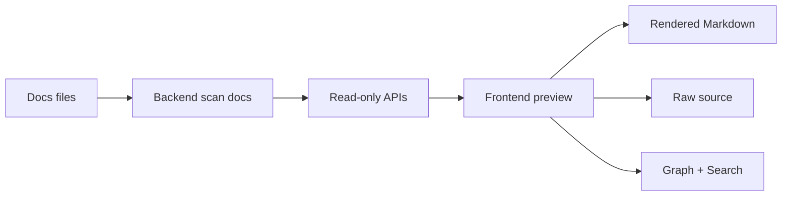

# Loại Bỏ Editor Trong Preview Web

## Meta

- **Status**: draft
- **Description**: Kế hoạch đưa preview web về chế độ chỉ đọc, loại bỏ Markdown editor, toolbar edit, API ghi tài liệu và các guard liên quan đến edit state.
- **Compliance**: planned
- **Links**: [Chỉ mục](../../_index.md), [Preview web](../../features/preview-web.md), [Module preview](../../modules/preview.md), [Markdown preview editable](./make-markdown-preview-editable.md), [Edit Markdown trong preview](./add-markdown-editing-preview.md), [Quy ước frontend preview](../../development/conventions/preview-frontend.md)

## Bối Cảnh

Preview web hiện là dashboard local để đọc docs, graph và search knowledge base. Trạng thái hiện tại đã tích hợp Markdown editor WYSIWYG bằng TOAST UI Editor: Doc tab có nút Edit, toolbar Markdown nổi, metadata panel editable, Save/Close action bar, hot reload guard khi đang sửa và backend `PUT /api/docs/{id}` để ghi raw Markdown vào file trong docs root.

Yêu cầu mới là loại bỏ editor trong preview web. Điều này nên được hiểu là preview trở lại đúng vai trò chỉ đọc: đọc docs, render Markdown/HTML, mở preview modal, copy reference, graph và search; không còn sửa tài liệu trực tiếp từ browser.

## Nguyên Nhân Và Lý Do Thiết Kế

Editor làm preview phức tạp hơn đáng kể:

- Frontend phải giữ state `editingMarkdown`, editor instance, metadata editable, save state và hot reload guard.
- Runtime phụ thuộc thêm TOAST UI Editor full package, CSS editor và command bridge cho toolbar.
- Backend phải expose API ghi file trong một server vốn chủ yếu dùng để đọc/preview.
- Tests và docs phải duy trì nhiều assertion cho editing flow, trong khi workflow docs có thể được chỉnh bằng editor/code tool quen thuộc hơn.

Loại bỏ editor giúp preview nhỏ hơn, ít rủi ro hơn và nhất quán hơn với tên gọi “preview”. Markdown rendering vẫn có thể dùng TOAST UI Viewer vì đó là read-only renderer, không phải editing surface.

## Mục Tiêu

- Bỏ toàn bộ UI edit trong Doc tab: Edit button, Save/Close action bar, Markdown edit toolbar và metadata editable panel.
- Bỏ TOAST UI Editor runtime dependency, chỉ giữ TOAST UI Viewer nếu vẫn là renderer Markdown chính.
- Bỏ frontend edit state, save flow, command bridge, metadata serialization và hot reload guard dành riêng cho editor.
- Bỏ hoặc vô hiệu hóa `PUT /api/docs/{id}` để preview API trở thành read-only.
- Giữ các hành vi read-only hiện có: rendered Markdown/HTML, Mermaid/LikeC4, highlight, internal links, selection copy, preview modal, Graph tab và Search tab.
- Cập nhật docs/tests để phản ánh preview web read-only.

## Ngoài Phạm Vi

- Không thay đổi format docs hoặc parser metadata.
- Không thay đổi search, graph, route hoặc preview modal ngoài những chỗ đang phụ thuộc edit state.
- Không thêm editor thay thế.
- Không tự động migrate nội dung Markdown hiện có.

## Logic Nghiệp Vụ

Sau thay đổi, preview web chỉ có hai chế độ xem tài liệu:

1. **Rendered view**: render Markdown client-side như hiện tại.
2. **Preview modal raw source**: raw source chỉ còn trong modal preview, không còn toggle source trên Doc tab chính.

API tài liệu nên chỉ đọc:

```http
GET /api/docs
GET /api/docs/{id}
```

`PUT /api/docs/{id}` nên trả `405 Method Not Allowed` nếu route vẫn tồn tại. Nếu muốn giảm tối đa surface, xóa hẳn handler save và để `handleSpec` chỉ chấp nhận `GET`.

Hot reload không cần giữ draft hay hỏi người dùng bỏ thay đổi. Khi docs đổi ngoài filesystem, preview reload lại project/docs/graph theo flow read-only hiện có.

## Cấu Trúc Giải Pháp



## Hướng Tiếp Cận Đề Xuất

Triển khai theo hướng tháo dần nhưng trong một change set gọn:

1. Bỏ API ghi trước để contract backend read-only rõ ràng.
2. Bỏ frontend edit controls và state, để UI không còn đường gọi save.
3. Bỏ dependency/type/CSS editor còn thừa.
4. Cập nhật tests và docs shipped.

Không nên để UI bị ẩn nhưng code save/API vẫn tồn tại, vì như vậy preview vẫn giữ surface ghi file không cần thiết và dễ bị lệch tài liệu.

## Chi Tiết Triển Khai

### Backend

- Sửa `handleSpec` để chỉ chấp nhận `GET`.
- Xóa `saveSpecRequest`, `handleSaveSpec`, `specDocumentPath` nếu không còn caller.
- Chỉ giữ `writeFileAtomically` nếu còn dùng nơi khác; nếu chỉ phục vụ save docs thì xóa luôn.
- Cập nhật backend tests: `PUT /api/docs/{id}` không còn persist content và nên assert `405 Method Not Allowed`.
- Giữ `GET /api/files` read-only như hiện tại.

### Frontend HTML Và Runtime

- Xóa các DOM node trong `preview_ui/index.html`:
  - `markdownEditToolbar`
  - `markdownEditActions`
  - `markdownEditButton`
  - `markdownSaveButton`
  - `markdownCancelButton`
  - `markdownSaveStatus`
- Xóa stylesheet TOAST UI Editor full CSS nếu chỉ phục vụ editor. Giữ stylesheet viewer hoặc CSS cần cho TOAST UI Viewer.
- Bỏ `rawMarkdownToggle` khỏi Doc tab chính; tài liệu chính luôn render ở chế độ đọc.

### Frontend TypeScript

- Xóa state và element references dành cho edit:
  - `editingMarkdown`
  - `markdownEditor`
  - `markdownEditorConstructor`
  - `markdownMetadata`
  - `markdownSaveState`
  - `markdownSaveError`
  - `markdownExternalChange`
- Xóa các hàm chỉ phục vụ edit:
  - `resetMarkdownEditState`
  - `currentSpecIsEditableMarkdown`
  - `enterMarkdownEdit`
  - `cancelMarkdownEdit`
  - `mountMarkdownPreviewEditor`
  - `loadToastMarkdownEditor`
  - `renderMarkdownEditorError`
  - `markdownEditorElement`
  - `destroyMarkdownPreviewEditor`
  - `markdownEditorMarkdown`
  - `markdownEditorDocumentMarkdown`
  - `remountMarkdownEditorForTheme`
  - `editableMarkdownParts`
  - `editableFrontmatter`
  - `editableMetaSection`
  - `renderEditableMetadataPanel`
  - `bindEditableMetadataPanel`
  - `serializeEditableMarkdown`
  - `updateMarkdownEditorControls`
  - `saveMarkdownDraft`
  - `refreshProjectAfterMarkdownSave`
  - `applyMarkdownCommand`
  - `clickToastTableToolbarItem`
  - `runToastEditorCommand`
- Sửa các call site:
  - `load()` không cần update edit controls.
  - `selectSpec()` không cần confirm discard hoặc reset editor.
  - `renderCurrentSpecContent()` luôn render read-only content.
  - `reloadPreviewData()` không cần guard `editingMarkdown`.
  - Không còn `updateRawMarkdownToggle()` hoặc `showRawMarkdown`.
  - `updateSelectionContextMenu()` không cần hide vì editor active.
  - `rerenderForTheme()` chỉ render lại content read-only.
  - Event listeners cho edit buttons/toolbar bị xóa.

### Types Và CSS

- Xóa `ToastMarkdownEditorConstructor` và `ToastMarkdownEditor` khỏi `types.d.ts`.
- Xóa CSS dành cho edit toolbar/action bar, metadata editable panel, WYSIWYG host editor-specific override và body class `markdown-editing`.
- Giữ CSS cho read-only markdown/html surface, TOAST UI Viewer, metadata table, diagram, code preview và modal raw source.

### Tests

- Đổi `TestPreviewUIUsesDedicatedFrontendLibraries` để không yêu cầu `@toast-ui/editor` full package hoặc `toastui-editor.css` nếu không còn cần.
- Xóa hoặc đổi `TestPreviewUIEditsMarkdownDocuments` thành test read-only, assert không có `markdownEditButton`, `markdownEditToolbar`, `saveMarkdownDraft`, `loadToastMarkdownEditor`, `getMarkdown`, `PUT`.
- Cập nhật test theme để không còn yêu cầu `remountMarkdownEditorForTheme`.
- Cập nhật HTTP handler test để `PUT /api/docs/{id}` không ghi file.
- Giữ tests render Markdown/HTML client-side, internal links, graph/search.

## Công Việc Cần Làm

1. Tháo backend save API và cập nhật test HTTP handler.
2. Xóa DOM edit controls khỏi `index.html`.
3. Xóa edit state/functions/listeners khỏi `preview_ui_src/app.ts`.
4. Xóa editor-only type definitions khỏi `types.d.ts`.
5. Xóa CSS editor-only khỏi `style.css`.
6. Build lại generated assets bằng `npm run build:preview`.
7. Cập nhật docs shipped: `docs/features/preview-web.md`, `docs/modules/preview.md`, `docs/_index.md` nếu cần, và `docs/_sync.md` khi implementation hoàn tất.
8. Chạy validation mục tiêu.

## Rủi Ro Và Ràng Buộc

- Worktree hiện có nhiều thay đổi preview/docs chưa commit; khi triển khai cần đọc diff kỹ và không revert thay đổi không liên quan.
- Một số helper có tên `markdown-wysiwyg-*` đang dùng cả cho viewer shell; cần đổi tên chỉ khi thật sự tránh nhầm, không bắt buộc nếu đổi tên làm diff lớn.
- TOAST UI Viewer import path vẫn chứa `@toast-ui/editor` trong package name vì viewer thuộc package đó; tests không nên cấm chuỗi này quá rộng nếu viewer còn cần.
- Nếu bỏ `PUT`, các docs đã nói preview có thể edit phải được cập nhật cùng change để tránh docs stale.
- Doc tab chính không còn raw source toggle; chỉ modal preview có raw/rendered switch.

## Kiểm Chứng

- `go test ./internal/preview`
- `npm run check:preview`
- `npm run lint:preview`
- `npm run build:preview`
- `npm run format:preview:check`
- Nếu thay đổi lan sang shared code hoặc docs sync rộng hơn, chạy thêm `go test ./...`.

Manual QA sau khi triển khai:

- Mở `go run . preview --project . --open`.
- Chọn Markdown doc: không thấy Edit/Save/Close toolbar.
- Raw toggle vẫn chuyển rendered/source được.
- Mermaid/LikeC4/highlight vẫn render.
- Selection copy menu vẫn hoạt động trong Doc và preview modal.
- Sửa file docs ngoài editor bằng filesystem, xác nhận hot reload cập nhật preview mà không hiện trạng thái draft/editor.
