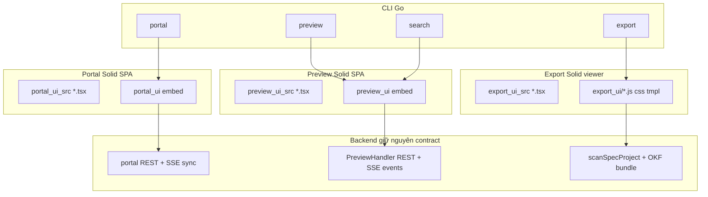
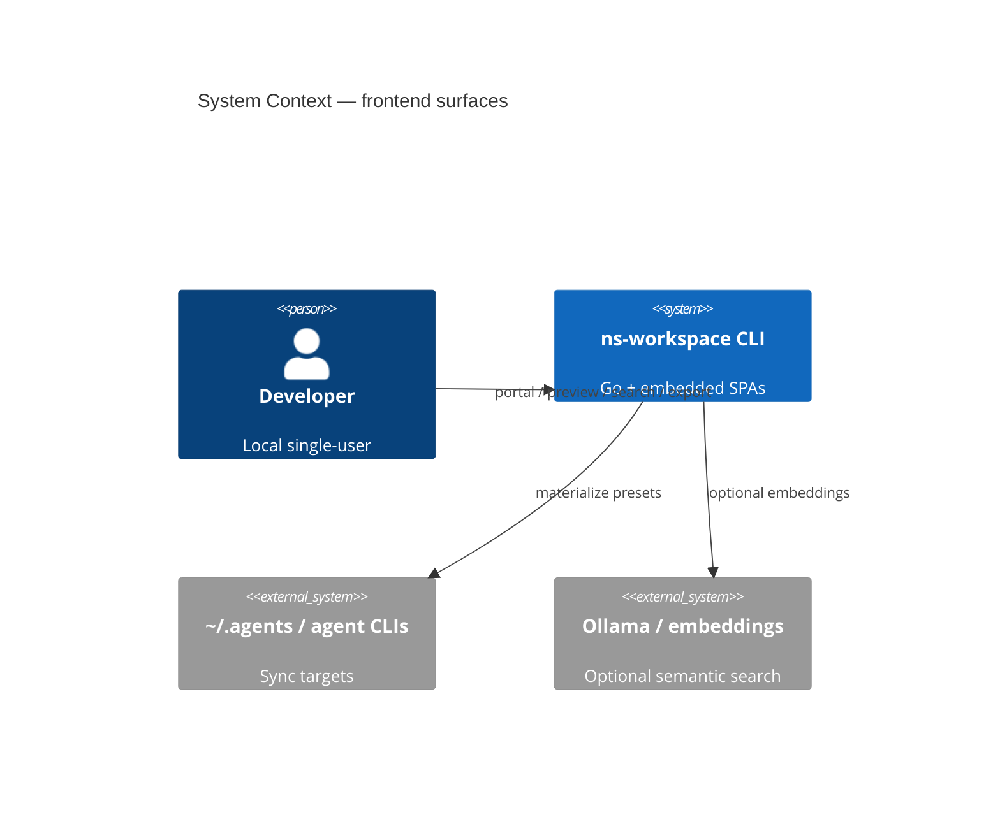
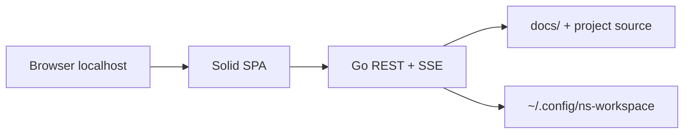

# Chuyển Portal, Preview SPA Và Export UI Sang SolidJS + TypeScript 7

## Bối Cảnh

Hiện trạng frontend trong repo:

| Surface | Stack hiện tại | Source | Artifact |
| ------- | -------------- | ------ | -------- |
| **Portal** | Vue 3 + TS 5.8 + Vite 5 + Tailwind v4 + CodeMirror + Phosphor Vue | `internal/portal/portal_ui_src/` (~2.2k LOC) | `internal/portal/portal_ui/` (Go embed) |
| **Preview (lệnh `preview`)** | [Quartz](https://quartz.jzhao.xyz/) clone/cache + `npx quartz build --serve` | Không còn SPA trong repo | Workspace cache `~/.cache/ns-workspace/quartz/` |
| **Export viewer** | Vanilla JS + Go `html/template` inject | `internal/preview/export_ui/` (`viz.js`/`viz.css`/`viz.html.tmpl`) | Single HTML file offline |
| **Search launcher** | HTML tĩnh nhỏ redirect URL | `graph.go` template | `ns-workspace-search.html` |

Backend Go vẫn có **API preview đầy đủ** (`PreviewHandler` trong `preview_api.go`): `project`, `docs`, `files`, `graph`, `search`, `events` (SSE). Search hybrid, graph, LSP Code Graph **không phụ thuộc Quartz**.

Tooling root:

- `package.json`: `typescript@^5.8.3`, `vue`, `vue-router`, `vue-tsc`, `@vitejs/plugin-vue`, …
- Target mong muốn: **`typescript@7`** (npm latest, hiện ~7.0.2, Go-native compiler) + **SolidJS** (JSX — type-check bằng `tsc`/`tsgo`, không cần vue-tsc / Volar).

## Nguyên Nhân Và Lý Do Thiết Kế

### Triệu chứng / động lực

- User yêu cầu thống nhất stack frontend: **SolidJS + TypeScript 7** cho portal, preview SPA và export_ui.
- Preview custom SPA đã từng tồn tại rồi bị thay bằng Quartz; monorepo vẫn giữ graph libs (`graphology`, `sigma`) và path/filter `preview_ui` trong search/LSP — dấu vết kiến trúc cũ.
- Vue template type-checking (vue-tsc/Volar) **chưa tương thích tốt với TypeScript 7 programmatic API**; Solid dùng JSX thuần → phù hợp TS 7 sớm hơn.

### Nguyên nhân gốc rễ (thiết kế, không phải bug)

1. **Hai thế hệ frontend lệch nhau**: portal = SPA tự host; preview = dependency ngoài (Quartz) + clone/npm install; export = vanilla port.
2. **Quartz tối ưu digital garden chung**, không tận dụng `PreviewHandler` (search hybrid, code graph, SSE) đã có trong Go.
3. **Không có shared frontend toolchain** giữa portal và preview → chi phí maintain Vue/Quartz/vanilla song song.

### Lý do chọn SolidJS + TS 7

- Fine-grained reactivity, bundle nhỏ, JSX + TypeScript first-class.
- `vite-plugin-solid` mature; `@solidjs/router` cho SPA.
- TS 7: type-check nhanh hơn rõ rệt; Solid không phụ thuộc vue-tsc.

## Góc Nhìn Tổng Quan Và Phạm Vi Tập Trung



**Tập trung:**

1. Tooling monorepo: TypeScript 7, Solid, Vite plugin, ESLint/Biome/Prettier/lint-staged.
2. **Portal** parity Vue → Solid (UI/API không đổi).
3. **Preview SPA** thay Quartz: Go serve embed SPA + `PreviewHandler`.
4. **Export viewer** rewrite Solid, vẫn single-file offline + `window.BUNDLE`.
5. Gỡ Quartz path khi preview SPA ổn định; cập nhật docs.

## Mục Tiêu

- [ ] Portal UI chạy SolidJS + TS 7; behavior API/UI parity với Vue hiện tại.
- [ ] `go run . preview` serve SPA Solid (docs browse, markdown, search, graph, SSE reload); **không** clone Quartz mặc định.
- [ ] `go run . export` sinh HTML offline dùng viewer Solid; Cytoscape/marked vẫn offline khi `--inline-assets`.
- [ ] `typescript@^7`, bỏ Vue stack; `npm run check:*` dùng `tsc` (TS 7).
- [ ] Docs/features/modules/conventions phản ánh stack mới.

## Ngoài Phạm Vi

- Đổi contract REST portal / preview API (trừ flag CLI bỏ/deprecate Quartz).
- Redesign UX portal lớn (ví dụ MCP card redesign riêng) — chỉ port 1:1 trừ khi chặn bởi Solid.
- Thay đổi pipeline agentsync, harness, kbmcp, graphquery LSP core.
- Host public / auth — vẫn localhost single-user.
- Đồng bộ theme pixel-perfect với Quartz (preview SPA là product UI của ns-workspace, không clone Quartz).

## Logic Nghiệp Vụ

### Portal (giữ nguyên)

- Local-only, overlay config, enable/disable skills/MCP/registry/adapters, sync SSE.
- Các route: Dashboard, Skills, MCPs, Registry, Adapters + SyncPanel.

### Preview (thay runtime)

| Hành vi | Trước | Sau |
| ------- | ----- | --- |
| Serve docs | Quartz static garden | Go HTTP + Solid SPA + `PreviewHandler` |
| Hot reload | Quartz HMR | SSE `/api/events` + optional source supervisor (như portal) |
| Search | Quartz search + lệnh `search` API | SPA tab Search gọi API hybrid hiện có |
| Graph | Quartz graph | SPA tab Graph (sigma/graphology hoặc Cytoscape) qua `/api/graph` |
| `--quartz-dir` | Custom Quartz | **Deprecate** (warn + ignore) hoặc remove sau phase |

### Export (giữ contract)

- Một file HTML; `--inline-assets` offline; `window.BUNDLE` / `window.BUNDLE_NAME`.
- License Apache 2.0 port knowledge-catalog vẫn ghi trong `COPYRIGHT.md`.
- Test export hiện tại (bundle blob, no remote auto-load, edges optional) phải pass.

### TypeScript 7

- `"typescript": "^7.0.0"` (hoặc pin `7.0.x`).
- `jsx: "preserve"` + Solid transform qua Vite; `jsxImportSource: "solid-js"`.
- Check: `tsc -p tsconfig.*.json --noEmit` (binary TS 7).

## Cấu Trúc Giải Pháp

### Layout thư mục đề xuất

```text
package.json                    # solid-js, @solidjs/router, vite-plugin-solid, typescript@7
tsconfig.base.json              # shared strict + jsxImportSource solid-js
tsconfig.portal.json
tsconfig.preview.json
tsconfig.export.json            # optional; export viewer
vite.portal.config.ts
vite.preview.config.ts
vite.export.config.ts           # lib/IIFE build single bundle

internal/portal/
  portal_ui_src/                # .tsx thay .vue
  portal_ui/                    # embed build

internal/preview/
  preview_ui_src/               # SPA Solid mới
  preview_ui/                   # embed build
  export_ui_src/                # Solid source viewer
  export_ui/                    # built viz.js/css + tmpl (+ third_party)
  preview.go                    # serve SPA + API, bỏ quartz serve path
  quartz.go                     # xóa hoặc stub deprecate
```

### Shared patterns (không bắt buộc package riêng phase 1)

- Design tokens CSS (portal `style.css` có thể chia sẻ tokens với preview).
- CodeMirror wrapper Solid (portal).
- `api.ts` typed fetch helpers.

### Build commands

```bash
npm run build:portal    # → portal_ui
npm run build:preview   # → preview_ui
npm run build:export    # → export_ui viz assets
npm run check:portal
npm run check:preview
npm run check:export    # nếu tách
```

Go embed chỉ đọc **artifact đã build**; CI/dev phải build frontend trước khi commit artifact (giữ workflow portal hiện tại).

## Mô Hình C4





## Hướng Tiếp Cận Đề Xuất

**Phased, parity-first, một stack.**

1. **Phase 0 — Tooling**: cài Solid + TS 7; dual-run tạm (Vue vẫn build) hoặc hard-cut portal trước.
2. **Phase 1 — Portal Solid**: port 1:1, rebuild embed, lint/check, smoke UI.
3. **Phase 2 — Preview SPA + Go serve**: scaffold SPA tối thiểu (shell + docs list + doc view + search); wire `PreviewHandler`; thay `Run()` bỏ Quartz; tests Go cập nhật.
4. **Phase 3 — Preview graph + polish**: graph UI, SSE, hash routes, search deep-link cho `search` command.
5. **Phase 4 — Export Solid**: build IIFE, inject template, giữ offline tests.
6. **Phase 5 — Cleanup + docs**: xóa Vue/Quartz dead code, cập nhật DEVELOPER/features/modules, Taskfile desc.

**Khuyến nghị thứ tự:** Portal trước (surface có sẵn, risk thấp) → Preview (đổi kiến trúc serve) → Export (constraint offline/file://).

## Chi Tiết Triển Khai

### 0. Tooling monorepo

**Add dependencies:**

- `solid-js`, `@solidjs/router`
- `vite-plugin-solid`
- `typescript@^7`
- Icons: `@phosphor-icons/web` hoặc solid-compatible set (thay `@phosphor-icons/vue`)
- Giữ: Tailwind v4, CodeMirror, graphology, sigma, Vite (nâng Vite nếu TS7/plugin yêu cầu)

**Remove (sau khi portal xong):**

- `vue`, `vue-router`, `vue-tsc`, `@vitejs/plugin-vue`, `eslint-plugin-vue`, `vue-eslint-parser`, `@phosphor-icons/vue`

**Config:**

- `tsconfig.*`: `jsxImportSource: "solid-js"`, `moduleResolution: "Bundler"`, target ES2022+
- ESLint: bỏ vue flat config; `typescript-eslint` + optional solid plugin nếu ổn định
- lint-staged / format globs: `*.{ts,tsx}` thay `*.{ts,vue}`
- `check:portal`: `tsc -p tsconfig.portal.json --noEmit`

### 1. Portal → Solid

| Vue | Solid |
| --- | ----- |
| `ref` / `computed` | `createSignal` / `createMemo` |
| `onMounted` / `onUnmounted` | `onMount` / `onCleanup` |
| `v-model` | signal + `onInput` / controlled props |
| `v-for` | `<For>` |
| `v-if` | `<Show>` |
| `vue-router` hash | `@solidjs/router` HashRouter |
| SFC `.vue` | `.tsx` components |
| `defineProps` / emit | props + callbacks |

**Files map:**

- `main.ts` → `main.tsx`
- `App.vue` → `App.tsx`
- `views/*.vue` → `views/*.tsx`
- `components/*.vue` → `components/*.tsx`
- `composables/useFlashMessage.ts` → hooks/signals tương đương
- `api.ts` giữ gần như nguyên (typed fetch)
- `CodeEditor`: mount CodeMirror trên `ref` DOM; sync signal ↔ EditorView

**Go:** `//go:embed portal_ui` không đổi path; chỉ rebuild artifact.

**Hot reload supervisor** portal: vẫn watch `portal_ui_src` — cập nhật glob `.tsx`.

### 2. Preview SPA (thay Quartz)

**Go `preview.Run`:**

1. Resolve project/docs.
2. `NewPreviewHandler` + register `/api/...`.
3. Serve embed `preview_ui` SPA (cùng pattern `spaFileServer` portal).
4. Bind `addr` (host:port đầy đủ, không chỉ port Quartz).
5. Optional: hot-reload supervisor khi checkout có source.
6. `--open` chờ server ready.

**Bỏ / deprecate:**

- `ensureQuartzRepo`, `prepareQuartzWorkspace`, `runQuartzServe`, flag `--quartz-dir` (warn rồi ignore trong 1 release).
- Tests chỉ cover quartz clone/serve → rewrite cho HTTP SPA.

**SPA routes (hash, local-friendly):**

| Route | Chức năng |
| ----- | --------- |
| `#/` hoặc `#/docs/*` | Cây docs + render markdown/HTML doc |
| `#/search` | Hybrid search panels (docs/code semantic + graph) |
| `#/graph` | Relationship graph visualization |
| `#/file?...` | Optional raw/code file view qua `/api/files` |

**Data:**

- `GET /api/project`, `/api/docs`, `/api/docs/{id}`, `/api/search`, `/api/graph`, `/api/events`
- Markdown: prefer server-rendered `HTML` nếu API có; fallback client markdown (marked) cho raw

**Search command:**

- Launcher HTML vẫn redirect tới `http://127.0.0.1:<port>/#/search` (hoặc path SPA tương đương).
- Server search dùng **cùng** preview server stack (không Quartz).

**MVP acceptance preview:**

1. Mở preview → thấy list docs từ project.
2. Mở một doc → title + body đọc được.
3. Search query → panels có kết quả (lexical tối thiểu; semantic nếu embedding available).
4. Graph → nodes/edges từ API.
5. Sửa file md → SSE → UI refresh (hoặc soft reload project).

### 3. Export UI Solid

**Ràng buộc cứng:**

- `file://` offline với `--inline-assets=true`
- Không fetch remote khi inline
- `window.BUNDLE` inject trước app boot
- Giữ Cytoscape layout options + detail panel behavior (parity)

**Cách build:**

- Vite `build.lib` hoặc single Rollup input → `viz.js` (IIFE gắn `globalThis` hoặc auto-mount `#app`)
- CSS → `viz.css`
- `viz.html.tmpl` mount root + vendor scripts + bundle inject (giống hiện tại)
- Source Solid trong `export_ui_src/`; **không** `//go:embed` source — chỉ artifact + third_party

**Licensing:** cập nhật `COPYRIGHT.md` nếu structure đổi; giữ attribution Apache 2.0 / third_party MIT.

### 4. Docs & Taskfile

Cập nhật sau khi code ổn:

- `docs/features/portal.md`, `preview-web.md`
- `docs/modules/preview.md`
- `docs/development/conventions/preview-frontend.md` (un-deprecate, Solid conventions)
- `docs/architecture/overview.md`, `DEVELOPER.md`, `README.md` nếu nhắc Quartz/Vue
- `Taskfile.yml` desc lint/serve
- `docs/_index.md` / `_sync.md` nếu skill init yêu cầu

## Công Việc Cần Làm

### Phase 0 — Tooling

1. Nâng `typescript` lên `^7`; chỉnh tsconfig base (jsx solid).
2. Thêm `solid-js`, `@solidjs/router`, `vite-plugin-solid`.
3. Tách/chuẩn bị vite configs; scripts build/check/lint.
4. Smoke: `tsc --version` ≥ 7; empty Solid entry build được.

### Phase 1 — Portal

1. Scaffold `portal_ui_src` Solid song song hoặc in-place replace.
2. Port `api.ts`, layout App, router, shared components, 5 views, SyncPanel, CodeEditor.
3. `npm run build:portal` + embed commit.
4. `npm run check:portal`, `lint:portal`.
5. Manual smoke: skills toggle, MCP save, registry, adapters, sync status stream.
6. Gỡ Vue deps khi portal-only.

### Phase 2 — Preview core

1. Scaffold `preview_ui_src` + vite.preview + embed dir.
2. Implement Go serve path (copy/adapt portal static+API wiring từ code cũ trong tests).
3. UI: shell, docs list, doc detail, basic search page.
4. Wire `search` launcher URL vào SPA search route.
5. Update/fix Go tests: quartz → SPA server; keep API tests.
6. Xóa hoặc isolate `quartz.go` (+ tests).

### Phase 3 — Preview graph + SSE

1. Graph page với graphology/sigma (đã có trong package.json) hoặc tái sử dụng pattern export.
2. SSE client cho `/api/events`.
3. Deep-link / empty states / reduced-motion.

### Phase 4 — Export Solid

1. Scaffold export Solid app đọc `window.BUNDLE`.
2. Port search/filter/layout/detail từ `viz.js`.
3. Build pipeline + `export.go` paths không gãy.
4. `go test ./internal/preview` export suite xanh.

### Phase 5 — Cleanup & docs

1. Dead code: Vue remnants, quartz, deprecated flags docs.
2. Filter `preview_ui` generated assets trong search (đã có pattern — verify).
3. Update knowledge base docs (feature/module/convention/architecture/DEVELOPER).
4. Plan status → `implemented`.

## Rủi Ro Và Ràng Buộc

| Rủi Ro | Mức | Mitigation |
| ------ | --- | ---------- |
| TS 7 + eslint/vite/biome chưa tương thích hoàn toàn | Trung bình | Pin versions; nếu blocker, `typescript@7` cho `tsc` và giữ tooling parser 5.x tạm (ghi rõ) |
| Mất feature digital garden Quartz (full-text static, backlinks UI) | Trung bình | Parity qua Go graph + search API; không claim “Quartz-compatible” |
| Export Solid bundle phá `file://` / CSP | Cao | IIFE + inline; test `--inline-assets`; không code-split dynamic import remote |
| Scope phình (3 UI surfaces) | Cao | Phase gate; portal ship độc lập trước preview |
| Go tests gắn quartz / preview_ui paths | Trung bình | Cập nhật test theo phase; không xóa coverage API |
| License export viewer | Thấp | Giữ COPYRIGHT + third_party headers |
| Artifact embed phình PR | Thấp | Build có chủ đích; không commit `node_modules` |

**Ràng buộc:**

- Localhost only; không auth.
- Không sửa embedded presets từ portal (overlay).
- Export validate docs trước khi ghi file.
- Plan này **chờ duyệt** trước khi sửa source (trừ việc user yêu cầu execute).

## Kiểm Chứng

### Portal

```bash
npm run check:portal
npm run lint:portal
npm run build:portal
go test ./internal/portal/...
# manual: go run . portal --open
```

Acceptance: 5 trang load; toggle skill/MCP/registry/adapter; save JSON MCP; sync status SSE; reset overlay.

### Preview

```bash
npm run check:preview
npm run build:preview
go test ./internal/preview/...
go run . preview --project . --open
go run . search --project . --no-open   # launcher + server
```

Acceptance: docs list/detail; search panels; graph nodes; không gọi quartz/git clone; SSE khi sửa md.

### Export

```bash
npm run build:export
go test ./internal/preview -run Export
go run . export --project . --out /tmp/kb.html
# open file:// /tmp/kb.html offline
```

Acceptance: `window.BUNDLE` present; graph + detail; inline assets; CDN mode vẫn optional.

### Tooling

```bash
npx tsc --version   # 7.x
npm ls typescript solid-js vue  # vue absent sau cleanup
```

## Tiêu Chí Chấp Nhận Nghiệp Vụ (tóm tắt)

- **BA / user-facing:** Dev local dùng `portal` và `preview` như trước về mục đích (quản lý preset; đọc/search docs), stack UI đổi nhưng workflow CLI không gãy.
- **Breaking nhận biết:** Bỏ trải nghiệm Quartz (theme/plugin Quartz, `--quartz-dir` custom garden). Cần ghi changelog/DEVELOPER.
- **Export:** Vẫn một file HTML chia sẻ offline được.

## Quyết Định Cần User Duyệt

1. **Phạm vi đã chọn:** portal + preview SPA (thay Quartz) + export_ui + `typescript@7`.
2. **Thứ tự phase** đề xuất: tooling → portal → preview → export → docs.
3. **Deprecate Quartz hoàn toàn** (không dual-mode dài hạn).
4. **Preview MVP** dựa trên `PreviewHandler` hiện có, không reimplement Quartz plugin ecosystem.

---

**Trạng thái:** `draft` — chờ phê duyệt trước khi sửa code.
