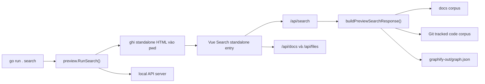

# Tách Search Page Thành Frontend Standalone Và Thêm Lệnh Graph

> Ghi chú 2026-05-27: kế hoạch này mô tả bối cảnh trước khi Code Graph chuyển khỏi Graphify. Search standalone vẫn đúng, nhưng Code Graph hiện lấy symbol/relations từ LSP runtime theo [Thay Code Graph Graphify Bằng LSP](./lsp-code-graph-search.md).

## Bối Cảnh

Preview web hiện là một SPA Vue trong `internal/preview/preview_ui_src/`, được Vite build vào `internal/preview/preview_ui/` rồi Go embed để lệnh `preview` phục vụ qua local HTTP server. Search hiện nằm trong `SearchPanel.vue`, được nhúng trong `App.vue`, gọi `/api/search`, mở preview tài liệu qua `/api/docs/{id}`, mở preview file qua `/api/files`, và render graph bằng `js/network_graph.ts`.

Backend search hiện tập trung ở `internal/preview/preview_search.go`, đặc biệt `handleSearch()` và `buildPreviewSearchResponse()`. Search trả bốn panel độc lập: Docs Semantic, Docs Graph, Code Semantic và Code Graph. Graphify report cũng cho thấy `buildPreviewSearchResponse()` là một node trung tâm, còn cụm `buildPreviewFrontend()` và `previewServer` là ranh giới giữa Go runtime và frontend build.

Yêu cầu mới là tách phần Search page ra một frontend source riêng, vẫn dùng Vue, Prettier, ESLint, Tailwind/DaisyUI-style CSS, icon system và network graph hiện tại, nhưng có khả năng chạy standalone/on the fly. Command `search` sinh một file HTML vào thư mục hiện tại và mở bằng web browser mặc định.

## Nguyên Nhân Và Lý Do Thiết Kế

Triệu chứng hiện tại là Search bị gắn vào preview shell: muốn dùng search/graph cần chạy server `preview`, tải toàn bộ sidebar/doc/graph shell, và dựa vào route `/search`.

Nguyên nhân trực tiếp là `SearchPanel.vue` không có entrypoint riêng. Nó nhận props từ `App.vue`, dùng API tương đối như `/api/search`, và các action preview đi qua modal chung của preview app.

Nguyên nhân gốc rễ là frontend preview hiện có một Vite entry duy nhất (`index.html` -> `main.ts` -> `App.vue`) nên mọi trải nghiệm đều đi qua một artifact embed duy nhất. Vì vậy không có artifact HTML độc lập cho Search, cũng chưa có command CLI nào tạo một viewer HTML on demand trong `pwd`.

Hướng thiết kế nên giữ một backend search contract duy nhất thay vì nhân đôi logic search sang frontend. Lệnh `search` chỉ nên tạo shell HTML/JS standalone và, khi cần dữ liệu động từ project, dùng API/runtime Go đã có hoặc snapshot JSON được nhúng vào HTML theo chế độ được chọn.

## Góc Nhìn Tổng Quan Và Phạm Vi Tập Trung

Phạm vi tập trung gồm ba ranh giới:

- CLI: thêm command `graph` trong `main.go`, usage và test command dispatch.
- Backend preview/search: tái dùng search/project/docs/files handlers hoặc tạo runner phục vụ Search standalone tạm thời.
- Frontend: tách Search app thành entry riêng, chia sẻ component/icon/network graph/style với preview app, nhưng không phụ thuộc `App.vue` hoặc sidebar/doc shell.

Ngoài phạm vi của kế hoạch này:

- Không thay đổi thuật toán ranking search, embedding, Git tracked filter hoặc graphify filtering.
- Không viết lại Graph tab tổng thể của preview.
- Không đổi data contract `/api/search` trừ khi cần thêm metadata nhỏ cho standalone UI.
- Không thay đổi định dạng `graphify-out/graph.json`.

## Mục Tiêu

- Có source frontend riêng cho Search standalone, ví dụ `internal/preview/preview_ui_src/search/`, với entry Vue riêng.
- Search standalone vẫn dùng Vue, TypeScript, Vite, ESLint, Prettier, CSS hiện có, icon component và renderer graph chung.
- Có lệnh `go run . search` sinh file HTML vào `pwd` và mở bằng browser mặc định.
- File HTML sinh ra có tên ổn định, ví dụ `search.html` hoặc `ns-workspace-search.html`, và có thể được ghi đè an toàn.
- Người dùng mở file/command từ project bất kỳ vẫn search được project đó theo `docs/`, code tracked bởi Git và `graphify-out/graph.json` nếu có.

## Logic Nghiệp Vụ

Lệnh `search` nên mặc định dùng project root là thư mục hiện tại. Các flag đề xuất:

- `--project PATH`: project root cần inspect, mặc định `pwd`.
- `--docs-dir PATH`: docs dir, mặc định `docs`, nhất quán với `preview`.
- `--out PATH`: file HTML output, mặc định nằm trong `pwd`.
- `--open`: mở browser sau khi sinh HTML, hoặc có thể mặc định mở browser theo đúng yêu cầu hiện tại.
- `--no-open`: nếu cần tắt mở browser trong test/CI.

Hai chế độ triển khai có thể cân nhắc:

1. Runtime local server nhẹ: `search` sinh HTML vào `pwd`, đồng thời chạy một local server API tạm giống preview để HTML gọi `/api/search`, `/api/docs`, `/api/files`. Hướng này giữ dữ liệu luôn động và ít thay đổi frontend search logic nhất, nhưng command trở thành long-running giống `preview`.
2. Snapshot HTML: `search` gọi backend để build một snapshot dữ liệu ban đầu và nhúng JSON vào HTML. Hướng này tạo file tự đủ hơn, nhưng search code theo query mới sẽ khó vì hiện backend tính search theo query và có embedding/graphify/Git filtering ở Go runtime.

Đề xuất chọn hướng 1 cho triển khai đầu: lệnh `search` tạo HTML launcher vào `pwd`, start server bằng API search hiện có, mở browser tới URL server hoặc file launcher. Nếu bắt buộc browser mở trực tiếp file HTML, HTML có thể chứa endpoint server được inject và redirect/connect tới server đang chạy.

## Cấu Trúc Giải Pháp

## Hướng Tiếp Cận Đề Xuất

Tách frontend theo hướng entrypoint mới thay vì fork toàn bộ app:

- Giữ `SearchPanel.vue` làm component chia sẻ nếu có thể.
- Tạo `SearchStandaloneApp.vue` để cung cấp layout tối giản, theme, query route state, modal preview và các handler mở doc/file.
- Tạo `search-main.ts` mount vào `#search-app`.
- Tạo `search.html` trong source Vite hoặc template Go tương ứng.
- Cập nhật `vite.config.ts` để build multi-entry: preview `index.html` và search standalone `search.html`.
- Nếu search standalone cần chạy qua file HTML được sinh on the fly, dùng template Go đọc/bọc artifact build hoặc inject URL API vào `window.__NS_WORKSPACE_GRAPH__`.

Tách backend/CLI theo hướng thêm package-level runner:

- Thêm `graph` vào danh sách command hợp lệ trong `main.go`.
- Tạo `preview.RunGraph(args []string)` hoặc package mới nếu muốn tách tên miền rõ hơn.
- Dùng lại `previewOptions`, `newPreviewServer()`, `openURL()`, `normalizePreviewProjectRoot()` và `docsRoot()`.
- Thêm handler/static path phục vụ search standalone artifact nếu chạy qua server, ví dụ `/graph-app` hoặc `/standalone/search`.
- Ghi HTML launcher vào `pwd` bằng template nhỏ, chứa URL server hoặc nội dung artifact đã build.

## Chi Tiết Triển Khai

Frontend:

- Audit `SearchPanel.vue` để loại các giả định chỉ đúng trong preview shell. Các props/emits hiện đã khá sạch: `query`, `keywordOperator`, `openSpecPreview`, `openFilePreview`.
- Giữ `Icon.vue` và `network_graph.ts` dùng chung. Nếu thiếu icon cho standalone toolbar thì bổ sung trong `Icon.vue` theo style hiện tại.
- Tạo layout standalone không có sidebar, tập trung vào search input, keyword operator, hai tab Docs/Code và preview modal.
- Reuse `PreviewModal.vue` nếu contract đủ; nếu modal đang phụ thuộc state preview app thì giữ state trong `SearchStandaloneApp.vue`.
- Cập nhật `package.json` scripts nếu cần thêm `build:graph` hoặc giữ `build:preview` build cả hai entry.
- Cập nhật ESLint/Prettier include để entry mới được lint/format.

Backend/CLI:

- `graph` parse flags riêng để tránh làm rối `preview`.
- Output path mặc định dùng `os.Getwd()` tại nơi user gọi command, không phải module root.
- Khi chạy trong checkout module, hot reload supervisor không nên tự động bật cho `graph` trừ khi có nhu cầu dev rõ ràng.
- File HTML output nên được ghi atomic-ish: tạo nội dung hoàn chỉnh rồi `os.WriteFile` với permission `0644`.
- Browser open dùng helper hiện có `openURL()`.
- Test nên có cách disable browser open bằng flag hoặc injectable opener để không mở browser trong CI.

## Công Việc Cần Làm

- Thêm planning/doc link vào `_index.md` sau khi kế hoạch được duyệt hoặc khi docs update được yêu cầu.
- Tạo frontend standalone entry cho Search và đảm bảo dùng lại component/common code hiện có.
- Cập nhật Vite multi-entry/build output và static embed nếu artifact cần ship cùng module.
- Thêm command `graph` vào CLI, usage và runner.
- Thêm template HTML launcher/output vào backend.
- Bổ sung test Go cho command dispatch, output file, no-open behavior và API/static route tối thiểu.
- Chạy validation: `npm run check:preview`, `npm run lint:preview`, `npm run format:preview:check`, `npm run build:preview`, `go test ./internal/preview`, `go test ./...`.

## Rủi Ro Và Ràng Buộc

- Nếu `search` chỉ mở file HTML nhưng không giữ server sống, search động theo query sẽ không hoạt động vì logic search nằm ở Go backend. File HTML hiện là launcher tới local server, không phải snapshot tự đủ.
- Multi-entry Vite có thể đổi hashed JS assets và làm test embed cần cập nhật.
- Preview app hiện đã có nhiều thay đổi local trong worktree; khi triển khai phải tránh ghi đè những thay đổi không thuộc task.
- Search panel đang render graph bằng WebGL/Sigma; standalone HTML cần đảm bảo import map/CDN/build asset vẫn đúng như preview hiện tại.
- Nếu output file nằm trong project root, code search có thể thấy chính file vừa sinh nếu Git fallback không hoạt động. Nên đặt tên output và ignore/filter hợp lý hoặc khuyến nghị Git tracked mode.

## Kiểm Chứng

- `go run . search --project <fixture> --out <tmp>/search.html --no-open` tạo đúng file HTML.
- Mở HTML/URL tạo bởi command và search query mẫu trả đủ Docs Semantic, Docs Graph, Code Semantic và Code Graph khi fixture có dữ liệu.
- Preview hiện tại vẫn chạy `/search` bình thường.
- Browser mở mặc định chỉ được gọi khi không có `--no-open`.
- Build output embed vẫn có asset JS tồn tại và static fallback không làm module script nhận sai MIME type.
