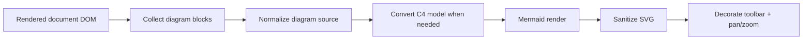

# Support Render Mermaid Và C4 Model

## Meta

- **Status**: draft
- **Description**: Kế hoạch chuẩn hóa và mở rộng khả năng render Mermaid, Mermaid C4 và C4 model trong preview web, bao gồm Markdown fences và hướng tương thích với HTML custom tags.
- **Compliance**: planned
- **Links**: [Chỉ mục](../../_index.md), [Preview web](../../features/preview-web.md), [Module preview](../../modules/preview.md), [Generate docs bằng HTML Tailwind và custom tags](./generate-docs-html-tailwind-custom-tags.md), [Loại bỏ editor trong preview web](./remove-preview-web-editor.md), [Quy ước frontend preview](../../development/conventions/preview-frontend.md)

## Bối Cảnh

Preview web hiện đã render Markdown client-side và có pipeline diagram ở frontend. Theo docs hiện tại, preview hỗ trợ:

- Code fence `mermaid`.
- Mermaid C4 khi source bắt đầu bằng `C4Context`, `C4Container`, `C4Component`, `C4Dynamic` hoặc `C4Deployment`.
- Fence language dạng `c4`, `c4context`, `c4container`, `c4component`, `c4dynamic`, `c4deployment`, được normalize về Mermaid C4.
- Fence `likec4` hoặc block nhìn giống LikeC4 `model { ... }`, parse subset `softwareSystem`, `container`, `component`, `description` và quan hệ `a.b -> c.d "label"`, rồi convert sang Mermaid `C4Component`.
- SVG sau render được sanitize, decorate toolbar và gắn `svg-pan-zoom`.

Yêu cầu mới là support render Mermaid và C4 model. Vì một phần đã có, kế hoạch này tập trung làm support này thành contract rõ ràng, robust hơn, có fixtures/test bao phủ thực tế và sẵn sàng dùng cho hướng generate docs bằng HTML + custom tags.

## Nguyên Nhân Và Lý Do Thiết Kế

Renderer hiện nằm trong `preview_ui_src/app.ts` và đang làm nhiều việc cùng lúc: detect code block, normalize C4 language, parse LikeC4 subset, render Mermaid, apply dark theme overrides, sanitize SVG, decorate toolbar và quản lý pan/zoom lifecycle. Cách này chạy được nhưng dễ mơ hồ ở ranh giới:

- “C4 model” có thể nghĩa là Mermaid C4 DSL, LikeC4 model DSL, hoặc custom tag HTML chứa diagram.
- Detection hiện phụ thuộc class của TOAST UI Viewer và `data-source-language`.
- LikeC4 parser hiện rất hẹp, chủ yếu line-based và chỉ hỗ trợ vài declaration/relation cơ bản.
- Test hiện phần lớn là string assertion, chưa có fixture mô tả source diagram đầu vào và DOM kỳ vọng đầu ra.

Thiết kế nên tách “nhận diện diagram”, “chuyển đổi C4 model”, và “render Mermaid SVG” thành các bước rõ hơn để dễ mở rộng mà không làm vỡ preview.

## Mục Tiêu

- Chuẩn hóa danh sách input được hỗ trợ:
  - Markdown fence `mermaid`.
  - Markdown fence Mermaid C4 bằng source bắt đầu với `C4*`.
  - Markdown fence language `c4`, `c4context`, `c4container`, `c4component`, `c4dynamic`, `c4deployment`.
  - Markdown fence `likec4` chứa `model { ... }`.
  - HTML custom tag tương lai: `<doc-diagram type="mermaid">` và `<doc-diagram type="c4-model">`.
- Tạo abstraction nhỏ cho diagram source:
  - `kind`: `mermaid`, `mermaid-c4`, `likec4-model`, `html-mermaid`, `html-c4-model`.
  - `source`: source gốc sau decode.
  - `mermaidSource`: source cuối cùng đưa vào Mermaid.
  - `title`/`label`: dùng cho toolbar và lỗi render.
- Giữ render chạy client-side, không thêm API render server.
- Error state phải hiện ngay tại vị trí diagram, không làm hỏng toàn bộ document.
- Dark theme và pan/zoom vẫn hoạt động cho Mermaid thường và C4.
- Có fixtures/tests đủ để biết Mermaid/C4 model thật sự được nhận diện và render pipeline đúng.

## Ngoài Phạm Vi

- Không xây editor diagram.
- Không hỗ trợ toàn bộ LikeC4 DSL trong một lần nếu parser subset không đủ.
- Không thêm runtime graph/diagram engine thứ hai nếu Mermaid C4 đáp ứng được.
- Không thay đổi Graph tab Sigma/Graphology.

## Logic Nghiệp Vụ

Pipeline diagram nên đi qua các bước:



Quy tắc nhận diện:

- Block `mermaid` dùng source nguyên bản.
- Block language `c4*` nếu source chưa bắt đầu bằng `C4*` thì prepend diagram type tương ứng.
- Block source bắt đầu bằng `C4*` luôn được xem là Mermaid C4 dù language không khai báo.
- Block `likec4` chỉ render khi có `model { ... }`; nếu không match thì giữ code block bình thường hoặc hiển thị lỗi nhẹ tùy contract chọn.
- HTML custom tag `doc-diagram` nên được normalize thành cùng `DiagramSource` thay vì có renderer riêng.

Quy tắc C4 model:

- Mermaid C4 DSL được đưa trực tiếp vào Mermaid.
- LikeC4 model subset được convert sang Mermaid C4.
- Nếu source có construct chưa support, renderer nên báo lỗi “unsupported C4 model syntax” kèm block giữ nguyên raw source có thể đọc được.

## Cấu Trúc Giải Pháp

### Frontend

Tách các helper trong `preview_ui_src/app.ts` hoặc chuyển sang module nhỏ nếu diff hợp lý:

- `collectDiagramBlocks(root)`: tìm code fences và custom tags.
- `diagramSourceFromCodeBlock(block)`: đọc `data-source-language`, class language và text.
- `diagramSourceFromCustomTag(node)`: đọc `type` và text content cho HTML docs.
- `normalizeMermaidDiagramSource(diagram)`: chuẩn hóa Mermaid/C4 source.
- `c4ModelToMermaid(source)`: thay thế hoặc wrap `likeC4ModelToMermaid`.
- `renderDiagramSource(host, diagram)`: gọi Mermaid, sanitize, theme và decorate.

Giữ `renderMermaidDiagram`, `decorateDiagram`, `registerDiagramPanZoom`, `destroyDiagramsIn` làm nền nếu đang ổn, nhưng giảm logic detection nằm rải trong `renderMermaidBlocks` và `renderLikeC4Blocks`.

### C4 Model Parser

Giữ parser subset hiện có nhưng làm rõ contract:

- Support declaration:
  - `id = softwareSystem "Name" { ... }`
  - `id = container "Name" { ... }`
  - `id = component "Name"`
  - `description "Text"`
- Support relation:
  - `a -> b "label"`
  - `a.b -> c.d "label"`
- Normalize id sang Mermaid-safe id.
- Preserve hierarchy bằng `System_Boundary` hoặc `Container_Boundary`.

Nếu cần mở rộng ngay, ưu tiên thêm:

- Relation không label: `a -> b`.
- `technology "..."` hoặc tag phụ nếu tồn tại trong docs thực tế, nhưng không bắt parser đoán quá rộng.

### HTML Custom Tags

Plan này nên tương thích với kế hoạch HTML docs:

```html
<doc-diagram type="mermaid"> flowchart LR A["Docs"] --> B["Preview"] </doc-diagram>

<doc-diagram type="c4-model"> model { app = softwareSystem "App" { web = container "Web" } } </doc-diagram>
```

Trong bước triển khai đầu, nếu HTML docs chưa implement, có thể chỉ thêm helper/test chuẩn bị nhưng chưa bật custom tag. Nếu triển khai cùng HTML docs thì `renderSpecDocumentContent` gọi cùng pipeline sau sanitize HTML.

## Chi Tiết Triển Khai

1. Audit renderer hiện tại:
   - `renderMermaidBlocks`
   - `renderLikeC4Blocks`
   - `mermaidC4DiagramTypeFromBlock`
   - `looksLikeMermaidC4Diagram`
   - `likeC4ModelToMermaid`
   - `parseLikeC4Model`
   - `renderMermaidDiagram`
2. Tạo `DiagramSource` type nội bộ trong TypeScript để mô tả source đã detect.
3. Gộp hai pass `renderMermaidBlocks` và `renderLikeC4Blocks` thành một pass hoặc một orchestrator để tránh double-processing.
4. Chuẩn hóa C4 language aliases:
   - `c4`
   - `c4-context`
   - `c4context`
   - `c4-container`
   - `c4container`
   - tương tự cho component/dynamic/deployment.
5. Giữ fallback an toàn:
   - Mermaid render fail thì hiển thị alert tại block.
   - C4 model parse fail thì hiển thị lỗi rõ và không crash document.
6. Cập nhật sanitize config nếu Mermaid/C4 SVG cần attribute/tag mới, nhưng giữ `securityLevel: "strict"`.
7. Cập nhật CSS nếu cần để diagram viewport ổn định trong Doc tab và preview modal.
8. Build lại generated assets.

## Tests Và Fixtures

Nên thêm hoặc cập nhật tests theo hướng contract thay vì chỉ string assertion:

- Test helper nhận diện Mermaid fence thường.
- Test helper nhận diện Mermaid C4 source bắt đầu bằng `C4Component`.
- Test helper nhận diện language alias `c4container`.
- Test LikeC4/C4 model conversion:
  - nested software system/container/component.
  - relation path `a.b -> c.d`.
  - relation không label nếu scope thêm.
- Test HTML custom tag nếu bật support HTML docs.
- Test rendered output string vẫn có `diagram-surface`, `diagram-toolbar`, `svg-pan-zoom`, dark theme override và error alert.

Validation đề xuất:

```bash
npm run check:preview
npm run lint:preview
npm run build:preview
npm run format:preview:check
go test ./internal/preview
```

Nếu refactor ảnh hưởng code shared hoặc tests rộng hơn, chạy thêm:

```bash
go test ./...
```

## Công Việc Cần Làm

1. Xác định chính xác phạm vi “C4 model” cần support ngay: Mermaid C4 DSL, LikeC4 model subset, HTML custom tag, hay cả ba.
2. Tạo abstraction `DiagramSource` và gom logic detect/normalize diagram.
3. Mở rộng alias language C4 và error handling.
4. Làm rõ hoặc mở rộng parser C4 model subset.
5. Đưa custom tag `doc-diagram` vào pipeline nếu đi cùng kế hoạch HTML docs.
6. Cập nhật tests preview cho renderer Mermaid/C4.
7. Chạy validation và manual QA.
8. Sau implementation, cập nhật docs shipped: `docs/features/preview-web.md`, `docs/modules/preview.md`, `docs/_sync.md` và `_index.md` nếu thêm spec mới vào index.

## Rủi Ro Và Ràng Buộc

- Mermaid C4 support phụ thuộc Mermaid browser runtime; nếu Mermaid đổi behavior, renderer cần fail rõ thay vì blank.
- LikeC4 DSL đầy đủ rộng hơn subset hiện có; parser tự viết không nên giả vờ support toàn bộ.
- Rendering nhiều diagram cùng lúc có thể tốn CPU; cần giữ render async và không block toàn bộ document.
- `svg-pan-zoom` cần SVG có kích thước và viewport hợp lệ; mọi thay đổi sanitize/decorate phải giữ lifecycle destroy khi rerender.
- Worktree hiện có nhiều thay đổi preview/docs chưa commit; khi triển khai cần đọc diff kỹ và không revert phần không liên quan.

## Tiêu Chí Chấp Nhận

- Mermaid fence thường render thành diagram surface có toolbar và pan/zoom.
- Mermaid C4 DSL render được khi source bắt đầu bằng `C4*`.
- C4 language aliases render được dù source chỉ chứa body diagram.
- C4 model/LikeC4 subset render thành Mermaid C4 hoặc báo lỗi rõ tại block nếu unsupported.
- Dark theme vẫn giữ edge, marker và label đọc được.
- Preview modal và Doc tab dùng cùng pipeline diagram.
- Tests và generated assets đồng bộ.
