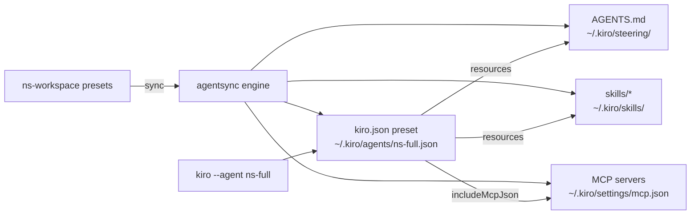

# Working Document: Kiro Agent tự động load synced skills và steering

## Tổng quan

- **Phạm vi**: toàn bộ uncommitted changes trên branch `main` (chưa có commit SHA)
- **Mục tiêu chung**: Khiến custom agent `ns-full` của Kiro nhận diện và sử dụng các skill + steering document mà `agentsync` đã đồng bộ từ `ns-workspace`, thay vì chỉ là một file cấu hình full-permissions độc lập.
- **Các file chính bị ảnh hưởng**:
  - `presets/settings/kiro.json`
  - `internal/agentsync/agentsync_test.go`
  - `README.md`
  - `docs/modules/agentsync.md`

## Bối cảnh & Vấn đề

`ns-workspace` có một engine đồng bộ hóa (`agentsync`) để copy/patch tài nguyên (instructions, skills, MCP servers, hooks…) sang nhiều AI coding tool khác nhau thông qua các adapter.

Với Kiro, adapter đã được đăng ký trong `internal/agentsync/adapter_registry.go` (`AdapterSpec.ID = "kiro"`) và đồng bộ:

- `AGENTS.md` → `~/.kiro/steering/AGENTS.md` (shared instructions)
- skills → `~/.kiro/skills/*`
- MCP servers → `~/.kiro/settings/mcp.json`
- custom agent preset `presets/settings/kiro.json` → `~/.kiro/agents/ns-full.json`

Tuy nhiên, preset `kiro.json` trước đây chỉ declare `tools: ["*"]` và `allowedTools: ["@builtin", "@*"]` để tạo agent full-permissions, còn `resources` là mảng rỗng. Điều này có nghĩa là Kiro CLI khi chạy `kiro --agent ns-full` sẽ không tự động thấy các skill và steering document đã được đồng bộ vào `~/.kiro/skills` và `~/.kiro/steering`. Ngưởi dùng phải tự cấu hình hoặc agent không sử dụng được tri thức đã sync.

## Chi tiết thay đổi theo từng bước

### Bước 1 — Khai báo `resources` trong preset agent Kiro (`presets/settings/kiro.json`)

- **Vấn đề / Nguyên nhân**: Custom agent `ns-full` cần biết các nguồn tài nguyên bổ sung ngoài prompt cứng. Kiro CLI hỗ trợ resource URI để agent load skill files và steering documents động.
- **Cách thay đổi**:
  - Thêm `resources` gồm 2 URI:
    - `"skill://~/.kiro/skills/*/SKILL.md"` — load toàn bộ file `SKILL.md` trong các thư mục skill đã sync.
    - `"file://~/.kiro/steering/**/*.md"` — load toàn bộ file markdown trong thư mục steering.
  - Cập nhật `description` để ghi chú rõ agent sẽ load synced skills và steering từ `~/.kiro`.
- **Vị trí trong code**:
  - File preset `kiro.json` tại `presets/settings/kiro.json`.
  - Được adapter Kiro copy verbatim sang `~/.kiro/agents/ns-full.json` thông qua `AgentConfigSrc` / `AgentConfigDst` trong `internal/agentsync/adapter_registry.go` (dòng 94–95).
- **Giải thích logic**: Kiro CLI đọc file `~/.kiro/agents/ns-full.json`. Khi field `resources` chứa các URI trên, agent sẽ tự động include nội dung skill/steering vào context, đảm bảo agent full-permissions vẫn tuân theo conventions và có khả năng sử dụng các skill đã đồng bộ.

### Bước 2 — Thêm kiểm thử tích hợp cho agent config Kiro (`internal/agentsync/agentsync_test.go`)

- **Vấn đề / Nguyên nhân**: Cần đảm bảo rằng mỗi khi `agentsync init --tools kiro` chạy, file `~/.kiro/agents/ns-full.json` được ghi đúng với các field `tools`, `allowedTools`, `includeMcpJson`, `resources`, và MCP servers vẫn được cài đặt.
- **Cách thay đổi**:
  - Thêm test mới `TestKiroAgentConfigLoadsSkillsAndSteering` (72 dòng) ngay sau `TestKiroHomeOverrideUsesKiroPresetPaths`.
  - Test chạy `manager.Apply(...)` với `ToolFilter: ParseTools("kiro")` trong thư mục tạm, sau đó:
    - Đọc `~/.kiro/agents/ns-full.json` qua helper `readJSONFile()`.
    - Assert `name == "ns-full"`.
    - Assert `tools == ["*"]`.
    - Assert `allowedTools == ["@builtin", "@*"]`.
    - Assert `includeMcpJson == true`.
    - Duyệt `resources` để xác nhận có ít nhất một URI dạng `skill://.../.kiro/skills` và một URI dạng `file://.../.kiro/steering`.
    - Đọc `~/.kiro/settings/mcp.json` và kiểm tra mỗi MCP server có ít nhất `type: http` + `url` hoặc `command`.
  - Xóa một dòng trống thừa trước comment `// TestPresetSkillsOverrideProviderTargetSkills` (cleanup).
- **Vị trí trong code**:
  - `TestKiroAgentConfigLoadsSkillsAndSteering()` thuộc package `agentsync` trong `internal/agentsync/agentsync_test.go` (dòng 338–409).
  - Các helper `readJSONFile()` nằm tại dòng 604–615 cùng file.
  - `Manager.Apply()` và `ParseTools()` thuộc package `agentsync` trong `internal/agentsync/agentsync.go`.
- **Giải thích logic**: Test mô phỏng quá trình `init` Kiro từ đầu, xác nhận custom agent config không chỉ là bản sao của preset mà còn mang theo các resource URI cần thiết. Đồng thờ, test bảo vệ khỏi regression nếu ai đó vô tình xóa `resources` hoặc làm hỏng cấu trúc MCP.

### Bước 3 — Cập nhật tài liệu ngưởi dùng (`README.md`)

- **Vấn đề / Nguyên nhân**: Bảng stable adapters trong README cần phản ánh đúng đường dẫn file mà `agentsync` tạo ra cho Kiro, bao gồm cả custom agent.
- **Cách thay đổi**: Trong hàng "Kiro / CLI", thêm `~/.kiro/agents/ns-full.json (full-permissions custom agent)` vào danh sách path được ghi.
- **Vị trí trong code**: Bảng stable adapters trong `README.md` (khoảng dòng 168–175).

### Bước 4 — Cập nhật module documentation (`docs/modules/agentsync.md`)

- **Vấn đề / Nguyên nhân**: Tài liệu module cần mô tả chính xác hành vi của Kiro plugin, đặc biệt là việc ghi custom agent với các resource đầy đủ.
- **Cách thay đổi**: Sau câu mô tả `KIRO_HOME`, thêm: "Ghi custom agent `~/.kiro/agents/ns-full.json` với `tools: ["*"]`, `allowedTools: ["@builtin", "@*"]`, `includeMcpJson: true` và `resources` trỏ đến synced skills/steering."
- **Vị trí trong code**: Phần "Plugin adapter hiện có" trong `docs/modules/agentsync.md`.

## Sơ đồ tổng thể

## Tác động & Lưu ý

- **Ảnh hưởng**: Chỉ tác động đến adapter Kiro. Không thay đổi logic sync cho các tool khác.
- **Rủi ro thấp**: Thay đổi chủ yếu là thêm resource URI vào preset và bổ sung test. Không có breaking change đối với cấu trúc file MCP hoặc steering.
- **Điểm cần kiểm thử**:
  - Chạy `go test ./internal/agentsync -run TestKiroAgentConfigLoadsSkillsAndSteering` để xác nhận test pass.
  - Chạy `go test ./internal/agentsync` để đảm bảo không phá vỡ các test Kiro hiện có (`TestKiroCLISelectionUsesKiroAdapter`, `TestKiroHomeOverrideUsesKiroPresetPaths`,…).
- **Các bước tiếp theo (nếu có)**:
  - Cân nhắc bổ sung test tương tự cho `KIRO_HOME` override để xác nhận resource URI vẫn resolve đúng khi `KIRO_HOME` khác `~/.kiro`.
  - Kiểm tra trên Kiro CLI thực tế xem `kiro --agent ns-full` có thực sự load skill/steering resources hay không.
