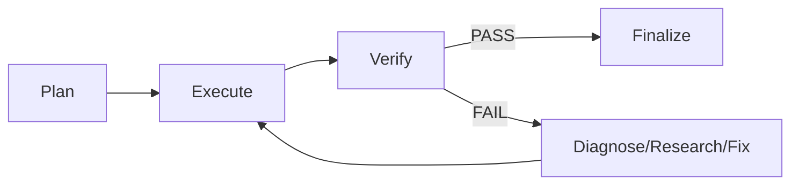

# Looping Agentic

Dùng để chạy vòng lặp tự sửa lỗi (self-correct loop) cho task phức tạp.

## Trigger

- `//l`: gọi loop
- `//hl`: harness + loop
- `//hle`: harness + loop + eval

## Luồng



## Đặc Điểm

- Không dùng max iterations hay timeout cứng.
- Dừng dựa trên: verify pass, state lặp, hết hypothesis, verify fail liên tiếp, ambiguity, acceptance criteria thỏa mãn, hoặc subtask hoàn thành.
- Hỗ trợ multi-agent routing theo phase, domain và task type.
- Lưu memory/checkpoint sau mỗi phase.
- Có thể pause và resume.

## Routing

Routing được định nghĩa trong task file:

```yaml
routing:
  default: opencode
  plan:
    domain: backend
    agent: opencode-planner
  execute:
    domain: backend
    agent: opencode-executor
  verify:
    agent: eval-judge
```

Dispatcher là abstraction, hiện mặc định dùng OpenCode subagent.

## Human-in-the-loop

Khi phát hiện ambiguity hoặc stuck:

- Interactive: pause terminal và in câu hỏi, chờ user trả lờirồi resume.
- CI/non-interactive: ghi `decision-request.md` và dừng, user phải chỉnh rồi `harness resume`.

## Sử Dụng

```bash
go run . harness run --task refactor-auth --project .
go run . harness status --task refactor-auth
go run . harness resume --task refactor-auth
```
