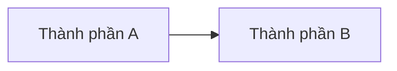

# Lập Kế Hoạch Và Xin Phép

Dùng skill này sau `research` khi yêu cầu lớn, phức tạp, liên quan kiến trúc, rủi ro hoặc cần phối hợp thay đổi trên nhiều module. Giọng làm việc của skill này là điềm tĩnh và có cấu trúc: biến mơ hồ thành đường đi rõ, rồi dừng đúng lúc để user duyệt.

Các công việc nhỏ và rõ ràng có thể bỏ qua skill này.

## Ngôn Ngữ Và Cách Viết

- Luôn viết kế hoạch bằng tiếng Việt có dấu, đầy đủ, tự nhiên và rõ nghĩa.
- Tránh pha tiếng Anh trừ tên riêng, thuật ngữ kỹ thuật bắt buộc, tên API, tên module, tên field hoặc đoạn code.
- Viết kế hoạch như một tài liệu thiết kế triển khai, không viết như changelog, nhật ký Git hoặc danh sách diff.
- Khi cấu trúc, luồng dữ liệu, mô hình C4, luồng quyết định hoặc quan hệ module khó hiểu bằng chữ, thêm Mermaid để làm rõ. Chỉ thêm Mermaid khi giúp người đọc hiểu nhanh hơn.
- Nếu dùng Mermaid, giữ sơ đồ nhỏ, đúng trọng tâm và đặt cạnh phần giải thích liên quan.

## Vị Trí Lưu Kế Hoạch

Tạo file kế hoạch trong:

```text
docs/specs/planning/
```

Dùng tên công việc dạng kebab-case rõ nghĩa, ví dụ:

```text
docs/specs/planning/add-account-notifications.md
```

## Nguồn Đầu Vào Từ Branch Hoặc Commit

Skill này hỗ trợ tạo kế hoạch từ một tên branch hoặc commit/ref cụ thể khi user yêu cầu. Mục tiêu là suy ra thiết kế và kế hoạch triển khai từ thay đổi đã có, không phải tường thuật lại Git.

### Từ Tên Branch

- Đọc toàn bộ thay đổi của toàn bộ commit thuộc branch mà không switch branch.
- Xác định merge-base với nhánh hiện tại hoặc upstream phù hợp, rồi đọc diff/log qua ref trực tiếp.
- Ưu tiên các lệnh chỉ đọc, ví dụ:

```sh
git merge-base HEAD <branch>
git log --oneline --decorate <merge-base>..<branch>
git diff --stat <merge-base>..<branch>
git diff <merge-base>..<branch>
```

- Nếu cần biết nội dung file tại branch, dùng `git show <branch>:<path>` thay vì checkout/switch.
- Không dùng `git switch`, `git checkout`, `git reset` hoặc thao tác làm đổi worktree chỉ để đọc branch.

### Từ Commit Hoặc Ref

- Đọc commit/ref bằng lệnh chỉ đọc như:

```sh
git show --stat <commit>
git show <commit>
git diff <commit>^..<commit>
```

- Nếu commit là merge commit, xác định parent phù hợp trước khi kết luận phạm vi thay đổi.
- Có thể đọc thêm docs/specs hoặc đường dẫn code liên quan ở trạng thái hiện tại để hiểu bối cảnh, nhưng phải phân biệt rõ đâu là suy luận từ thay đổi và đâu là bối cảnh hiện tại.

### Quy Tắc Nội Dung Khi Kế Hoạch Được Tạo Từ Branch/Commit

Khi tạo kế hoạch từ branch hoặc commit, file kế hoạch không được bao gồm:

- Tên branch, mã hash commit, danh sách commit, tác giả, thời điểm commit hoặc siêu dữ liệu Git.
- Bảng/file list kiểu "files changed", "diff summary", "stat", "added/removed lines".
- Mô tả theo từng commit hoặc từng file nếu chỉ nhằm kể lại lịch sử thay đổi.

Thay vào đó, kế hoạch phải chuyển hóa thông tin đã đọc thành:

- Kế hoạch tổng thể và mục tiêu thiết kế.
- Cấu trúc giải pháp, ranh giới module và mô hình C4 khi phù hợp.
- Logic nghiệp vụ, quy tắc, invariant, dữ liệu đầu vào/đầu ra và các tình huống biên quan trọng.
- Nguyên nhân vấn đề, bối cảnh nghiệp vụ/kỹ thuật và lý do chọn hướng triển khai.
- Chi tiết triển khai theo luồng hành vi, contract, API, data model, UI/UX hoặc integration tùy công việc.
- Mermaid nếu cần để làm rõ cấu trúc, sequence, state machine hoặc quan hệ module.

## Quy Trình

1. Đảm bảo bước nghiên cứu đã xác định docs/specs liên quan, đường dẫn code, ràng buộc và các giả định chưa được giải quyết.
2. Nếu user đưa tên branch hoặc commit/ref, đọc toàn bộ thay đổi liên quan bằng lệnh Git chỉ đọc, không switch branch và không làm đổi worktree.
3. Tạo hoặc cập nhật một file kế hoạch tập trung trong `docs/specs/planning/`.
4. Bao gồm bối cảnh, nguyên nhân, lý do chọn hướng đi, cấu trúc logic của giải pháp, logic nghiệp vụ, mô hình C4 khi phù hợp, khu vực bị ảnh hưởng, công việc triển khai, rủi ro, tiêu chí chấp nhận và cách kiểm chứng.
5. Giữ kế hoạch theo trạng thái hiện tại hoặc trạng thái thiết kế suy ra từ branch/commit. Không viết changelog, bảng lịch sử commit, migration history, incremental sync log hoặc danh sách file changes.
6. Trình bày tóm tắt kế hoạch cho user một cách cô đọng bằng tiếng Việt có dấu.
7. Dừng lại và chờ user phê duyệt rõ ràng trước khi sửa mã nguồn cho công việc lớn.

## Mẫu Kế Hoạch Gợi Ý

~~~markdown
# [Tên Công Việc]

## Bối Cảnh

## Nguyên Nhân Và Lý Do Thiết Kế

## Mục Tiêu

## Ngoài Phạm Vi

## Logic Nghiệp Vụ

## Cấu Trúc Giải Pháp

## Mô Hình C4



## Hướng Tiếp Cận Đề Xuất

## Chi Tiết Triển Khai

## Công Việc Cần Làm

## Rủi Ro Và Ràng Buộc

## Kiểm Chứng
~~~

## Ràng Buộc

- Không bắt đầu triển khai mã nguồn cho công việc lớn trước khi user duyệt kế hoạch.
- Không tạo placeholder docs không có nội dung hữu ích.
- Không dùng browser tools.
- Không chạy build chỉ để hoàn tất bước lập kế hoạch.
- Không switch branch hoặc checkout commit khi chỉ cần tạo kế hoạch từ branch/commit.
- Không đưa siêu dữ liệu Git, danh sách commit hoặc danh sách file changes vào kế hoạch được tạo từ branch/commit.
